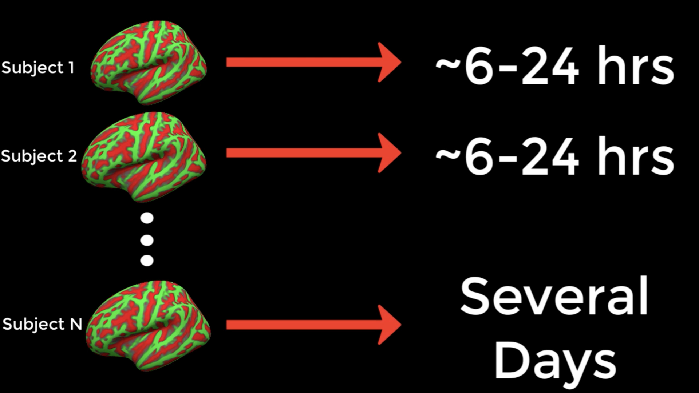
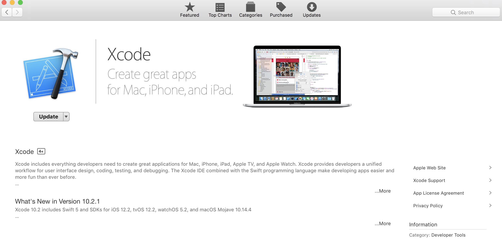

.. _FS_04_ReconAllParallel:

=====================
FreeSurfer Tutorial #4: Running recon-all in Parallel
=====================

-----------

Time Constraints with Recon-All
*************

As you will soon find out, FreeSurfer takes a long time to process an individual subject - around sixteen to twenty-four hours on a typical iMac, with some variation due to factors such as the quality of the input data. For many researchers, this can be a prohibitively long time to wait, especially if the study contains dozens or hundreds of subjects.



One way to reduce the amount of time it takes to analyze so many subjects is to run the analyses in parallel. Modern computers typically have a central processing unit with several **cores**, which can be individually used for different tasks. To illustrate what cores are, picture eight men and eight kitchens, with each kitchen only big enough for one man to prepare his meal. In this analogy, each computer core is a kitchen. Eight men cannot fit into one kitchen, but if the other kitchens are unlocked and made available for use, each man can make his own meal in each room.

Let's assume that each meal takes one hour to make. Instead of each man waiting his turn for the same kitchen every hour, everybody makes their meals simultaneously. What would otherwise take eight hours - that is, for all of the men to make their meal in the same kitchen - now takes one hour. If we could do something similar with our data analysis, we could finish processing the anatomical images in a more reasonable amount of time.


Downloading the Parallel Command
***********

Turning back to FreeSurfer, usually just one core is used each time recon-all is run. By using a command called **parallel** instead, each instance of recon-all can be assigned to a different core. If you are using a Macintosh computer, you can see the number of cores you have by typing the following:

::

  sysctl hw.physicalcpu hw.logicalcpu
  
Which should return something like this:

::

  hw.physicalcpu: 4
  hw.logicalcpu: 8
  
The first entry is the number of physical cores, which is 4; and the second entry is the number of logical cores, which is 8. Nobody really understands what any of this means, but all you need to know is that the number of logical cores is the number of individual recon-all jobs that you can run simultaneously.

The parallel command doesn't come standard with the Macintosh operating system; you will need to download it. A prerequisite is to download the Xcode application, which can be found in the Macintosh App Store.



You will then need to go to `this website <https://brew.sh/>`__ and install Homebrew, a package installation manager. Homebrew allows you to quickly install packages using the command line. For example, once you have installed Homebrew, open a terminal and type the following:

::

  brew install parallel
  
  
Which will install the parallel command. (Check to see if it has been installed correctly by typing `parallel -help` at the command line and pressing return. You should see the help manual printed to your terminal window.)


Using the Parallel Command
**********

.. note::

  You must be using the **bash** shell in order to use parallel. If you are unsure what shell you are using, type ``echo $0``. If you are not in the bash shell, simply type ``bash`` and press return.
  
  If you want to store the results of recon-all in the directory from which you run parallel, type ``export SUBJECTS_DIR=`pwd```.
  
  
Parallel is run by **piping** the output of the ``ls`` command into the parallel command. For example, if you have six anatomical images labeled sub1.nii, sub2.nii ... sub6.nii, you can analyze them in parallel by typing the following:

::

  ls *.nii | parallel --jobs 8 recon-all -s {.} -i {} -all -qcache
  
Let's analyze what this command does:

1. The ``ls`` command uses a wildcard to expand all of the anatomical images that have the ``.nii`` extension. 

2. The list is then piped into the ``parallel`` command, which uses the ``--jobs 8`` option to indicate that 8 cores will be used to analyze the data. Each instance of recon-all will be assigned to a different core.

3. The dot in the curly braces for the ``-s`` option signifies that the ``.nii`` extension should be removed; in other words, the input to ``-s`` will be sub1, sub2 ... sub6.

4. The ``-i`` option indicates to use the output of the ``ls`` command as input to the ``parallel`` command.

5. The ``-all`` and ``-qcache`` options have the same meaning as what was discussed in the previous tutorial on recon-all.

Now run the command and observe what happens. If a typical recon-all job takes 15 hours on your computer, come back in 15 hours and see how many subjects have been processed. If you have eight cores and eight subjects, it should finish in the same amount of time it takes to process one subject; and if you have more than eight subjects, a new one will be processed as soon as one of the cores is freed up after finishing a subject.


Analyzing the Cannabis Dataset
**********

If you have set up the directory correctly, all of the subjects should be in a folder called ``Cannabis``. Create another directory called ``FS``, and navigate into that directory. From a bash shell (see the note above), type the following code to run all of these subjects through the parallel command:

::

  ls .. | grep ^sub- > subjList.txt

  for sub in `cat subjList.txt`; do
  cp ../${sub}/ses-BL/anat/*.gz .
  done
  
  gunzip *.gz
  
  SUBJECTS_DIR=`pwd`
  
  ls *.nii | parallel --jobs 8 recon-all -s {.} -i {} -all -qcache
  
  rm *.nii
  
  for sub in `cat subjList.txt`; do
  mv ${sub}_ses-BL_T1w.nii ${sub}
  done
  

The next tutorial will show you another way to batching your recon-all processes by using a supercomputer: The Open Science Grid.

--------------

Video
*********

For a video overview of the ``parallel`` command, see `this video <https://www.youtube.com/watch?v=XHN2tm3tNaw&list=PLIQIswOrUH6_DWy5mJlSfj6AWY0y9iUce&index=5&t=0s>`__.
