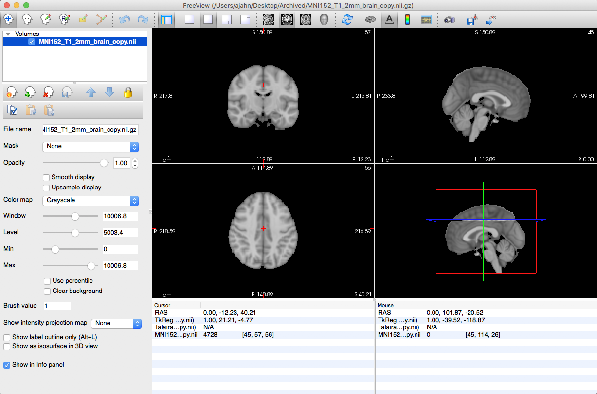
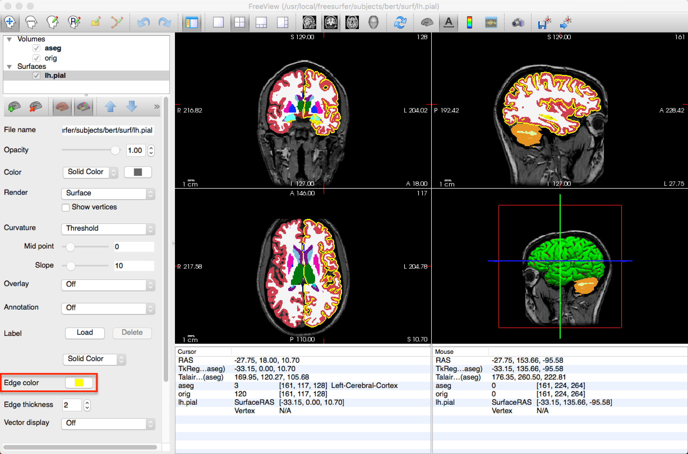

.. _FS_06_Freeview:

================================
FreeSurfer Tutorial #6: Freeview
================================

---------------

Viewing Your Data
*****************

Each neuroimaging software package has a **data viewer**, or an application that allows you to look at your data. AFNI, SPM, and FSL all have data viewers which basically do the same thing: the user loads imaging data, usually anatomical or functional images, and can view them in three dimensions. More generally, you can load most any NIFTI file that contains any kind of imaging data - provided that it is a three-dimensional matrix of numbers.

FreeSurfer has its own viewer called **Freeview**, which can by launched from the Terminal by typing ``freeview`` and pressing enter. It can load NIFTI images just like the other packages, and in addition it can load FreeSurfer-specific formats, such as data with ``.mgz`` and ``.inflated`` extensions. The image can be viewed in all three dimensions in the Viewing Panel, or you can change the layout so that only one viewing dimension is displayed.

The Control Panel
**********

The upper-left corner of Freeview contains the **Control Panel**, which shows the volumes currently loaded in memory. The checkbox next to each image can be checked or unchecked to make the image visible or invisible, respectively. As with the other viewers, the image at the top is the **overlay** - it covers all of the other images. The up and down arrows allow you to bring one particular image to the top of the stack, or to lower an image so that it is no longer the overlay image. The ``Opacity`` slider allows you to keep an image as an overlay, but to change its transparency so that you can see the image immediately underneath it.

.. figure:: 06_Freeview_Demo.gif

The **Toolbar** is underneath the Control Panel, and it contains options for changing the opacity, contrast, and color map of the images. When an image such as aseg.mgz is loaded, for example, the default is to color it as greyscale. A more informative color map, however, is the **FreeSurferColorLUT** (LUT = Look-Up Table), which color-codes each segment of the image according to a predefined table. Many of the images in FreeSurfer are encoded like this; it will take some time to find out which ones are, but a useful heuristic is to assume a look-up table for any image that is segmented (such as aseg.mgz) or parcellated (such as one of the atlases).

Loading Volumes and Surfaces
**********

Freeview can load both volumes and surfaces at the same time. To load a surface, click ``File -> Load Surface``, and select an image in the ``surf`` directory, such as ``lh.pial``. This will overlay a 3D representation of the surface in the three-dimensional box of the View window, and will trace the outline of the surface in the orthogonal boxes (i.e., the sagittal, axial, and coronal views). The color of the surface in the orthogonal views can be changed by selecting a new ``Edge color``.

Freeview Options from the Command Line
**********

Freeview has several command-line options you can use to save time. For example, if you wanted to create the same layout in the figure above - that is, load the orig.mgz file, the aseg.mgz file with the color look-up table, and the lh.pial file with a yellow edge color - you can type the following from the subject directory containing the ``mri`` and ``surf`` directories:

::

  freeview -v mri/orig.mgz mri/aseg.mgz:colormap=LUT -f surf/lh.pial:edgecolor=yellow
  
The ``-v`` option signalizes that the following files are volumes, and the ``-f`` option signalizes the the following file is a surface. The colons indicate an option for the file they are attached to; for example, ``aseg.mgz:colormap=LUT`` means to assign a look-up table colormap to the aseg.mgz file. Likewise, the ``edgecolor=yellow`` option means to set the edgecolor for the lh.pial file to yellow. Other options for freeview can be found by typing ``freeview -h`` from the command line.

--------

Video
*********

For a video overview of both the directory structure created by recon-all, and how to use freeview with the output, click `here <https://www.youtube.com/watch?v=FhOvbUp5eAU&list=PLIQIswOrUH6_DWy5mJlSfj6AWY0y9iUce&index=6>`__.
