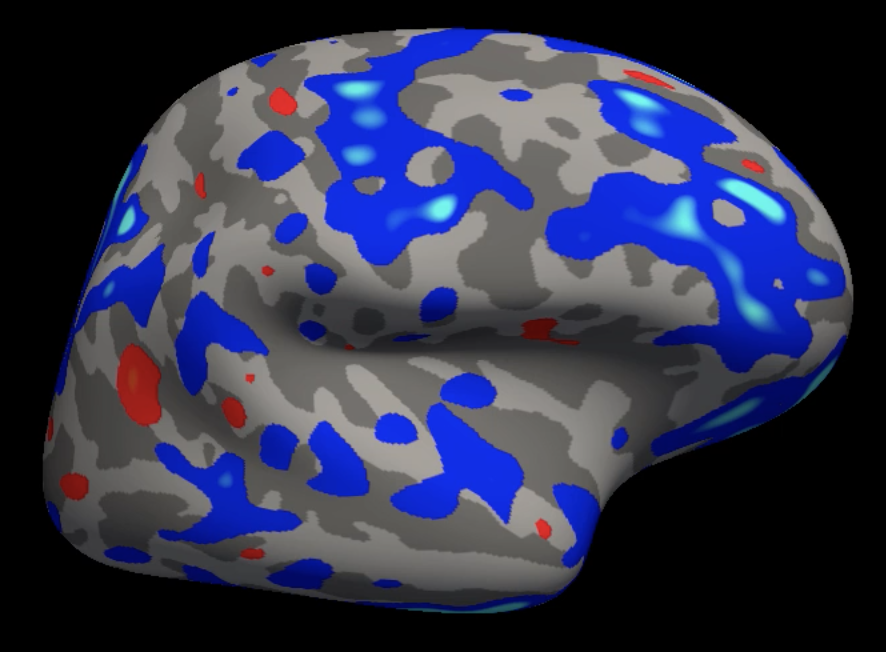
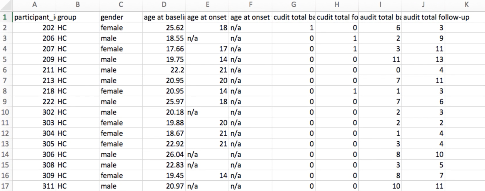

.. _FS_07_FSGD:

=====================================
FreeSurfer Tutorial #7: The FSGD File
=====================================

---------------

.. note:: 

  Before starting this tutorial, create a directory called ``FS`` within the ``Cannabis`` directory. The ``FS`` directory should contain all of the directories that have been generated by recon-all. Either run the recon-all commands from that directory, or move them into the FS directory with the ``mv`` command.

Comparing Groups
*****************

So far we have reviewed the basic commands of FreeSurfer: recon-all and freeview. Recon-all creates a series of volumes and surfaces from a T1-weighted anatomical image, and quantifies the amount of grey matter thickness and volume in different regions of the brain. The cortical regions are called **parcellations**, and the sub-cortical regions are called **segmentations**. For example, the left superior frontal gyrus is a parcellation delineated by the Desikan-Killiany atlas, and structural measurements are calculated in that region for each subject. The right amygdala, on the other hand, is a segmentation; because the sub-cortical regions are not inflated into a surface, they only contain measurements of grey matter volume, not thickness.

At this point, you may be thinking about how to compare structural measurements between groups and how to represent those differences on the surface of the brain. The procedure is similar to fMRI analysis: Just as we compare voxels in fMRI, we compare vertices in FreeSurfer. If the vertices are in a common space such as MNI, we can calculate differences in grey matter thickness at a particular vertex and test whether that difference is significant. This generates statistical maps that we can overlay on a template brain as a surface map.



  
  Example of a group analysis result mapped onto the fsaverage template. Lighter blue colors represent more negative contrast estimates, and yellow colors represent more positive contrast estimates.
  
  
The template brain that we use, which was mentioned in passing in the earlier tutorials, is called ``fsaverage``. It is an average of 40 subjects that were combined using the spherical averaging technique described in `Fischl et al., 1999 <https://tinyurl.com/y4ubdg78>`__. The coordinates of this brain are used as a standardized space for the rest of the brains which are normalized to the fsaverage template.


Organizing the Directories
**********

First, we will copy the fsaverage template into our current directory. Navigate to the Cannabis directory which contains all of the subjects (i.e., ``Cannabis/FS``), and then type:

::

  cp -R $FREESURFER_HOME/subjects/fsaverage .
  
to copy the fsaverage template. When that is done, set the SUBJECTS_DIR variable to the current directory by typing ``export SUBJECTS_DIR=`pwd```. This will place the output of any recon-all or group analysis commands into the current directory:

::

  setenv SUBJECTS_DIR `pwd`
  
.. note::

  The backticks which bookend ``pwd`` will display the absolute path to the current directory; in other words, it will replace ```pwd``` with whatever the output is of typing the command ``pwd``. This kind of shorthand will be useful, so practice it whenever you have the chance.
  
We will also create two directories called ``FSGD`` and ``Contrasts``, which will contain the text files needed to run our analysis:

::

  mkdir FSGD Contrasts
  

Creating the FSGD File
**********

The Cannabis dataset comes with a file called ``participants.tsv`` that contains labels and covariates for each subject: Group, gender, age, onset of cannabis use, and so on. To create a FreeSurfer Group Descriptor (FSGD) file, we will extract those covariates or group labels that we are interested in and format them in a way that FreeSurfer understands. The FSGD file will both contain the covariates that we want to contrast, and a separate contrast file will indicate which covariates to contrast and which weights to assign to them.




  Screenshot of part of the participant file that comes with the Cannabis dataset. Note: HC = Healthy Controls. Farther down the participant file, the label CB stands for Cannabis User.

To keep our files organized, copy the participants.tsv file into the FSGD directory, and rename it ``CannabisStudy.tsv``:

::

  cp ../particpants.tsv FSGD/CannabisStudy.tsv.


Now, open the file ``CannabisStudy.tsv`` in Excel. We will reformat it into an FSGD file, which is organized in such a way that can be understood by the group analysis commands we will run later. In the first column, type the following four lines:

::

  GroupDescriptorFile 1
  Title CannabisStudy
  Class HC
  Class CB
  
These lines are called **header lines**, since they are needed at the top, or head, of the document and indicate the format of the FSGD file. The first line, ``GroupDescriptorFile 1``, indicates that the file is in FSGD format; you will need this first line in any FSGD file that you create. The second line, ``Title CannabisStudy``, will prepend the string "CannabisStudy" to the directories which store the results of your analyses. The next two lines, ``Class HC`` and ``Class CB``, indicate that the subject name next to a column containing the string HC belongs to the HC group, and that the subject name next to a column containing the string CB belongs to the CB group. For example, after our header lines, we may see something like this:

::

  Input sub-202 HC
  Input sub-206 HC
  Input sub-207 HC
  Input sub-101 CB
  Input sub-103 CB
  Input sub-104 CB
  
The first column, ``Input``, signalizes that this row contains a subject; the next column, ``sub-202`` through ``sub-104``, specifies the subject name (which should correspond to the subject directories in the Cannabis folder); and the last column, ``HC`` and ``HB``, indicates which group that subject belongs to. In this case, subjects 202, 206, and 207 belong to the HC group, and subjects 101, 103, and 104 belong to the CB group. Our goal is to contrast the structural measurements between the groups, which we will do in the next chapter. Later on, you will see how to add as many covariates as you like - one for each column. These covariates will be selected from the ``participants.tsv`` file.

For now, save the spreadsheet as a Tab Delimited Text file by clicking on ``File -> Save As``, and selecting "Tab Delimited Text" from the File Format field. This will create a file called ``CannabisStudy.txt``. Make sure this is saved into the FSGD directory. Then open a Terminal, navigate to the FSGD directory, and type the following:

::

  tr '\r' '\n' < CannabisStudy.txt > CannabisStudy.fsgd
  
This will remove any DOS carriage returns, which Unix cannot interpret, and replaces them with newline characters. This will prevent any errors when using the FSGD file with FreeSurfer commands.


Creating the Contrast file
***********

Our next step is to create a contrast file that specifies the **contrast weights** for each regressor in our model. The "Class" variables that we specified in the FSGD file are group regressors: One for the Cannabis group, and one for the Control group. Since we have only two regressors, we only need to specify two contrast weights.

To specify these weights, navigate to the ``Contrasts`` directory and then type:

::

  echo "1 -1" > HC-CB.mtx
  
This enters the string ``1 -1`` into a file labeled ``HC-CB.mtx``. (``.mxt`` stands for "matrix", as in, "contrast matrix"; in more complicated designs, the contrast file can be any size M x N matrix.) The label of the contrast file can be anything you choose; in this example, we have chosen a label that is compact and easy to understand.

Now create another contrast file for the opposite contrast, namely:

::

  echo "-1 1" > CB-HC.mtx
  
Which will create a contrast file subtracting the Control group from the Cannabis group.


Exercises
*************

Now that we have created the files necessary for a group analysis, the next step is to run the group analysis itself. Before you proceed, try the following exercises to test your understanding of what you just read.


1. If you wanted to create a contrast representing the average effect across groups, what contrast weights would you use? What would be a good label for the contrast file?

2. When analyzing an open-access dataset designed to compare Old and Young groups, you come across this FSGD file:
  
::

  GroupDescriptorFile 1
  Title MyStudy
  Class Old
  Class Young
  Input sub-101 HighAge
  Input sub-102 HighAge
  Input sub-103 HighAge
  Input sub-201 LowAge
  Input sub-202 LowAge
  Input sub-203 LowAge
  
What is wrong with this file? Which parts would you change? (Hint: One section you *must* change for the analysis to run without FreeSurfer throwing any errors; another section can be changed to better describe the analysis.)


------------


Video
**********

For a video demonstration of how to create the FSGD file, click `here <https://www.youtube.com/watch?v=3T9PuME2g9A&list=PLIQIswOrUH6_DWy5mJlSfj6AWY0y9iUce&index=7>`__.
