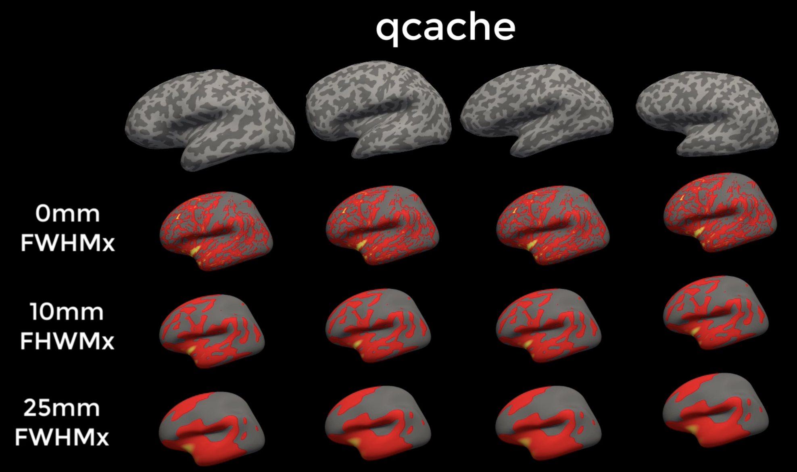
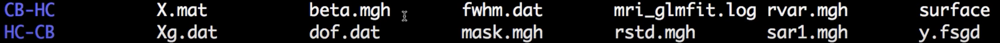
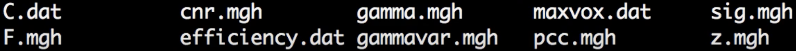
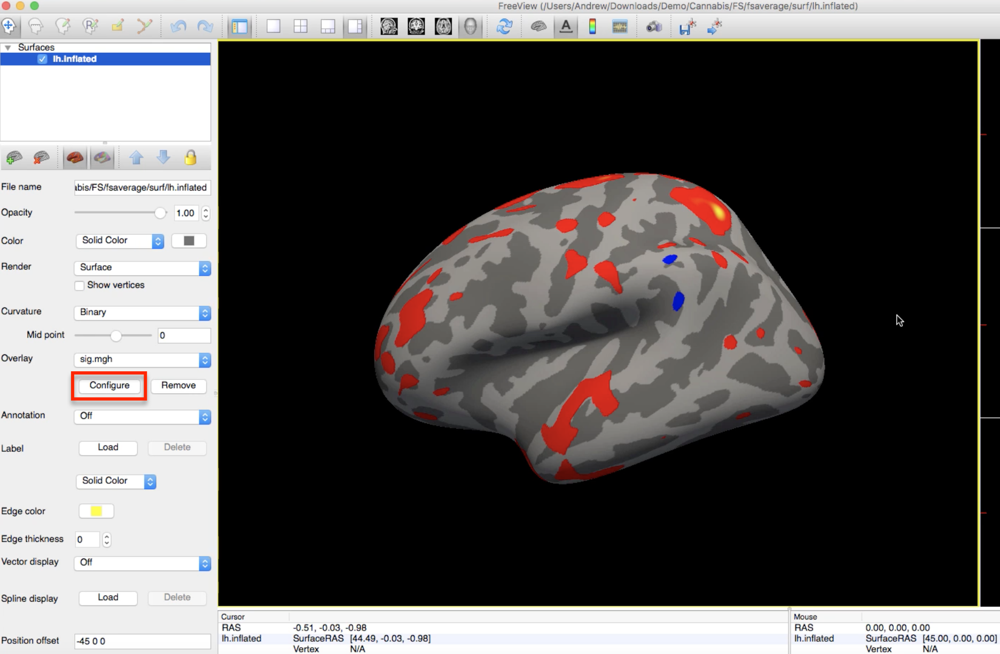

.. _FS_08_GroupAnalysis:

======================================
FreeSurfer Tutorial #8: Group Analysis
======================================

---------------

Overview
*********

The previous tutorials have focused on preparing the data for a group analysis: First, the data was preprocessed using recon-all, with different structural measurements calculated at each vertex; and second, we created an FSGD file and a contrast file indicating which groups we want to compare against each other.

If you recall from a previous tutorial, I recommended using the ``qcache`` option when running recon-all. This will generate thickness, volume, and curvature maps at several different smoothing sizes, such as 0mm, 10mm, and 25mm full-width half-maximum kernels. One of the benefits of surface-based analysis is that you can use much larger smoothing kernels than you can in volumetric-based analyses, because there is no risk of smoothing across gyri. When you run the group analysis you can choose among any of the following smoothing sizes:

  
  Example output from qcache. Notice how the thickness estimates across the subjects become smoother as a result of using large smoothing kernels.

.. warning::

  Before looking at your group analyses, decide on which smoothing kernel you will use - and then stick to it. This will prevent you from checking every possible smoothing size, which in turn will require you to correct for the number of tests that you examine with different smoothing kernels.

Creating a group file with mris_preproc
************

In order to run a group analysis, we will need to combine all of our individual structural maps into a single dataset. This is similar to the idea of combining consecutive volumes of an fMRI run into a one dataset - as though the volumes are daisy-chained together and laid end to end. (Or, to think of it another way, the structural images are stacked on top of each other, like pancakes; or layered like nachos. Use whatever food analogy is most helpful to remember this important point.) 

The data are also **resampled** to the fsaverage template, which is in MNI space. Whenever we do any kind of group analysis - comparing groups, region of interest analysis, and so on - each subject's data must have the same dimensions and voxel resolution. Forgetting to resample usually leads to errors during this step. (All of this applies to fMRI analysis as well.)

We will perform all of these steps with a single command: **mris_preproc**. The command requires the following arguments:

1. An FSGD file (indicated by the ``--fsgd`` option);
2. A template to resample to (``--target``);
3. An indication of which hemisphere to resample (``--hemi``);
4. A label for the output file (``--out``).

In this tutorial, we will also use the ``--cache-in`` option to specify which smoothed images we want to use in the analysis. You can choose any of the smoothed images generated by using the ``--qcache`` option with recon-all.

To make the command more compact and to make it adaptable to any study you wish to analyze, we will use nested for-loops:

::

  #!/bin/tcsh
  
  setenv study $argv[1]
  
  foreach hemi (lh rh)
    foreach smoothing (10)
      foreach meas (volume thickness)
        mris_preproc --fsgd FSGD/{$study}.fsgd \
          --cache-in {$meas}.fwhm{$smoothing}.fsaverage \
          --target fsaverage \
          --hemi {$hemi} \
          --out {$hemi}.{$meas}.{$study}.{$smoothing}.mgh
      end
    end
  end

Copy this code into a shell script and save it as ``runMrisPreproc.sh``. This code is also available for download `here <https://github.com/andrewjahn/FreeSurfer_Scripts/blob/master/runMrisPreproc.sh>`__. Make sure the script is in the directory containing all of the subject directories (in this case, ``Cannabis/FS``), and then run it by typing ``tcsh runMrisPreproc.sh``.

.. note::

  If you need a refresher on Unix, variables, and for-loops, see :ref:`this tutorial <Unix_Intro>`.
  
  

Fitting the general linear model with mri_glmfit
**********
  
Now that all of the subjects are concatenated into a single dataset, we can fit a general linear model with FreeSurfer's ``mri_glmfit`` command. In this example we will use the following inputs:

1. The concatenated dataset containing all of the subjects' structural maps (``--y``);
2. The FSGD file (``--fsgd``);
3. A list of contrasts (each contrast specified by a different line containing ``--C``);
4. The hemisphere of the template to analyze (``--surf``);
5. A mask to restrict our analysis only to the cortex (``--cortex``);
6. An output label for the directory containing the results (``--glmdir``).

As above, we will use nested for loops to analyze the hemispheres, smoothing kernels, and structural measurements of our choosing. In this example we will analyze both the left and right hemispheres at a smoothing kernel of 10mm, and we will analyze the strucutral maps of volume and thickness:

::

  #!/bin/tcsh
  
  set study = $argv[1]
  
  foreach hemi (lh rh)
    foreach smoothness (10)
      foreach meas (volume thickness)
          mri_glmfit \
          --y {$hemi}.{$meas}.{$study}.{$smoothness}.mgh \
          --fsgd FSGD/{$study}.fsgd \
          --C Contrasts/CB-HC.mtx \
          --C Contrasts/HC-CB.mtx \
          --surf fsaverage {$hemi}  \
          --cortex  \
          --glmdir {$hemi}.{$meas}.{$study}.{$smoothness}.glmdir
      end
    end
  end
  

Copy this code into a shell script and save it as ``runGLMs.sh``. This code is also available for download `here <https://github.com/andrewjahn/FreeSurfer_Scripts/blob/master/runGLMs.sh>`__. Run the script from the subject directory by typing ``tcsh runGLMs.sh``.

Reviewing the Output
**********

If the scripts run without any errors, you should see the following directories in your current directory:

::

  lh.thickness.CannabisStudy.10.glmdir
  lh.volume.CannabisStudy.10.glmdir
  rh.thickness.CannabisStudy.10.glmdir
  rh.volume.CannabisStudy.10.glmdir
  
The directory name indicates the hemisphere, structural measurement, name of the study, and the smoothing kernel used in the analysis. Each directory contains the same structure; if we navigate into the ``lh.volume.CannabisStudy.10.glmdir`` directory and type ``ls``, for example, we will see the following:

The directories ``CB-HC`` and ``HC-CB`` contain the contrast data for each contrast specified in ``mri_glmfit``, which we will review in the next section. Among the files in the current directory, ``y.fsgd`` is a copy of the FSGD file used to run the analysis; ``mri_glmfit.log`` contains the code that was run for the current analysis; ``mask.mgh`` is the mask used for the analysis; and ``beta.mgh`` is a concatenated dataset of the individual beta weights created by the analysis. You can read descriptions of the other outputs by typing ``mri_glmfit`` and examining the section under ``Command-Line Arguments``.
  
Within each of the contrast directories you will see the following:

The file ``gamma.mgh`` is a contrast map - the beta dataset in the above directory multiplied by the contrast weights for this particular contrast. In the HC-CB directory, for example, ``gamma.mgh`` would show where the Control Group has greater volume than the Cannabis Group in the left hemisphere. ``z.mgh`` converts this contrast into a z-map, and ``sig.mgh`` converts the contrast into a map of p-values. As above, you can read descriptions of the other outputs in the ``mri_glmfit`` help manual.

.. note::

  FreeSurfer uses -log10(p) notation; in other words, a value of 1 in the ``sig.mgh`` map represents a p-value of 0.1, a value of 2 represents a p-value of 0.01, and so on.

To render the statistical maps on the ``fsaverage`` template, navigate to any of the contrast directories (e.g., HC-CB) and type:

::
  
  freeview -f $SUBJECTS_DIR/fsaverage/surf/lh.inflated:overlay=sig.mgh
  
Which will load the left hemisphere of the fsaverage template, and map the ``sig.mgh`` overlay onto it. The threshold of the p-values can be changed by clicking on the ``Configure`` button and moving the sliders.

Now that we have the results, what do we do with them? Your first impulse might be to put them in a manuscript and try to publish it; but to ensure that our results aren't false positives, we will need to use a form of multiple comparisons correction known as **cluster correction**, described in the next tutorial.

--------------

Video
**********

For a video overview of ``mris_preproc`` and ``mri_glmfit``, as well as how to view the results, see `this video <https://www.youtube.com/watch?v=hdSkEPG-G8s&list=PLIQIswOrUH6_DWy5mJlSfj6AWY0y9iUce&index=8>`__.
