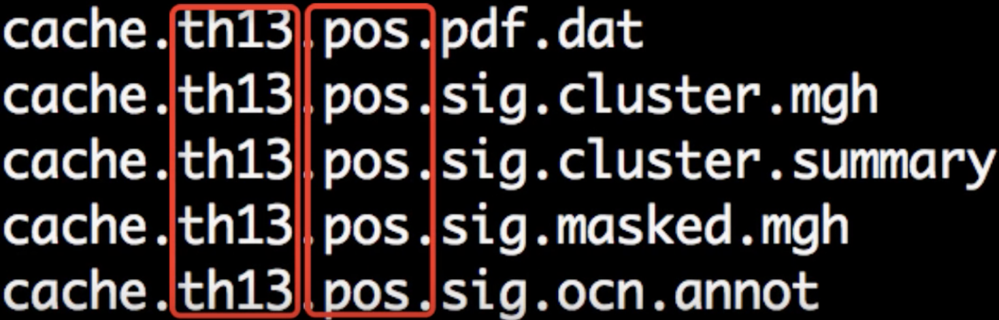
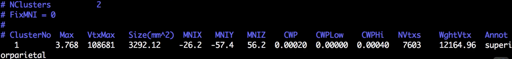

.. _FS_09_ClusterCorrection:

======================================
FreeSurfer Tutorial #9: Cluster Correction
======================================

---------------

Overview
*********

After you have run your general linear model and created group-level contrast maps, you will need to correct for the amount of tests that you have run. For a more detailed overview of how cluster-correction works, see :doc:`this page <https://andysbrainbook.readthedocs.io/en/latest/fMRI_Short_Course/fMRI_Appendices/Appendix_A_ClusterCorrection.html>`__; although it uses fMRI data to illustrate the concept, the same idea applies to the vertices that we analyze in structural data.

Cluster Correction with mri_glmfit-sim
**********

As in the previous tutorial, we will use nested for-loops to create cluster-corrected maps for each contrast. Each level of the nested loop specifies a different combination of which hemisphere, smoothness, and structural measurement we are analyzing:

::

  #!/bin/tcsh
  
  setenv study $argv[1]
  
  foreach meas (thickness volume)
    foreach hemi (lh rh)
      foreach smoothness (10)
        foreach dir ({$hemi}.{$meas}.{$study}.{$smoothness}.glmdir)
          mri_glmfit-sim \
            --glmdir {$dir} \
            --cache 1.3 pos \
            --cwp 0.05  \
            --2spaces
        end
      end
    end
  end
  
  
The options for mri_glmfit_sim specify the following:

1. The directory that is being corrected for multiple comparisons (``--glmdir``);
2. The vertex-wise cluster threshold (``--cache``);
3. The cluster-wise p-threshold (``--cwp``, always set to 0.05 unless you have reasons for doing otherwise);
4. Correction for analyzing both hemispheres (``--2spaces``)

For most analyses, the ``--glmdir``, ``--cwp``, and ``--2spaces`` options will not need to be changed. The ``--cache`` option, on the other hand, may be changed depending on your analysis; and so it deserves to be explained in more detail.

The first argument to the ``--cache`` option is the **vertex-wise threshold** - only vertices above this threshold will be considered part of the clusters that will then be tested for statistical significance. The following table shows you which vertex-wise thresholds have already been **cached** by FreeSurfer, or already stored in memory. In other words, FreeSurfer has pre-computed the number of contiguous vertices at each vertex-wise threshold in order to be labeled a significant cluster:

==================   ============
-log10(P) value      p-value
==================   ============
1.3                  0.05
2.0                  0.01
2.3                  0.005
3.0                  0.001
3.3                  0.0005
4.0                  0.0001
==================   ============

The second argument after the ``--cache`` option specifies the **direction** of the test you are analyzing: The positive direction (``pos``), the negative direction (``neg``), or both directions (``abs``). If you have an *a priori* hypothesis about which group should have larger or smaller structural values, use the ``pos`` or ``neg`` arguments; otherwise, use the ``abs`` argument.

.. warning::

  If you are using the ``--cache`` option, it is now recommended to use a value of 3.0 or higher. A recent paper by `Greve & Fischl (2018) <https://www.sciencedirect.com/science/article/pii/S1053811917310960>`__ demonstrated that using a lower vertex-wise threshold leads to inflated false positives. To maintain a false positive rate of 0.05, either use a vertex-wise threshold of 3.0, or use a permutation test with the ``--perm`` option. See the help output of ``mri_glmfit-sim`` for more details.
  
Now copy the code above into a file called ``runClustSims.sh``, and save it in the directory containing your subjects. (You can also download a copy of the script `here <https://github.com/andrewjahn/FreeSurfer_Scripts/blob/master/runClustSims.sh>`__.) You can run the script by typing ``runClustSims.sh CannabisStudy``.
  

Viewing the Results
***********

When the script has finished, navigate into one of the directories that it has analyzed, such as ``lh.volume.CannabisStudy.10.glmdir/HC-CB``. There are several new files that have been created:

Each part of the file is separated by periods. The first part, ``cache`` indicates that the cluster simulation was performed using cached simulations; ``th13`` means that a vertex-wise threshold of 1.3 was used; and ``pos`` indicates the direction of the test.

Although there are many files that have been generated, we will only focus on two: The cluster.summary file, and the cluster.mgh file. If you open the cluser-summary file and scroll to the bottom, you will see a listing of each cluster that was determined to be statistically significant:

These clusters can then be rendered on the fsaverage template by typing the following from the cluster-corrected directory:

::

  freeview -f $SUBJECTS_DIR/fsaverage/surf/lh.inflated:overlay=cache.th13.pos.sig.cluster.mgh
  
Observe how the clusters that you see in freeview correspond to the clusters listed in the cluster summary file.

-----------

Video
**********

For a video overview of how to do cluster correction in FreeSurfer, click `here <https://www.youtube.com/watch?v=CpnKJWdW1Pc&list=PLIQIswOrUH6_DWy5mJlSfj6AWY0y9iUce&index=9>`__.
