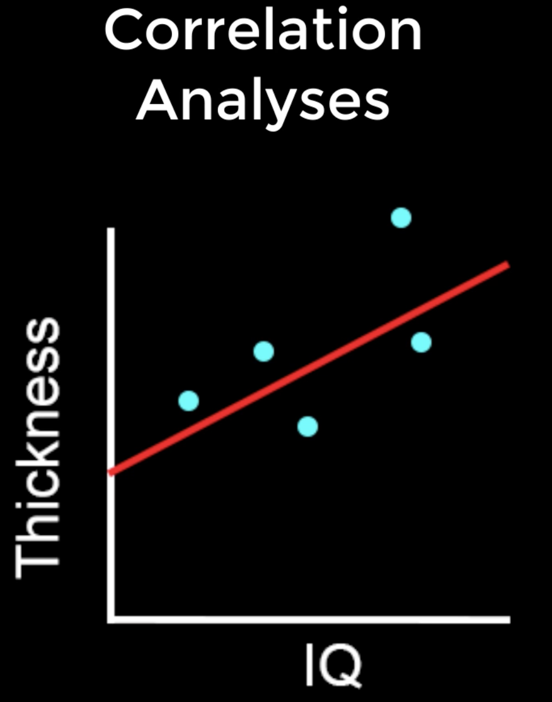
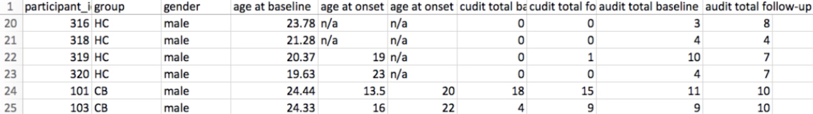
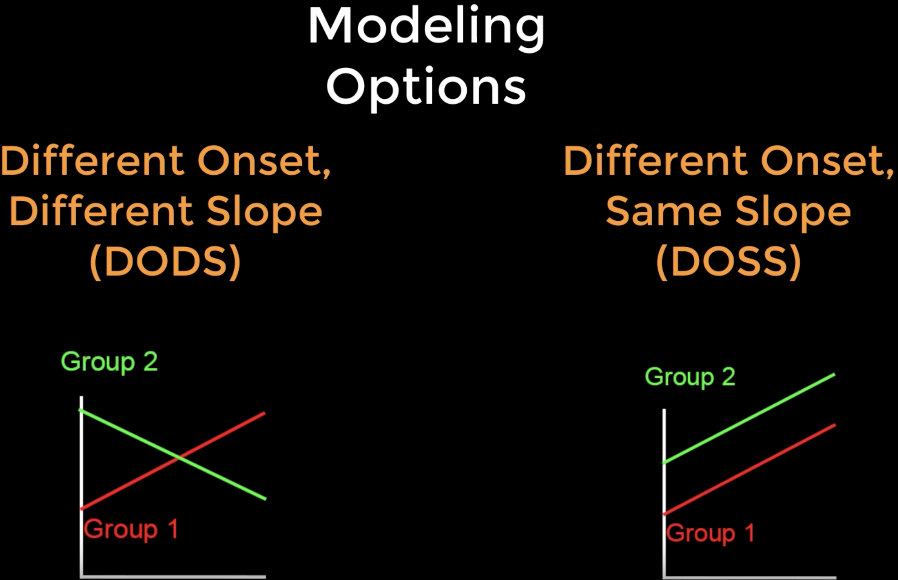

.. _FS_10_CorrelationAnalysis:

=============================================
FreeSurfer Tutorial #10: Correlation Analysis
=============================================

---------------

Overview
********

**Correlation** quantifies how much two variables covary. For example, if I am analyzing an experiment which measures the IQ and the cortical thickness of my subjects, I can plot both variables on separate axes of a graph. For each subject I draw a dot on my graph at the intersection of their IQ and thickness values, and then draw a line that seems to best fit the data. The magnitude of the covariation between the variables, also known as the **correlation coefficient**, can be calculated using the formula found `here <https://www.socscistatistics.com/tests/pearson/>`__. (On that page you can also click on the ``Calculator`` button to compute the correlation coefficient for a sample dataset.) A positive correlation means that as one of the variables goes up, so does the other; and a negative correlation represents the inverse. The magnitude of the correlation coefficient can be tested for statistical significance, just as with t-tests.

.. note::

  Although the correlation coefficient describes the covariation between two variables, it should not be interpreted to mean that one variable necessarily *causes* an increase or decrease in the other variable. While finding a strong correlation can be a useful first step in constructing a model of causality between the variables, these results should always be interpreted with caution; see, for example, the case of the `lurking variable <https://www.statisticshowto.datasciencecentral.com/lurking-variable/>`__.
  
Just as the group comparison in the last tutorial used a t-test at each vertex to test for differences between groups, so can we test for significant correlations at each vertex between structural measurements and covariates. A list of the covariates for the current study can be found in the ``participants.tsv`` file. For example, we may want to include the covariates ``age`` and ``audit total baseline`` (the values in audit represent how many drinks per week the subject has), either to see how they correlate with different structural measurements, or to regress them out of the model. Including age as a covariate, for example, would allow us to test for the difference between the groups while controlling for the effect of age; in other words, we could say that the differences we observe in cortical thickness between the groups (for example) is not due to age, and is more likely to be explained by the subject's group.

  

DODS vs. DOSS
*************

Before we model these covariates, we need to be familiar with FreeSurfer's modeling options: Different Onset, Different Slope (or **DODS**) and Different Onset, Same Slope (or **DOSS**). DODS will estimate a separate onset (or **intercept**) and a separate slope for each of the covariates in the model, while DOSS restricts the slopes for both covariates to be the same.

The advantages of DOSS are that fewer parameters are estimated, and therefore you will have more degrees of freedom and more statistical power. This probably doesn't matter for large datasets with many degrees of freedom, but it may have an effect on datasets that have only a couple dozen subjects and several covariates. For most analyses, however, DODS is the better option - it is more flexible, and also allows you to model interaction effects. Whichever model you choose, you should use the model that you think is most reasonable for your data.

.. note::

  DODS is the default for ``mri_glmfit``. If you wish to use DOSS, you would type ``doss`` as the second argument after mri_glmfit's ``--fsgd`` option; e.g., ``mri_glmfit --fsgd CannabisStudy.fsgd doss``.

Modifying the FSGD File
***********************

In the tutorial on :ref:`creating the FSGD file <FS_07_FSGD>`, we saw how the FSGD file is formatted to include two groups. We will now add covariates, and see how to modify the FSGD file accordingly.

First, open the previous FSGD file (``CannabisStudy.fsgd``). Under the row that contains ``Class CB``, insert another row and type ``Variables``. In the next two cells, type ``Age`` and ``Audit``. This indicates that the columns to the right of the Group column contain covariates, and that these are Age and Audit, respectively. The first few lines of the new FSGD file should look like this:

::

  GroupDescriptorFile 1
  Title CannabisStudy
  Class HC
  Class CB
  Variables Age Audit
  Input sub-202 HC  25.62 6
  Input sub-206 HC  18.55 2
  Input sub-207 HC  17.66 3
  
  
When you have finished formatting the file, save it as ``CannabisStudy_Age_Audit``, and then run this code to remove any problematic carriage returns:

::

  tr '\r' '\n' < CannabsiStudy_Age_Audit.txt > CannabisStudy_Age_Audit.fsgd
  
You are then ready to create the contrast files to either rerun the group analysis controlling for the covariates, or to run a correlation analysis on any of the covariates.

.. note::

  Another covariate that is useful to include for between-groups analysis is **estimated total intracranial volume**, or eTIV for short. This will control for overall head size, which can be a confounding factor between groups that on average have different head sizes (e.g., males and females, old and young, patients and control; see `this paper <https://www.sciencedirect.com/science/article/pii/S1053811914007769>`__ for an overview of when it is appropriate to include this covariate). If a subject has been processed with recon-all, the following line of code will use ``mri_segstats`` to extract the eTIV (you will need to make sure that this command is run from the directory that contains the subjects, and that SUBJECTS_DIR is pointing to that directory):
  
::

    mri_segstats --subject subject_name --etiv-only | grep atlas_icv | awk '{print $4}
    
  This number, which usually ranges from about 1,000,000 to 1,500,000 in healthy adults, can then be entered into the FSGD file just as we did with the other numbers. Mean-centering the covariates can also change your interpretation of the results; see `this page <http://mumford.fmripower.org/mean_centering/>`__ for examples of when to do it, and how it will change your interpretation.

Creating Contrast Files for Covariate Analyses
**********************************************

The number of covariates and the modeling option that you choose (DODS or DOSS) will affect the formatting of your contrast files. In our previous tutorial which only had two groups, we needed only two numbers: one contrast weight for each group. With additional covariates, we will need to add a corresponding number of columns.

If we decided to use DOSS, for example, there would only be one additional parameter to estimate for each additional covariate. In that case, if we wanted to contrast the groups while controlling for the effects of Age and Audit, our contrast file would look like this:

::

  1 -1 0 0
  
And if we wanted to create a correlation map for Age, it would look like this:

::

  0 0 1 0

.. note::

  Remember that the columns will correspond to the order that they are placed in the FSGD file; in our example, the covariates are in this order: Age, Audit.
  
If we instead wish to use DODS (which is the default for ``mri_glmfit``), a contrast file for contrasting the groups would look like this:

::

1 -1 0 0 0 0

Note that there are two additional zeroes. The way to read this contrast file is in groups of two: The first two numbers indicate the contrast weights for the HC and CB groups, and the next two numbers represent the contrast weights for the Age covariate of the HC and CB groups, respectively. The last two numbers represent the contrast weights for the Audit covariate for the HC and CB groups, and the pattern would go on for as many additional covariates that you include.

For now, let us create two contrast files: One that tests for a difference between groups, and one that tests for the average correlation of the Audit covariate, collapsed across groups. For the second contrast we will use contrast weights of 0.5 each, in order to control for the number of covariates that we are averaging across:

::

  echo "1 -1 0 0 0 0" > HC-CB_Age_Audit.mtx
  echo "0 0 0 0 0.5 0.5" > Audit_Slope.mtx
  
Save this file in your ``Contrasts`` folder, and then open the file ``runGLMs.sh``. Replace the contrast options to the following:

::

  --C Contrasts/HC-CB_Age_Audit.mtx \
  --C Contrasts/Audit_Slope.mtx \
  
  
Running the Analysis
********************

You can rerun these analyses by navigating to your subjects directory and creating a higher-level script called ``runAllGroupScripts.sh``, which contains the following code:

::

  #!/bin/tcsh
  
  setenv study $argv[1]
  
  tcsh runMrisPreproc.sh $study
  tcsh runGLMs.sh $study
  tcsh runClustSims.sh $study
  
Run this higher-level script by typing:

::
  
  tcsh runAllGroupScripts.sh CannabisStudy_Age_Audit
  
  
And look at the results in :ref:`Freeview <FS_06_Freeview>`.

-----------

Video
*****

For a video overview of how to do correlation analyses in FreeSurfer, click `here <https://www.youtube.com/watch?v=tnMvf_FM6u4&list=PLIQIswOrUH6_DWy5mJlSfj6AWY0y9iUce&index=9>`__.
