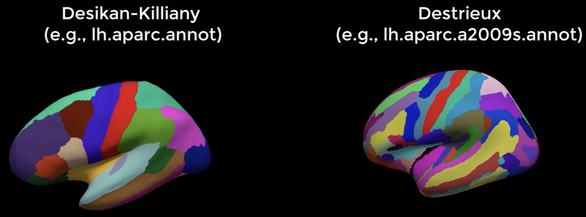

.. _FS_11_ROIAnalysis:

======================================
FreeSurfer Tutorial #11: Region of Interest Analysis
======================================

---------------

Overview
*********

In addition to creating a cortical surface and calculating structural measurements at each vertex, FreeSurfer parcellates and segments the brain - the parcellations outlining anatomically distinct regions of the cortex, and the segmentations dividing the sub-cortical nuclei into distinct structures. These parcellations are created along the lines of two atlases that come with FreeSurfer: The Destrieux atlas, and the Desikan-Killiany atlas.

Within each subject's ``stats`` directory, there is a table corresponding to the parcellations for each atlas. For example, the results for the parcellation of the left hemisphere are located in the file ``lh.aparc.annot`` for the Desikan-Killiany atlas, and in the file ``lh.aparc.a2009s.annot`` for the Destrieux atlas. The main difference between the two is that the Destrieux atlas contains more parcellations which can be used for finer-grained analyses.

  The Desikan-Killiany and Destrieux atlases placed side by side. Note that the Destrieux atlas contains more parcellations of the cortex.
  
  
The segmentations, on the other hand, are contained within one file called ``aseg.stats``. There are no separate segmentation files for each atlas.

Extracting data with asegstats2table and aparcstats2table
*********

Both the command ``asegstats2table`` and ``aparcstats2table`` require a list of subjects and the structural measurement you wish to extract from the table.

Let's begin with ``asegstats2table``. A typical command would look like this:

::

  asegstats2table --subjects sub-101 sub-103 --common-segs --meas volume --stats=aseg.stats --table=segstats.txt

1. The ``--subjects`` option specifies a list of subject names; 
2. ``--common-segs`` signalizes to output segmentations common to all of the subjects - in case one segmentation is different from the others, do not exit the common with errors; 
3. ``--meas`` indicates which structural measurement to extract from the table ("volume" is the default; alternatives are "mean" and "std");
4. ``--stats`` points to the stats file that the segmentation data will be extracted from; and
5. ``--table`` writes the extracted measurement to a text file, organized by subject name.

The command ``aparcstats2table`` requires similar arguments. Here is a typical command:

::

  aparcstats2table --subjects sub-101 sub-103 --hemi lh --meas thickness --parc=aparc --tablefile=aparc.txt
  
In this command you can specify the hemisphere to analyze (``--hemi``), the measurement to extract (``--meas``, with the options of "thickness", "volume", "area", and "meancurv"), and which atlas to use for parcellation (``--parc``; you can choose either "aparc", the Desikan-Killinay atlas, or "aparc.a2009s", the Destrieux atlas). The label for the output file is specified with the ``--tablefile`` option. Include as many subjects as you like in your analysis.

Next Steps
*********

The output from these commands are tab-delimited text files that can be read into a spreadsheet like Excel, or a statistical software program such as R. You would perform the statistical tests just like you would any other t-test: Select the structural measurements from the groups you wish to compare, and then contrast the two groups against each other.

.. note::

  In the future, I will add sections on how to resample a volumetric ROI to the surface, and then extract structural measurements from that ROI.

-----------

Video
**********

For a video overview of how to do region of interest analysis in FreeSurfer, click `here <https://www.youtube.com/watch?v=ho_cFxkXS5E&list=PLIQIswOrUH6_DWy5mJlSfj6AWY0y9iUce&index=10>`__.
