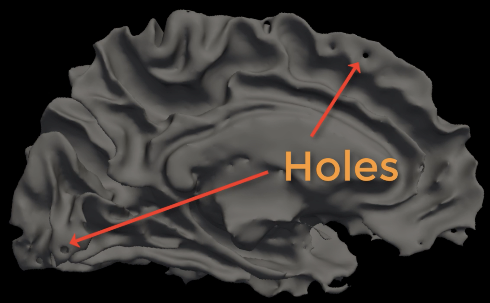
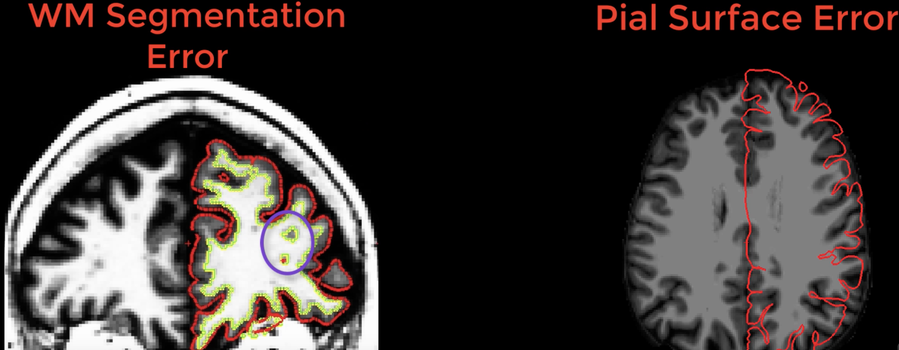
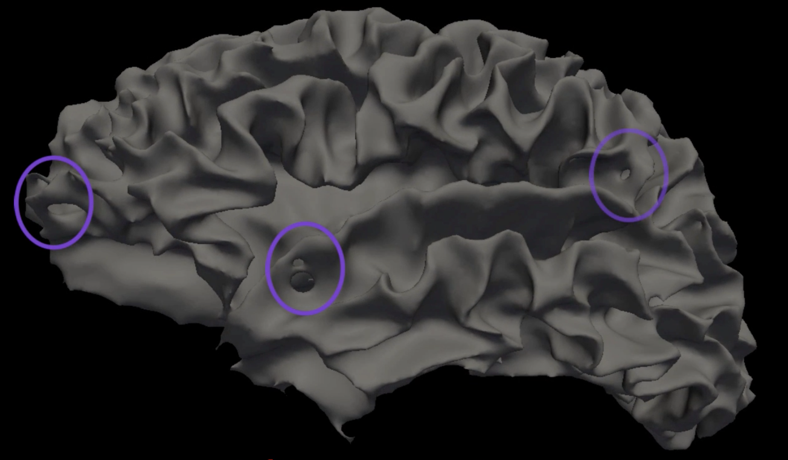
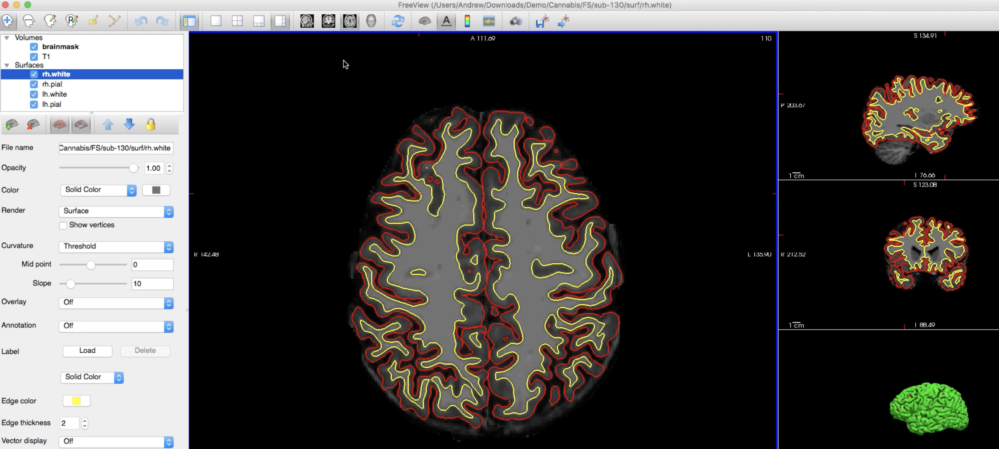
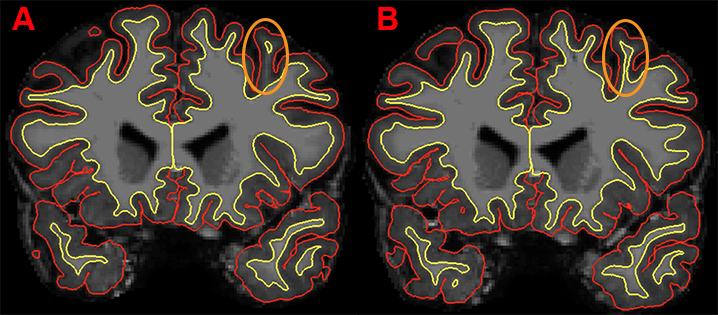
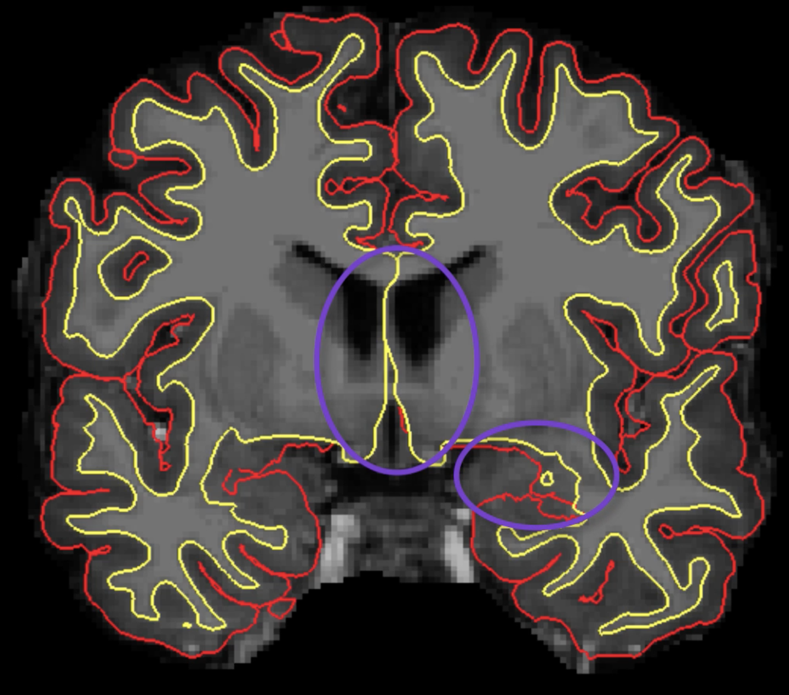

.. _FS_12_FailureModes:

======================================
FreeSurfer Tutorial #12: Introduction to Failure Modes
======================================

---------------

Overview
*********

If your anatomical data is of good quality - strong contrast between the tissue types, no movement, high resolution - then recon-all will likely run without errors, and will generate surfaces that accurately track the borders of the different tissue types. You may observe small discrepancies between the borders that are drawn by FreeSurfer, and the actual borders between the grey and white matter; but as long as the discrepancies are relatively small and infrequent, it's best to leave them alone. In those cases, sometimes editing the surfaces can make the problem worse, not better.

Nevertheless, for some subjects recon-all won't be able to finish reconstructing the surfaces; or, if it does, sometimes the discrepancies are so large that manual edits are required. An example of one of these problems is the appearance of holes in the reconstructed white matter surface, which can throw off the calculations of nearby grey matter thickness and volume. These **Failure Modes** occur whenever there is an issue that either causes recon-all to exit prematurely, or which requires manual edits.

Hard Failures vs. Soft Failures
*********

Failure modes can be divided into two categories: **Hard Failures** and **Soft Failures**. Hard failures occur when recon-all exits its preprocessing stream due to one of these scenarios:

1. No write permission to the current disk (to fix this, see the help file for the ``chmod`` command);
2. Insufficient disk space; or
3. Problems with the anatomical image, such as too much motion.

Scenarios 1 and 2 are easy enough to resolve, but 3 can be difficult and maybe even impossible to fix. It is best to prevent scenario 3 from happening by making sure the subject is still during the anatomical scan, and to check the slices as they are being acquired by the scanner.

Soft Failures, on the other hand, occur when recon-all has finished without any errors - but upon closer observation of the output there are obvious errors that need to be fixed. These include large holes in the white matter ("white matter segmentation errors") and large discrepancies between the border of the white and grey matter of the anatomical volume and the reconstructed surface ("pial surface errors").

  Examples of white matter and pial surface errors.
  

Soft Failure Types
**********

As soft failures are more common, you should be familiar with their different types. Soft failures can be divided into the following categories:

1. Skullstripping errors;
2. Pial surface errors;
3. Intensity normalization errors;
4. Topological defects; and
5. White matter segmentation errors.

A few words about the last two types of errors. **Topological defects** refer to either holes that are punched through the reconstructed white matter surface, or to false "handles" of grey matter that bridge gyri. These will appear in the white matter surfaces in the ``surf`` directory. Since the release of FreeSurfer version 6.0 these types of errors are very rare, and they are usually automatically fixed during recon-all. You can see how these defects are fixed by loading the files ``lh.smoothwm.nofix`` and ``lh.white`` into freeview and toggling between them.

  Example of topological defects in the white matter surface, which are usually corrected by recon-all.
  
White matter segmentation errors, on the other hand, occur in the *volume* of the anatomical image (not in the reconstructed surface). These will look like the holes shown in the figure in the previous section above, and they are often caused by lesions or gliomas within the white matter. These are relatively uncommon in healthy subjects, and will not be covered in this course. For a walkthrough of how to fix these errors, see this `FreeSurfer page <https://surfer.nmr.mgh.harvard.edu/fswiki/FsTutorial/WhiteMatterEdits_freeview>`__.

Viewing the Other Errors
************

The remaining soft failures - skullstripping, pial surface, and intensity normalization errors - are the most common ones you will encounter, even in high-quality data. To begin looking for these errors, we will load the T1 and brainmask images as underlays in freeview, and overlay the white and pial surfaces for both hemispheres. Here is a sample command that you can use (replacing "[subject]" with the name of the subject you are looking at):

::

  freeview -v [subject]/mri/T1.mgz \
  [subject]/mri/brainmask.mgz \
  -f [subject]/surf/lh.pial:edgecolor=red \
  [subject]/surf/lh.white:edgecolor=yellow \
  [subject]/surf/rh.pial:edgecolor=red \
  [subject]/surf/rh.white:edgecolor=yellow
  
  
This will draw the boundary of the pial surface in red and the white matter surface in yellow. After running the command, you should see something like this in freeview:

While you are looking through the slices, note that although one slice may look wrong - for example, there seems to be an "island" of white matter inside a gyrus - remember that we are looking at a three-dimensional image through two-dimensional slices. If the anomaly resolves in the next slice or two, that is probably because the white matter is being projected in a direction orthogonal to the slice you are currently looking at.

  Example of two contiguous coronal slices. The white matter within the gyrus in slice A appears to be detached from the surrounding white matter; but the connection is resolved in slice B. In this case, no manual editing of this image is required.
  

Also note that the surfaces drawn in the medial wall near the ventricles and corpus callosum, and the surfaces drawn near the subcortical structures, will not be used in the final surface calculations and can be ignored during editing.

Next Steps
********

Any other edits will be done with one or more of the following steps:

1. Erasing voxels;
2. Filling voxels;
3. Adding control points;
4. Cloning voxels.

We will see how to use each of these tools, and when they are needed, in the next two chapters. 

-----------

Video
**********

For a video overview of failure modes, click `here <https://www.youtube.com/watch?v=8n5_XE-OH0E&list=PLIQIswOrUH6_DWy5mJlSfj6AWY0y9iUce&index=11>`__.
