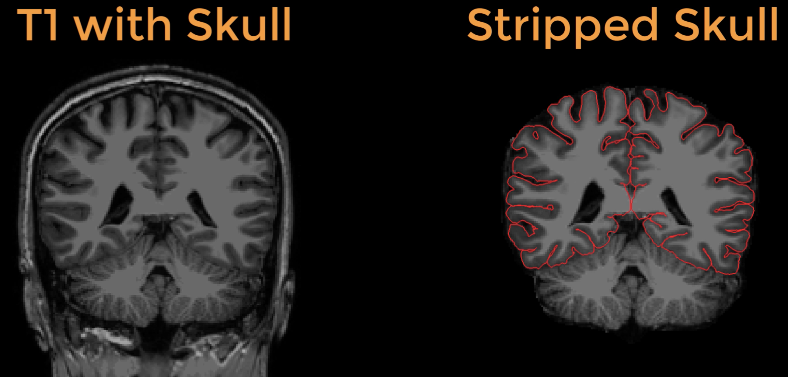
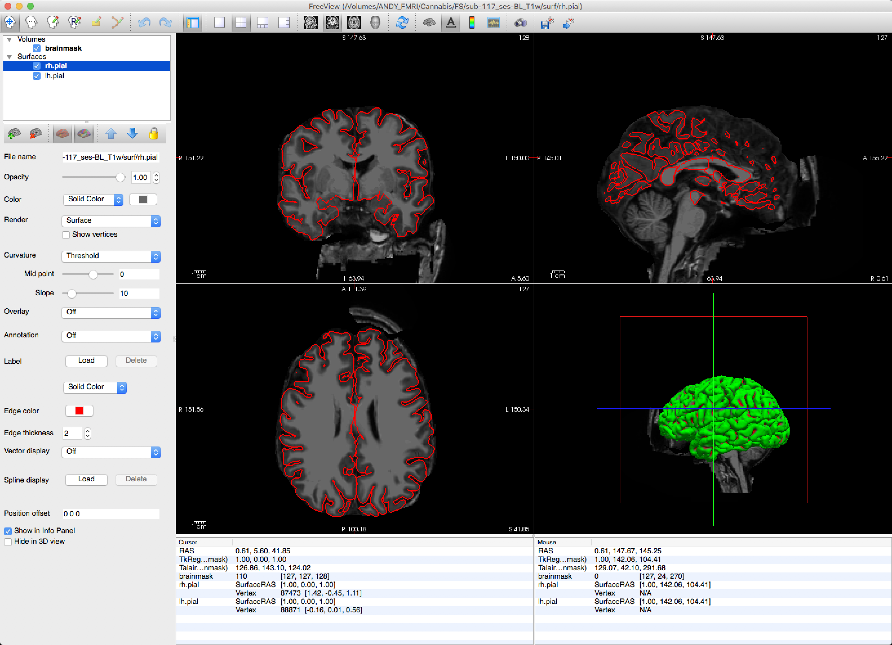
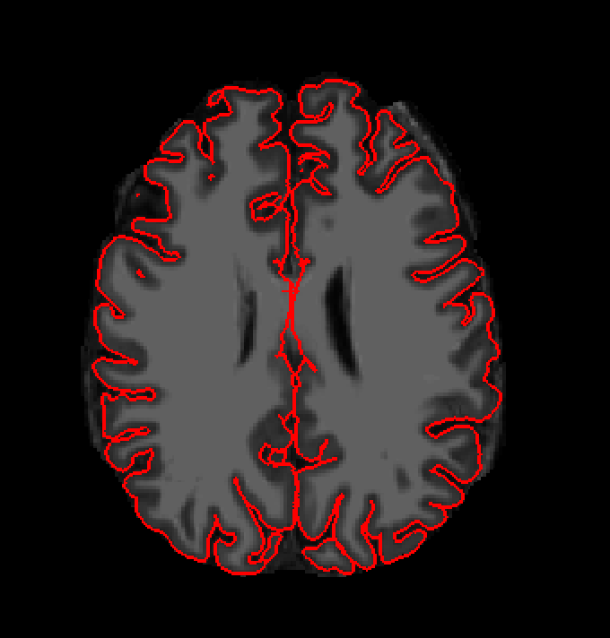
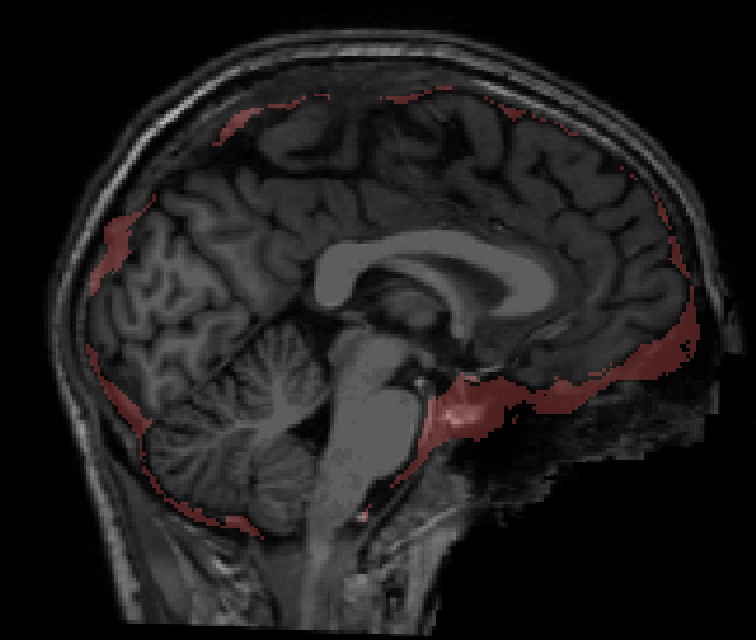

.. _FS_13_PialSurface:

======================================
FreeSurfer Tutorial #13: SkullStripping and Pial Surface Errors
======================================

---------------

Skull-Stripping
*********

One of the first preprocessing steps in recon-all is to :ref:`**skull-strip** <Skull_Stripping>` the anatomical image. This removes both the skull and anything else from the image that is not grey or white matter, such as the eyes, neck, ears, and dura mater, which allows recon-all to trace a more accurate boundary of the pial surface.

  The T1-weighted anatomical image before and after skullstripping. On the right, the outline of the pial surface is traced in red.

The pial surface after skullstripping should be checked for whether cortex was removed during skullstripping, or not enough non-brain tissue was removed. In the latter case, the pial surface may include part of the dura matter or the skull, which can inflate the estimate of the amount of cortex in that region.

.. note::

  Even if not all of the non-brain material was removed during skullstripping, that is OK as long as the pial surface has been correctly traced.
  
Setting the watershed threshold
^^^^^^^^^^

One way to control the amount of skull that is removed is by adjusting a parameter called the **watershed threshold**. During recon-all's autorecon1, the skull is stripped using a watershed threshold of 25; this parameter can take any value from 0 to 50. Increasing the threshold will increase the likelihood that both brain and skull will remain (i.e., it will be a more lenient skull-strip), while decreasing the threshold will run a more aggressive skull-strip. 

In our dataset, subject 117 still has much of the skull remaining. You can view this by navigating to the directory ``sub-117_ses-BL_T1w`` and typing:

::

  freeview -v mri/brainmask.mgz -f surf/lh.pial:edgecolor=red surf/rh.pial:edgecolor=red
  
This will display the brainmask.mgz image with the pial surfaces overlaid on top of it. The skull-strip for this subject failed to remove parts of the frontal skull, as well as large portions of the neck, as seen below:

We can remove more of the skull by setting a lower watershed threshold, such as 5. To do this, navigate to the subject directory and type the following:

::

  recon-all -skullstrip -wsthresh 5 -clean-bm -s sub-117_ses-BL_T1w
  
This will create a new brainmask.mgz file, which now has more of the skull removed. You can examine the changes by using the same freeview command as above.

Using the -gcut option
^^^^^^^

Even with a lower watershed threshold, there remain bits of skull and dura mater. You can use the -gcut option to remove the latter:

::

  recon-all -skullstrip -clean-bm -gcut -subjid sub-117_ses-BL_T1w
  
This will take a few moments, and it will look as though the command is working; before it finishes, however, you will see this error message:

::

  ** Gcutted brain is much smaller than the mask!
  ** Using the mask as the output instead!

This indicates that too much of the brain was removed - usually the cerebellum - and that the command defaulted to using the original brainmask.mgz file. This is often a problem with images that have too much skull or neck remaining, even after skull-stripping; the -gcut option won't work with those subjects.

To illustrate the results of gcut, we will use it with a different subject, number 119. First, open the subject's ``brainmask.mgz`` file and look for regions that are surrounded by large amounts of dura mater. Then run the following command from the subject directory:

::

  recon-all -skullstrip -clean-bm -gcut -subjid sub-119_ses-BL_T1w
  
To examine how much dura was removed, load the ``brainmask.mgz``, ``T1.mgz``, and ``brainmask.gcuts.mgz`` files in freeview:

::

  freeview -f mri/brainmask.mgz mri/T1.mgz mri/brainmask.gcuts.mgz:colormap=LUT
  
This will display the excised regions in fuschia; use the overlay slider to examine where the dura excision may have cut into the cortex, such as in the frontal area. In this subject the gcut option does a good job at removing dura mater, but has also removed small amounts of brain as well.

.. note::

  After you use the watershed or gcut options, you will need to regenerate the pial surfaces with the following code:
  
  recon-all -autorecon-pial -subjid <subject name>
  

Pial Surface Errors
**********

A related problem is an inaccurate pial surface, which can be caused by failures in skull-stripping or removal of dura mater. As we've seen, however, the remedies for those failures can remove cortex, which can also result in an inaccurate estimate of the pial surface. A more accurate method is to manually remove those parts of the surface which trace parts of the nearby skull or dura mater.

In this example, let's go back to subject 117. Load the subject's ``brainmask.mgz`` image and pial surfaces with this command:

::

  freeview -v mri/brainmask.mgz -f surf/lh.pial:edgecolor=red surf/rh.pial:edgecolor=red surf/lh.white:edgecolor=yellow surf/rh.white:edgecolor=yellow
  
If you scroll to slice 92 in the Coronal viewing pane, you will notice that the pial surface (traced in red) appears to include 

---------

Video
*********
