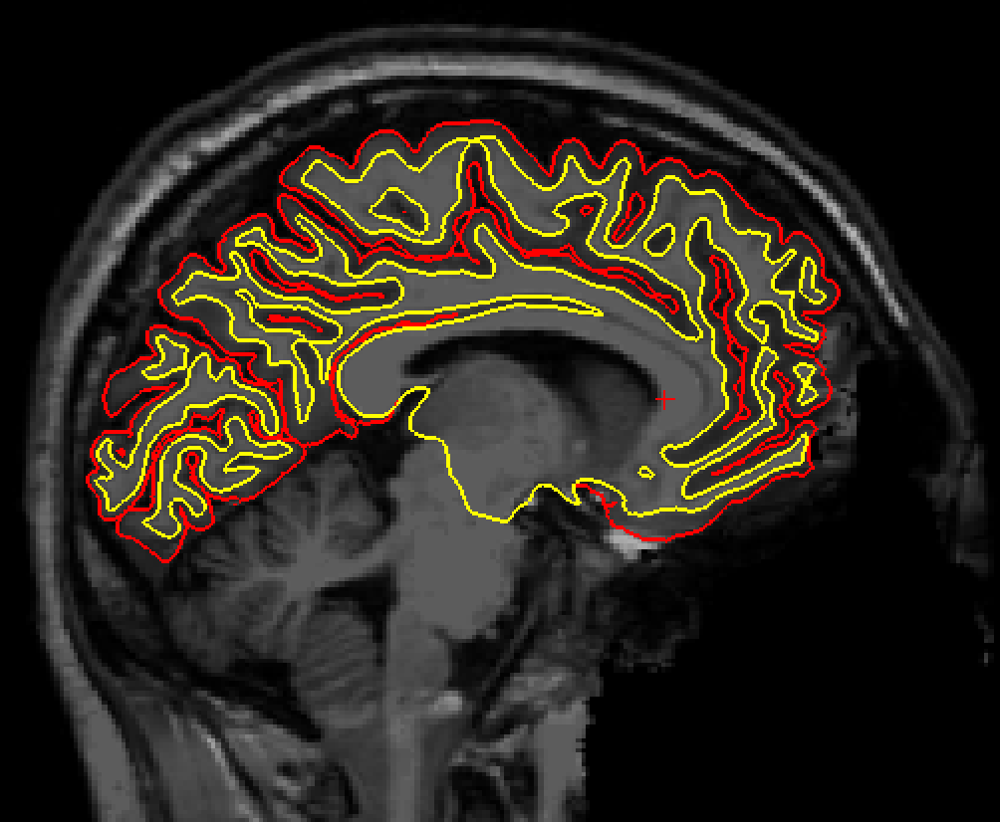
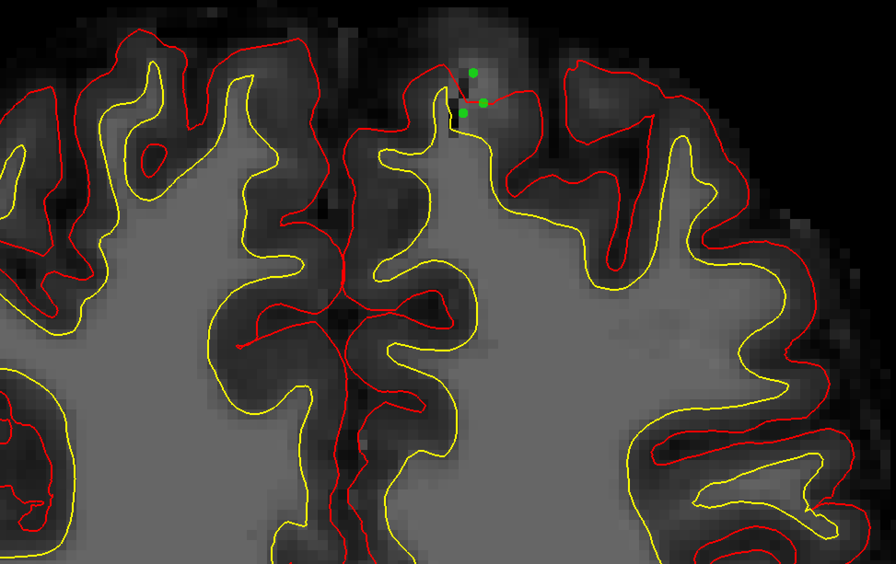

.. _FS_14_ControlPoints:

===================================================================
FreeSurfer Tutorial #14: Control Points and Intensity Normalization
===================================================================

---------------

Overview
********

During preprocessing, FreeSurfer will perform a step called **intensity normalization**. This refers to a homogenization of the signal intensity of the white and grey matter, in order to better distinguish between the tissue types and make it easier to segment the brain.

Intensity normalization failures are typically indicated by an inaccurate white matter surface. In that case, we will add **control points** to specify which parts of cortex should be classified as white matter. These control points act like tiny lamps that illuminate their immediate surroundings; by increasing the signal intensity of nearby voxels, they increase the likelihood that the area will be classified as white matter.

Identifying Intensity Normalization Errors
******************************************

Intensity normalization errors usually occur in areas that are susceptible to signal dropout - such as the ventral frontal cortex and ventral areas of the temporal lobe.

In subject 128, we can see pockets of white matter that are not captured by the reconstructed surfaces:

::

  freeview -v mri/brainmask.mgz mri/T1.mgz -f surf/lh.pial:edgecolor=red surf/rh.pial:edgecolor=red \ 
  surf/lh.white:edgecolor=yellow surf/rh.white:edgecolor=yellow
  
  
In this particular case, parts of the frontal cortex have been removed. This isn't due to an over-aggressive skull-strip, as you might think; rather, the the subject has been de-identified by having its face removed, which unfortunately has removed areas of the frontal pole as well.

Nevertheless, we will attempt to improve the surface estimates by setting control points and judge whether it is better or not.

Setting the Control Points
**************************

Switch to the coronal view and zoom in on the frontal area of the brain. The intensity normalization errors start around slice 121. From the menu, click on ``File -> New Point Set``, and type the name ``control.dat``. Select the ``brainmask.mgz`` file as your template dataset.

You can add a control point by clicking with the left mouse button on voxels that seem to belong to the white matter, but which aren't encapsulated by the white matter surface. Be sparing with your placement of control points: do not place them inside the yellow line, and do not place them in voxels that are clearly grey matter. Just two or three are enough to cover a moderate-sized area. Remember that they will extend their influence to nearby voxels as well.

.. note::

  If you need to remove a control point, you can either undo it by pressing ``cmd+z``, or by holding ``Shift`` and left-clicking on the control point you want to remove.
  
  Also, for other considerations of where to set control points, see the `FreeSurfer intensity normalization tutorial <https://surfer.nmr.mgh.harvard.edu/fswiki/FsTutorial/ControlPointsV6.0>`__.

When you are done setting the control points, click on ``File -> Save Point Set``, and save the file as ``control.dat`` in the subject's ``tmp`` directory. Then close freeview and type the following from the subject directory:

::

  recon-all -autorecon2-cp -autorecon3 -subjid sub-128_ses-BL_T1w

Video
*****

For a video overview of how to set control points, click `here <https://www.youtube.com/watch?v=TY2G8cHHzRE&list=PLIQIswOrUH6_DWy5mJlSfj6AWY0y9iUce&index=13>`__.
