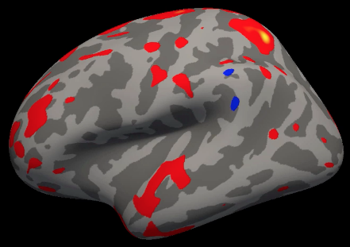

.. _FreeSurfer_Introduction:

=======================
FreeSurfer Short Course
=======================

Overview
--------

FreeSurfer is a software package that enables you to analyze **structural MRI** images - in other words, you can use FreeSurfer to quantify the amount of grey matter and white matter in specific regions of the brain. You will also be able to calculate measurements such as the thickness, curvature, and volume of the different tissue types, and be able to correlate these with covariates; or, you can contrast these structural measurements between groups.

  An example of a typical group-level map created by FreeSurfer. This is from a group-level contrast between two groups, with the red and blue colors indicating where there are differences in cortical thickness between the groups. Typically these results are depicted on inflated brains; darker grey represents sulci, and lighter grey represents gyri.
  

This course will show you how to download and install FreeSurfer, and how to analyze a dataset from start to finish. Along the way you'll learn the basic FreeSurfer vocabulary and how to do preprocessing, volume editing, and region of interest analysis.

.. toctree::
   :maxdepth: 1
   :caption: Start to Finish Analysis with FreeSurfer

   FS_ShortCourse/FS_01_BasicTerms
   FS_ShortCourse/FS_02_DownloadInstall
   FS_ShortCourse/FS_03_ReconAll
   FS_ShortCourse/FS_04_ReconAllParallel
   FS_ShortCourse/FS_05_OpenScienceGrid
   FS_ShortCourse/FS_06_Freeview
   FS_ShortCourse/FS_07_FSGD
   FS_ShortCourse/FS_08_GroupAnalysis
   FS_ShortCourse/FS_09_ClusterCorrection
   FS_ShortCourse/FS_10_CorrelationAnalysis
   FS_ShortCourse/FS_11_ROIAnalysis
   FS_ShortCourse/FS_12_FailureModes
   FS_ShortCourse/FS_13_PialSurface
   FS_ShortCourse/FS_14_ControlPoints
   FS_ShortCourse/Appendices/AppendixA_LGI

.. note::

  The following is under construction; check back soon!

.. toctree::
   :maxdepth: 1
   :caption: Start to Finish Analysis with TRACULA

   TRACULA_ShortCourse/TRACULA_01_Intro

