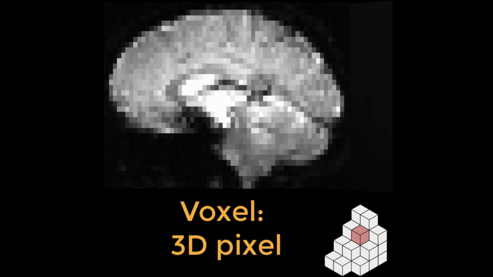
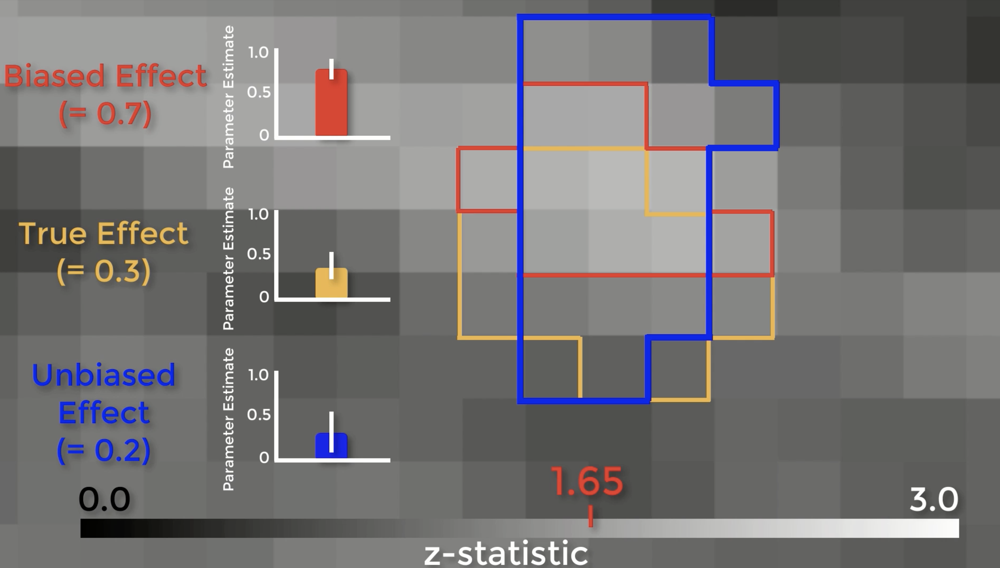
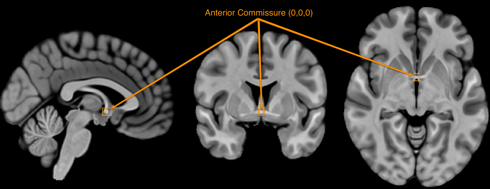
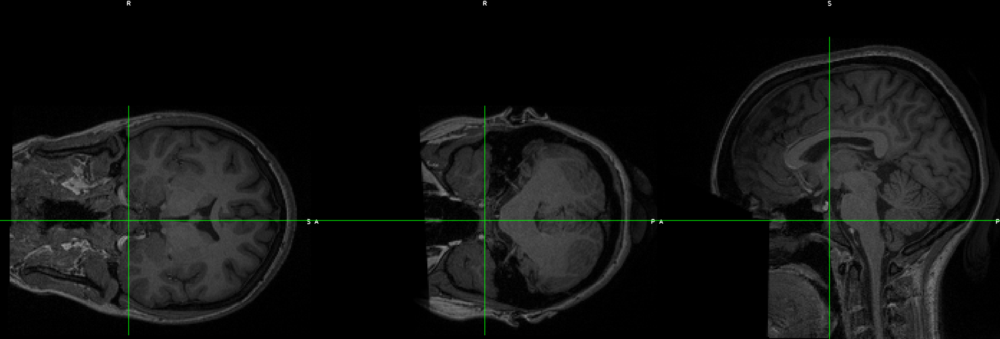
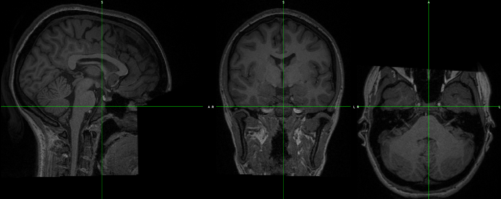

.. _FrequentlyAskedQuestions:

Frequently Asked Questions
==========================

This is a list of common questions that I am asked. I have found that most questions can be organized into categories such as Resampling, Cluster Correction, Normalization, and so on. Some of these questions may eventually be folded into the fMRI Concepts section.

Resampling
**********

Question: What is resampling? 

Answer: Resampling means changing either the resolution, dimensions, or both the resolution and dimensions of an image. A typical fMRI image is composed of voxels, which are like the pixels that make up your computer screen, but in three dimensions. For example, a common voxel size is 3 by 3 by 4 millimeters. 

  An fMRI image is composed of cubes called voxels (lower right). Each of these cubes contains a single number representing the signal measured at that voxel. Voxels can either be isotropic, with dimensions of equal lengths, or anisotropic, with at least one dimension either longer or shorter than the other dimensions. One common use of resampling is to make the dimensions of the voxel either shorter or longer, which in turn creates larger or smaller voxels. Larger voxels lead to a lower-resolution image, and smaller voxels will lead to a higher-resolution image.
  

You can resample an image using several different methods. Let's start with the nearest neighbor method, which is the easiest to illustrate. Imagine that we have a 4x4 grid with a number in each square, and that we want to resample it to a 3x3 grid. In the animation below, we superimpose a 3x3 grid on the original 4x4 grid and then find which number is closest to the center of the new square. In the upper left corner, for example, the number 8 is closest to the center of the new square. As a result, the new square will now contain the value 8.

.. figure:: NearestNeighbor_Example.gif

For example, let's say that you created a mask in FSL, and you would like to extract the data from a statistical map. You can use flirt to resample the mask to the statistical image:

::

  flirt -in mask.nii.gz -ref stats.nii.gz -out mask_RS.nii.gz -applyxfm
  
Or in AFNI:

::

  3dresample -input mask.nii.gz -master stats.nii.gz -prefix mask_RS.nii.gz
  
And you would then be able to use an ROI extraction command, such as 3dmaskave or fslstats, to extract data from the mask.

In order to resample an image to an isotropic voxel size, such as 3x3x3, you can use the following options with flirt:

::

  flirt -in volume.nii -ref volume.nii -applyisoxfm 3.0 -nosearch -out volume_3x3x3.nii
  
To resample to an anisotropic voxel resolution, you can use AFNI's 3dresample command, e.g.:

::

  3dresample -input volume.nii -out output_volume.nii -dxyz 1 0.8 1.5
  
Which will resample the voxels to have a size of 1x0.8x1.5mm, in this example.

SPM uses the GUI to resample the images; the steps for this procedure can be found in `this chapter <https://andysbrainbook.readthedocs.io/en/latest/SPM/SPM_Short_Course/SPM_09_ROIAnalysis.html#using-the-command-line-for-roi-analysis>`__.

For an overview of this topic, see `this video <https://www.youtube.com/watch?v=rvW-D5o3ALA>`__.

Biased Analysis
***************

Question: What is a biased analysis? How do you avoid doing them?

To give an example of a biased analysis, imagine that we wanted to test whether drinking Four Loko helps undergraduates do better on their exams. Let’s say that we observed which students showed an improvement, and then ran our final group-level analysis on only those students. Obviously this would be a biased analysis, since we’re only focusing on those subjects that have the effect we’re looking for; it’s no longer a truly random sample.

Circular analyses can also happen with imaging data, although it’s not as apparent when it happens. This was first pointed out in a study which examined activity in the fusiform face area in response to different stimuli. They extracted data from each condition’s significant voxels and discovered a pattern of selective activity. However, it was pointed out that if you chose an ROI outside of the brain which happened to contain significant voxels just by chance, and ran the same tests on those voxels, you would get the same pattern - which clearly shouldn’t happen. When they reran the analysis using independent ROIs, they found a pattern of noise - which you would expect with a non-brain ROI. When they ran an unbiased ROI analysis on the original data, they found that the original pattern disappeared.

Let’s see exactly how biased ROIs lead to inflated effect sizes. Here is a z-score map showing our group-level effects. If we zoom in, we can see the boundaries of each individual voxel, with a range of z-scores from 0 to 3. Assume that there is a real effect in the brain outlined in orange. If we extracted the parameter estimates for each subject from those voxels, the effect would be 0.3 – with some variation around that value. Now assume that we threshold our image at an uncorrected level of p<0.05, or a z-score of 1.65. The voxels highlighted in red are the only ones that pass that threshold. Here’s the important part: notice that this region overlaps with some of the true effect voxels, but that it includes some noise voxels as well. Because the region by definition can only include voxels passing a certain threshold, it will only contain noise voxels that are above that threshold, which biases the effect to be larger than the true effect. If we used an independent ROI, for example with cross-validation, we would create a region that probably contains some true effect voxels, and also some noise voxels – but these noise voxels will not be biased to be artificially high or low. In this example the unbiased effect is slightly lower than the true effect, but in theory it could be higher or lower – it just won’t be biased either way.

There are two problems with those arguments. First, the magnitude of the effect is just as important as detecting whether the effect is there, and biased analyses will systematically overestimate it. Why? Because small studies by definition can only detect large effects. The second is that if you publish a biased analysis, the reader may assume that it is an inferential analysis, even if it includes caveats about how it was done. If you absolutely insist on presenting them in a figure, at least don’t include error bars.

We’ve only touched on a couple of different ways to do biased analyses, but there are other ways too - and you need to be on the lookout for them. Let’s say that you use an anterior cingulate cortex ROI for your confirmatory analysis - meaning that you selected the ROI beforehand, regardless of what the whole-brain results look like - but the results don’t pass correction. You then look at the whole-brain map, and see this. You then decide to use an ROI located more in the pre-SMA. This is also a biased analysis, because now you know where your effect is before you decide where to extract from.

Orientation Problems
********************

Question: When I open my image in a viewer, the axes don't look right. How can I change it to a more reasonable orientation, such as LPI?

First, let's define the acronyms often used when discussing orientation. Remember that fMRI data is three-dimensional, and that each image has an **origin** which specifies the coordinates of X=0, Y=0, and Z=0. Usually the **anterior commissure**, a bundle of connective fibers just below the fornix, is set as the origin.

The orientation of the image indicates which direction relative to the origin is positive or negative, and the orientation is specified by a triplet of letters. For example, LPI signifies that the direction is negative to the left of the anterior commissure, and positive to the right; negative behind, and positive forward; and negative below, positive above. In this orientation, coordinates of X=-3, Y=18, Z=34 would mean that the crosshair is centered on a voxel that is, relative to the anterior commisure, 3 millimeters to the left, 18 millimeters forward, and 34 millimeters above - approximately in the left dorsal anterior cingulate.

Sometimes the orientations are flipped along one or more of the axes, resulting in orientations such as RPI or RAI. As long as all of the data is processed the same way and all of the images have the same orientation, this usually isn't a problem. However, if you have an image with a different orientation, you will have to change it.

This can be done with FSL's fslswapdim command. Let's demonstrate this with the `EUPD Cyberball <https://openneuro.org/datasets/ds000214/versions/00001>`__ dataset from Openneuro.org. If you download the anatomical and functional data for subject EESS001, you will notice that although the functional data looks OK, the anatomical data's orientations appear to be flipped: The coronal section is displayed as though it's on its side, and the other views look odd:

To fix this, type the following command:

fslswapdim sub-EESS001_anat_sub-EESS001_T1w.nii.gz RL PA IS anat_reorient.nii

When you open the reoriented image, it looks as though it's in the correct orientation. Overlay the functional image on top of it to make sure that all of the images are now in the same orientation.

What is Signal-to-Noise Ratio? How can I calculate it?
******************************************************

How can I calculate the number of voxels in a mask?
***************************************************

Let's say you have two masks in an image, labeled A and B. Mask A is composed of 1's, and Mask B is composed of 2's. If these masks are saved into one image called ``ROIs.nii.gz``, and they were created from a template called ``ROI_Template.nii.gz``, you can use the command:

::

  fslstats -K ROIs.nii.gz ROI_Template.nii.gz -V

Which will return two numbers per mask. The first number is the number of voxels, and the second number is the volume, in cubic millimeters. For example, if one of my masks was 9 voxels large and the other one was 15 voxels, with a 2x2x2mm resolution (or 8 cubic millimeters per voxel), the output would look like this:

::

  9 72.000000 15 120.000000
  
  
How can I unwarp my data?
****************

.. note::

  I will expand upon this in a more developed section; the following are some quick notes, so that I don't forget how I did this.

Imaging data is often warped because of magnetic field inhomogeneities (also known as B0 inhomogeneities). The data can be unwarped using field maps, which detect where the inhomogeneities are located.

Another way to unwarp the data is with **blip-up/blip-down** images. Usually these are acquired in the Anterior-to-Posterior (AP) and Posterior-to-Anterior (PA) directions, with one of the directions being used to acquire your functional runs. For example, let's say that you have two images labeled AP.nii.gz and PA.nii.gz: The former contains three volumes, and the latter contains three volumes. AP images typically look more "smushed" near the frontal pole, and PA images are more smeared outwards at the frontal areas.

.. Insert figures of AP and PA examples

You can use FSL's topup to fix these. (Apply motion correction before or after?) First, merge the two phase-encoded images together with ``fslmerge -t AP_PA_b0.nii.gz AP.nii.gz PA.nii.gz``.

Then use topup to create a fieldmap:

::

  topup --imain=AP_PA_b0.nii.gz --datain=acqparams.txt --config=b02b0.cnf --out=topup_AP_PA_b0
  
In which config is a file that is provided by default by FSL (e.g., you don't have to create it; you can type this command from anywhere), and acqparams is a text file that contains the following:

::

  0 -1 0 0.0665
  0 -1 0 0.0665
  0 -1 0 0.0665
  0 1 0 0.0665
  0 1 0 0.0665
  0 1 0 0.0665

The way to read this file is, in columns from left to right:

1. +RL
2. +PA
3. +IS (This is a guess)
4. Readout time, defined as the time from acquisition of the center of the first echo to the center of the last. You can also calculate it with the formula: ReadoutTime = [EchoSpacing (in ms)] * [EPI Factor] * 0.001

This will create a field map, which can be applied to the fMRI data with:

::

  applytopup --imain=fMRI.nii.gz --topup=topup_AP_PA_b0 --datain=acqparams.txt --inindex=1 --out=fMRI_unwarped --method=jac
  
Related Readings
^^^^^^^^^^^^^^^^^

See these websites for more details about field-map unwarping a functional image.

1. `FSL topup guide <https://fsl.fmrib.ox.ac.uk/fsl/fslwiki/topup/TopupUsersGuide#Configuration_files>`__
2. `More detailed topup guide <http://ftp.nmr.mgh.harvard.edu/pub/dist/freesurfer/tutorial_packages/centos6/fsl_507/doc/wiki/topup(2f)TopupUsersGuide.html>`__
3. `Lewis Center for neuroimaging: Using field maps <https://lcni.uoregon.edu/kb-articles/kb-0003>`__

How do I merge multiple ROIs into a Single File?
************************************************

1. Merge all of the publication ROIs into one file using fslmaths to add them together (fslmerge, on the other hand, will concatenate the volumes in time, and each ROI will be in a separate volume);
2. Merge the other ROIs using step 1 above;
3. Multiply the merged theoretical ROI dataset by 2, using fslmaths (e.g., fslmaths theoretical_ROIs.nii -mul 2 theoretical_ROIs_2s.nii);
4. Multiply the merge Neurosynth ROI dataset by 3 (fslmaths neurosynth_ROIs.nii -mul 3 neurosynth_ROIs_3s.nii);
5. Merge all of the datasets together using fslmaths (e.g., fslmaths pub_ROIs.nii -add theoretical_ROIs_2s.nii -add neurosynth_ROIs_3s.nii all_ROIs.nii)

View it in fsleyes and see if that is what you want.

How do I extract the voxel coordinates for an ROI?
**************************************************

If the atlas is in MNI space, you can use a command like AFNI's 3dmaskdump. First, save the mask using the methods shown here: https://www.youtube.com/watch?v=Vaj7BBxqXt0

Then type the following:

::

  3dmaskdump -noijk -xyz -nozero -mask yourMask.nii yourMask.nii

It should generate a series of numbers, with the first 3 representing the MNI coordinates of each voxel. Note that these are in RAI orientation, so you will have to multiply the first two columns by -1 in order to convert it to LPI orientation (which is the standard used by most people).

What is in the header of a NIFTI file?
**************************************

When an fMRI images is acquired, several pieces of information are stored in its **header**, which is like a list of ingredients on the side of a box. For example, using the FSL command ``fslinfo`` on a functional dataset might return something like this (comments are after the # symbol):

::

  data_type	INT16 #The decimal precision of the data; e.g., INT16 means that it is in Integer format (i.e., no decimals), and can store values between –32768 and 32768.
  dim1		64 # Number of voxels in the x-dimension (i.e., left-to-right)
  dim2		64 # Number of voxels in the y-dimension (i.e., front-to-back)
  dim3		42 # Number of voxels in the z-dimension (i.e., bottom-to-top; in most acquistions, these are the **slices**)
  dim4		180 # Number of time-points; in other words, the number of volumes that have been concatenated together into a time-series
  datatype	4
  pixdim1		3.000000 # Size of each voxel in the x-dimension, in millimeters
  pixdim2		3.000000 # Size of each voxel in the y-dimension, in millimeters
  pixdim3		3.300000 # Size of each voxel in the z-dimension, in millimeters
  pixdim4		2.100000 # Size of the time-step, or TR; in other words, the time it takes to acquire each volume
  cal_max		0.000000
  cal_min		0.000000
  file_type	NIFTI-1+

Given this, annotate the output of this same command when applied to an anatomical image (hint: It is a single volume):

::

  data_type	INT16
  dim1		256
  dim2		256
  dim3		160
  dim4		1
  datatype	4
  pixdim1		1.000006
  pixdim2		1.000000
  pixdim3		1.000000
  pixdim4		1.700000
  cal_max		0.000000
  cal_min		0.000000
  file_type	NIFTI-1+

It is common to report the anatomical x- and y-dimensions as the field of view, or FOV, in the Methods section of neuroimaging papers. Since the x- and y- dimensions for anatomical images are usually the same, the FOV is typically reported as a single number, in centimeters, that is supposed to represent each of them separately. For example, in the output above, the FOV might be reported as "25.6cm".

You can output even more of the header by using a command like ``fslhd``. For example, some datasets may report this in the ``descrip`` field at the bottom of the output:

::

  descrip		TE=4.2;Time=123931.290;phase=1
  
Other pieces of information, such as the flip angle, are not usually stored in the header and must be extracted from the protocol located in the computer that ran the fMRI scan.

Other Questions
***************

1. What is the difference between a functional and a structural image?
2. Where do the fMRI templates come from? When should one use a template other than the default?
3. What are the types of images that one can generate from the scanner, and how are they different? What questions can they answer?
  
