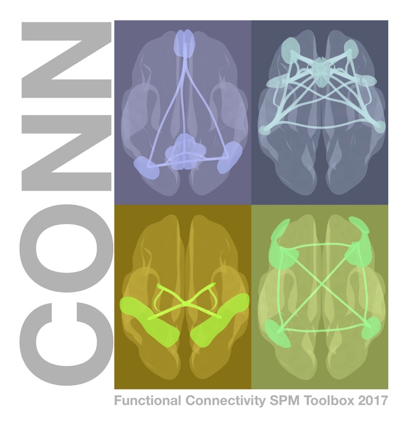

.. _CONN_Overview:

============================================
Functional Connectivity and the CONN Toolbox
============================================

---------------

Overview
********

This module will introduce you to functional connectivity, the correlation in :ref:`BOLD signal <SPM_02_Stats_HRF_History>` between two distinct regions of the brain. This correlation can be analyzed when the subject is doing a task (i.e., **task-based connectivity**), or when the subject is at rest - relaxed and alert, but not doing any particular task (i.e., **resting-state connectivity**).

In the following tutorials, you will learn how to perform resting-state connectivity analyses on a sample dataset. We will use the `CONN toolbox <https://www.nitrc.org/projects/conn>`__ to run the analyses, which includes both creating correlation maps for each voxel of the brain, and generating **connectomes** that visualize the strength of the connectivity between different regions.

  The CONN toolbox is one of the most widely used resting-state analysis packages available.

Recommended Tutorials
*********************

Before going on, you may want to work through the :ref:`SPM tutorials <SPM_Overview>`. These will introduce you to Matlab and SPM, which you will need to run the CONN toolbox. That course will also cover what toolboxes are, and how to install some of the most widely used ones, including Marsbar and the WFU PickAtlas toolboxes. When you have finished doing the SPM tutorials, come back to this page to being the CONN walkthrough.

Note that SPM is a prerequisite for the CONN toolbox, meaning that you will need to :ref:`download and install SPM <SPM_fMRI_Intro>` before you can use CONN. The rest of the tutorials in the SPM module aren't required, although a better understanding of how SPM preprocesses fMRI data will prepare you to use the CONN toolbox. 

.. toctree::
   :maxdepth: 1
   :caption: Start to Finish Analysis with CONN

   CONN_ShortCourse/CONN_00_History
   CONN_ShortCourse/CONN_01_FSL_Demo
   CONN_ShortCourse/CONN_02_DataDownload
   CONN_ShortCourse/CONN_03_LookingAtData
   CONN_ShortCourse/CONN_04_GUI_Overview
   CONN_ShortCourse/CONN_05_Preprocessing
   CONN_ShortCourse/CONN_06_QA_Checks
   CONN_ShortCourse/CONN_07_Denoising
   CONN_ShortCourse/CONN_08_1stLevel_Analysis
   CONN_ShortCourse/CONN_09_2ndLevel_Analysis
   CONN_ShortCourse/CONN_10_Viewing_Results
   CONN_ShortCourse/CONN_11_Task_gPPI
   CONN_ShortCourse/CONN_12_Scripting
   CONN_ShortCourse/CONN_AppendixA_GraphTheory
   CONN_ShortCourse/CONN_AppendixB_OtherSecondLevelDesigns
   CONN_ShortCourse/CONN_AppendixC_ImportingROIs

