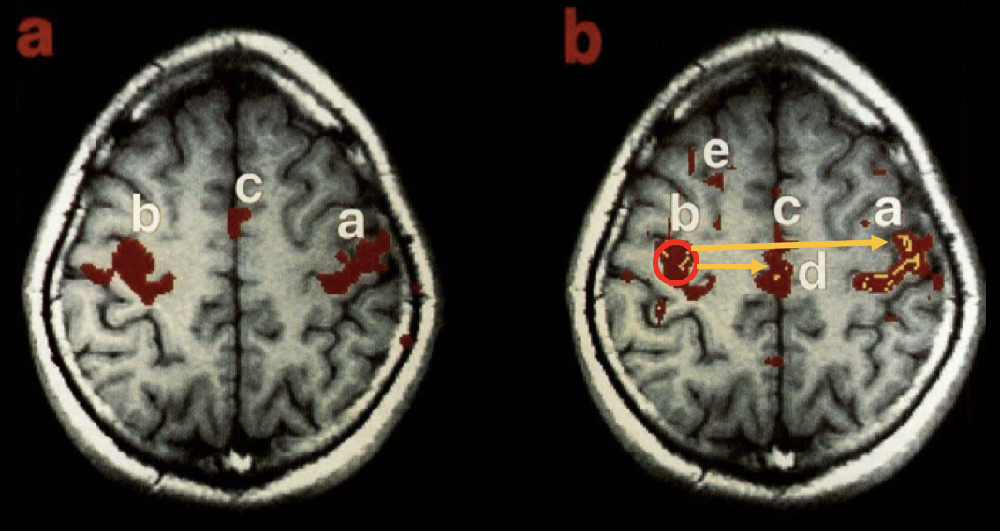
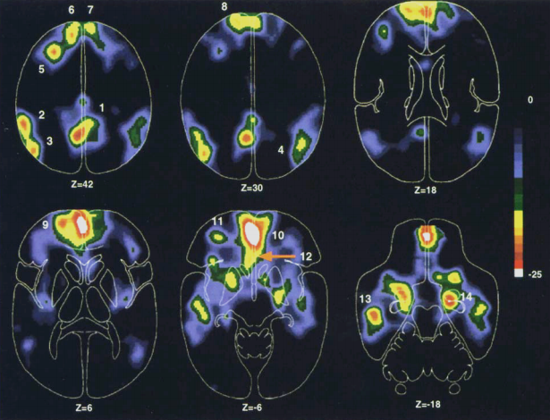

.. _CONN_00_History:

==================================
History of Functional Connectivity
==================================

--------------

Bharat Biswal and the Discovery of Resting-State Correlations
*************************************************************

As neuroimaging became more widespread in the early 1990s, experiments with fMRI focused mainly on mapping the BOLD response to sensory and motor stimuli. The visual cortex response to a flashing checkerboard, for example, was noted early on (Kwong et al., 1992), as was the primary sensory areas to auditory stimuli, tactile stimuli, and finger presses. These experiments were simple, but necessary for demonstrating the validity of fMRI as a non-invasive imaging technique.

With these basic results already documented, researchers began investigating both the source of the BOLD signal and the sources of noise. It was understood that the signal that was being acquired from the BOLD response was relatively small compared to the noise that surrounded it; not only noise generated by the scanner itself (taking the form of what is known as "scanner drift") but from physiological sources such as respiration and the pulsation of blood throughout the brain. To more closely examine these physiological sources of noise, in 1995 Bharat Biswal scanned subjects both when they were doing a task - in this case, pressing buttons at a certain rhythm - and when they were doing nothing at all.

To his surprise, even after regressing out the physiological sources of noise from the resting-state data, they did not explain all of the variance in the BOLD response. Observing what appeared to be temporal correlations between different regions of voxels, Biswal extracted the time-series from the left motor cortex and correlated that signal with every other voxels' time-series. Instead of the random correlations that one would expect if there were no systematic BOLD fluctuations at rest, there was a strong correlation with the time-series of the opposite hemisphere's motor cortex - suggesting that these two functionally similar regions, although physically distant from each other, generated similar patterns of activity even at rest.

.. note::

  In this example, Biswal had used the left motor cortex as a **seed region**, which was then correlated with all of the other voxels in the brain. This type of correlation analysis is common, although some researchers may choose to restrict their correlation analysis between the seed region and a region of interest. For more information about regions of interest and how to extract data from them, see either the :ref:`AFNI <AFNI_08_ROIAnalysis>`, :ref:`FSL <FSL_09_ROIAnalysis>`, or :ref:`SPM <SPM_09_ROIAnalysis>` tutorials.

  Result from the original Biswal et al. 1995 paper. Panel (a) shows task-related activity in the motor cortices, while panel (b) shows functional connectivity during a resting-state scan, using the left motor cortex as a seed region. Although the resting-state analysis does reveal correlations with regions other than the right motor cortex, note the high degree of overlap between the task and the resting-state images.

A few years after Biswal's discovery, several other researchers examined whether these resting-state patterns could be observed in other regions of the brain. Since the motor cortices seemed to be highly correlated, it was assumed that other bilateral structures would show high correlations as well - such as the visual cortex and auditory cortex. And if these functionally similar regions were correlated, it was argued, then even other functionally similar regions should also be functionally connected, not just bilateral structures. For example, if the dorsal anterior cingulate and the anterior insula are both active during a cognitively demanding task, then perhaps they should be correlated during rest as well.

The Default-Mode and Task-Positive Networks
**************************

Biswal's work had cleared the way for neuroimagers to test a wide range of new hypotheses: How would these resting-state patterns change depending on what seed region was used? How would these resting-state patterns differ between groups, especially clinical populations? What did that mean for treatment of common mental disorders? How did these correlations vary over time, and with age?

Before these questions could be answered, there was a search for a reliable resting-state pattern that could be linked to how subjects performed during tasks. Behavioral differences in basic psychometric studies between schizophrenics and controls, for example, had been established; but was this a result of, say, deficits in visual processing, or because of a difference in higher-level cognition?

A couple of years after the Biswal et al. 1995 paper, Gordon Shulman and a team of researchers at the University of Washington noted that as some regions became more active during cognitively demanding tasks, there was a simultaneous decrease in blood flow to other regions. This led Shulman to speculate that there may be two networks of brain regions that show inverse patterns in their blood flow depending on whether a task is currently being performed or not: The dorsal anterior cingulate and intraparietal sulcus were shown to be consistently active during tasks, whether they were verbal or non-verbal; while the ventromedial prefrontal cortex and posterior cingulate cortex showed consistently lower levels of blood flow during tasks, no matter which kind of task it was.

