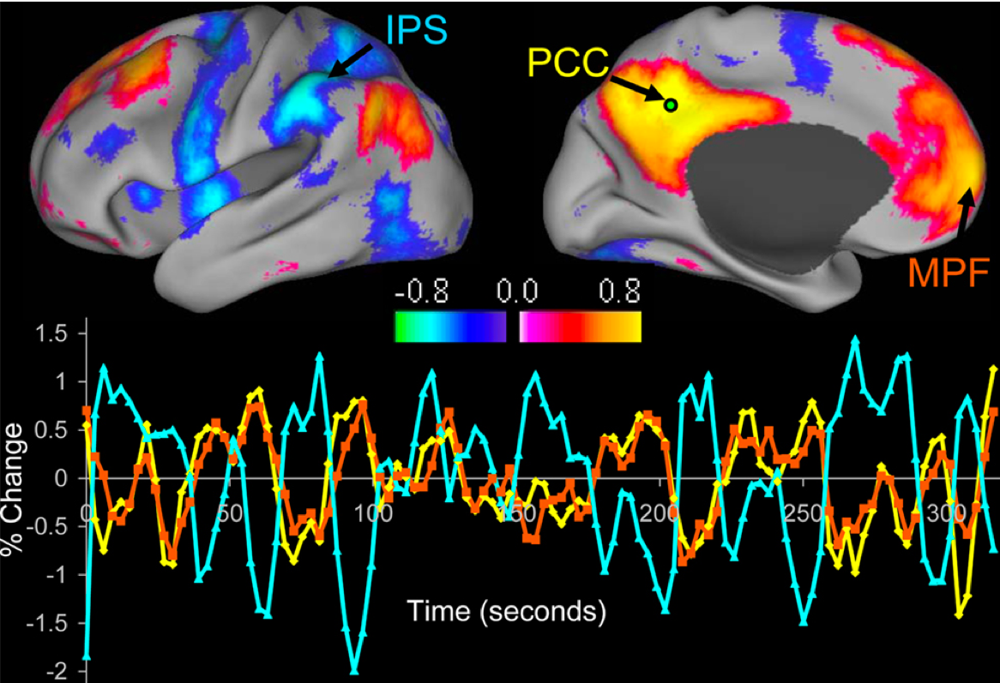

.. _CONN_00_History:

==================================
History of Functional Connectivity
==================================

--------------

.. note::

  This section is still under construction. Check back soon!

Bharat Biswal and the Discovery of Resting-State Correlations
*************************************************************

As neuroimaging became more widespread in the early 1990s, experiments with fMRI focused mainly on mapping the BOLD response to sensory and motor stimuli. The visual cortex response to a flashing checkerboard, for example, was noted early on (Kwong et al., 1992), as was the primary sensory areas to auditory stimuli, tactile stimuli, and finger presses. These experiments were simple, but necessary for demonstrating the validity of fMRI as a non-invasive imaging technique.

With these basic results already documented, researchers began investigating both the source of the BOLD signal and the sources of noise. It was understood that the signal that was being acquired from the BOLD response was relatively small compared to the noise that surrounded it; not only noise generated by the scanner itself (taking the form of what is known as "scanner drift") but from physiological sources such as respiration and the pulsation of blood throughout the brain. To more closely examine these physiological sources of noise, in 1995 Bharat Biswal scanned subjects both when they were doing a task - in this case, pressing buttons at a certain rhythm - and when they were doing nothing at all.

To his surprise, even after regressing out the physiological sources of noise from the resting-state data, they did not explain all of the variance in the BOLD response. Observing what appeared to be temporal correlations between different regions of voxels, Biswal extracted the time-series from the left motor cortex and correlated that signal with every other voxels' time-series. Instead of the random correlations that one would expect if there were no systematic BOLD fluctuations at rest, there was a strong correlation with the time-series of the opposite hemisphere's motor cortex - suggesting that these two functionally similar regions, although physically distant from each other, generated similar patterns of activity even at rest.

.. note::

  In this example, Biswal had used the left motor cortex as a **seed region**, which was then correlated with all of the other voxels in the brain - also called a **whole-brain** analysis. This type of correlation analysis is common, although some researchers may choose to restrict their correlation analysis between the seed region and a region of interest. For more information about regions of interest and how to extract data from them, see either the :ref:`AFNI <AFNI_08_ROIAnalysis>`, :ref:`FSL <FSL_09_ROIAnalysis>`, or :ref:`SPM <SPM_09_ROIAnalysis>` tutorials.

  Result from the original Biswal et al. 1995 paper. Panel (a) shows task-related activity in the motor cortices, while panel (b) shows functional connectivity during a resting-state scan, using the left motor cortex as a seed region. Note the high degree of overlap between the task and the resting-state images.

A few years after Biswal's discovery, several other researchers examined whether these resting-state patterns could be observed in other regions of the brain. Since the motor cortices seemed to be highly correlated, it was assumed that other bilateral structures would show high correlations as well - such as the visual cortex and auditory cortex. And if these functionally similar regions were correlated, it was argued, then even other functionally similar regions should also be functionally connected, not just bilateral structures. For example, if the dorsal anterior cingulate and the anterior insula are both active during a cognitively demanding task, then perhaps they should be correlated during rest as well.

The Default-Mode and Task-Positive Networks
**************************

Biswal's work had cleared the way for neuroimagers to test a wide range of new hypotheses: How would these resting-state patterns change depending on what seed region was used? How would these resting-state patterns differ between groups, especially clinical populations? What did that mean for treatment of common mental disorders? How did these correlations vary over time, and with age?

Before these questions could be answered, there was a search for a reliable resting-state pattern that could be linked to how subjects performed during tasks. Behavioral differences in basic psychometric studies between schizophrenics and controls, for example, had been established; but was this a result of, say, deficits in visual processing, or because of a difference in higher-level cognition?

A couple of years after the Biswal et al. 1995 paper, Gordon Shulman and a team of researchers at the University of Washington noted that as some regions became more active during cognitively demanding tasks, there was a simultaneous decrease in blood flow to other regions. This led Shulman to speculate that there may be two networks of brain regions that show inverse patterns in their blood flow depending on whether a task is currently being performed or not: The dorsal anterior cingulate and intraparietal sulcus were shown to be consistently active during tasks, whether they were verbal or non-verbal; while the ventromedial prefrontal cortex and posterior cingulate cortex showed consistently lower levels of blood flow during tasks, no matter which kind of task it was.

It wasn't until nearly a decade later, in 2005, that Michael Fox and his colleagues demonstrated that these regions were anti-correlated with one another: An increase in activity in the task-activated regions, for example, was associated with a decrease in activity in the rest-related regions. The three major nodes of these task-activated regions were identified as the intraparietal sulcus, the frontal eye fields, and the middle temporal cortex, whereas the three major nodes of the rest-activated regions were the medial prefrontal cortex, posterior cingulate cortex, and lateral parietal cortex. These opposing sets of nodes were dubbed the **task-positive** and **task-negative** networks, respectively.

One implication from this study was that in order to do a task effectively, there had to be coordination between each of the task-positive nodes, as indexed by the amount of correlation between the nodes - and, as important, that there had to be a coordinated decrease in activity in the task-negative nodes. Disruptions in this coordination could then be linked to different mental disorders, such as schizophrenia and bipolar disorder.

Resting-State Artifacts and The Debate over Global Signal Regression
********************************************************************

Motion Artifacts
^^^^^^^^^^^^^^^^

As resting-state studies became more widespread in the mid-2000's, there was more scrutiny over the proper methods for doing so. Although Biswal had demonstrated that the BOLD signal fluctuations underlying resting-state signals were not artifacts, it became increasingly apparent that resting-state data was highly susceptible to certain types of artifacts - in particular, motion. 

Although from the beginning motion had been identified as an artifact and potential confound for task-related studies, researchers later demonstrated that it could lead to spurious correlations between different parts of the brain. Many resting-state studies of elderly populations, for example, found that correlations between spatially distant nodes such as the posterior and anterior regions of the cingulate cortex were lower compared to younger adults. These differences were thought to reflect a deterioration of the brains of the older subjects, similar to how the screws and pins of a machine are worn down over time.

Although these studies either controlled for motion as a covariate or only included subjects with low levels of motion, Van Dijk and colleagues (2011) demonstrated that even minuscule levels of motion could lead to significant differences between groups. Grouping subjects according to how much they moved showed differences even between groups with mean motions of 0.044 and 0.048. Averaged across large groups of subjects, very subtle differences in motion can become the dominant source of variance.

  Figure 4 from the Van Dijk et al. (2011) paper. The two groups on the right differ by only a few thousandths of a millimeter of average motion - an extremely small difference, but one that can still lead to significant differences between the groups.

Physiological Noise
^^^^^^^^^^^^^^^^^^^

Motion artifacts are often thought to be caused by the subject's deliberate movements: Adjusting the head or scratching an itch, for example. While those types of motion are the most conspicuous, other involuntary motions can have as large of an effect, and are often more insidious. Respiration and heart rate are the two main causes of small, involuntary motions that can have an effect on between-group differences. Measuring these physiological signals and regressing them out can account for spurious correlations that take place near the arteries or at the edges of the brain, where these artifacts are most prominent.

Global Signal Regression
^^^^^^^^^^^^^^^^^^^^^^^^

Although movement artifacts have always been considered a source of noise that needs to be accounted for, one method of analyzing the data has caused controversy since it was first introduced: **Global Signal Regression**, or GSR. One of the earliest uses of GSR was by Fox et al. (2005, discussed above), which examined anti-correlations between the resting-state and task-positive networks. However, it was later shown by Murphy et al. (2007) that GSR causes spurious negative correlations in voxels.

The rationale for including GSR is that it captures several sources of noise not related to neural activity: Respiration, head movement, scanner drift, and so on.
