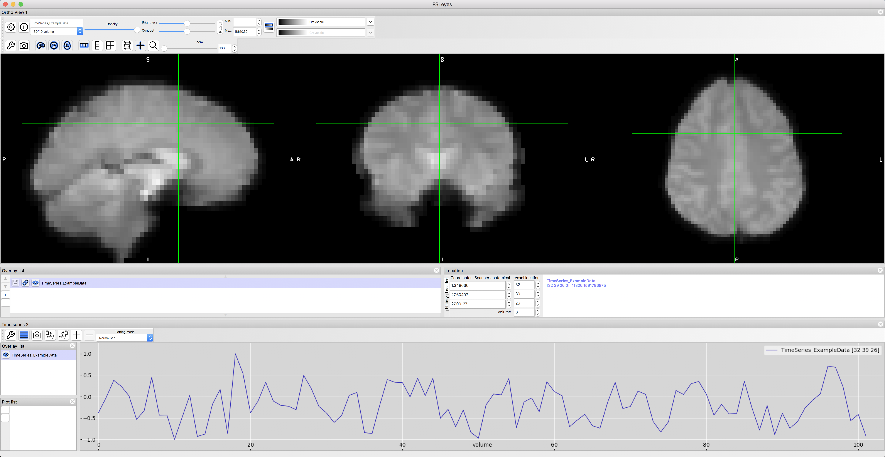
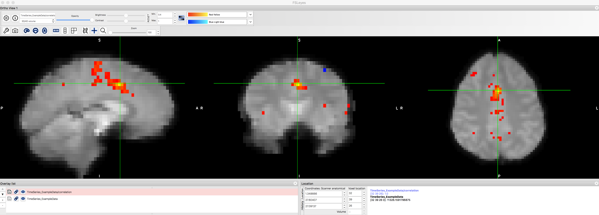
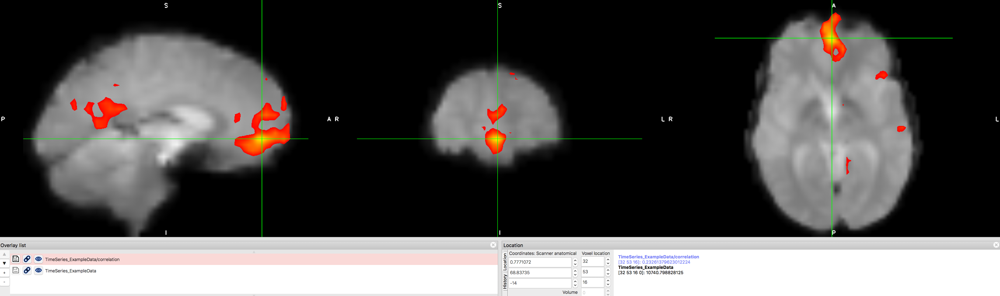

.. _CONN_01_FSL_Demo:

=================================================
Chapter #1: Functional Connectivity Demonstration
=================================================

------------------

Overview
********

Before we begin using the CONN toolbox, a short demonstration of functional connectivity using a basic method may help prepare you for using a more sophisticated package. I prefer to use the fMRI analysis package FSL for this demonstration, although both AFNI and SPM are able to do functional connectivity analyses as well. Before going on, I recommend that you work through the :ref:`FSL tutorials <fMRI_Intro>` to familiarize yourself with how FSL works, what a time-series is, and how to extract data from regions of interest (ROIs). If you already know how to do a functional connectivity analysis in FSL, or if you simply want to get started with the CONN toolbox, click the ``Next`` button down below.

.. note::

  This tutorial will use a sample dataset that you can download `here <https://www.andysbrainblog.com/s/TimeSeries_ExampleDatanii.gz>`__. The file size is about 20MB.

Functional Connectivity Analysis with FSL
*****************************************

As you saw in the FSL tutorial, each voxel of an fMRI dataset contains a **time-series**, or sequence of BOLD activation measurements that are concatenated together. The sampling rate of the time-series is the **Time to Repetition (TR)**, which for most fMRI studies is around 2-3 seconds. For each voxel, therefore, the BOLD activiation is measured at each TR, and this continues for a period of time specified by the user. This period of time encompassing when the scanner is measuring the BOLD signal is called a **run** (or **session**, in SPM), and several runs of data are usually acquired for a typical experiment. 

To examine the time-series of the sample dataset, navigate to where you downloaded the ``TimeSeries_ExampleData.nii.gz`` file, and type:

::

  fsleyes TimeSeries_ExampleData.nii.gz
  
This will open the file in the fsleyes viewer. From the menu at the top of your window, click on ``View -> Time series``. This will open a time-series panel at the bottom of the fsleyes viewer. To make the numbers more intelligible, and to enable us to compare time-series from distant voxels, click on the "Plotting mode" dropdown menu and select "Normalised". This will scale the time-series relative to a mean of 0.

  A sample time-series from a voxel in the dorsal anterior cingulate cortex.
  
Now, click on a random voxel, and then from the menu at the top of the screen select ``Tools -> Seed correlation (Pearson)``. The voxel you have currently selected will be a **seed voxel**; the time-series of this seed voxel will be used as a reference. This will generate a connectivity map between your seed voxel and every other voxel in the brain, with hotter colors representing greater correlation.

You will also notice that a new file in the Overlay list has been created, ``TimeSeries_ExampleData/correlation``. If you highlight this image by clicking on it, you can then set the "Min." and "Max." thresholds to only show those voxels that correlate with the seed region at or higher than a certain level. Set the "Min" field to ``0.4``, and take a look at which voxels remain after this threshold.

  The functional connectivity map after thresholding at r > 0.4. Note that the voxel we used as our seed region will have a perfect r=1.0 correlation with itself, and that neighboring voxels are also highly correlated with it. There are a couple of smaller clusters farther away from the dACC that correlate with the seed region, but they are relatively weak.
  
.. note::

  If you've read the :ref:`Cluster Correction appendix <Appendix_A_ClusterCorrection>`, you will remember that one of the justifications for cluster correction is that a given voxel is not completely independent from its neighbors. How do you see that principle being reflected in this correlation map?
  
Now let's see whether we can replicate one of the most well-known functional connectivity networks, the so-called **Default Mode Network**. This network is a pattern of correlated regions, primarily the ventromedial prefrontal cortex and the posterior cingulate cortex. Use the "Voxel location" fields to enter values of X=32, Y=53, and Z=16, and use this voxel as a seed for another functional connectivity analysis. What do you notice about the resulting correlation map?

  The Default Mode Network, showing high correlation between the ventromedial prefrontal cortex and posterior cingulate cortex nodes. This map can be saved as its own image by clicking on the disk icon next to the correlation map that has been generated. You can then convert this to a z-score using Fisher's r-to-z transform, and use those transformed images as input into a group-level analysis.
  
  
Functional Connectivity Analysis with Neurosynth
************************************************

Another useful tool to learn about functional connectivity is `Neurosynth <neurosynth.org>`__. Neurosynth is primarily a meta-analysis tool, but it can also be used to quickly generate functional connectivity maps for seed regions in a template brain. If you click on the "Locations" tab, you will open a new window that says "Functional connectivity and coactivation maps". Click on any coordinate in the brain, and then click on "What's here?" After a few moments, a correlation map will be generated. You can threshold the image to only show correlations above a certain value, and you can also download the correlation map to use as a mask.

.. figure:: 01_Neurosynth_FuncConn_Demo.gif
  
Next Steps
**********

Now that you have an idea of what functional connectivity is and how we generate correlation maps, you are ready to begin learning about the CONN toolbox. Click ``Next`` to learn about how to first download the data we will be analyzing with CONN.
