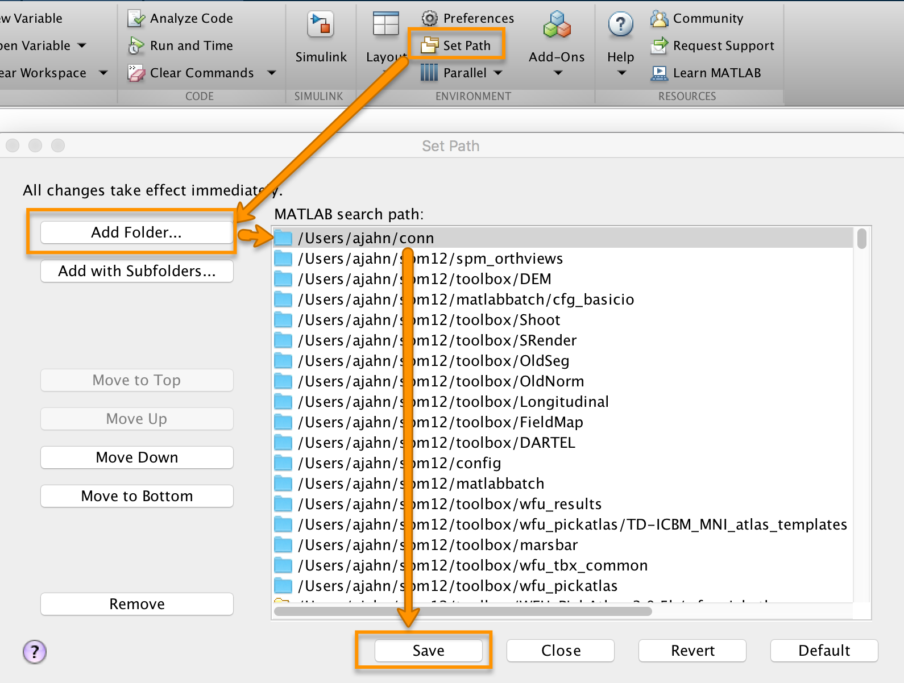
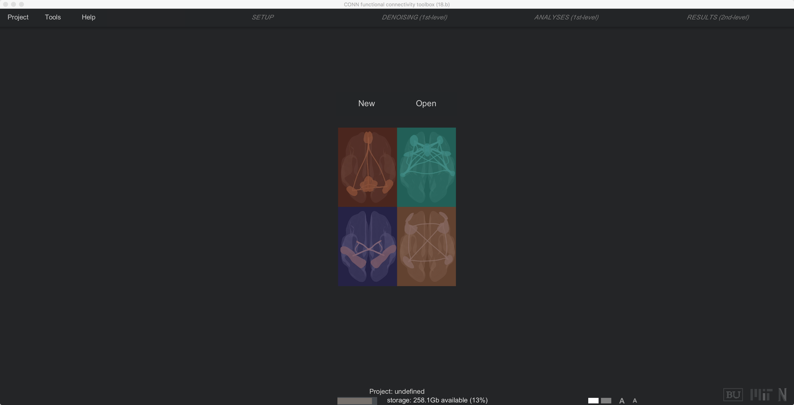

.. _CONN_03_LookingAtData:

========================================
Chapter #3: Downloading the CONN Toolbox
========================================

------------------

Overview
********

The CONN software package is what is known as a **toolbox**, a suite of commands that is designed to be used as an add-on to SPM. (An overview of some common toolboxes that are used with SPM can be found :ref:`here <SPM_Intermezzo_Toolboxes>`.) The CONN download page can be found `here <https://www.nitrc.org/projects/conn/>`__ on the NITRC website; simply click on the download button to begin downloading version 18.b.

When it has finished downloading, unzip it. This will create a folder called ``conn``. Open a new Matlab terminal, and type:

::

  movefile('~/Downloads/conn', '~')
  
Which will move the ``conn`` folder to your home directory.

The next step is to set a **path** to the directory, so that we can access the CONN toolbox from any directory. Click on the ``Home`` tab at the top of the Matlab window, and then click on the ``Set Path`` button. Click on ``Add Folder``, Select the ``conn`` folder from your home directory, and click ``Save``. 

Then exit out of the window, return to the Matlab terminal, and type:

::

  conn
  
If the path has been set correctly, CONN should load. After a few moments, you will see the default CONN screen:

  
