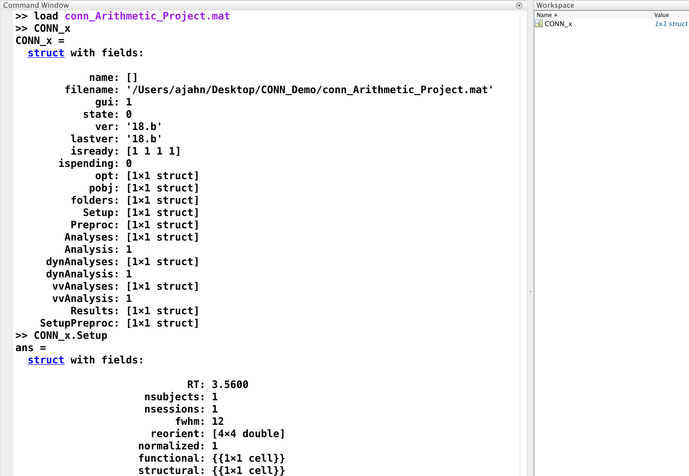
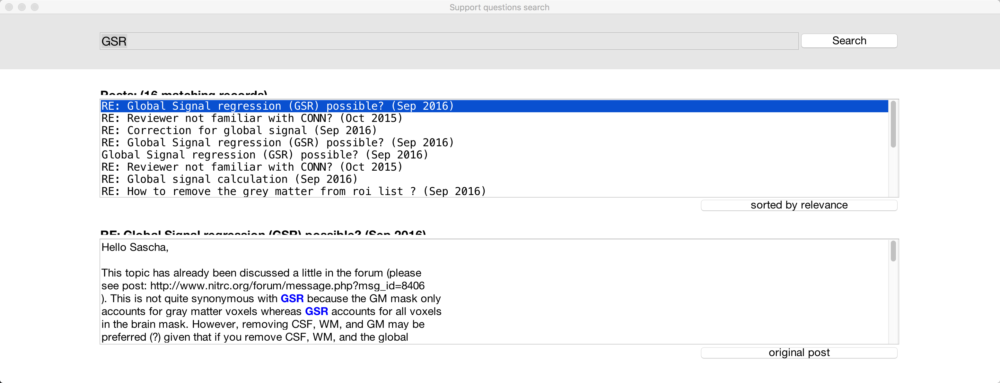
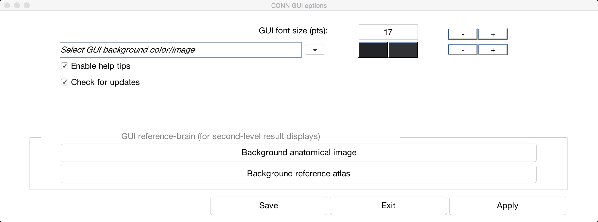
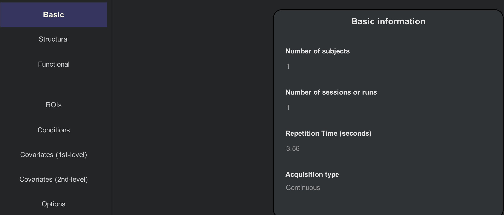
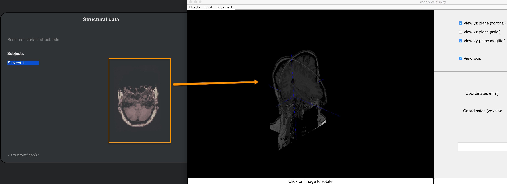
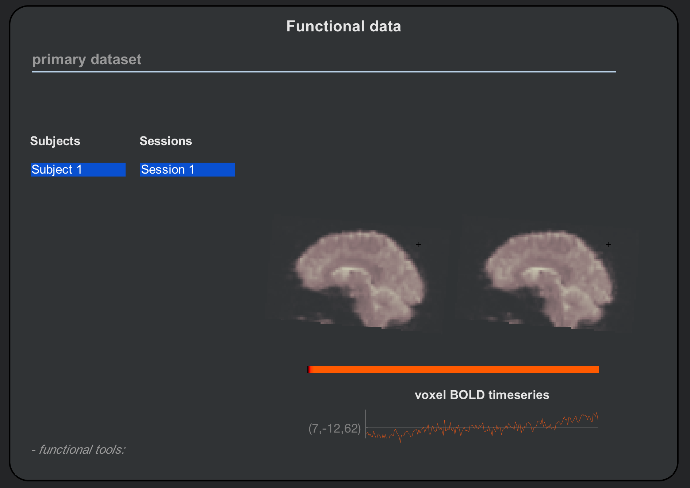
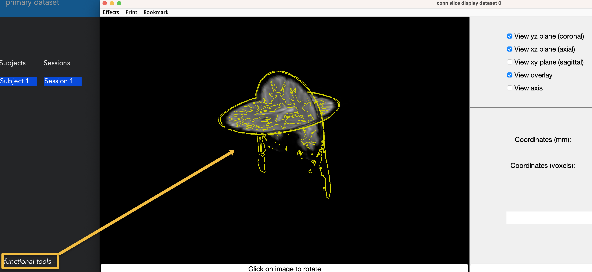

.. _CONN_04_GUI_Overview:

========================
Chapter #4: The CONN GUI
========================

------------------

.. The following assume that a directory called CONN_Demo has already been created and is placed on the Desktop.

Overview
********

One of CONN's major advantages is its graphical user interface (GUI). Virtually everything that you will need to do can be done from the GUI, and CONN's layout is straightforward and easy to use.

As with an fMRI package like SPM, though, the reliance on the GUI comes at the expense of some flexibility. Later on during the module on scripting we will see how to write Matlab code that allows you to batch certain analyses and access data that isn't available from the interface. For most purposes, however, the CONN GUI works very well, and is particularly accessible for newcomers.

The first step of any CONN analysis is to create a new **project**. This will generate a Matlab file that contains fields reflecting all aspects of the experiment that have been changed from the GUI, such as options, names of files, and what data has been loaded. Let's say, for example, that we click on the ``New`` button and name our project ``conn_Arithmetic_Project``. Save it into the ``CONN_Demo`` folder, and then go back to the Matlab terminal. Navigate to that folder, and notice that it now contains a .mat file called ``conn_Arithmetic_Project.mat``. You can load this file in the Matlab terminal by typing:

::

  load conn_Arithmetic_Project
  
There is now a new variable in your workspace called ``CONN_x``. This is a **structure file** that contains all of the fields of your experiment, similar to how a job file in SPM contains information on all of the changes you made in the GUI. In the figure below, I have already filled in a few of the fields in the GUI, such as the RT, number of subjects, and FWHM:

.. note::

  Those with experience using SPM may find it useful to review the chapter on :ref:`scripting in SPM <SPM_06_Scripting>`. The concepts are similar, and the newcomer to CONN may find it easier to understand what the .mat file does once he reviews how the same idea is carried out in SPM.
  
As you make changes to the project during preprocessing and certain analyses, you can overwrite the project file at any time by hovering your cursor over the "Project" menu and selecting "Save As". You can then close the CONN GUI if you need to, re-open it at a later time, and load your project by clicking the "Open" button and selecting the project file that you created.

The Help Menu
^^^^^^^^^^^^^

As you use the CONN toolbox more, you will encounter errors that are specific to your analysis. The "Help" menu contains links to the CONN Manual (which can also be found `here <https://web.conn-toolbox.org/resources/documentation>`__) and other web resources. The "Search help" option opens a search menu to filter forum posts by topic. For example, if you want to see every post that mentioned GSR (Global Signal Regression), you just enter it in the filter field:

Other Options
^^^^^^^^^^^^^

In order to make the CONN GUI easier to read, some users may want to change its appearance. Hover your mouse over the "Tools" menu, and select "GUI options." This will open a window that allows you to do things like increase the font size or change the color scheme. "Enable help tips" allows to you choose whether to have CONN automatically display help text when you hover your mouse over certain options. The "Background anatomical image" and "Background reference atlas" options allow you to specify the template that is used to project your results onto; you will see how the results are displayed once we cover 1st-level analysis, and if you don't like the default reference volume, you can choose a different one.

  
The Setup Tab
*************

Along the top of the CONN GUI are four tabs:

1. Setup
2. Denoising
3. Analyses (1st-level)
4. Results (2nd-level)

The **Setup** tab is where the user enters the scanning parameters for the study, such as the number of runs and the TR; there are also buttons for loading the structural and functional images.

In this experiment there was one resting-state scan and one anatomical scan per subject; since we are beginning by analyzing just one subject, we enter ``1`` for the "Number of subjects" field, and ``1`` for the "Number of sessions or runs" field. From the ``sub-01_task-rest_bold.json`` on the Openneuro data download page, we learn that the Repetition Time (i.e., the TR) was 3.56 seconds; enter this number in the "Repeition Time (seconds)" field.

The "Acquisition type" field provides two choices: ``Continuous`` and ``Sparse``. Most experiments will use Continuous acquisition; Sparse acquisition is used for event-related designs, and omits convolving the HRF with the onset of each trial. For now, leave it as the default of ``Continuous``.

The Structural Tab
^^^^^^^^^^^^^^^^^^

We now move down the left side of the GUI to the "Structural" tab. Click on it, and then use the menu on the right-hand side of the GUI to select the file ``sub-01_anat_sub-01_T1w.nii``. A pop-up window will say that "1 file has been assigned to 1 subject". Click OK, and the structural image will be loaded in the center window. The slider to the right of the image can be used to flip through different slices, and the "o" button at the top of the slider will change the viewing montage between axial, coronal, and sagittal slices. Clicking on the slices will open up another display window that allows you to look at the slices in combinations of planes by clicking multiple checkboxes.

  Clicking on the structural slices in the CONN GUI will open another display window that allows you to view the slices in three dimensions.
  

The Functional Tab
^^^^^^^^^^^^^^^^^^

The Functional tab is similar to the structural tab - select the file ``sub-01_func_sub-01_task-rest_bold.nii``, and it will load the image's slices into the center window. The first volume in the time-series is displayed on the left, and the last volume in the time-series is displayed on the right; if there was any major movement or artifacts between the beginning and the end of the time-series, it would show up in this side-by-side comparison. If there was little or no motion or artifacts, on the other hand, the two images should look virtually identical.

As with the Structural tab, you can switch between viewing planes and flip between different slices of the functional data. There is a difference, however: Instead of opening up a new viewing window, clicking on the slices will open up a time-series plot, extracted from the voxel that you clicked on. Since these data haven't been preprocessed yet, you may notice trends in the direction of the time-series either upwards or downwards; these represent **scanner drift** artifacts which are corrected by filtering out linear and higher-order trends from the data.

A useful QA check to do at this stage is to click on the ``- functional tools:`` menu in the bottom left corner of the Functional data window, and select ``Slice viewer with anatomical overlay (QA_REG)``. This displays the functional data and anatomical image simultaneously, and traces out the major sulcal and gyral curves in yellow. Check this to make sure that the boundaries of the gyri and sulci of the functional data roughly match up with those of the anatomical image.  Selecting both the coronal and axial planes is a good way to check that the ventricles and other internal structures are aligned.

If you like, you can do the same QA check with the SPM Check Reg function by clicking the ``- functional tools:`` menu and selecting ``Display functional/anatomical coregistration (SPM)``. This will open the Check Reg window, similar to what you used in the :ref:`SPM tutorial <SPM_07_SettingTheOrigin>`.

.. note::

  There are other options in the ``- functional tools:`` menu; look at each of them and guess what they do. Why would it not make sense at this time to look at the coregistration with the MNI boundaries?
  

  
  
