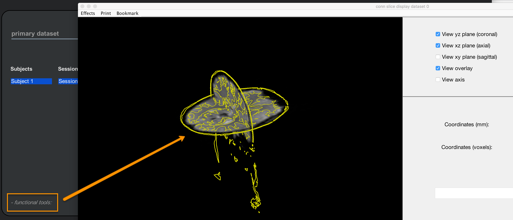

.. _CONN_04_GUI_Overview:

========================
Chapter #4: The CONN GUI
========================

------------------

Overview
********

One of CONN's major advantages is its graphical user interface (GUI). Virtually everything that you will need to do can be done from the GUI, and CONN's layout is straightforward and clear.

As with an fMRI package like SPM, though, the reliance on the GUI comes at the expense of flexibility. In a later module on :ref:`scripting <CONN_12_Scripting>` we will see how to write Matlab code that allows you to batch certain analyses and access data that isn't available from the interface. Regardless, for most purposes the CONN GUI works very well, and newcomers will find it easy to learn.

Creating a New Project
**********************

The first step of any CONN analysis is to create a new **project**. This generates a Matlab structure that contains fields reflecting all aspects of the experiment that have been changed from the GUI, such as options, names of files, and what data has been loaded. Let's say, for example, that we click on the ``New`` button and name our project ``conn_Arithmetic_Project``. Save it into the ``CONN_Demo`` folder, and then go back to the Matlab terminal. Navigate to that folder, and notice that it now contains a .mat file called ``conn_Arithmetic_Project.mat``. You can load this file in the Matlab terminal by typing:

::

  load conn_Arithmetic_Project
  
There is now a new variable in your workspace called ``CONN_x``. This is a **structure file** that contains all of the fields of your experiment, similar to how a job file in SPM contains information on all of the changes you made in the GUI. In the figure below, I have already filled in a few of the fields in the GUI, such as the RT, number of subjects, and FWHM:

.. figure:: 04_CONN_MatFile.png

.. note::

  Those with experience using SPM may find it useful to review the chapter on :ref:`scripting in SPM <SPM_06_Scripting>`. The concepts are similar, and the newcomer to CONN may find it easier to understand what the .mat file does once he reviews how the same idea is carried out in SPM.
  
As you make changes to the project during preprocessing and certain analyses, you can overwrite the project file at any time by hovering your cursor over the "Project" menu and selecting "Save As". You can then close the CONN GUI if you need to, re-open it at a later time, and load your project by clicking the "Open" button and selecting the project file that you created.

The Help Menu
^^^^^^^^^^^^^

As you use the CONN toolbox more, you will encounter errors that are specific to your analysis. The "Help" menu contains links to the CONN Manual (which can also be found `here <https://web.conn-toolbox.org/resources/documentation>`__) and other web resources to help you troubleshoot the problem. 

One such resource is the "Search help" option which opens a search menu to filter forum posts by topic. For example, if you want to see every post that mentioned GSR (Global Signal Regression), you just enter it in the filter field:

.. figure:: 04_Forum_Search.png

It can take some time to become familiar with both the CONN toolbox and functional connectivity in order to understand some of the posts. Nevertheless, reading the forums is a good way to immerse yourself in the CONN toolbox's terminology, and many of the replies from Alfonso Nieto-Castanon (the main developer of the CONN toolbox) are well-written and clear. Even if you don't understand at first what is being said in the forums, consistent practice with the toolbox and reading both the documentation and the posts will reinforce the understanding of each other.

Other Options
^^^^^^^^^^^^^

The default appearance of the CONN toolbox is a black background with white text, and most of the buttons in darker shades. If you prefer another layout, you can change the appearance of the GUI in order to make it easier to read. Hover your mouse over the "Tools" menu, and select "GUI options." This will open a window that allows you to do things like increase the font size or change the color scheme. A couple of other commonly used options are:

1. "Enable help tips", which allows you to choose whether to have CONN automatically display help text when you hover your mouse over certain options. This is useful for displaying all of the options that are associated with a particular step, but if you find the help bubble distracting, you can hide it. 

2. The "Background anatomical image" and "Background reference atlas" options allow you to specify the template that is used to project your results onto; you will see how the results are displayed once we cover 1st-level analysis, and if you don't like the default reference volume, you can choose a different one.

.. figure:: 04_GUI_Options.png

There are many other options besides these, and you are encouraged to try others out to suit your tastes. These won't affect your results, but they can make doing the analysis easier and more pleasant to do; and after all, why make life more difficult than it needs to be?
  
The Setup Tab
*************

The CONN GUI is framed by a strip of tabs running along the top of the window, and a column of buttons on the left side. These tabs and buttons control what is seen in the working space of the GUI, and what will be done to the data in that workspace.

The tabs at the top of the window, from left to right, represent each of the steps that will need to be done in order to analyze a resting-state dataset:

1. Setup
2. Denoising
3. Analyses (1st-level)
4. Results (2nd-level)

To begin our tour of the CONN GUI we will focus on the **Setup** tab, which is where you will enter the scanning parameters for the study - such as the number of runs and the TR. There are also buttons for loading the structural and functional images. Once these images are loaded, we can then begin to **preprocess** the data, which we will discuss in the next chapter.

In this experiment there was one resting-state scan and one anatomical scan per subject; since we are beginning by analyzing just one subject, we enter ``1`` for the "Number of subjects" field, and ``1`` for the "Number of sessions or runs" field. From the ``sub-01_task-rest_bold.json`` on the Openneuro data download page, we learn that the Repetition Time (i.e., the TR) was 3.56 seconds; enter this number in the "Repetition Time (seconds)" field.

The "Acquisition type" field provides two choices: ``Continuous`` and ``Sparse``. Most experiments will use Continuous acquisition; Sparse acquisition is used for event-related designs, and omits convolving the HRF with the onset of each trial. For now, leave it as the default of ``Continuous``.

.. figure:: 04_Basic.png

The Structural Tab
^^^^^^^^^^^^^^^^^^

We now move down the left side of the GUI to the "Structural" tab. Click on it, and then use the menu on the right-hand side of the GUI to select the file ``sub-01_anat_sub-01_T1w.nii``. A pop-up window will say that "1 file has been assigned to 1 subject". Click OK, and the structural image will be loaded in the center window. 

Whenever you load data into the CONN toolbox, and whenever you have generated an output file after processing the data you have loaded, it is good practice to look at your data. This means examining the data you loaded to make sure there are no artifacts and no irregularities, such as flipped orientations or Gibbs ringing artifacts. Once the data is loaded you can use slider to the right of the image to flip through different slices, and the "o" button at the top of the slider will change the viewing montage between axial, coronal, and sagittal slices. Left-clicking on the slices themselves will open up another display window that allows you to look at the slices in multiple planes by clicking multiple checkboxes - for example, in the x and y, or x, y, and z dimensions.

  Clicking on the structural slices in the CONN GUI will open another display window that allows you to view the slices in three dimensions. Checking multiple boxes will create cross-sections from multiple angles; for exmaple, check the boxes next to ``View yz plane`` and ``View xy plane`` will create a combination of coronal and sagittal slices.
  

The Functional Tab
^^^^^^^^^^^^^^^^^^

The Functional tab is similar to the structural tab - select the file ``sub-01_func_sub-01_task-rest_bold.nii``, and it will load the image's slices into the center window. The first volume in the time-series is displayed on the left, and the last volume in the time-series is displayed on the right; if there was any major movement or artifacts between the beginning and the end of the time-series, it would show up in this side-by-side comparison. If there was little or no motion and no artifacts, on the other hand, the two images should look virtually identical.

As with the Structural tab, you can switch between viewing planes and flip between different slices of the functional data; for example, click on the ``+`` icon to the upper-left of the functional images in order to display sagittal slices. There is a difference between the functional viewer and the anatomical viewer, however: Instead of opening up a new viewing window, clicking on the slices directly will open up a time-series plot, extracted from the voxel that you clicked on. Since these data haven't been preprocessed yet, you may notice trends in the direction of the time-series either upwards or downwards; these represent **scanner drift** artifacts which are corrected by filtering out linear and higher-order trends from the data.

A useful QA check to do at this stage is to click on the ``- functional tools:`` menu in the bottom left corner of the Functional data window, and select ``Slice viewer with anatomical overlay (QA_REG)``. This displays the functional data and anatomical image simultaneously, and traces out the major sulcal and gyral curves in yellow. Check this to make sure that the boundaries of the gyri and sulci of the functional data roughly match up with those of the anatomical image.  Selecting both the coronal and axial planes is a good way to make sure the ventricles and other internal structures are aligned.

If you like, you can do the same QA check with the SPM Check Reg function by clicking the ``- functional tools:`` menu and selecting ``Display functional/anatomical coregistration (SPM)``. This will open the Check Reg window, similar to what you used in the :ref:`SPM tutorial <SPM_07_SettingTheOrigin>`.
  

Exercises
*********

1. As discussed above, a new CONN project will generate an associated ``.mat`` file that contains all of the settings that were specified in the GUI. Close the CONN GUI if you haven't already, saving your project if needed. Then, from the Matlab command line, load the ``.mat`` file by typing:

::

  load conn_ArithmeticProject.mat
  
And note what the value is when you type ``CONN_x.Setup.RT``. Change this value to 3 by typing ``CONN_x.Setup.RT = 3``, and then overwrite the previous file by typing ``save('conn_ArithmeticProject.mat', 'CONN_x')``. Now, reopen the project in the CONN GUI, and note how the field for the Repetition Time has changed.

From the same Basic window in the Setup tab, note that there are two acquisition types: Continuous and Sparse. Continuous is the first option in the dropdown menu, and it is the default. Close the CONN GUI, load the project ``.mat`` file again, and try to find where the acquisition type is located in the .Setup field of the CONN_x structure. Demonstrate how you would modify it, presenting the code you would use to do so (both for changing the value, and then overwriting the project file). Paste a screenshot of the Setup Basic GUI once you have made these changes. Lastly, show the code you would use to change these values back to the defaults (RT of 3.56, Continuous Acquisition Type). Make sure that they are reset to those values in the CONN GUI before continuing with this tutorial.

2. There are other options in the ``- functional tools:`` menu; look at each of them and guess what they do. Why would it not make sense at this time to look at the coregistration with the MNI boundaries? (Assume you have not done any preprocessing yet.)

3. The font size and color scheme of the CONN GUI can be changed by selecting ``Tools -> GUI options``. Look through each of the options, and decide which ones you want to change, if any. For example, you might prefer a smaller or larger font, or to have dark text on a light background. Experiment with the different options, and try to come up with a combination that works best for you.
  
Video
*****

For a video overview of the CONN GUI, click `here <https://www.youtube.com/watch?v=N-1CZ3U8LrI>`__.
  
  
Next Steps
**********

There are other options in the GUI, such as ROIs, Conditions, and Covariates. We will leave those for now, coming back to them after we have preprocessed our data - which we turn to in the next chapter.
  
  
