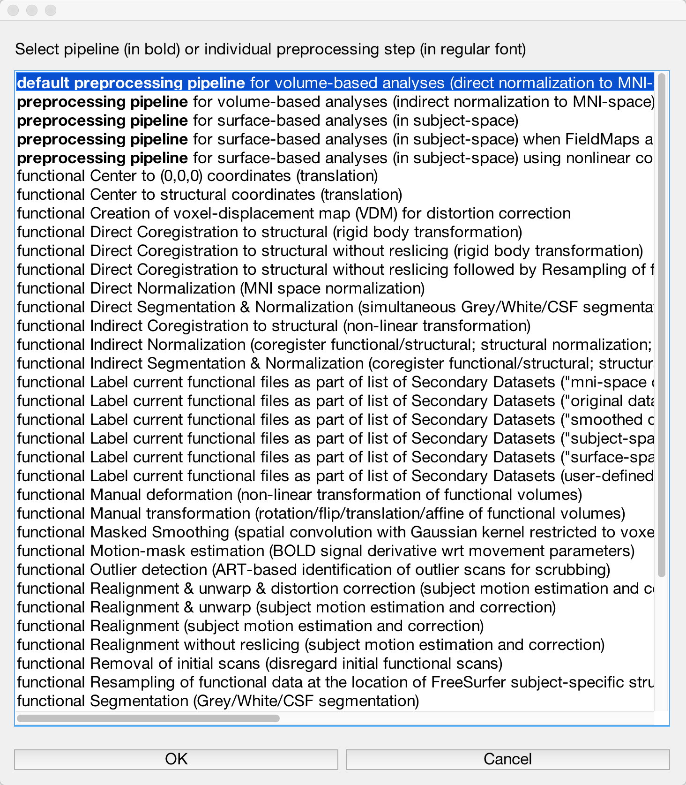

.. _CONN_05_Preprocessing:

========================
Chapter #5: Preprocessing
========================

------------------

Overview
********

Preprocessing a resting-state dataset is similar to how you preprocess a task-related dataset: You do the same steps of realignment, segmentation, normalization, and so on. The main difference is in the motion threshold. Resting-state datasets are notoriously susceptible to motion-related artifacts; even small movements can introduce spurious correlations. These artifacts are particularly problematic for laboratories studying disorders such as schizophrenia, or for researchers who scan very old or very young people. Too much movement will ruin your study.

There is no simple way to address this problem, aside from training the subjects to move as little as possible. That said, the CONN toolbox has several methods for mitigating movements artifacts, including ART (`Artifact Detection Tools <https://www.nitrc.org/projects/artifact_detect>`__) and principal component filtering of signal from tissues you may not be interested in, such as white matter and cerebrospinal fluid - a method known as ``Comp Cor``, short for Component Correction. In the following chapters, we will examine how including or omitting these steps will affect our results.

The Preprocessing Button
************************

Our first step is to **preprocess** the data to improve the quality of the images and reduce noise - similar to what we did with the :ref:`preprocessing of fMRI data <SPM_04_Preprocessing>`. To perform all of the classical preprocessing steps as well as removal of movement artifacts, click on the ``Preprocessing`` button at the bottom left of the screen. 

This will open a menu showing virtually every preprocessing step available. Bold font indicates a pipeline, or series of preprocessing steps that have already been arranged in a particular order. The first option that is highlighted, "default preprocessing pipeline", will do a traditional analysis that normalizes volumetric data to MNI space. If you are a more experienced user, you may want to explore some of the other options, such as using :ref:`FreeSurfer <FreeSurfer_Introduction>` to analyze the subject's data in their native space. For now, highlight the default preprocessing pipeline and click ``OK``.

This will add all of the preprocessing steps into the window at the top of the screen. Highlighting a step will display a short description of what the step does, along with the input and output. Some steps, such as "functional Direct Segmentation & Normalization", allow you to specify additional options, such as whether you want to use the "First functional volume as reference." (These options probably won't affect your results much, if at all, but they are there at your disposal.) You can also move certain steps up or down in the pipeline, or add and remove certain steps, by using the button on the right of the menu. For now, click the ``Start`` button to begin preprocessing the individual subject that we have loaded.

.. figure:: 05_Preprocessing_Pipeline.png

.. note::

  At the fMRI Lab at the University of Michigan, the images that are uploaded to the server already have been slice-time corrected and motion-corrected; therefore, you can omit those steps from the preprocessing pipeline by highlighting them and clicking the ``Remove`` button.

Before the preprocessing can start, you will be prompted to enter a few more options. For example, you need to specify the slice order, which should be on your scan log; if you're unable to locate it, ask your scan technician to find out what order was used. In this tutorial, we will use the interleaved (Siemens) ordering. You will also be asked to specify the threshold for how ART identifies an outlier. The "intermediate settings (97th percentile)" should work fine for most cases, although you may want to set it to a higher or lower threshold depending on the population you are studying. Instead of basing the threshold on a normative sample, moreover - in other words, the settings that have already been selected - you can instead choose to edit the settings directly by selecting "Edit settings" and manually setting the subject-motion mm threshold.

.. figure:: 05_Set_Motion_Threshold.png

For our current tutorial, we will leave it at the intermediate settings.

You will next be prompted to select the sampling resolution of the anatomical and functional output. The defaults of 1mm^3 for the anatomical image and 2mm^3 for the functional images should be fine; if you want to take up less space on your hard drive, you can lower the resolution (i.e., increase the numbers in the fields), at the expense of lower spatial resolution.

Finally, you will be asked to specify a smoothing kernel. As you will see later, the smoothed data by default is omitted from the actual functional connectivity analysis; it is included here in case you want to use it. Click ``OK``, and the preprocessing will begin, calling upon SPM tools as needed. For this subject, it will take about 5 minutes total.

.. note::

  For more details on what each step does, see the :ref:`SPM preprocessing module <SPM_04_Preprocessing>`.

Next Steps
**********

If everything has run without error, you should see a pop-up window saying that everything has finished without any problems. When the preprocessing has finished, we will need to inspect the images for any artifacts or other problems - in other words, we will do **Quality Assurance (QA) checks**. To learn more about how to do them, click the ``Next`` button.
