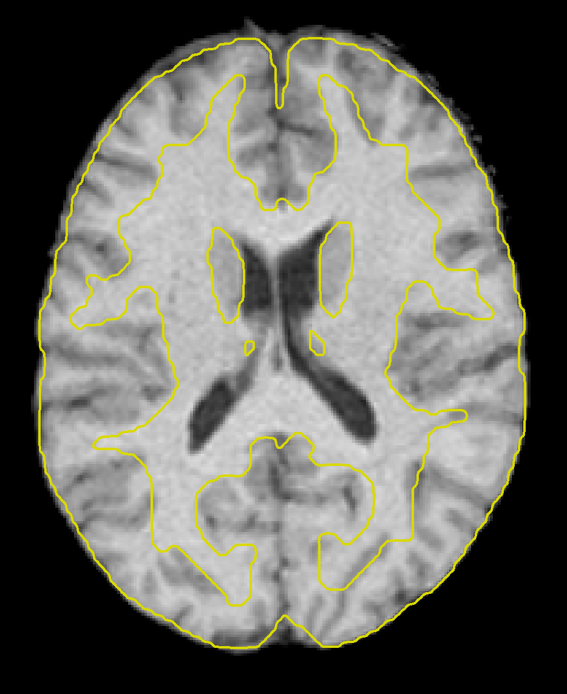
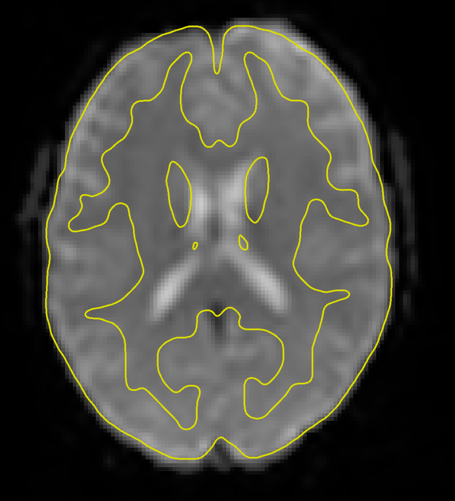
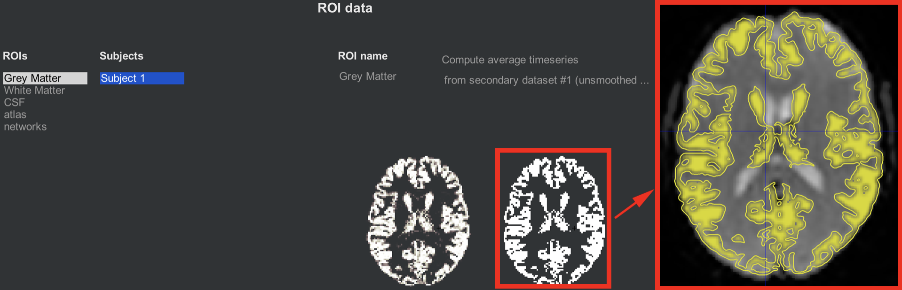
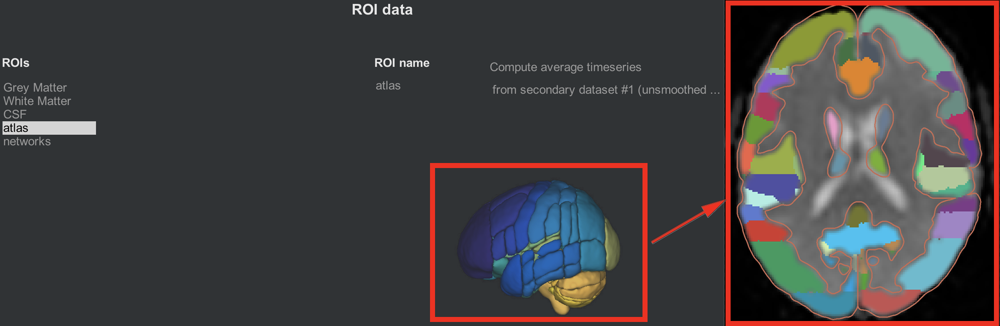
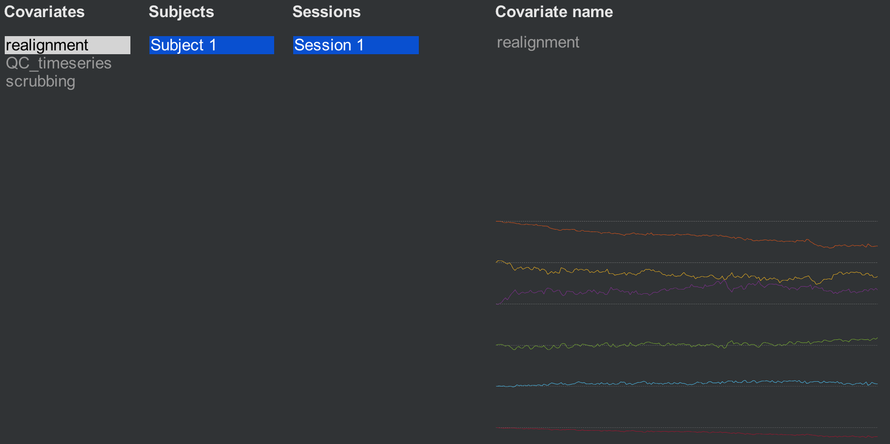
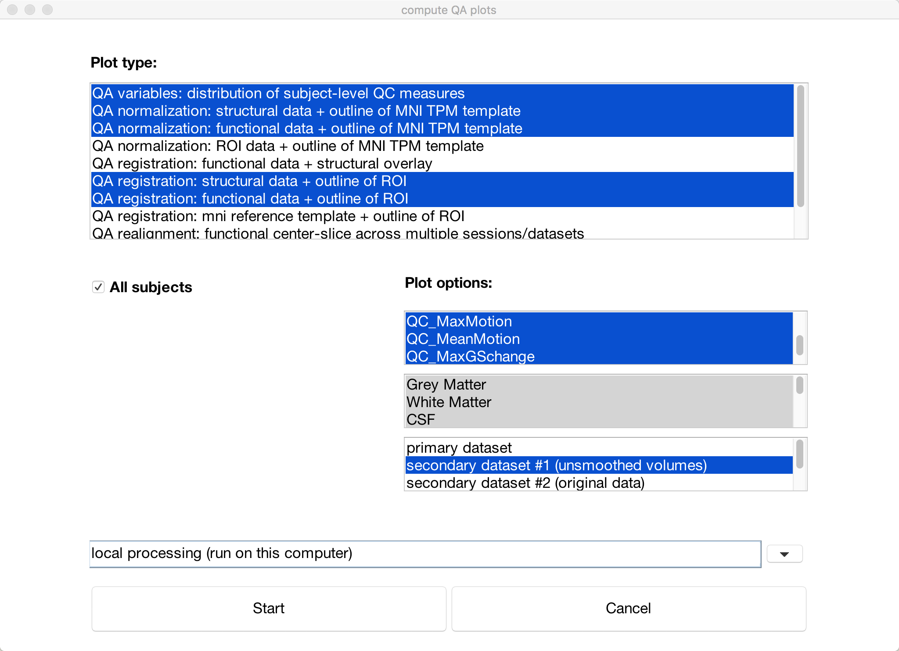

.. _CONN_06_QA_Checks:

====================================
Chapter #6: Quality Assurance Checks
====================================

------------------

Overview
********

When preprocessing the data, checking the files before and after each step will give you a sense of whether everything ran without error, or if there is something you need to double-check or redo. We will first use the buttons on the left side of the CONN GUI to examine the output of some preprocessing steps, and then use the ``QA Plots`` button in the bottom left of the CONN GUI to create a comprehensive QA report.

Revisiting the Structural and Functional Tabs
*********************************************

Once the preprocessing has finished, click on the Structural tab again. You will notice that the anatomical image looks different; it has in fact been skull-stripped, resampled to 1mm^3 resolution, and normalized to match the MNI template. Scroll through the different views to make sure that sure that the brain looks standardized. If you click on the ``-structural tools:`` menu and select ``Slice viewer with MNI boundaries (QA_NORM)``, you will see the outlines of the MNI template traced in yellow on top of the anatomical image. Observe how the yellow lines roughly outline the boundary between the white matter and the grey matter of the anatomical image. The normalization won't be perfect, but the general outlines should match up.

Clicking on the Functional tab reveals a similar change - the functional data have now been fully preprocessed, which has included normalization and smoothing. Clicking on the ``-functional tools:`` menu and selecting the ``Slice viewer with MNI boundaries (QA_NORM)`` will also show a yellow line dividing the white and grey matter. The general outline of the MNI template should also encompass the functional image. If both the anatomical and functional data are aligned with the MNI template, this indicates that the preprocessing was successful.

The ROIs Tab
************

We now come to the Regions of Interest (ROIs) tab, which lists the different regions that will be used in the connectivity analysis. Since we are primarily interested in the resting-state signal from the grey matter, we will **parcellate** the cortex into different regions, or **nodes**, and extract the average time-series from each of them. We can further divide groups of nodes into **networks** that show consistent correlation in their resting-state signal.

Grey Matter, White Matter, and CSF
^^^^^^^^^^^^^^^^^^^^^^^^^^^^^^^^^^

Clicking on the ROIs tab reveals that five sets of ROIs have already been generated for you: Grey Matter, White Matter, CSF, atlas, and networks. Let's begin with the first three, which correspond to the tissue types that make up the brain. One of the preprocessing steps, **Segmentation**, classified each voxel in the anatomical image as belonging to one of these three tissue types (for more details on how this is done, see the SPM tutorial on :ref:`Segmentation <04_SPM_Segmentation>`). The anatomical image was used for segmentation because it has higher spatial resolution than the functional image; but since we are ultimately interested in data from the functional image, we then have to resample these tissue maps onto the functional data.

The two side-by-side axial slices illustrate how the grey matter mask looks both before and after it has been binarized (i.e., set to 1's where the mask is grey matter, and 0's everywhere else), and then slightly eroded. This erosion makes the mask slightly more conservative in what it determines to be grey matter, since voxels near the boundary of the grey and white matter will be excluded. Clicking on either slice will open up a montage window that you can use to more closely observe the overlap between the grey matter mask and the grey matter of the functional image. 

  Illustration of the grey matter ROI mask before (left) and after (right) thresholding. The inset shows the grey matter mask overlaid on the functional data, which you can open by clicking on either of the axial slices. Similar images are displayed for the White Matter and CSF tabs.
  
.. note::

  Next to the ``ROI name`` field, you will see a couple of options: The first one, "Compute average timeseries," indicates that the time-series will be averaged across the voxels within that mask, which can be further subdivided by an atlas (see below). This is typically done for the Grey Matter mask. For the other tissue maps, White Matter and CSF, the option changes to ``Compute PCA Decomposition``. This performs a PCA to extract a time-series that is most representative of that tissue type; since we assume that the resting-state signal should be fundamentally different depending on which tissue type we are extracting data from, we will enter this PCA as a nuisance regressor when Denoising the data - our next step after this chapter.
  
  For both computing the average time-series and doing PCA, you can choose to do a weighted version of either one. In this case, more weight will be given to voxels determined by the Segmentation step to more likely belong to one tissue type as opposed to any of the others.
  
  Also note that there is another indicator, labeled ``from secondary dataset #1 (unsmoothed)``, that signalizes for the time-series to be extracted from the unsmoothed data. The smoothing step is performed to assist with spatial normalization, but the extracted data is unsmoothed - the idea being that there is less mixing of signal between different tissue types in the unsmoothed data.

Atlases and Networks
^^^^^^^^^^^^^^^^^^^^

The CONN toolbox comes with default atlases, or ways to parcellate the grey matter into different nodes. The grey matter is partitioned according to the :ref:`Harvard-Oxford Cortical Atlas <fMRI_09_ROIAnalysis>`, and the cerebellum is partitioned according to the AAL atlas. Clicking on the parcellated 3D brain will open a viewing window illustrating how the atlas has been resampled to the functional data. For example, the parcellation colored in orange indicates the anterior cingulate. Hovering your mouse around the different colors will return a string showing which ROI you are pointing to. Later on, we will use these ROIs in our 1st-level analysis to generate connectivity maps between those ROIs and all of the other voxels in the brain.

The same idea is illustrated in the ``networks`` tab, which assigns groups of nodes to a single network. The Default-Mode Network, for example, is a combination of a node in the posterior cingulate cortex and a node in the ventromedial prefrontal cortex. As with the cortical ROIs, you can open a slice-viewing window by clicking on the 3D network parcellation.

Covariates (1st-level)
**********************

Another output from preprocessing is the creation of nuisance regressors, or covariates that represent signal that we are either uninterested in or are trying to disentangle from the signal that we are interseted in. Motion is a classic example of a nuisance regressor: We are typically uninterseted in signal generated by the subject moving around, and we want to remove any confounding effects of movement on the signal that we are intereseted in, such as resting-state signal.

Clicking on the ``Covariates (1st-level)`` tab reveals three covariates that have been generated by default: Realignment, QC_timeseries, and scrubbing. The realignment covariate is a set of six movement parameters representing movement, in millimeters, in the three translational and rotational directions. (For more details about how motion correction works, see :ref:`this chapter <Motion_Correction>`.) Hovering the mouse around the movement parameters will display a vector of six numbers indicating the average motion in all six directions at that timepoint.

The second covariate, QC_timeseries, computes an additional measure of motion called **Framewise Displacement** (FD). This is a type of composite measure of all of the movement parameters, and the formula varies slightly between different research groups. The default in CONN is the FD computed by the ART toolbox; if you want to use another FD formula, click on the ``-covariate tools:`` menu and select ``compute new/derived first-level covariates``. This will open up another window with other options to choose from.

The last covariate, ``scrubbing``, will display any volumes that have been modeled out of the data, or **scrubbed**. This subject was very still during the scanning, so no volumes have been scrubbed.

Generating QA Plots
*******************

You can summarize all of the QA check we did above by clicking the ``QA plots`` button in the bottom-left corner of the CONN GUI. In the window that opens up, click ``Create new report``, and label it whatever you want. Then click ``Create new plot``, and select any of the QA checks that you are interested in. The default ones that are highlighted will display checks such as the functional and structural data on the MNI template and the motion parameters. When you have chosen the QA plots that you want, click ``Start``.

As series of figures will be generated, one for each QA check that you selected. You can then click on the ``Export`` button to generate an HTML file that contains everything in a convenient file that can be accessed at any time.
