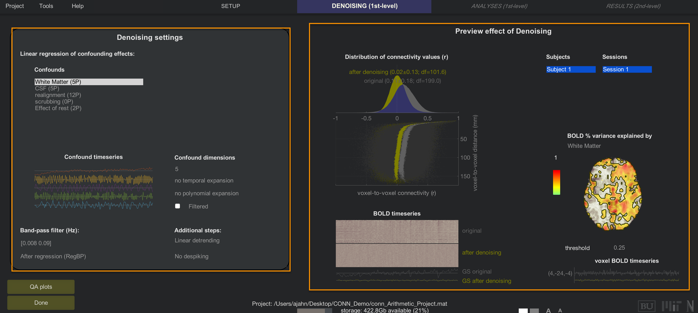
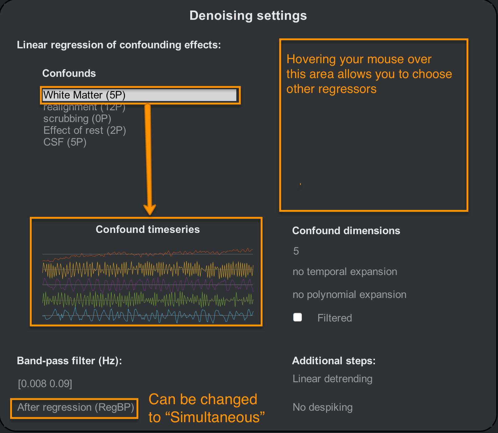
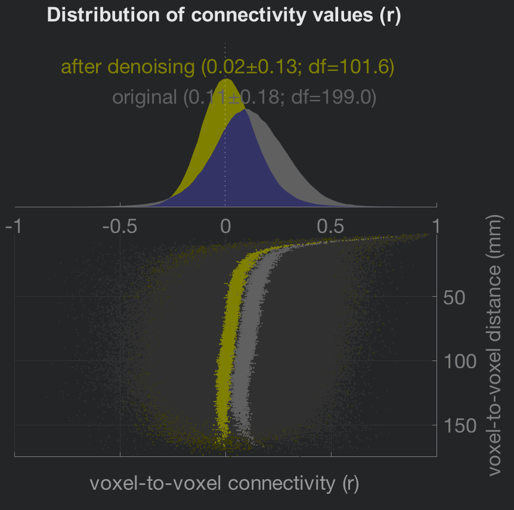
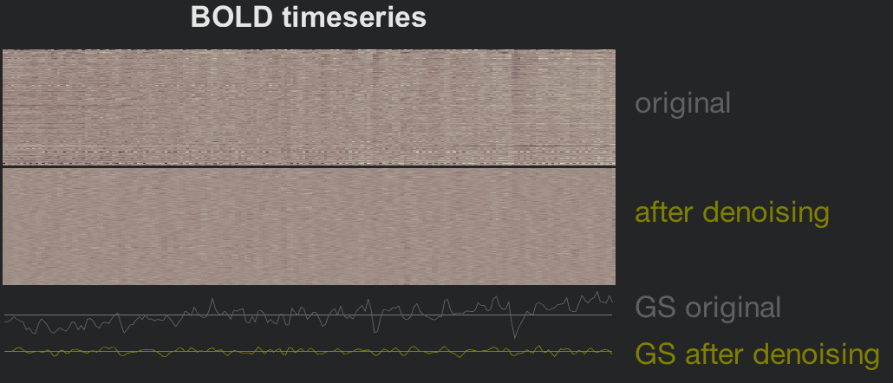

.. _CONN_07_Denoising:

=====================
Chapter #7: Denoising
=====================

------------------

Overview
********

One of the most important steps for cleaning up resting-state data is **Denoising**. This will remove certain artifacts from the resting-state data, such as linear drifts and motion effects.

To begin Denoising, click ``Done`` from the Setup tab. A new menu will apepar, prompting you to select which resting-state analyses you want to do: Any combination of ROI-toROI, Seed-to-Voxel, and Voxel-to-Voxel. All three are selected by default; unless you only want to focus on a subset of these analyses, leave them all for now. Click ``Start`` to begin the Denoising step.

.. note::

  You can change which default analyses will be checked by clicking on the "Options" button at the bottom of the Setup menu and checking or unchecking different analyses. You have control over other options as well, such as the resolution of the output data, what type of mask will be used, and whether to use parametric or non-parametric methods for determining the statistical significance of the results. You also have the choice of generating additional output files, such as first-level seed-to-voxel r-maps. These can be useful for analyses outside of the CONN toolbox.
  
  
The Denoising Tab
*****************

After a few minutes, you will have access to the Denoising tab. This window shows the different confound regressors that are used to account for different sources of noise, and allows you to see how this changes the amount of signal explained by each regressor. The Denoising tab can be split into two general areas: The Denoising Settings area, and the Preview area.

  The area on the left displays a list of confound regressors that you can enter into your model, while the panel on the right shows the effect of including those regressors.

Denoising Settings
^^^^^^^^^^^^^^^^^^

By default, CONN will include regressors derived from the tissue types you generated in the ROIs section of the Setup tab, and the 1st-level covariates of the Setup tab. CONN extracts five principal components from both the White Matter and CSF ROIs to best represent the signal profile in those regions. If you click on the string ``White Matter (5P)``, below you will see an illustration of each components time-series. In the "Confound dimensions" panel you can change the number of components; for example, try entering a value of 10, and see how the time-series panel changes. 

You can also choose to add higher-order temporal derivatives. If this is done at all, it is usually added to the motion regressors; 1st- and 2nd-order derivatives can capture more subtle movements that are not accounted for by the traditional translations and rotations. Polynomial expansion is a similar concept, adding either a quadratic or cubic exponent to the regressor, although this is not commonly done.

The ``Filtered`` checkbox specifies whether the regressor should be bandpass filtered *before* it is entered into the model. You can do this for individual regressors by highlighting the Confound regressor and checking the box, or by changing the ``After regression (RegBP)`` option to ``Simultaneous``. In the ``Additional steps`` panel you can also choose to add higher-order detrending - for example, if you have a very long scan session and you believe there may be more complex scanner drift - and Despiking. Despiking will artifically lower the signal of voxels that are abnormally high, and which are not accounted for by high motion. In general, choosing to either Despike or not Despike will give similar results.

.. warning::

  Bandpass filtering the time-series data and then doing nuisance regression has been shown to reintroduce noise frequencies and components; see the `Hallquist et al. (2014) <https://www.ncbi.nlm.nih.gov/pmc/articles/PMC3759585/>`__ paper for more details. The CONN toolbox doesn't appear to have an option that will let you do this, but it is good to be aware of it in any case.
  
  
.. note::

  If you want to remove either bound of the bandpass filter, enter ``Inf`` for that bound. For example, if you want to remove all of the lower frequencies below 0.008, but allow all higher frequencies, you would enter the vector ``[0.008 Inf]``.

Preview Denoising
^^^^^^^^^^^^^^^^^

The right-side area of the Denoising tab shows an immediate update of how the regressors affect the resting-state data. The distributions at the upper-left show the effect of your denoising regressors and parameters both before and after they are applied. In general, resting-state data is skewed to generate positive correlations, mostly as a result of the confound regressors such as motion. Note how the distribution of connectivity values is centered closer to zero after denoising is applied. The scatter plot below the distributions shows another view of the same principle: Data that is denoised shows a more uniform distribution in connectivity values as one tests for correlations at voxels farther away from the seed voxel.

  
The figure in the lower-left side is a **carpet plot** which unravels each volume from a three-dimensional cube of voxels into a one-dimensional string of squares. Each column represents an individual volume, and each row is an individual voxel in that volume. Denoising smooths out the rougher transitions between voxels that are probably caused by movement, scanner drift, and physiological noise; and the time-series plot of the global signal reflects this smoothing as well.

Lastly, the preview brain in the right-hand side shows the percent of variance in the BOLD signal explained by the currently highlighted confound regressor. The loading of the explained variance should correspond to the regressor that is highlighted. For example, can you guess which nuisance regressor this plot represents? What clues do you see? Try to guess what the figure would look like if one of the other confound regressors were selected.

Next Steps
**********

For most datasets, the above figures should look similar - the distribution of connectivity values will be centered close to zero, and the BOLD timeseries will be smoothed out. If the data passes those checks, you are ready to begin estimating a general linear model using those regresssors. To see how to do this, click the ``Next`` button.

Exercises
*********

1. Enter a bandpass regressor of ``[Inf 0.09]``. In your own words, describe what this filter will do. Is this in general better or worse than a low-pass filter? Why?

2. Experiment with changing different regressors to ``Filtered``, and observe what happens in the Preview window. Does this filtering (equivalent to the ``Simultaneous`` option) seem to worsen or improve the nuisance regression? How would you make that judgment?
