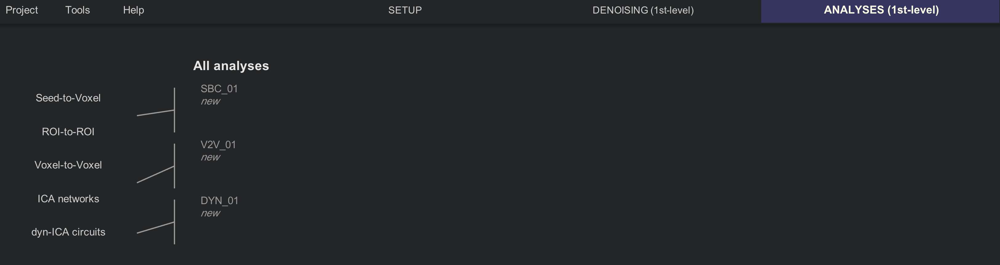
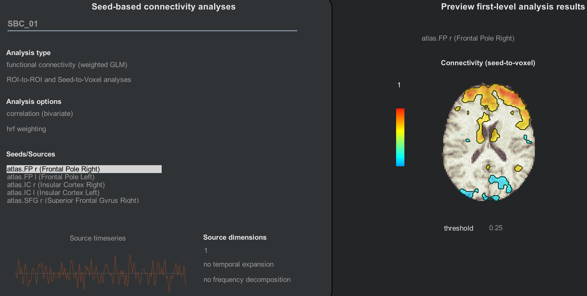

.. _CONN_08_1stLevel_Analysis:

==============================
Chapter #8: 1st-Level Analysis
==============================

------------------

Overview
********

The next step of our analysis is a **1st-level model**. The regressors specified during the Denoising step, along with any condition regressors that were set in the Setup tab, are used to construct a model to best fit the data observed in each voxel. A correlation analysis is then computed, averaging across the signal in each of the ROIs and correlating it with other ROIs in the brain, along with generating correlation maps using each voxel as a seed.

To run the 1st-level model, click ``Done`` from the Denoising tab. A new menu will apepar, similar to the one you saw before denoising: You have options for which type of resting-state analyes you want to do. Leave all of the boxes checked for now, and click the ``Start`` button.

CONN will take a couple of minutes to denoise the data and generate each of the correlation maps you specified. When it is done, you will have access to the ``Analyses (1st-level)`` tab. Click on it to review each of the analyses.

  The 1st-level tab. Seed-to-voxel and ROI-to-ROI analyses will be stored in a folder called SBC (Seed-Based Correlation), Voxel-to-Voxel analyses will be stored in the folder V2V (Voxel-to-Voxel), and dyn-ICA circuits will be output in the folder DYN_01 (Dynamic Connectivity).
  

Seed-Based Correlation
**********************

If you recall from the Setup tab, several different ROIs were generated: Grey matter, white matter, and CSF (the latter two primarily for denoising), and atlases and networks. The atlases and networks ROIs parcellate the brain into different regions, also known as **seeds**. The time-series of the grey matter is averaged across all of the voxels in each of these seeds, and correlation maps are generated for both the correlation of that seed to all of the other seeds, and of each seed to all of the other voxels in the brain.

Clicking on the Seed-to-Voxel or ROI-to_ROI buttons (which are in fact yoked together) will display two distinct areas, similar to the setup seen in the Denoising tab. The left area, ``Seed-based connectivity analyses``, lists different analysis types and options that you can choose from.

Since we are only looking at resting-state data, ``functional connectivity (weighted GLM)`` is the most appropriate option to use. Later on we will see how to do a generalized psychophysiological interaction (gPPI) analysis, which can be used with task-related datasets.

In the Seeds/Sources panel, highlight different seeds to observe how the connectivity map changes in the ``Preview first-level analysis results`` area. What do you notice about the maps as you select different seeds? Do they match up with what you would predict?

If you are satisfied with the preview of the correlation maps, click the ``Done`` button. This will generate correlation maps that are stored in your project folder in the ``results/firstlevel`` directory.
