.. _CONN_09_2ndLevel_Analysis:

================================
Chapter #9: Group-level analysis
================================

--------------------

Overview
********

Our goal in analyzing this dataset is to generalize the results to the population that the sample was drawn from. In other words, if we see changes in functional connectivity in our sample, can we say that these changes would likely be seen in the population as well?

To test this, we will run a **group-level (or 2nd-level) analysis**: we calculate the standard error and the mean for a correlation estimate, and then test whether the average estimate is statistically significant.

Setting up the Group-Level Analysis
***********************************

In the last chapter, we analyzed a single run for a single subject - in other words, we ran a 1st-level analysis. This is appropriate for determining whether there are significant correlations within a single subject, but we cannot do any group inference. To load more subjects, we will first have to download more subjects. Go back to the `Arithmetic study <https://openneuro.org/datasets/ds002422/versions/1.0.0>`__ and download the functional and anatomical data for subjects 2-6.

.. note::

  If your Downloads folder is the default, you can move all of the downloaded images to their respective folders by using the following code, typed from the CONN_Demo directory:
  
  ::
  
    subjects = [02 03 04 05 06];
    
    for subject=subjects
    
      subject=num2str(subject, '%02d');
      mkdir(['sub-' num2str(subject) '/anat'])
      mkdir(['sub-' num2str(subject) '/func'])
      movefile(['~/Downloads/sub-' num2str(subject) '_anat_sub-' num2str(subject) '_T1w.nii'], ['sub-' num2str(subject) '/anat'])
      movefile(['~/Downloads/sub-' num2str(subject) '_func_sub-' num2str(subject) '_task-rest_bold.nii.gz'], ['sub-' num2str(subject) '/func'])
      
    end
      
 

From the CONN GUI, click on the Setup tab and click ``Basic``. Change the number of subjects from 1 to 6, and observe how the number of sessions and the repetition time expands to reflect the total number of participants. Each number corresponds to each subject; for example, the third number in the "Number of sessions or runs" field corresponds to the third subject that we will load. If the parameters are different for any of the subjects, make sure that the edits match the subject.

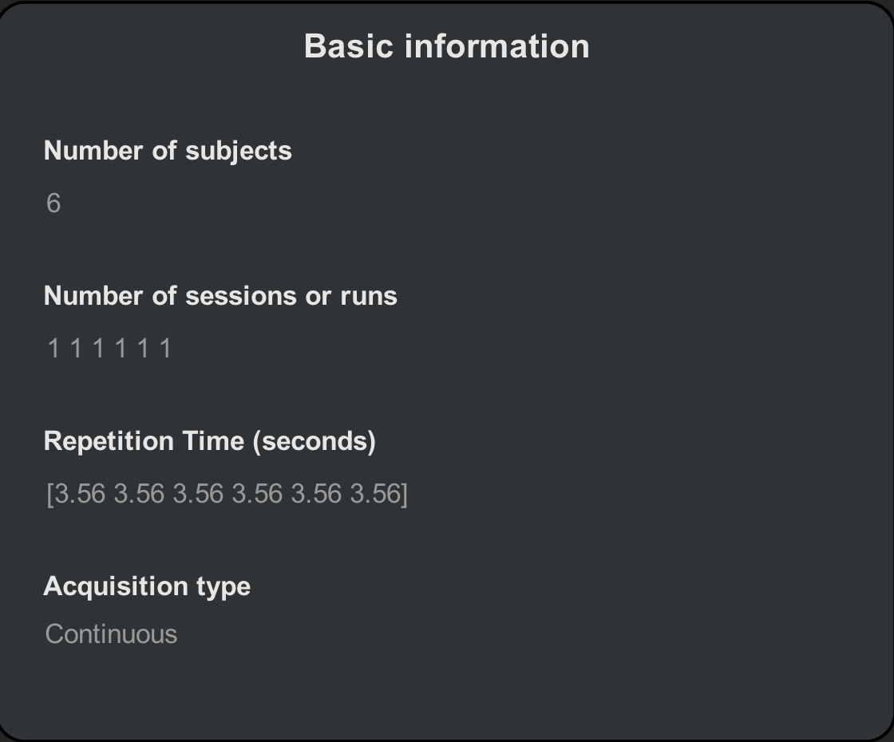

We will then load each subject's anatomical and functional data. The easiest way to do this is to use the ``Find`` filter on the right-hand side of the CONN interface. In the field below the image extensions (i.e., *.img, *.nii, etc.), type "T1w" and then click ``Find``. The current directory and its sub-directories will be searched for any images that contain that string.

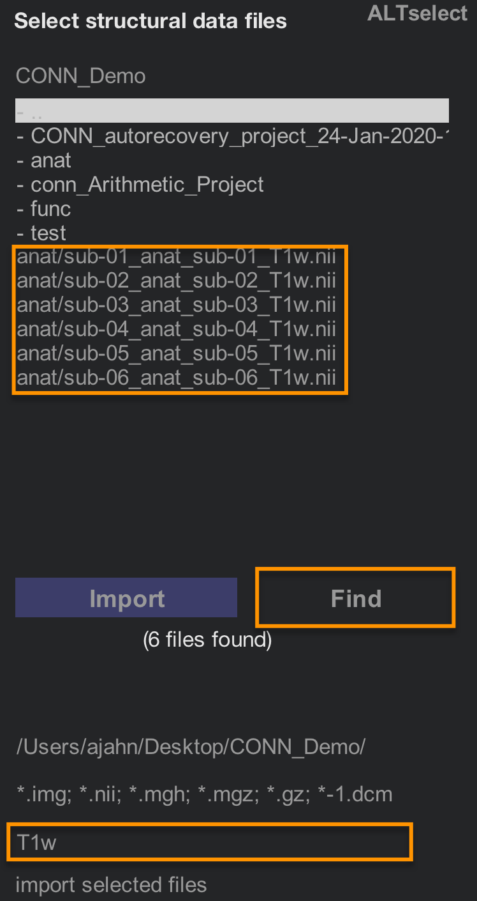

Hold shift and then click to select all of the Subjects in the ``Subjects`` field, and then hold shift and click to select all of the "T1w.nii" images that are in the image selection window. Then click the ``Import`` button. You should see something like the following:

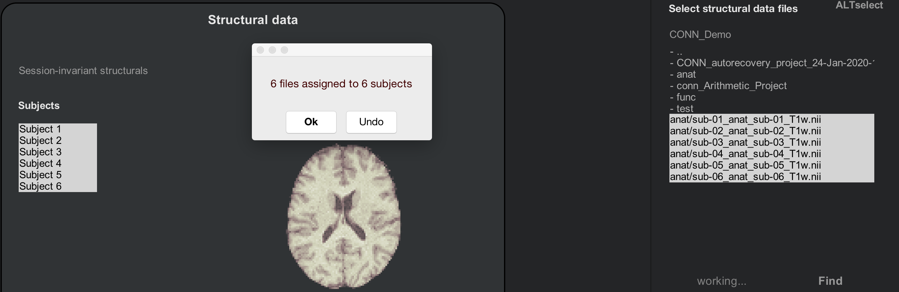

.. note::

  As before, scroll through the slices of your anatomical images to make sure that there are no artifacts, and that the images are oriented correctly.
  
Now do the same procedure for the functional images. Click on the ``Functional`` tab, and use the ``Find`` filter to look for any images in your directories that contain the string "bold". Use shift and click to highlight the Subjects and the resting-state images, and then click ``Import``. After a few moments, you should see a pop-up window saying that "6 files have been assigned to 6 subjects".

.. note::

  As you look through the functional images for these six subjects, do you notice any anomalies? (Hint: There is one in subject 2.) Do you think this will be a problem? If so, which preprocessing step should you pay particularly close attention to?

If you have already analyzed subject 1, you may notice that the data in the ``ROIs`` and ``Covariates`` tabs are the same, regardless of which subject you select. As we preprocess the subjects, these fields will be filled in with the ROIs and covariates for each subject.
  
Preprocesing the Subjects
^^^^^^^^^^^^^^^^^^^^^^^^^

Click on the ``Preprocessing`` button to begin preprocessing all of the subjects in a single batch. This will take about 5-6 minutes per subject, or around 30-40 minutes total. When it has finished, check the ``ROIs`` and ``Covariates (1st-level)`` tabs, this time scrolling through each subject. Note any differences bewteen the subjects: Which masks (i.e., tissue types) look different? What do the covariates look like? Subject 2, for example, now has 10 volumes that have been marked as outliers. Each of these marked volumes will be inserted as a regressor in the 1st-level design matrix, which removes their variance from the rest of the time-series.

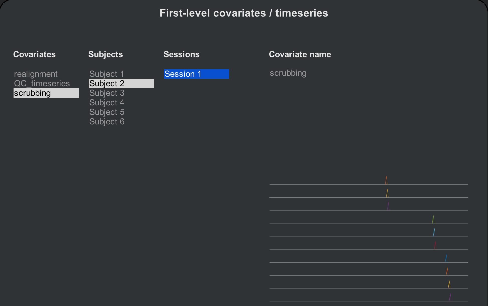

.. warning::

  In the CONN toolbox, this procedure of removing a volume via regression is called **scrubbing**. There is some debate about what the term actually refers to, since in other contexts it can mean simply removing the volume from the time-series (e.g., Caballero-Gaudes & Reynolds, 2017). Any time you come across the term being used, look at the context to see which method it refers to.
  
Denoising and 1st-level analysis
^^^^^^^^^^^^^^^^^^^^^^^^^^^^^^^^

The rest of the steps will be done the same way as when we processed the individual subject. Click on ``Done`` to begin denoising. To save time, uncheck the ``Voxel-to-Voxel`` analysis, and click ``Start``. This will take a few minutes per subject.

When Denoising has finished, click on the ``Denoising (1st-level)`` tab to review the effect of accounting for different confound regressors. The layout is the same; the only difference is that you can now click through all of the subjects. Review them using the same criteria as in the denoising chapter, and then click the ``Done`` button to proceed with the 1st-level modeling. 

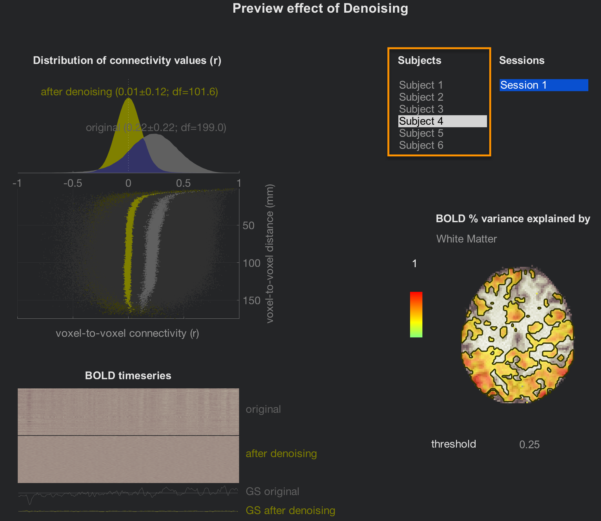

This will only take a few minutes, but to save time, uncheck the box next to ``Voxel-to-Voxel`` connectivity.

The preview window of the tab ``Analyses (1st-level)`` will be the same as for the individual subject analysis, but now with all of the subjects listed. Click through all of them to review their connectivity maps after the denoising has been performed. 

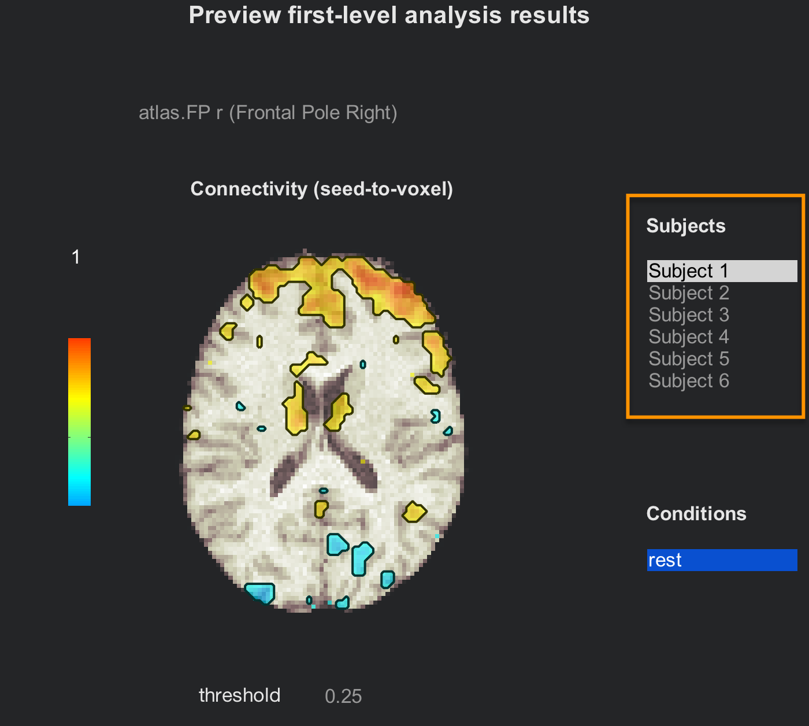

If you are satisfied with the quality check, click on ``Done`` to begin the 2nd-level analysis. Make sure that "All Subjects" and "All conditions" are checked, and then click ``Start``. This will only take a few minutes.

Group-Level Analysis
********************

When you have finished the group analysis, you will have access to the last tab, ``Results (2nd-level)``. This will display a whole-brain map of the correlation for the contrasts that you specified in the ``Setup`` tab.

You may wonder what contrasts we specified. The default that has already been created for you is a condition called "rest" which is the correlation map generated for each subject at each ROI. These are then averaged over all of the subjects by using a **contrast vector** in the Covariates (2nd-level) tab of the ``Setup`` screen. If you click on the 2nd-level covariates button, you will see a list of all the covariates that will be entered into the 2nd-level; the covariate "AllSubjects" has a contrast vector of ``[1 1 1 1 1 1]``, representing an average taken over all of the subjects. (The other covariates that have a "QA" prefix are nuisance regressors, and are not able to be selected at the group level.) Click back and forth between the ``Setup`` and ``Results (2nd-level)`` tab to see the correspondence between how the experiment is set up, and the results that are generated.

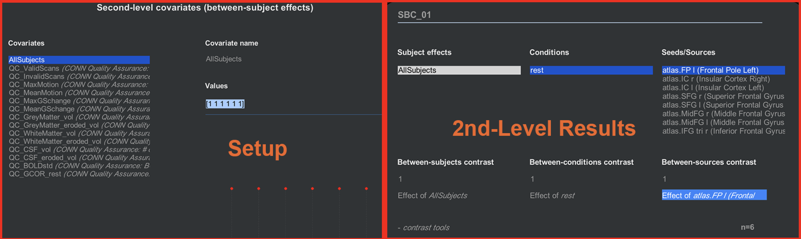

What if we want to create another contrast - for example, compare the first three and the last three subjects, as though they are different groups? We first need to create two separate contrast vectors: One for the first three subjects, and one for the last three. From the ``Setup`` tab, click on ``Covariates (2nd-level)`` and hover your mouse over the bottom left corner of the "Covariates" menu. Click on the ``+`` sign, and label the covariate "Group A". In the "Values" field, enter the following vector:

::

  [1 1 1 0 0 0]
  
And do the same for another covariate, labeling it "Group B" and entering this vector:

::

  [0 0 0 1 1 1]
  
Observe how the red dots change according to which contrast vector you have selected; the dots will be positive for the first three subjects for Group A, and positive for the last three subjects for Group B.

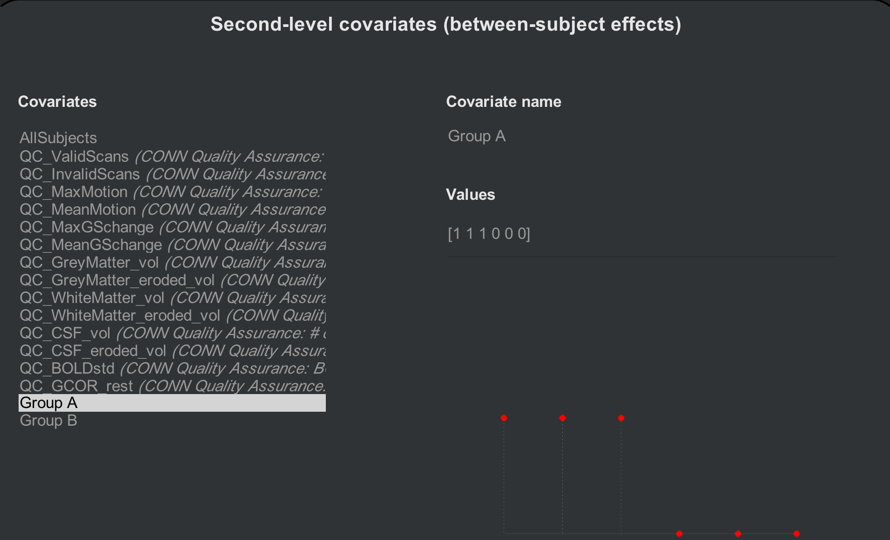

Now when you click on the ``Results (2nd-level)`` tab, there will be two new "Subject effects": Group A and Group B. Highlighting either group separately will show results for just that group; to take a contrast between the two, on the other hand, we will hold shift and click to highlight both groups, and enter a Between-subjects contrast of [1 -1]:

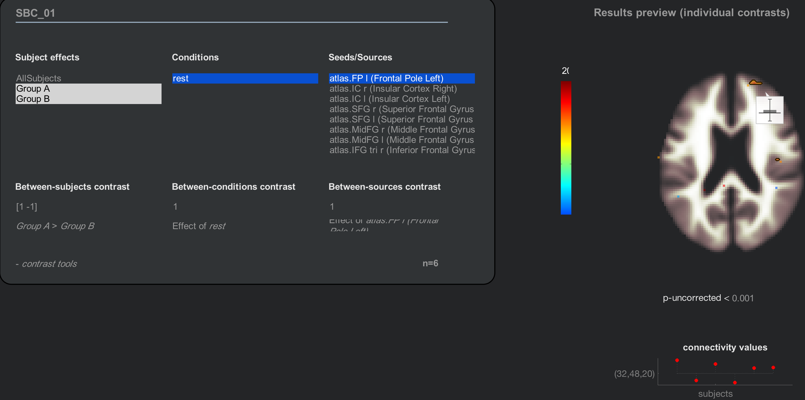

.. note::

  Another way to generate the same contrast is to highlight both groups with your mouse, and then click on the string that says "Any effects (F-test)". You will see options for looking at either each group's average separately, a contrast of GroupA-GroupB, or a contrast of GroupB-GroupA.
  
  
Adding Nuisance Covariates
^^^^^^^^^^^^^^^^^^^^^^^^^^

If you want to account for other sources of variance, such as age or sex, these can also be entered in the ``Covariates (2nd-level)`` tab. Create a new contrast (e.g., "Age"), and enter the values for each subject, making sure that they match. For example, the first Age covariate that you enter should be the age of the first subject. The following figure shows an Age covariate created for these subjects:

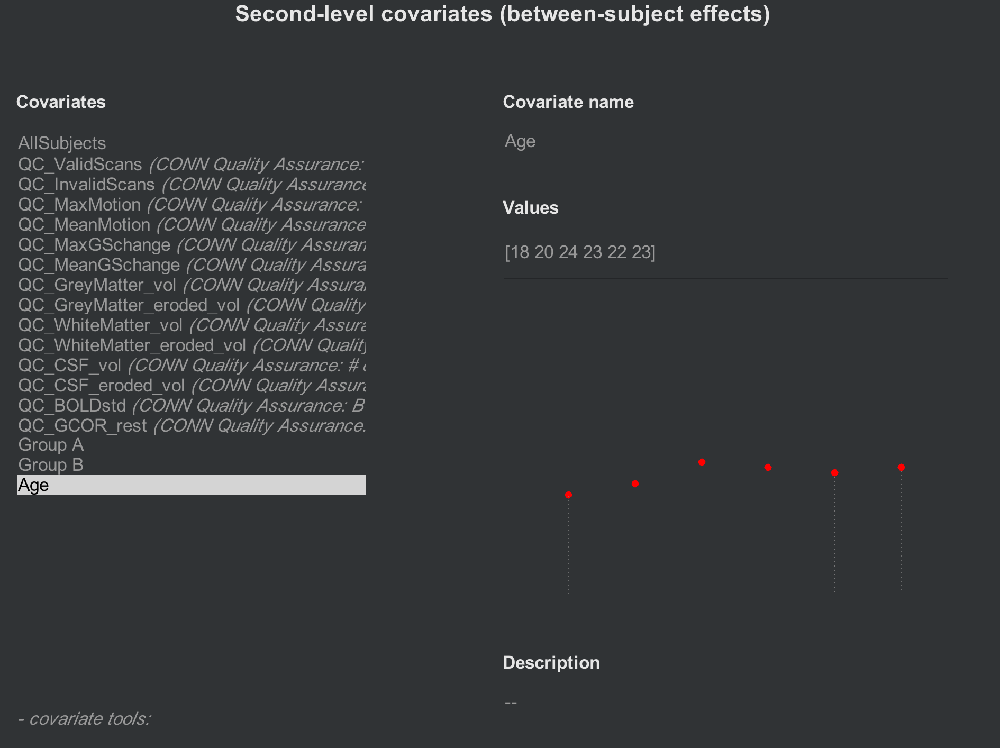

If you want to mean-center any of your covariates, click on the ``-covariate tools:`` menu, select ``Orthogonalize selected covariate(s)``, and highlight the "All Subjects" covariate:

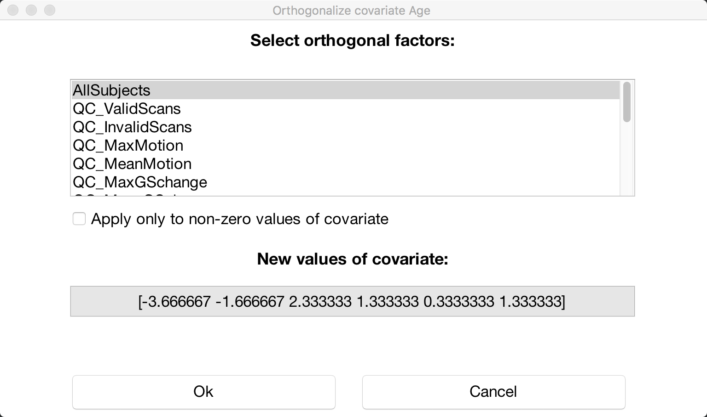

Video
*****

A video demonstration of group-level analysis in the CONN toolbox can be found `here <https://www.youtube.com/watch?v=cr1u7OZ4JGw&list=PLIQIswOrUH69DoNKYFnOc-UM_tZxwLuMX&index=8>`__.

Exercises
*********

1. Create two new groups, Group C and Group D, which are composed of the following vectors: Group C [1 0 1 0 1 0]; Group D [0 1 0 1 0 1]. In the Results (2nd-level) tab, create a contrast of Group C > Group D, using the "atlas.FP r (Frontal Pole Right)" as a seed. Display the results, and then change the multiple comparisons settings to "Customize (advanced Family-Wise Error control settings". Change the "voxel threshold" to ``p<0.05``, and change the directional test from ``two-sided`` to ``positive contrast (one-sided)``. Take a screenshot of the results. (Hint: There should be two clusters that survive this correction threshold.)

2. Run the same analysis as in Exercise #1, but include Age as a nuisance covariate. Compute the same contrast, display the results, and change the multiple comparisons correction as in Exercise #1. Take a screenshot of the results. How have the results changed?

Next Steps
**********

Now that we have created out second-level contrasts, we will go on to interpret the results - which requires another chapter in itself. Click the ``Next`` button to learn more about how to look at the figures and determine what they mean.
