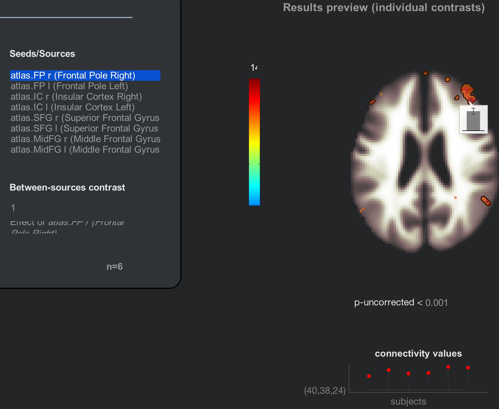
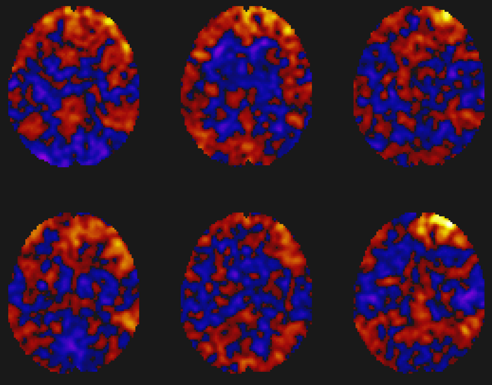
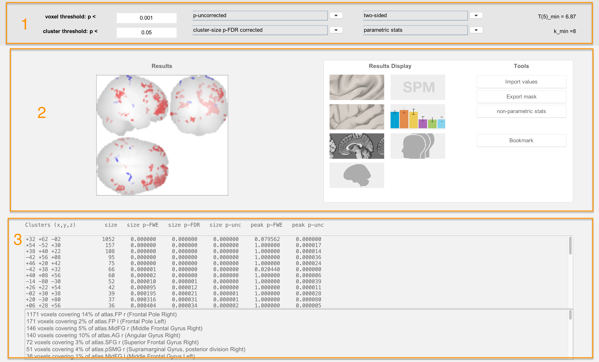
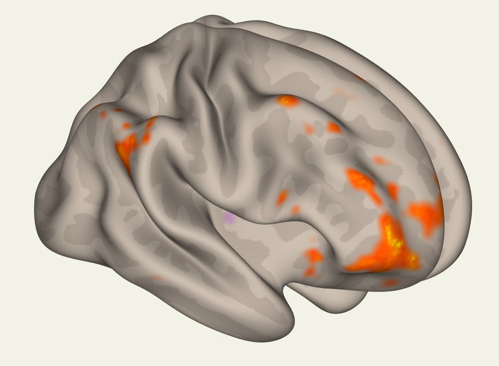
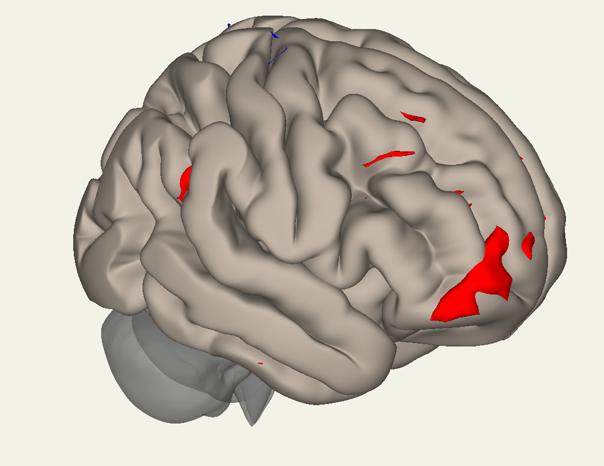

.. _CONN_10_Viewing_Results:

================================
Chapter #10: Viewing the Results
================================

------------------

Overview
********

The CONN toolbox will generate many different graphs automatically - one for each of the ROIs you specified in the ``Setup`` tab. These connectivity maps depict the correlation between each ROI and the rest of the brain (the "Seed-to-Voxel" maps), as well as the correlation between each ROI with every other ROI in the brain (the "ROI-to-ROI" maps).

For each of the subject effects and conditions that you specified, a corresponding second-level map will be displayed on the right side of the CONN window. The results are by default displayed on axial slices at an uncorrected p-value of 0.001, and the colorbar to the left represents the strength of the t-statistic. Hovering the mouse over the voxels displays the t-statistic and p-value for the contrast highlighted in the Subject effects window, and clicking on a voxel generates a bar plot showing the strength of the contrast estimate. If you highlight the AllSubjects effect, for example, the results preview will show the strength of the connectivity for the seed region that has been selected - in this case, the Right Frontal Pole.

The Results preview panel includes more options for viewing the results (although you will need to hover your mouse over the panel in order to reveal them). Clicking on the ``plot subjects`` button, for example, gives you the option of displaying the results for each individual subject in a montage. Note how the group-level result represents the strength of the overlap between the individual subject maps:

.. note::

  Try the ``plot effects`` and ``plot values`` buttons as well. How would you interpret the results that are generated? What happens if you click on a different voxel?
  
  
The Results Explorer
********************

You may have wondered why the right window pane says "Results preview", when it appears that we have generated our group-level results. The map has not actually been written to the disk yet; we will do that by clicking on the ``Results explorer`` button. After a few moments, another window opens up, giving you more options for viewing the results in different orientations - for example, rendered on a surface.

When the results explorer window opens, you will see the a glass brain with the results displayed on it for the seed that was highlighted. The window can be divided into three parts:

1. The **Threshold Panel**;
2. The **Display Panel**; and
3. The **Coordinates Panel**.

The Threshold Panel
^^^^^^^^^^^^^^^^^^^

The Threshold Panel allows you to set a **threshold**, or value that determines which results are displayed. For example, the ``voxel threshold`` field specifies the **cluster-forming threshold**, or how significant a voxel needs to be to be considered as part of the cluster. The field below it, ``cluster threshold``, then sets the threshold of which clusters will be displayed. (For more details on how cluster-forming thresholds work, see :ref:`this chapter <Appendix_A_ClusterCorrection>`.)

The menus next to the voxel threshold and cluster threshold fields specify which kind of correction mechanism to use. For example, switching from "p-uncorrected" to "F/T/X stat" allows you to specify a t-statistic threshold instead of a p-threshold. Likewise, the cluster threshold can be changed from an FDR threshold to FWE or uncorrected.

The last pair of menus specify whether the tests are one-sided or two-sided, and whether to use parametric or non-parametric methods for correction. Unless your hypothesis is concerned with only one direction of the result, leave the default of "two-sided"; and if you want to use a correction method that does not depend on parameteric assumptions such as normality, change "parametric stats" to "non-parametric stats". Selecting "non-parametric stats" will prompt you to selec tthe number of simulations; usually around 5000 simulations is recommended, although this can be unwieldy for large samples. 

For now, run a non-parametric simulation with 1000 simulations, and observe how the results change. (You can always change it back to parametric statistics to see the original results.) Are there new clusters that appear? Clusters that disappear? Why do you think that is?

The Display Panel
^^^^^^^^^^^^^^^^^

The Display Panel shows the results, by default on a glass brain. The buttons on the right side of the panel allow you to visualize the results in different ways. For example, the button in the upper left part of the panel will display the results on an inflated brain:

While the button below it will display the results on a typical cortical surface:

.. note::

  Question: Why might one want to use the Inflated versus the Cortical display?
  
.. warning::

  These results have been **rendered**, or resampled, to fit on the cortical surface. They can be slightly misleading if you are attempting to localize results to very small areas; in that case, it would be better to do the entire analysis on volumetric data that has first been converted to a surface using :ref:`FreeSurfer <FreeSurfer_Introduction>`. We will not be covering surface-based analysis with CONN in this tutorial, but be aware that you will first need to reconstruct the surface before using the CONN toolbox.

The other buttons are relatively straightforward to use, such as displaying the results on individual slices. The last button we will discuss here is the button that says "SPM"; this will load the results into the SPM contrast manager, which can then be thresholded and viewed using the SPM interface. For more details on how to use the contrast manager, see :ref:`this tutorial <SPM_08_GroupAnalysis>`.

The Coordinates Panel
^^^^^^^^^^^^^^^^^^^^^

The bottom panel shows coordinates for each cluster that passes the thresholds specified above. Clicking on each set of coordinates will highlight a cluster by slightly darkening it. These coordinates can then be reported in a table as significant results, given your thresholds.

Before leaving this section, highlight a cluster that is significant in the column labeled "size p-FDR", but not "size p-FWE". What do you think would happen to that cluster if you switched your threshold from "cluster-size p-FDR corrected" to "cluster-size p-FWE corrected"?

10_Coordinates.png

ROI-to-ROI Results
******************

Close the Results explorer window, and then click on the ``ROI-to-ROI`` tab. This also displays functional connectivity results, but at a different resolution: instead of a whole-brain connectivity map, we only see ROIs that are significantly correlated with other ROIs. 

Exercises
*********

1. Try running through each of the steps above for both seed-to-voxel and ROI-to-ROI analyses, but using a different seed.
