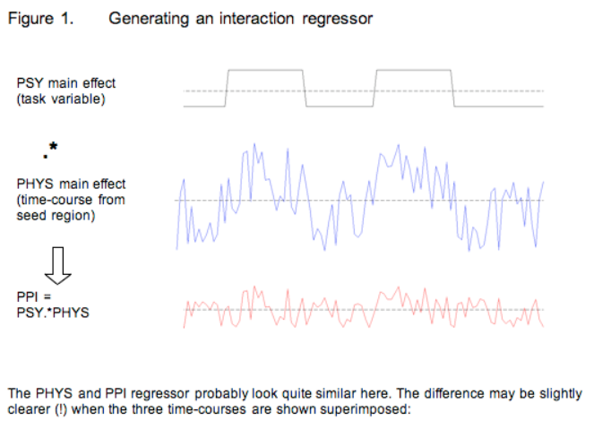
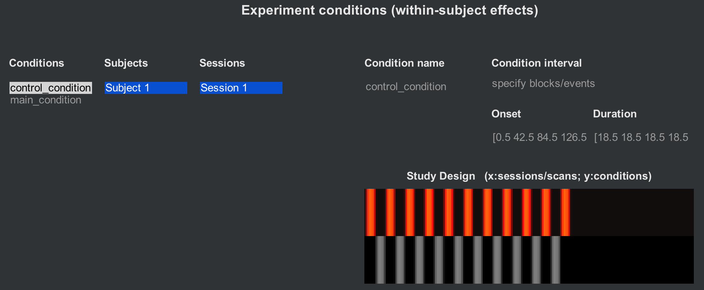

.. _CONN_11_Task_gPPI:

===============================================
Chapter #11: Task-Related Connectivity and gPPI
===============================================

------------------

Overview
*********

Until now, we have analyzed **resting-state** data, in which the subject does nothing except remain still and awake. However, it is also common for studies to collect task-related data as well, in which the subject does some kind of activity; such as doing the :ref:`Flanker Task <fMRI_02_ExperimentalDesign>`, for example. In this chapter we will cover how to analyze task-related data by using a technique called **Psychophysiological Interactions (PPI)**, which reveals whether the functional connectivity between two nodes depends on what task the subject is currently doing.

.. figure:: 11_gPPI_Example.png

  Example of a PPI analysis, taken from Outhred et al. (2015). The functional connectivity between the left amygdala seed region and the right IFG changes depending on which condition the subject is in.

Traditional PPIs
^^^^^^^^^^^^^^^^

Originally, a psychophysiological interaction consisted of modeling three terms (Friston, 1997): 

1. A task regressor indicating which of two tasks the subject was currently doing;

2. A time-series regressor extracted from a seed region; and

3. An interaction term, consisting of the product of the task regressor multiplied by the time-series regressor.

The interaction term was then tested for significance. In other words, a significant voxel would show differences in functional connectivity as a function of task. The figure below shows how these regressors are constructed:

  An illustration of PPI regressors. The top panel shows a binary regressor composed of 1's and -1's, indicating whether the subject is in one of two conditions. The middle panel shows a time-series extracted from a seed region. The bottom panel shows the interaction regressor, created by multiplying the above regressors. Note how the -1's, when multiplied by the seed time-series, invert the sign of the time-series - if the time-series is going down, in the interaction regressor it will go up.

  The interaction regressor is then compared against the time-series of every other voxel in the brain. If there is a good correspondence between the two, the significance of the fit is higher. Both figures are taken from the `FSL website <https://fsl.fmrib.ox.ac.uk/fsl/fslwiki/PPI>`__.

Generalized PPIs
^^^^^^^^^^^^^^^^

A more recent version of PPI is known as **generalized PPI (gPPI)** (McLaren et al., 2012). This method creates a PPI term for each condition in the study, in addition to the regressor of the seed time-series and individual regressors for each condition. If the study has N conditions, then the gPPI analysis will contain 2N+1 regressors.

As an example, let's say that we have three conditions in our experiment: A, B, and C. The gPPI analysis would consist of the following regressors:

1. Regressor for A
2. Regressor for B
3. Regressor for C
4. Time-series regressor for the seed region
5. PPI for A
6. PPI for B
7. PPI for C

Even if one of these conditions is of no interest, modeling the entire experimental space will be more accurate than restricting the PPI to only a pair of the regressors.

Setting up a gPPI in the CONN Toolbox
*************************************

So far, we have used the CONN toolbox to model one condition: The resting-state condition, which is simply the time-series at each of our ROIs that we have selected in the Setup tab. We will now load a separate scan that was collected while the subject was doing a task, and which has two conditions: The main task, in which the subject was doing an arithmetic problem, and a control task, in which the subject was doing nothing. The onset times for each of these conditions can be found in the "events.tsv" files on the openneuro webpage for the Arithmetic dataset.

.. note::

  To review onset times, and how they are used to construct a general linear model, see :ref:`this module <fMRI_05_1stLevelAnalysis>`.
  
We will first demonstrate this with a single subject, and then with a group analysis. Go back to the Setup tab, and click on "Basic". Set the number of subjects to "1", and the CONN toolbox will ask which subjects you want to delete. Hold down shift and click to select subjects 2-6, so that only subject 1 remains. Click on the "Functional" button, and select the file ``sub-01_func_sub-01_task-arithm_run-01_bold.nii.gz``. This will replace the resting-state scan with a task-related scan.

Then, click on the "Conditions" tab. Clicking on the ``+`` sign when you hover over the Conditions column will allow you to specify a new regressor. In the "Condition name" field, type ``control_condition``, and click on the dropdown menu below "Condition interval" to select "specify blocks/events". This will generate two new fields, "Onset" and "Duration", which you can use to specify when the condition happened, and for how long. Looking at the .tsv file, we see that the onsets were 21.5, 63.5, 105.5, and so on, while the durations were 18.5 for each event. Type the onsets and the durations for each occurrence of the control condition, and then press enter. You can then do the same for the other condition, which we will call ``main_condition``.

Doing this once can be a useful exercise, but you most likely will not want to do this for large numbers of subjects. A better alternative is to load the .tsv files through the CONN GUI automatically, which will fill in all of the fields for you. Highlight the conditions you just created and click the ``-`` sign to remove them, and then click on the ``- condition tools:`` dropdown menu and select ``import condition info from text file(s)``. Since this data is in `BIDS format <https://bids.neuroimaging.io/>`, we can select the option ``BIDS-compatible``. (You can select either option for the single subject; when you have more sessions and more subjects, you will want to select the option "one *_events.tsv file in each subject/session folder.) When the onset files are loaded, you will see the following figure in the Study Design window:

  The study design window. Bars indicate the onset and duration of each trial, with separate conditions on each row. Highlighted bars reflect the condition and session that is currently selected in the left-hand menus.
  
When you are finished importing the timing files, click ``Done``.

