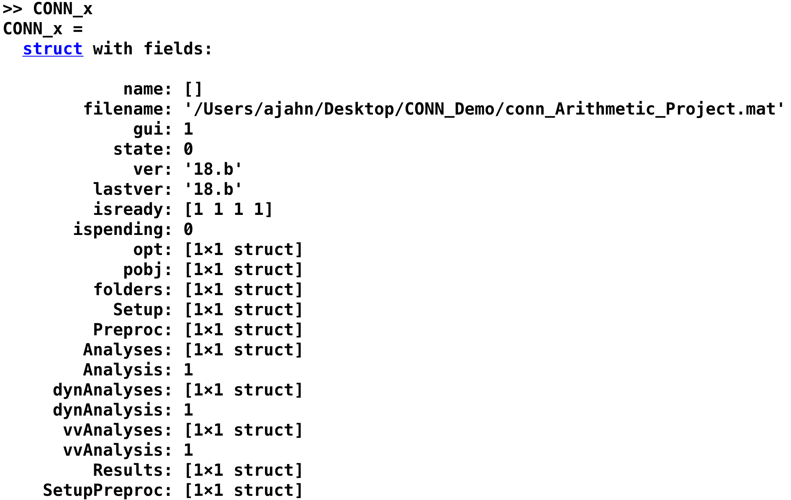
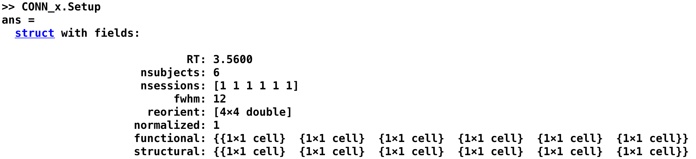

.. _CONN_12_Scripting:

======================
Chapter #12: Scripting
======================

------------------

.. note::

  A template script for this tutorial was provided by the `Chronic Pain & Fatigue Research Center <https://medicine.umich.edu/dept/chronic-pain-fatigue-research-center>`__ of the University of Michigan. In particular, thanks to Chelsea Kaplan and Tony Larkin.

Overview
********

After you’ve preprocessed and set up a model for a single run for a single subject, you will need to do the same steps for all of the runs for all of the subjects in your dataset. This may seem tedious but doable - we only have twenty-six subjects, and two runs per subject. You may think that it can be done over the course of a week or so; and you can always assign the task to a couple of Research Assistants.

This attitude is admirable, and if you take this approach you will be able to analyze all of the data eventually. But at some point you will run into two problems:

1.You will find that manually analyzing each run is not only tedious but prone to error, and the probability of making a mistake increases significantly as the number of runs to analyze also increases; and

2. For larger datasets - for example, eighty subjects with five runs each - this approach quickly becomes impractical.

An alternative is to **script** your analysis. Just as an actor has a script which tells him what to say and where to stand and where to move, so can you write a script that tells your computer how to analyze your datasets. This has the double benefit of automating your analyses and being able to analyze datasets of any size - the code for analyzing two subjects or two hundred is virtually identical.

Scripting in the CONN Toolbox
*****************************

Structures, Fields, and Variables
^^^^^^^^^^^^^^^^^^^^^^^^^^^^^^^^^

The CONN Toolbox comes with a command called ``conn_batch``, which takes a **structure** as an argument. A structure is a Matlab data type that organizes several variables into containers called **fields**. The structure fields that are expected by the ``conn_batch`` command are the following (taken from the conn_batch help, which can also be found on the `CONN scripting page <https://sites.google.com/view/conn/resources/conn_batch?authuser=0>`__):

::

   filename          : conn_*.mat project file (defaults to currently open project)
   subjects          : Subset of subjects to run processing steps or define parameters for (defaults to all subjects)
   parallel          : Parallelization options (defaults to local processing / no parallelization)
   Setup             : Information/processes regarding experiment Setup and Preprocessing
   Denoising         : Information/processes regarding Denoising step
   Analysis          : Information/processes regarding first-level analyses
   Results           : Information/processes regarding second-level analyses/results
   QA                : Information/processes regarding Quality Assurance plots
   
In other words, the variable that we will pass as an argument to the ``conn_batch`` command - a variable that we will call **batch** from now on - requires the fields listed above. If you recall from the earlier chapters, there were tabs in the CONN GUI that were labeled Setup, Denoising, Analysis, and Results; these fields will also contain sub-fields that specify the values that we entered into the GUI. For example, the field:

::

  batch.Setup.RT=3.56
  
specifies that the RT for this experiment is 3.56 seconds.

The CONN_x Structure
^^^^^^^^^^^^^^^^^^^^

The other fields and sub-fields can be found on the CONN scripting page, along with explanations about what each value and option means. But the easiest way to create and modify a structure is by generating one through the GUI.

In fact, you already have created such a structure, even if you weren't aware of it. Each time you save your project, a .mat file is created. This .mat file can be **loaded** into the Matlab terminal by using the ``load`` command. For example, if you have been following along with the tutorials up to this point, you have created a .mat file called ``conn_Arithmetic_Project.mat``. You can load it by typing:

::

  load conn_Arithmetic_Project.mat
  
This returns a structure in your workspace called ``CONN_x``. When you type ``CONN_x``, you will see the following text returned:

Each of these fields contain the values that you entered into each tab. For example, we can display the values that were entered in the ``Setup`` tab by typing ``CONN_x.Setup``, which returns several fields (only the first few are displayed in the figure below):

Note the correspondence between the values entered in these fields, and the values that are entered when you load the ``conn_Arithmetic_Project.mat`` file. If we want, we can edit the values within the CONN_x structure from the Matlab terminal, save it as a .mat file, and then load it into the CONN toolbox. The edits we make in the Matlab terminal should then be reflected in the GUI.

Try this by typing the following line of code in the Matlab terminal:

::

  CONN_x.Setup.RT = 1
  
This replaces the original value of 3.56 with a value of 1. We can then save the updated CONN_x structure into our .mat file by typing:

::

  save('conn_Arithmetic_Sample.mat', 'CONN_x')
  
This uses the Matlab ``save`` command, which requires two arguments: The .mat file to be written, and any values or structures to be saved into it. In this case, we save the CONN_x structure into the .mat file. If you now load it from the CONN GUI (by clicking on ``Project -> Open`` and selecting the file), the Basic Information tab should be updated with the new Repetition Time that you specified in the Matlab terminal.

The CONN_x structure also specifies menu options. For example, the Batch.Setup section of the CONN help page says about the field ``acquisitiontype``:

::

  acquisitiontype : 1/0: Continuous acquisition of functional volumes [1] 
  
This is a binary variable, with 1 signalizing a continuous acquisition of functional volumes (which is the default, as indicated by the brackets). If we set this to 0, then it will be the other option that is available, which is sparse sampling. As an exercise, set the field ``CONN_x.Setup.acquisitiontype`` to 0, save the CONN_x structure into the .mat file, and reload the .mat file. What do you observe has changed?

Creating the conn Batch Variable
********************************

Having seen how CONN creates a Matlab structure from the GUI, we will now create our own structure using Matlab code. The structure will be called **batch**, and it will contain fields indicating which files to load and which options to run.

.. note::

  The following code is adapted from the file ``conn_batch_workshop_nyudataset.m``, which you can download from Alfonso Nieto-Castanon's `NITRC website <https://www.nitrc.org/frs/?group_id=279>`__. The CONN website also contains examples of how to modify your batch script. The website lists each of the different fields that can be entered into the batch structure, and what the defaults are. If you don't write out one of the fields in your script, it will be set to the default listed on the webpage.
  For example, the field Analysis.type reads: ``analysis type, 1 = 'ROI-to-ROI', 2 = 'Seed-to-Voxel', 3 = 'all'; [3]``. If we don't include this in our script, the field will automatically be set to 3, meaning that both ROI-to-ROI and Seed-to-Voxel analyses will be run.

Loading the files
^^^^^^^^^^^^^^^^^

The first block of code in the script will load the anatomical and functional files. It uses a **recursive search** to look into every directory below the current directory to find the files matching the file you specified. This is done by the command **conn_dir**, which takes a string as an argument; if you want to load several subjects, you can use a regular expression such as an asterisk (see the "wildcard" section of :ref:`this tutorial <Unix_07_Scripting>` for more details). 

Whichever method you choose, make sure that the ``NSUBJECTS`` variable matches the total number of subjects that will be selected. For example, if there are six subjects in the current directory and you are using a wildcard to select the resting-state data, you would set NSUBJECTS to 6:

::

  NSUBJECTS=6;
  cwd=pwd;
  FUNCTIONAL_FILE=cellstr(conn_dir('sub-*_func_sub-*_task-rest_bold.nii.gz'));
  STRUCTURAL_FILE=cellstr(conn_dir('sub-*_anat_sub-*_T1w.nii'));
  if rem(length(FUNCTIONAL_FILE),NSUBJECTS),error('mismatch number of functional files %n', length(FUNCTIONAL_FILE));end
  if rem(length(STRUCTURAL_FILE),NSUBJECTS),error('mismatch number of anatomical files %n', length(FUNCTIONAL_FILE));end
  nsessions=length(FUNCTIONAL_FILE)/NSUBJECTS;
  FUNCTIONAL_FILE=reshape(FUNCTIONAL_FILE,[NSUBJECTS,nsessions]);
  STRUCTURAL_FILE={STRUCTURAL_FILE{1:NSUBJECTS}};
  disp([num2str(size(FUNCTIONAL_FILE,1)),' subjects']);
  disp([num2str(size(FUNCTIONAL_FILE,2)),' sessions']);
  TR=3.56; % Repetition time
  
Executing this block of code will return both the number of subjects and the number of sessions per subject, and the wildcard ``*`` will return any files that contain the string ``sub-``, ``_func_sub-``, and ``task-rest_bold.nii.gz``, in that order. For your own experiment, remember to change this filter so that it is specific to how your data is labeled. Remember to change the TR as well, if needed.

The Setup Field
^^^^^^^^^^^^^^^

Each field after the ``batch`` structure will be one of the tabs listed in the CONN GUI: Setup, Denoising, and Analysis.

The first block of code will populate the ``Setup`` field of the ``batch`` structure. If the files above were correctly loaded, this block of code should be useable for any experiment. You may want to change the batch name to something more descriptive of your study, and change the processing pipeline and slice order if needed.

::

  %% CONN-SPECIFIC SECTION: RUNS PREPROCESSING/SETUP/DENOISING/ANALYSIS STEPS
  %% Prepares batch structure
  clear batch;
  batch.filename=fullfile(cwd,'Arithmetic_Scripted.mat');            % New conn_*.mat experiment name

  %% SETUP & PREPROCESSING step (using default values for most parameters, see help conn_batch to define non-default values)
  % CONN Setup                                            % Default options (uses all ROIs in conn/rois/ directory); see conn_batch for additional options 
  % CONN Setup.preprocessing                               (realignment/coregistration/segmentation/normalization/smoothing)
  batch.Setup.isnew=1;
  batch.Setup.nsubjects=NSUBJECTS;
  batch.Setup.RT=TR;                                        % TR (seconds)
  batch.Setup.functionals=repmat({{}},[NSUBJECTS,1]);       % Point to functional volumes for each subject/session
  for nsub=1:NSUBJECTS,for nses=1:nsessions,batch.Setup.functionals{nsub}{nses}{1}=FUNCTIONAL_FILE{nsub,nses}; end; end %note: each subject's data is defined by three sessions and one single (4d) file per session
  batch.Setup.structurals=STRUCTURAL_FILE;                  % Point to anatomical volumes for each subject
  nconditions=nsessions;                                  % treats each session as a different condition (comment the following three lines and lines 84-86 below if you do not wish to analyze between-session differences)
  if nconditions==1
      batch.Setup.conditions.names={'rest'};
      for ncond=1,for nsub=1:NSUBJECTS,for nses=1:nsessions,              batch.Setup.conditions.onsets{ncond}{nsub}{nses}=0; batch.Setup.conditions.durations{ncond}{nsub}{nses}=inf;end;end;end     % rest condition (all sessions)
  else
      batch.Setup.conditions.names=[{'rest'}, arrayfun(@(n)sprintf('Session%d',n),1:nconditions,'uni',0)];
      for ncond=1,for nsub=1:NSUBJECTS,for nses=1:nsessions,              batch.Setup.conditions.onsets{ncond}{nsub}{nses}=0; batch.Setup.conditions.durations{ncond}{nsub}{nses}=inf;end;end;end     % rest condition (all sessions)
      for ncond=1:nconditions,for nsub=1:NSUBJECTS,for nses=1:nsessions,  batch.Setup.conditions.onsets{1+ncond}{nsub}{nses}=[];batch.Setup.conditions.durations{1+ncond}{nsub}{nses}=[]; end;end;end
      for ncond=1:nconditions,for nsub=1:NSUBJECTS,for nses=ncond,        batch.Setup.conditions.onsets{1+ncond}{nsub}{nses}=0; batch.Setup.conditions.durations{1+ncond}{nsub}{nses}=inf;end;end;end % session-specific conditions
  end
  batch.Setup.preprocessing.steps='default_mni';
  batch.Setup.preprocessing.sliceorder='interleaved (Siemens)';
  batch.Setup.done=1;
  batch.Setup.overwrite='Yes';
  
  
If you want, you can also load your custom atlas, discussed more in :ref:`Appendix C <CONN_AppendixC_ImportingROIs>`. For example, if I have a folder called ``ROIs`` which contains the atlas ``AndyROIs.nii`` and the header text file ``AndyROIs.txt``, I could add the following code:

::

  batch.Setup.rois.files{1}='ROIs/AndyROIs.nii';
  batch.Setup.rois.multiplelabels = 1;
  
The ``multiplelabels`` field, set to ``1``, indicates that there is a text file in the folder where the ROIs are located. This file provides a label for each ROI in the atlas. Note that this will overwrite the default of files ``atlas.nii`` and ``networks.nii``; if you want to include them in addition to your custom ROIs, you will need to add them in the script; e.g.,

::

  batch.Setup.rois.files{2}='~/conn/rois/atlas.nii';
  batch.Setup.rois.files{3}='~/conn/rois/networks.nii';
  
  
The Denoising Field
^^^^^^^^^^^^^^^^^^^

This block of code controls all of the options that are specified in the Denoising tab of the GUI. Here, the code demonstrates how to change the filter to a customized range, such as 0.01 to 0.1 The other parameters, ``done`` and ``overwrite``, will execute the code (``done=1`` means run the Denoising step) and overwrite any previous results (``overwrite='Yes'``). You can set ``overwrite`` to "No" if you want the program to throw an error before it overwrites any previous data.

::

  %% DENOISING step
  % CONN Denoising                                    % Default options (uses White Matter+CSF+realignment+scrubbing+conditions as confound regressors); see conn_batch for additional options 
  batch.Denoising.filter=[0.01, 0.1];                 % frequency filter (band-pass values, in Hz)
  batch.Denoising.done=1;
  batch.Denoising.overwrite='Yes';

The Analysis Field
^^^^^^^^^^^^^^^^^^

Similar to the Denoising block of code above, this section will run both the 1st and 2nd-level analyses. If you want to run only one of the analysis types, such as ROI-to-ROI, you can set it with a new field ``Analysis.type``. See the CONN batch webpage for more details.

::

  %% FIRST-LEVEL ANALYSIS step
  % CONN Analysis                                     % Default options (uses all ROIs in conn/rois/ as connectivity sources); see conn_batch for additional options 
  batch.Analysis.done=1;
  batch.Analysis.overwrite='Yes';

Running the Batch
*****************

You can run the batch from the Terminal by using the command ``conn_batch``:

::

  conn_batch(batch);
  
All of the steps you specified earlier will be run. The next three lines will open the CONN GUI and automatically load the second-level results. If everything ran without errors, you should see the same results that were generated using the point-and-click method of the GUI:

::

  conn
  conn('load',fullfile(cwd,'Arithmetic_Scripted.mat'));
  conn gui_results

Video
*****

For a video demonstration of scripting, click `here <https://www.youtube.com/watch?v=NJmPYLfE7oo>`__.

Congratulations!
****************

You now have everything you need to script an analysis in CONN, no matter how big the dataset is. The following chapters are a set of appendices covering other situations that you may come across in the CONN toolbox, such as graph theory, pre-post designs, and how to create your own custom ROIs.
