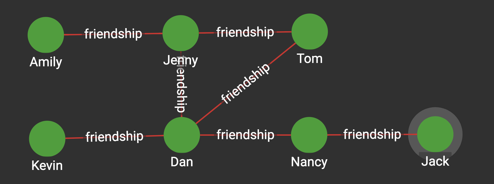
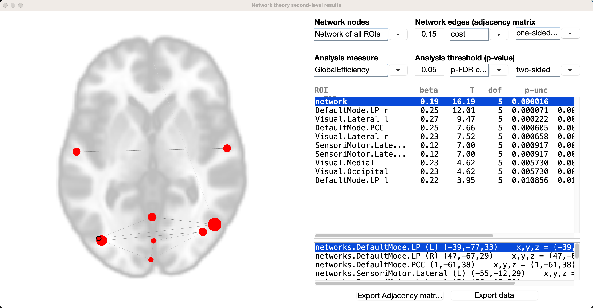
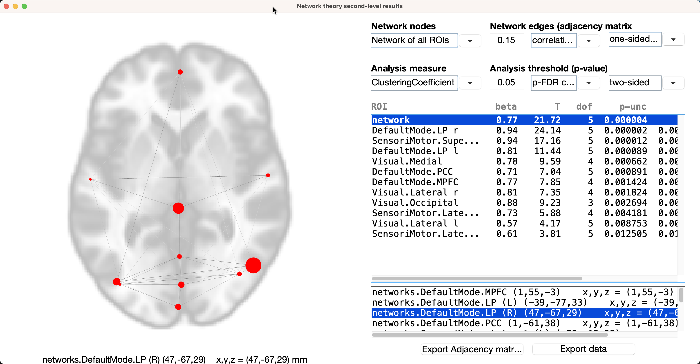
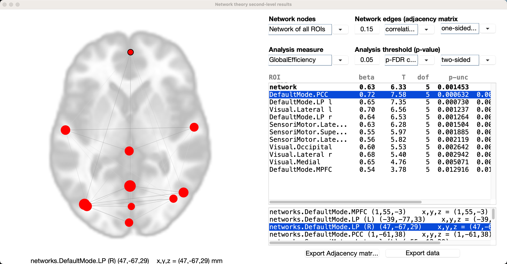

.. _CONN_AppendixA_GraphTheory:

========================
Appendix A: Graph Theory
========================

------------------

Overview
********

This chapter is a brief overview of **graph theory**, a method of describing the pairwise relationships between two or more objects. In mathematics, graph theory can model any pair of objects - neurons, people, cities, and so on. For our purposes, we will be focusing on graph theory as applied to neuroimaging data, and in particular resting-state data. In this scenario, individual **voxels** or clusters of voxels are the pairs of objects that we are interested in modeling. Graph theory can provide a different perspective on how these voxels are connected, and in turn inform us of how the brain is organized.

Graph Theory Basics
*******************

Nodes and Edges
^^^^^^^^^^^^^^^

Let's use a set of railroads as an example. A train may be able to go directly from one city to another, such as from Kalamazoo to Port Huron, Michigan. However, the train cannot go *directly* from Kalamazoo to Port Huron; it has to pass through Battle Creek first. Someone taking a train from Battle Creek, on the other hand, can go to either Port Huron, Detroit, or Kalamazoo, without having to stop at any other cities. One can also travel directly from Port Huron to Detroit and vice versa, and go from either of those cities to Battle Creek.

.. figure:: AppendixA_TrainExample.png

Instead of looking at these train stops on a map, let's instead assign each of them a number; that way, we can compare these networks whether they are train stops or neural connections. For example, let's assign the following:

::

  Battle Creek = 0
  Detroit = 1
  Port Huron = 2
  Kalamazoo = 3
  
We can compress the train map into a more compact figure using the numbers as indicators for each city:

.. figure:: AppendixA_GraphTheoryDemo.png

In this figure, we represent each city as a **node** (also called a **vertex**). Each node has connections to different nodes; in graph theory, these connections are called **edges**. On the right side of the figure, we can present the same network in a different way, as an **adjaceny matrix**. Connections between nodes are marked with a 1, whereas nodes that are not connected are marked with a 0. For example, Kalamazoo (3) is directly connected to Battle Creek (0), but not with wither Detroit (1) or Port Huron (2). The fact that Battle Creek has so many direct connections within this network makes it a **hub**, or node with more edges than average. We will return to this concept later.

.. note::

  Adjacency matrices are **symmetrical**, meaning that the upper diagonal (i.e., all of the numbers above the diagonal of zeros that bisects the graph) are redundant with the lower diagonal (i.e., all of those numbers below the diagonal of the graph). This is true only for undirected graphs, but for the present tutorial we will assume that symmetry holds.
  
To sum up, this **network** is represented as a collection of nodes connected by edges. Some of the connections are direct - for example, between Detroit and Port Huron - while others are indirect, such as the connection between Port Huron and Kalamazoo. More complicated networks will have different levels of connectivity depending on how many steps each node is removed from the other nodes, but all networks in graph theory rest upon these building blocks.

Modularity
^^^^^^^^^^

If we zoom out of Michigan and look at the train system across all of America, you will notice something else: Certain regions of the country have a high density of high-traffic train connections within themselves (such as Boston, New Haven, and New York City on the East Coast), but only a few, lower-traffic connections for traveling to other cities in other regions of the country (such as Seattle, Houston, and San Diego).

.. figure:: AppendixA_TrainNetworkUSA.png

This clustering of nodes and edges into discrete pockets is known as **modularity**. Technically, this is a threshold that is set to determine when the density of intra-modular connections (such as the train network of the East Coast) is greater than inter-modular connections (such as connections between New York City and Los Angeles). Many algorithms exist for creating this threshold, but the general idea is the same. The basic idea behind modularity boils down to: When is the density of intra-modular connections greater than inter-modular connections?

The simplest algorithm is to maximize the value of what is called the **modularity index**, represented by the letter **Q**:

.. figure:: AppendixA_ModularityIndex.png

  The modularity index, as defined by `Newman (2005) <https://www.pnas.org/content/103/23/8577.full>`__.
  
The total number of edges in the network is represented by **m**, and the fraction **1/4m** is a normalization parameter that seems to work well for most studies. **s** is a column vector which, for two groups, contains either a 1 (if the node belongs to group A) or a -1 (if the node belongs to group B). The last term, **B**, is what is called a **modularity matrix**; this matrix contains the **degree** (i.e., the number of edges) between two nodes if they were placed at random. (For more details about the mathematics behind each of these terms, see the `Newman (2005) paper <https://www.pnas.org/content/103/23/8577.full>`__.) Conceptually, the equation represents the number of edges falling within a group, as compared to the expected number of edges that are placed at random within a similar-sized network.

.. note::

  A different explanation of modularity can be found in this review by `Sporns & Betzel, 2016 <https://www.annualreviews.org/doi/abs/10.1146/annurev-psych-122414-033634?casa_token=Q9be2mqaTKsAAAAA:sx6xrzjrEtxIEaHm3NZdoUuL3bMfsoTNY6KRNQ689UpPM6KLEZvkkBjv8XMDBrZbJCH--Xg6YhZQ>`__.

The Louvain Algorithm
&&&&&&&&&&&&&&&&&&&&&

One of the most popular algorithms for maximizing this index is the **Louvain Algorithm** (`Blondel et al., (2008) <https://iopscience.iop.org/article/10.1088/1742-5468/2008/10/P10008/pdf?casa_token=Bqn_uVUg-N4AAAAA:rmElcqEgc9PmhQY_MDroocX24m-Vmgqd6N_wQon46oD3jvTxOJPmIF-8K9PVbTnzXIOzUW3CHA>`__). The algorithm first assigns a node to a module at random and calculates the resulting modularity index. If the index increases, then the node joins the new module; if the modularity decreases, then the node remains in its original module.

This procedure, also called **community detection**, organizes the nodes into modules, or communities, on each pass. A number of passes can be specified by the user to make as fine-grained partitions as is wanted.

.. figure:: AppendixA_Louvain.png

  An illustration of the Louvain algorithm (figure taken from Blondel et al, 2008). Nodes are assigned to a module based on the density of edges connecting nearby nodes - if the modularity index increases, then the node is assigned to that module. This procedure can proceed through several passes until a desired number of modules is reached.
  
Let's use the brain as an example to illustrate this algorithm. If we calculated all of the correlation coefficients between every voxel in the brain and decided to categorize them into four modules, one possibility is that we would end up dividing the brain into the four lobes (frontal, temporal, occipital, and parietal): regions that are anatomically and functionally distinct from each other. If we decided to do another pass, it is likely that we would end up with a network representation of the two hemispheres of the brain.
  
A related parameter is called **resolution**, which determines how fine-grained the resulting networks are. This is similar conceptually to the idea of multiple passes using the Louvain algorithm, but this method places a limit on how large the resulting modules can be. Using a certain resolution parameter with the brain example above may reproduce the canonical four lobes, while a higher resolution parameter can further divide these lobes into smaller sub-regions.

.. figure:: AppendixA_Resolution.png

  Example of tuning the resolution parameter, as shown in `Betzel & Basset (2017) <https://www.sciencedirect.com/science/article/pii/S1053811916306152>`__. The resolution parameter reflects the topological scale of interest: increasing it leads to finer scaled modules, but at some point it may start to model noise rather than biologically plausible modules. This parameter can't be set using the CONN toolbox, but it can be set in other toolboxes (such as the Brain Connectivity Toolbox).

  
**Thresholding** can also be used to remove edge values below a certain value. For example, a graph analysis of resting-state data may threshold the resulting connectivity maps to only show correlation values above 0.2, and remove everything else. This can increase signal to noise-ratio, and it can either be absolute (in the example just given) or proportional (e.g., keeping 20% strongest connections) - which in CONN is called **fixed network cost**.

.. figure:: AppendixA_Thresholding.png

  Example of thresholding, taken from Taya et al. (2016).
  
Graph Theory in the CONN Toolbox
********************************

As you saw in a previous chapter on :ref:`viewing the results <CONN_10_Viewing_Results>`, one of the options to display the group-analysis is called "Graph Theory". Using the correlation maps as input, either ROIs are used as nodes, and the correlation values between the nodes represent the edges. As with any network dataset, the correlation values can be thresholded to only display those values that are the strongest and most robust.

.. figure:: AppendixA_CONN_Graph.png

  Within the CONN Results window, nodes are depicted as red circles, with the strength of the currently selected graph theory metric represented by the size of the circle. Edges between the nodes are depicted as black lines.
  
Here is a brief summary of what some of the measures mean. A fuller treatment of all of the graph theory metrics can be found on the `CONN website <https://web.conn-toolbox.org/fmri-methods/connectivity-measures/graphs-roi-level>`__.

1. **Degree**: Simply the number nodes that the current node is connected to, i.e. its number of edges.
2. **Cost**: Proportion of edges for the current node.
3. **Clustering Coefficient**: Proportion of connected nodes across all neighboring nodes.
4. **Global Efficiency**: Inverse of the average distance matrix.
5. **Average path length**: Average shortest-path distance between the node and all other nodes.

Which one you use is up to you. Let's take a look at two of the most popular graph metrics, clusting coefficient and global efficiency, and see how they would apply to our data.

Clustering Coefficient
&&&&&&&&&&&&&&&&&&&&&&

One measurement of local connectivity is a node's **clustering coefficient**, or the proportion of connected nodes across all neighboring nodes. If a node's neighbors are highly connected, then the clustering coefficient is high as well; if there is a low proportion of connections between its neighbors relative to all possible connections among the neighbors, the clustering coefficient is low.

To illustrate this, let's represent as a network friendship among individuals. In the figure below, each of the edges represents a friendship between two individuals, represented by nodes. (In this case, friendship is binary: Either you are friends with someone, or you are not.) Jenny is friends with three people in this graph: Amily, Tom, and Dan. There could be three possible friendships among her neighbors: Dan with Amily, Amily with Tom, and Tom with Dan. However, only one of those pairs are friends - Tom and Dan. Since there is only one friendship out of a possible three friendships total, the clustering coefficient for Jenny is 1/3, or 0.33. 

  Figure from docs.TigerGraph.com

Tom, on the other hand, is friends with two people: Jenny and Dan. Consequently, there is only one possible friendship among his neighbors, and they do indeed happen to be friends. Tom's clustering coefficient is therefore 1/1, or 1.

Lastly, let's focus on Dan. He is friends with four other people: Jenny, Tom, Kevin, and Nancy. There are six possible friendships among his friends, but only one pair are friends (Tom and Jenny). His clustering cofficient is 1/6, or 0.1667.

We can apply this to our current dataset by going to the 2nd-level tab for our group-level analysis, and highlighting ``AllSubjects`` under ``Subject Effects``. Select ``SBC_01 (ROI-to_ROI)`` from the drop-down menu (click on ``SBC_01 (Seed-to-Voxel)`` to show the options), and then click on ``graph-theory results`` in the right window pane. You should see something like this:

The defaults will be to use all of the ROIs you selected in the 1st-level tab, and to use a cost threshold of 0.15 to intially threshold the edges between the nodes. The second row of options specify the graph theory metric, and will compute the significance relative to a randomly generated graph with an equal number of nodes.

Let's make our graph slightly different by changing the initial threshold from cost to correlation coefficient, and change the analysis measure from Global Efficiency to Clustering Coefficient:

If we look at individual ROIs, each node's clustering coefficient is located under the ``beta`` column in the results window. For example, if we highlight the ROI ``DefaultMode.LP r``, the clustering coefficient is 0.94, meaning that 94% of this node's neighbors have connections with each other. The beta next to the ``network`` ROI is the average clustering coefficient for all of the ROIs; you can see this yourself by adding up all fo the betas for the individual ROIs, and then dividing them by 11.

Global Efficiency
&&&&&&&&&&&&&&&&&

Another popular graph metric is Global Efficiency, technically defined as the inverse of the average distance matrix. If we assume that each edge is binary (i.e., either it passes a given correlation coefficient threshold or it does not), then the distance between two nodes can be measured by the number of edges you need to get from one node to the other. Using our example above with the friend graph, Tom would need to "go through" Dan and Nancy in order to get to Jack; therefore, the distance between them is 3.

Turning to our connectivity data, we can change the Analysis measure back to Global Efficiency. In this example, the beta next to the network ROI is the global efficiency for the entire set of nodes; the average inverse of the distance matrix for this entire set of nodes, is 0.63, indicating that it is relatively quick to get from one node to the other in this graph. As with some other graph theory metrics, this is a measurement that needs to be seen in context relative to global efficiencies calculated from other studies.

Global efficiency is calculated for the individual nodes as well; the interpretation of individual global efficiencies is more complicated, but it is explained clearly by Alfonso in `this thread <https://www.nitrc.org/forum/message.php?msg_id=6695>`__, which I have also reprinted below:

.. note::

  The statistical test comparing the global efficiency of the entire network across your two subject groups is reported in the top-right list (in the row labeled as 'network'); in addition, the global efficiency of the entire network can be represented as the average of the global efficiency of each node of the network (global efficiency of a node in a graph is defined as the average inverse shortest-path distance from this node to all other nodes in the graph). So yes, in addition to comparing between groups the global efficiency of the 'whole-brain' network, you can also compare between groups the global efficiency of individual nodes (ROIs) within this network (this is sometimes thought of as a measure of centrality or relative importance of a given node within a graph); the rest of the result rows shown in the top-right list correspond to the statistical test on the global efficiency measure for each of the nodes/ROIs (only shown those nodes that survive the chosen false positive threshold; the labels of these nodes are displayed in the bottom-right list). In your example attached it would seem that the increased global efficiency (of the entire brain network) in groupA (from the positive beta value and significant p-value in the 'network' row) could be perhaps attributed to an increased efficiency/centrality within the network of the particular ROIs shown in the results display (from their positive beta values and significant FDR-corrected p-values in the corresponding rows for each ROI).
  
Conclusion
**********

We have examined only a couple of different metrics, but I encourage you to study the others in more detail. The fundamentals covered here should give you the means to calculate and visualize any metric you want, and to make an educated interpretation.
