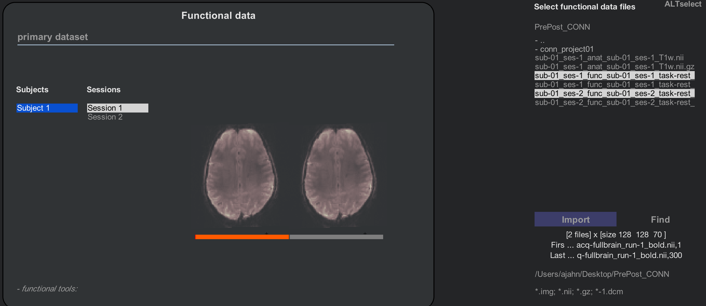
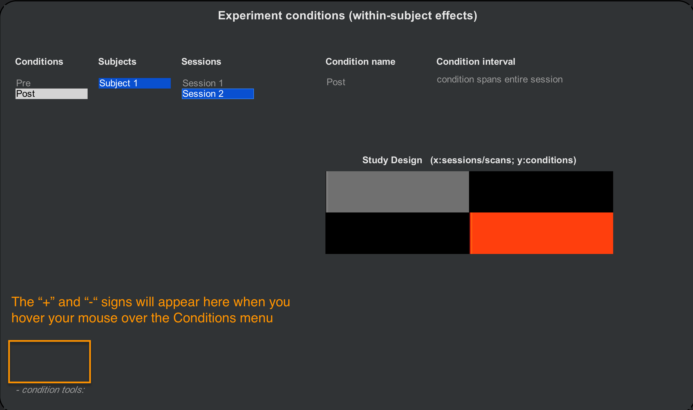

.. _CONN_AppendixB_OtherSecondLevelDesigns:

=======================================
Appendix B: Other Second-Level Analyses
=======================================

------------------

Overview
********

Now that you've run a group-level analysis, you may be wondering how you can set up more advanced types of analyses - for example, testing differences in connectivity before and after some type of intervention (also known as a **pre-post** design), or testing for differences in connectivity between groups. You may also want to use a different parcellation of connectivity nodes than the default ones provided by the CONN toolbox.

Setting up a Pre-Post design
****************************

One common functional connectivity analysis is a pre-post design. In this scenario, the subject is scanned once to measure their connectivity profile at a baseline, or before an intervention. Then the intervention occurs, either inside or outside of the scanner - such as undergoing a new behavioral therapy, for example. After this intervention the subject is scanned again, and the difference in connectivity can be calculated. If we are doing an anger management behavioral intervention, for instance, we may predict that there would be increased connectivity between regions involved in regulating emotion, such as the prefrontal cortex, and regions associated with detecting emotional salient stimuli, such as the amygdala and other parts of the limbic system.

This design requires at least two scans: One before, and one after. Click on `this link <https://openneuro.org/datasets/ds001168/versions/00003?app=FMRIPREP&version=61&job=5b0595071e2af6133af412ef>`__ which displays a dataset that has resting-state scans at two separate time points. Download the resting-state data for subject one, for both session 1 and session 2 (``fullbrain_run-1``), along with the anatomical image for run 1 (``T1w.nii``).

In the CONN GUI, open a new project, calling it ``PrePost_CONN``. In the Basic tab, enter a TR of 3 seconds, and set the number of sessions to 2. For the structural file, load the T1w.nii image; since there was only one anatomical image acquied, we will set this to be a Session-invariant structural. You may come across experiments that acquire a separate anatomical scan for each session, in which case you can specify session-specific structurals.

The Functional tab will display a menu containing one subject, and two sessions for that subject. Hold shift and click to select both sessions, navigate to the folder containing the functional data, and hold control and click to select both the session 1 and session 2 data. Click ``Import``, and CONN will load each functional run into its corresponding session. Note that there is now a bar beneath the functional images displayed in the middle window: If Session 1 is highlighted, then the left-hand part of the bar is highlighted in orange, and the right-hand part of the bar is grey; if Session 2 is highlighted, the color-coding is reversed. The orange highlighting indicates that there are two sessions, and each is assigned its corresponding volumes.

Now we will click on the ``Conditions`` tab. When we were analyzing one session from one subject, the default was to generate a condition called ``rest`` that represented the time-series across the entire session. Now that we have two sessions, it will be more helpful to label them Pre and Post. Rename ``rest`` to ``Pre``, making sure that Session 1 for Subject 1 is highlighted. Then click on the ``+`` sign at the bottom of the Conditions menu to add a new Condition, rename that condition to ``Post``, highlight Session 2 for subject 1, and use the "Condition interval" menu to specify that the ``condition spans entire session``. This will highlight the second session in orange:

.. note::

  If you accidentally add a condition that you no longer want, click on the ``-`` sign at the bottom of the Conditions menu.
  
