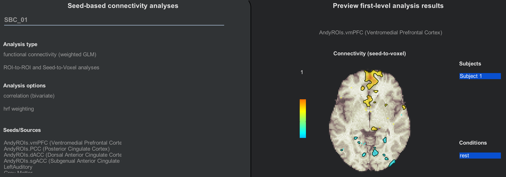

.. _CONN_AppendixC_ImportingROIs:

==========================
Appendix C: Importing ROIs
==========================

---------------

Overview
********

The default atlases that come with the CONN toolbox can be found in the folder ``conn/rois``. The file ``atlas.nii`` contains parcellations derived from the Harvard-Oxford Cortical atlas, as well as cerebellum parcellations. Similarly, the ``networks.nii`` file contains 32 networks that are commonly found in the resting-state literature.

Each of these files has a companion .txt file that indicates what label belongs to which parcellation. If you open the file ``atlas.txt``, for example, you would see these first few lines:

::

  FP r (Frontal Pole Right)
  FP l (Frontal Pole Left)
  IC r (Insular Cortex Right)
  IC l (Insular Cortex Left)
  SFG r (Superior Frontal Gyrus Right)
  SFG l (Superior Frontal Gyrus Left)
  MidFG r (Middle Frontal Gyrus Right)
  MidFG l (Middle Frontal Gyrus Left)
  
  
These correspond to the seeds that you see during the 1st and 2nd-level analyses:

.. figure:: 08_1stLevelPreview.png

Adding ROIs
***********

What if you want to use your own images - either a single ROI, or an entire atlas? In that case, you would need to create a series of ROIs combined into a single image, in which each ROI is indexed by a separate number. If you use Edit mode with FSLeyes, for example, you can assign a different number to each ROI that you draw on the brain. To keep things simple, increase the ROI indices by increments of 1. Images that contain several ROIs that parcellate the brain are called **atlases**.

When you have created the atlas, save it in a folder (such as the ``conn/rois`` folder) and use a text editor to create a text file with the same root name as the atlas. For example, if my atlas is called ``AndyROIs.nii``, I would create a text file called ``AndyROIs.txt``. Let's say that I have created an atlas with 4 ROIs: One in the vmPFC, one in the PCC, one in the dACC, and one in the sgACC. I would enter the following text into the file:

::

  vmPFC (Ventromedial Prefrontal Cortex)
  PCC (Posterior Cingulate Cortex)
  dACC (Dorsal Anterior Cingulate Cortex)
  sgACC (Subgenual Anterior Cingulate Cortex)
  
From the Setup tab, click on the ``+`` sign when you hover your mouse over the ROIs column, and call the ROI whatever you want. Then in the "Select ROI definition files" menu, navigate to where you stored your ROI, and select it. You will have to rerun Setup (but not preprocessing), and denoising again in order to use these ROIs for your analyses:

