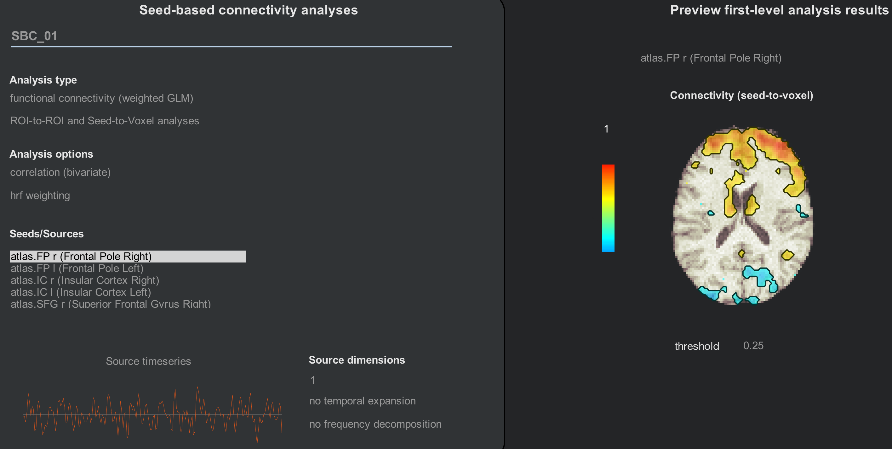

.. _CONN_AppendixC_ImportingROIs:

==========================
Appendix C: Importing ROIs
==========================

---------------

Overview
********

The default atlases that come with the CONN toolbox can be found in the folder ``conn/rois``. The file ``atlas.nii`` contains parcellations derived from the Harvard-Oxford Cortical atlas, as well as cerebellum parcellations. Similarly, the ``networks.nii`` file contains 32 networks that are commonly found in the resting-state literature.

Each of these files has a companion .txt file that indicates what label belongs to which parcellation. If you open the file ``atlas.txt``, for example, you would see these first few lines:

::

  FP r (Frontal Pole Right)
  FP l (Frontal Pole Left)
  IC r (Insular Cortex Right)
  IC l (Insular Cortex Left)
  SFG r (Superior Frontal Gyrus Right)
  SFG l (Superior Frontal Gyrus Left)
  MidFG r (Middle Frontal Gyrus Right)
  MidFG l (Middle Frontal Gyrus Left)
  
  
These correspond to the seeds that you see during the 1st and 2nd-level analyses:

Adding ROIs
***********

What if you want to use your own images - either a single ROI, or an entire atlas? In that case, you would need to create a series of ROIs combined into a single image, in which each ROI is indexed by a separate number. If you use Edit mode with FSLeyes, for example, you can assign a different number to each ROI that you draw on the brain. To keep things simple, increase the ROI indices by increments of 1. Images that contain several ROIs that parcellate the brain into different regions are called **atlases**.

When you have created the atlas, save it in a folder (such as the ``conn/rois`` folder) and use a text editor to create a text file with the same root name as the atlas. For example, if my atlas is called ``AllInsulaROIs.nii``, I would create a text file called ``AllInsulaROIs.txt``. Let's say that I have created an atlas with 4 ROIs: One in the left Anterior Insula, one in the left Posterior Insula, one in the right Anterior Insula, and one in the right Posterior Insula. These could be created by using Marsbar to place a sphere of a given radius around the peak coordinates of another study, for example, or by using an atlas to create a mask. (For examples of how to do both through SPM, see :ref:`this chapter <SPM_09_ROIAnalysis>`.) 

As mentioned above, these ROIs should each have a single number filling in their constituent voxels, and the numbers for each ROI should increase consecutively. For example, the left AI could be labeled with 1's, the left PI with 2's, the right AI with 3's, and the right PI with 4's. You can either do this manually by using an image calculator to multiply each ROI by a given number and then add all of them together, or you can use Marsbar's "Export" function to do this automatically, by selecting ``ROI Definition -> Export -> Number Labelled ROI Image``. The latter approach assumes that you created spherical ROIs through Marsbar; if you have, this method can save you time.

In any case, once you have created your ROIs, you could enter the following text into the file, following our current example:

::

  LeftAnteriorInsula (MNI -38, 6, 2)
  LeftPosteriorInsula (MNI 35, 7, 3)
  RightAnteriorInsula (MNI -38, -6, 5)
  RightPosteriorInsula (MNI 35, -11, 6)

This will generate a label in the CONN toolbox when these ROIs are processed, and also serve as a reminder of where exactly the ROIs are located. In this example, I created ROIs with a 6mm sphere around the MNI coordinates listed to the right of each ROI.

To import these ROIs, from the Setup tab click on ``ROIs`` from the menu on the left. Click on the ``New`` button at the bottom when you hover your mouse over the ROIs column, and call the ROI whatever you want; in this case, we will call it "AllInsulaROIs". Check the box underneath that is next to "Atlas File". Then in the "Import ROI files" panel on the right, navigate to where you stored your ROI, and select it by double-clicking on it:

.. figure:: C_ImportROIs.png

Once it is imported, you can use the up and down arrows next to the image to navigate through the slices and see where they are. If you click on the image panel, it will open up a new window, displaying where the ROIs are located on one of the subject's functional volumes:

.. figure:: C_VisualizeROIs.png

If the ROIs are located where you think they should be, you are ready to re-run the analyses using your custom ROIs. You will have to rerun Setup (but not preprocessing), by clicking on the ``Done`` button. If you have already run analyses and are re-running them with additional ROIs, you can save time by selecting the option ``do not overwrite (skip already-processed subjects/ROIs``:

.. figure:: C_Processing.png

You will do the same for the Denoising tab and the 1st-level analyses tab; you will then be able to run any second-level analyses as usual:

.. figure:: C_SecondLevel.png

.. .. figure:: C_Manual_ROIs.png

Exercises
*********

1. Create four new ROIs, using either the WFU Pickatlas toolbox or spheres generated with the Marsbar toolbox (see :ref:`this chapter` <SPM_09_ROIAnalysis>` for details on how to use both toolboxes). Make sure that the resulting image contains ascending, consecutive values for each ROI. Then, create an associated .txt file, and save both the image and the file into your ``conn/rois`` directory. Process the data using these new ROIs, and save a screenshot of the 1st-level result for a single subject, finding a slice that shows the seed that you used.
