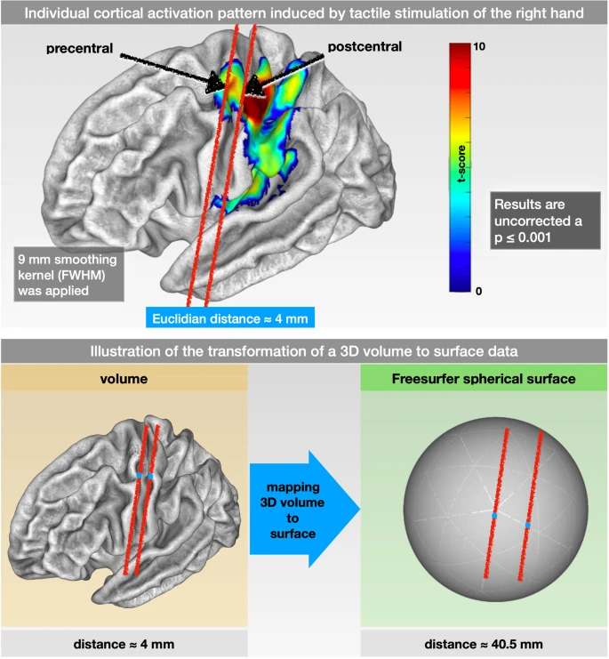
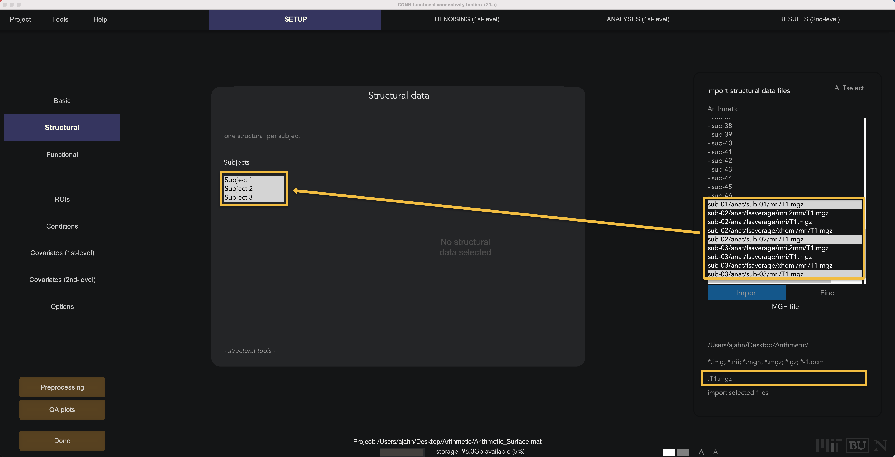
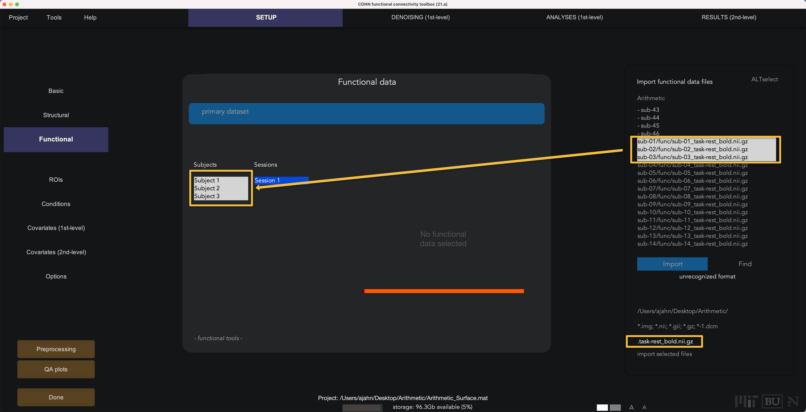

.. _CONN_AppendixD_SurfaceBasedConnectivity:

======================================
Appendix D: Surface-Based Connectivity
======================================

-------

Overview
********

The analyses you did in the previous chapters were done in what is called **volumetric space**; each image has individual voxels acquired with a specific length, width, and height, and the time-series is averaged across groups of voxels within each region. This works well for most purposes; however, functional connectivity can suffer from the same problems as task-based analysis during the preprocessing step of :ref:`smoothing <Smoothing>`. As pointed out in a recent paper by `Brodoehl et al. (2020) <https://www.nature.com/articles/s41598-020-62832-z#Sec2>`__, smoothing can average signal across functionally heterogenous areas, which can be especially problematic for connectivity analyses. For example, the ridges of two nearby gyri can be a few millimeters away from each other when viewed from above, even though the actual distance from peak to peak - traveling along the ridge of the gyrus, like going down from one hill into a valley, and up the other hill - can be many times longer than that.

  Figure 1 from Brodoehl et al. (2020). Note that the Euclidean distance (i.e., "as the bird flies") between adjacent ridges of cortex can be as close as four millimeters. The actual distance from ridge to ridge, traveling through the valleys of the cortex, is ten times as long. 

This distance is more accurately represented by reconstructing the image into **surface space**. Simply put, erforming task-based and functional connectivity analyses on the surface allows the use of larger smoothing kernels without the signal contamination problems of smoothing in volumetric space. This can both increase power and reduce the chance of smoothing across regions or different tissue types. (More details about the differences between volumetric and surface-based analysis have been detailed in the :ref:`SUMA module <AFNI_09_SurfaceAnalysis>`.) For the rest of the chapter, you will need to be familiar with FreeSurfer; the walkthrough can be found :ref:`here <FreeSurfer_Introduction>`. Once you have finished that tutorial and learned how to use the ``recon-all`` command, follow the steps below to modify your CONN project to analyze surface data.

Creating the Surface
********************

For the remainder of this tutorial, we will use the first three subjects of the Arithmetic task on OpenNeuro.org, which can be found `here <https://openneuro.org/datasets/ds002422/versions/1.1.0>`__. If you followed the steps in the previous chapters, you should have the entire dataset downloaded. Navigate to the folder ``Arithmetic``, and type the following code:

::

  for i in sub-01 sub-02 sub-03; do
    cd $i/anat;
    SUBJECTS_DIR=`pwd`;
    recon-all -s $i -i ${I}_T1w.nii -all;
    cd ../..;
  done
  
This will run recon-all sequentially in each ``anat`` directory. Alternatively, if you have multiple processors on your computer, you could open three separate terminals and run recon-all in each of them; or, you could use the :ref:`parallel command <FS_04_ReconAllParallel>`. The latter two options will complete recon-all more quickly by processing each subject in parallel. In any case, you should be able to process all three subjects in about a day.

Loading the Surface Data into CONN
**********************************

When ``recon-all`` finishes, you will have a new directory within each subject's ``anat`` folder. Each of these FreeSurfer directories will contain subfolders such as ``mri`` and ``surf``, which you will need to import the surface data into CONN.

First, open a Matlab terminal and open the CONN toolbox. Create a new project called ``Arithmetic_Surface``, which will open the Setup Tab. Enter ``3`` for the number of subjects, and change the TR to ``3.56``.

Next, click on the ``Structural`` button. Within the FreeSurfer output directories, there is a file called ``T1.mgz`` in the ``mri`` subfolder. In the ``Find`` field, type ``T1.mgz`` and then press the ``Find`` button; you should see a new list of files that contain the string ``T1.mgz``. Shift and click to highlight all of the Subjects in the ``Structural data`` field, and then hold control and left-click to select the corresponding T1.mgz files for each subject, and click ``Import``. This will automatically detect the surface reconstructed anatomical file, along with any segmentation files.

The functional data, by contrast, is still in volumetric space; during preprocessing, it will be resampled to surface space. Click on ``Functional``. Similar to what we just did above, enter ``task-rest_bold.nii.gz`` in the ``Find`` field; highlight the three subjects in the ``Functional data`` window and then control and click to select their corresponding functional files.

