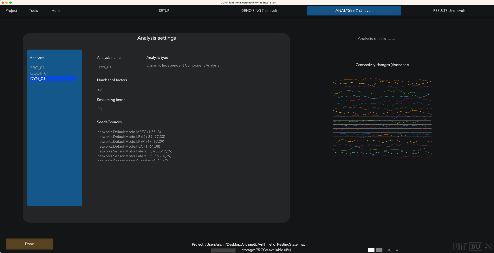
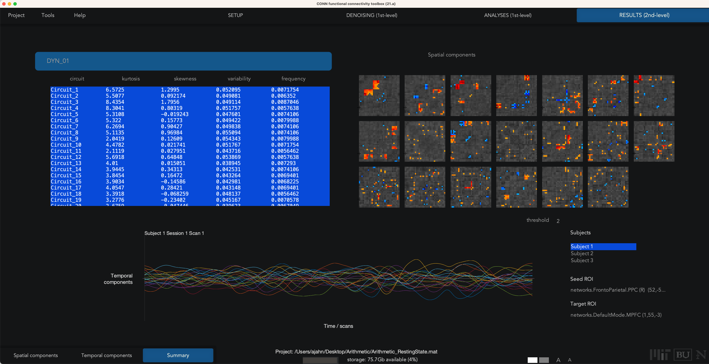
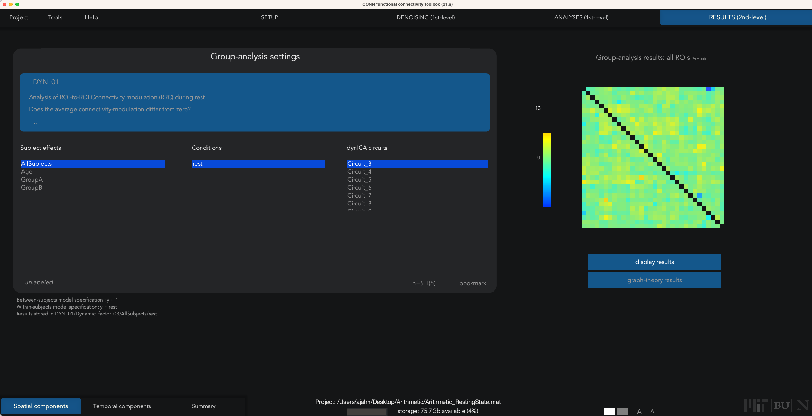
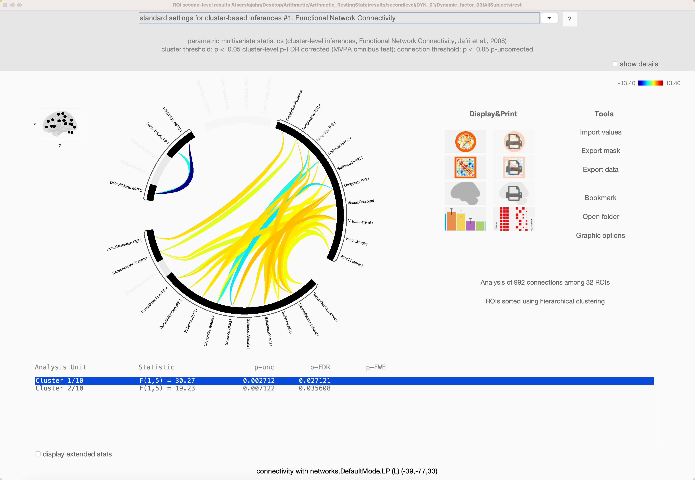

.. _CONN_AppendixE_DynamicConnectivity:

================================
Appendix E: Dynamic Connectivity
================================

-------

Overview
********

The connectivity analyses we have done so far, both resting-state and task-based, use one time-series per voxel, or the average of a time-series over all of the voxels within an ROI. In addition, the CONN toolbox is able to do **Dynamic Connectivity**, in which a time-series is sub-divided into smaller components, or in which multiple independent components are extracted from a given time-series. These types of analyses measure the temporal variability of a time-series, instead of using the time-series as a single measure.

Sliding Window Analysis
***********************

The more straightforward type of dynamic connectivity is **Sliding Window Analysis**. This technique divides the time-series into smaller bins, with the amount of bins being specified by the user. For example, if we take the resting-state data from ``sub-01`` and load the fully preprocessed functional data, we can specify the number of bins in the ``Conditions`` part of the ``Setup`` tab. Make sure that the ``rest`` condition is selected, as is ``condition spans entire selected session(s)``. Then, at the bottom of the window, click on the ``Time-frequency decomposition`` drop-down menu, and select ``temporal decomposition (sliding-window)``. 

.. figure:: AppendixE_SlidingWindowSetup.png

Click the Done button in the bottom left of the Setup tab, leaving the defaults as they are. Similar to the analysis for a typical resting-state scan, use the defaults for Denoising as well. When you come to the 1st-level Analysis tab, click Done and leave the defaults. This will move on to the 2nd-level results, and it will throw an error saying that the group-level analysis can't be done with just one subject. Ignore it for now, and click on the Analyses (1st-level) tab to return to the previous window.

Note that you now have many different Seeds (e.g., ROIs) to select from, which will update a correlation map on the right-hand side. You can select different connectivity windows to see how the connectivity changes over time:

.. figure:: AppendixE_SlidingWindowResults.png

These results can be found in the directory conn_project01/results/firstlevel/SBC_01. For example, the file corr_Subject001_Condition012_Source134.nii will show the correlation map for time window 12 for Source 134 (in this example, 134 corresponds to the right amygdala). You can then extract z-transformed correlation values from these maps, for example in AFNI:

.. figure:: AppendixE_ViewingResultsAFNI.png

The default sliding window parameters are intervals of 100 seconds for each window, separating each window by 25 seconds. For example, if you have a time-series that is 300 seconds long, the sliding window vector would look like:

::

  [0 25 50 75 100 125 150 175 200 225 250 275]
  
With the onset of each of these time-points having a 100 second long window following each of them, and an overlap of 75 seconds for each window. For our data, let's create a vector of onsets that will be 100 seconds long for each window, with 25 seconds of overlap:

::

  [0 75 150 225 300 375 450 525 600]
  
This will create 11 new regressors: one for each of the windows we specified, and a Temporal Average and Temporal Variability regressor. Click ``Done``, and also run Denoising as usual.

When you arrive at the 1st-level Analysis tab,

Dynamic ICA
***********

.. note::

  This section is still under construction.
  
Dynamic ICA is an extension of generalized psychophysiological interactions: Given a set of ROIs, this analysis will measure how the strength and the sign of the connectivity changes with a given component. The resting-state data is decomposed into several independent components, and dyn-ICA measure how their connectivity changes with each ROI-to-ROI pair.

To run a dyn-ICA analysis, from the 1st-level Analysis tab, hover your mouse over the ``Analyses`` panel, and click on ``New`` at the bottom of the panel. Select ``dyn-ICA``, and click ``Done``. This will generate a new analysis in the ``Analyses`` panel called ``DYN_01``. You can specify the number of factors, or independent components, as well as the temporal smoothing kernel, in seconds. As with a seed-based or ROI-to-ROI connectivity analysis, you can select as many or as few seeds as you want; in this case, select only those seeds with a ``networks`` prefix, and unselect all of the rest. Then click ``Done``.

  
In our current example, we used the default of 20 factors and a temporal modulation kernel of 30 seconds. This will run 20 separate analyses to extract that number of components, and then detect which ROIs exhibit similar variability in their time-series. When the analyses finish, you will see a Summary tab in Results (2nd-level), which displays an NxN correlation matrix for each component that was extracted. Some components may seem to be noisier and less interpretable, while others exhibit more structure. For example, Spatial Component #3 shows a high component score for the sensorimotor and visual ROIs, suggesting that these pairs of ROIs exhibit similar temporal variability over a temporal smoothing kernel of 30 seconds:

The other two buttons in the lower left, ``Spatial components`` and ``Temporal components``; for now, click on ``Spatial components``, and you will see a results window similar to the earlier Seed-based connectivity analysis that you performed in previous chapters. For example, highlight ``Circuit_3``, and click ``display results``:

