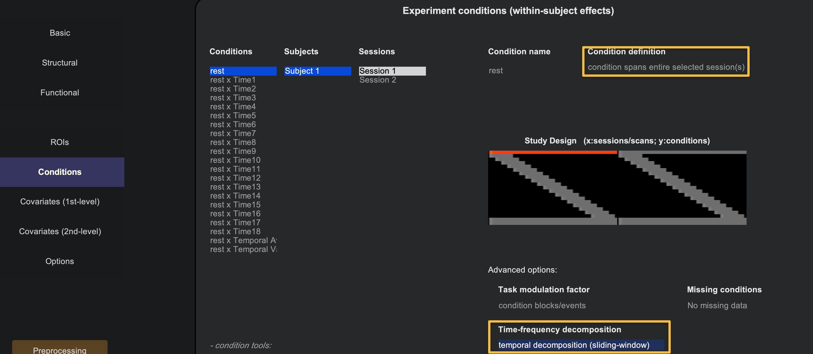
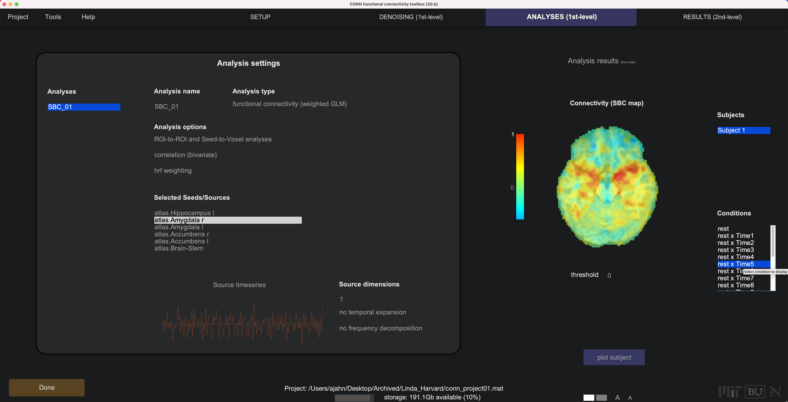
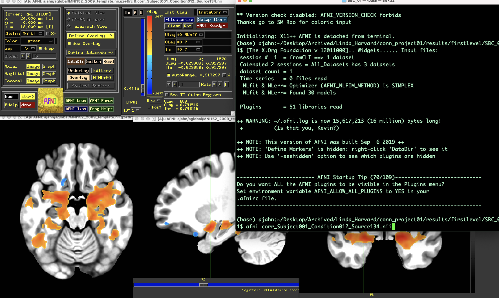

.. _CONN_AppendixE_DynamicConnectivity:

================================
Appendix E: Dynamic Connectivity
================================

-------

Overview
********

The connectivity analyses we have done so far, both resting-state and task-based, use one time-series per voxel, or the average of a time-series over all of the voxels within an ROI. In addition, the CONN toolbox is able to do **Dynamic Connectivity**, in which a time-series is sub-divided into smaller components, or in which multiple independent components are extracted from a given time-series. These types of analyses measure the temporal variability of a time-series, instead of using the time-series as a single measure.

Sliding Window Analysis
***********************

The more straightforward type of dynamic connectivity is **Sliding Window Analysis**. This technique divides the time-series into smaller bins, with the amount of bins being specified by the user. For example, if we take the resting-state data from ``sub-01`` and load the fully preprocessed functional data, we can specify the number of bins in the ``Conditions`` part of the ``Setup`` tab. Make sure that the ``rest`` condition is selected, as is ``condition spans entire selected session(s)``. Then, at the bottom of the window, click on the ``Time-frequency decomposition`` drop-down menu, and select ``temporal decomposition (sliding-window)``. 

Click the Done button in the bottom left of the Setup tab, leaving the defaults as they are. Similar to the analysis for a typical resting-state scan, use the defaults for Denoising as well. When you come to the 1st-level Analysis tab, click Done and leave the defaults. This will move on to the 2nd-level results, and it will throw an error saying that the group-level analysis can't be done with just one subject. Ignore it for now, and click on the Analyses (1st-level) tab to return to the previous window.

Note that you now have many different Seeds (e.g., ROIs) to select from, which will update a correlation map on the right-hand side. You can select different connectivity windows to see how the connectivity changes over time:

These results can be found in the directory conn_project01/results/firstlevel/SBC_01. For example, the file corr_Subject001_Condition012_Source134.nii will show the correlation map for time window 12 for Source 134 (in this example, 134 corresponds to the right amygdala). You can then extract z-transformed correlation values from these maps, for example in AFNI:

Dynamic ICA
***********

.. note::

  This section is still under construction.
