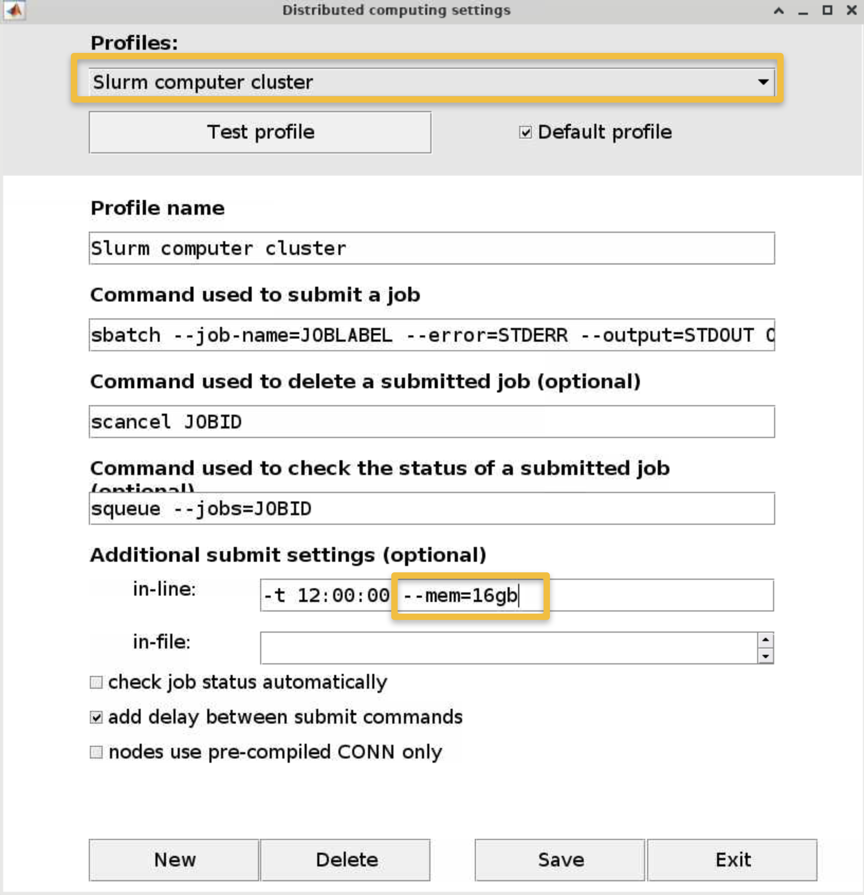
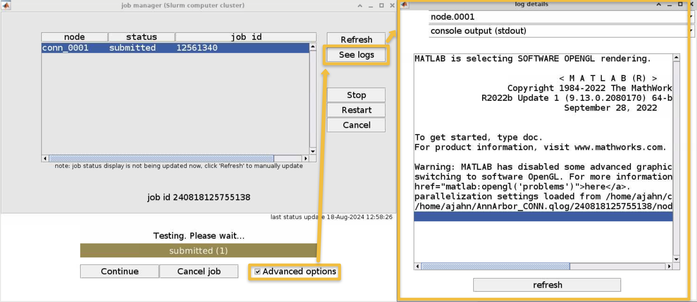
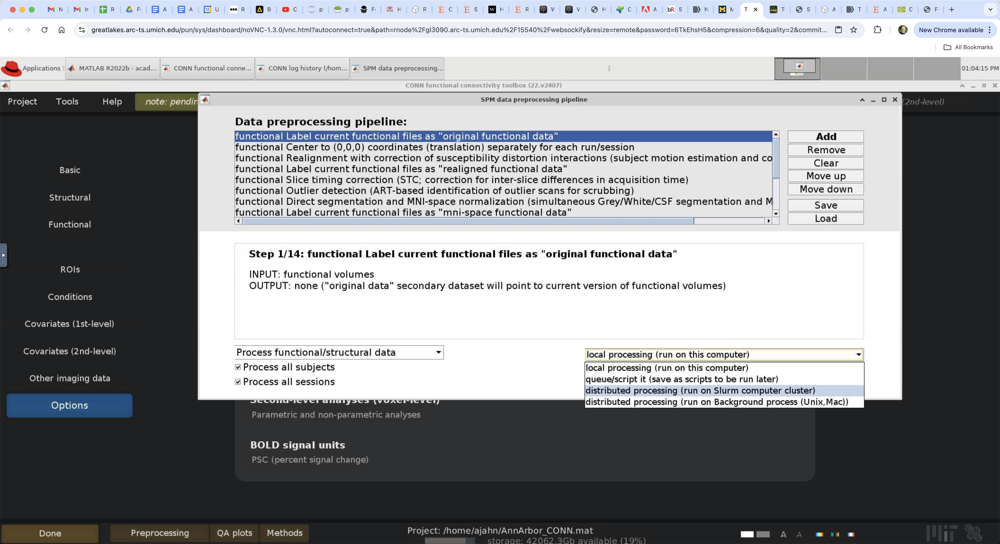
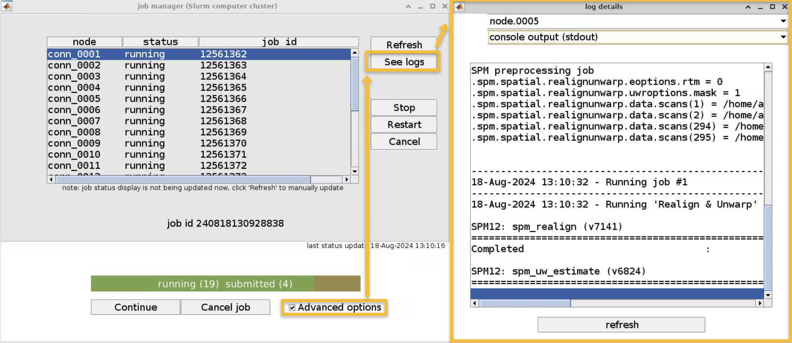

.. _CONN_AppendixF_OpenScienceConnToolbox:

=============================================
Appendix F: Open Science and the CONN Toolbox
=============================================

-------

Overview
********

The latest version of the CONN toolbox, 24.27, allows you to download any of the datasets hosted by the `**1000 Functional Connectomes Project** <https://fcon_1000.projects.nitrc.org/>`__. There are 33 datasets in total, from Cambridge to Taipei, and most of them contain demographics data as well. There is also a range of sample sizes, from a few to a couple hundred.

You can download and analyze one of these datasets by opening the CONN toolbox, and selecting ``Project -> New (download) -> from FCP/INDI public database``. You will be prompted to enter a name for the project; in this case, let's call it CONN_fCONN_Demo. You can then select the dataset that you want; let's choose the smallest one with only 8 subjects, the ``Taipei_b`` dataset.

The next prompt will ask you whether you want to just download the data, or whether you want to download and process it. This includes everything, from preprocessing to denoising to creating correlation maps, and has the benefit of taking care of everything for you while you go do something else. The downside is that it uses defaults you may not want, and it only generates correlation maps for the networks ROIs, not the atlas ROIs (although you can change this later). For now, let's choose the "Download and process" option, and wait for about an hour while the data is analyzed.

Once it has finished, you will see that all of the tabs are enabled, since all of the preprocessing and analyses have been completed. We are going to take a quick look through all of them, although you should take the time to thoroughly quality check the data as discussed in the :ref:`previous chapters <CONN_06_QA_Checks>`.

Notice that only the networks ROIs are analyzed in the 1st-level tab; you could add the other atlas ROIs here if you wanted. You can also run the group-level analyses for any region that is available. Also note that this dataset does not contain any other demographic information, such as age or sex, so we won't be able to control for them.

Analyzing Data on the Supercomputing Cluster
********************************************

Let's now take a look at how to analyze these datasets on the supercomputing cluster. At the University of Michigan, I use the cluster Great Lakes, which has a web-based graphical user interface called OnDemand. Here I can click on ``My Interactive Sessions``, and select a new instance of Matlab. Many of my defaults are standard, and I will keep this session running for 96 hours, along with using a modest 16 gigabytes of memory. After clicking ``Launch``, it takes a few moments for the session to load; I then click on ``Launch Matlab`` and wait for Matlab to open.

I already have installed SPM12 and the CONN toolbox, and after adding them to my path, I type ``conn`` to open a new instance of the CONN toolbox. As before, I create a new project by downloading one of the fCONN datasets; let's call this project ``AnnArbor_CONN``, since I will be analyzing data from one of the Ann Arbor sites; let's select the first option, AnnArbor_a. This time, however, let's choose to just Download the data instead of processing it. Once it is downloaded, we are going to take advantage of the numerous cores, or individual computers, that are contained within the cluster. Click on ``Tools -> HCP Options -> Configuration``. Under ``Profiles``, select ``Slurm computer cluster`` from the dropdown menu, with slurm referring to the batch syntax used to submit jobs and check the box next to ``Default profile`` so that this is used automatically for all future projects . Most of the defaults are fine; the only thing we will change is the ``Additional submit settings``. To the field next to ``in-line:``, add ``--mem=16gb``. This ensures that we have enough memory to run the current analysis; and ``-t 12:00:00`` allocates 12 hours of processing time for the job. This is probably more than we need, but it's good to be on the safe side.

Now, click on ``Test profile`` to see whether a job can be submitted on this system. You will now see a job manager window that tracks the progress of your submitted job. If you click on the box next to ``Advanced options``, you can see more details about what is happening in the job right now. In this example, we have one job submitted to one node, with a unique job identifier. If you click on ``See logs``, it will show you exactly what code is being run; in this case, it is simply testing whether the jobs can be submitted in parallel. Click on the ``refresh`` button, either in the log details window or in the job manager window, to see whether anything has progressed. 

After a few moments, you should see the Testing bar change to a green color, and that it says "finished". This means that it successfully ran without any errors. Now, exit that window, click on ``Options``, and uncheck the boxes next to ``Voxel-to-Voxel`` and ``Dynamic Circuits``; this is just to save time. Now click on ``Preprocessing``, and select the first option, the default preprocessing pipeline. Click on the dropdown menu that says ``local processing``, and change it to ``distributed processing (run on Slurm computer cluster)``. Then click ``Start``. 

You will see a new prompt asking you how many parallel jobs you would like to run. There are 23 subjects we have downloaded, and if we want to, we can use 23 cores, or one for each job - just like using a separate computer to process each job individually. After clicking ``OK``, you will be asked the usual questions about preprocessing, such as slice-timing correction and smoothing; for now I will skip slice-timing correction and keep the rest of the defaults the same. 

After you finish choosing all of your options, another job manager window appears after a few moments. Click on ``Advanced options``, and note that in this case there are 23 jobs being run simultaneously; clicking on ``See logs`` will show you the progress of each one individually, and you can toggle between different jobs by clicking on the dropdown menu that says ``node.0001`` and selecting another node. The main benefit of parallelization is that the processing is done in parallel instead of serially; if it takes thirty minutes to preprocess a single subject, then it will take roughly thirty minutes to analyze however many subjects you have in your queue. The time savings can be enormous, and directly proportional to the number of jobs you are running. For now, we will let the preprocessing run in the background, and come back to it when it finishes in about half an hour. If it seems to pause at some point when it appears from the individual log files that the preprocessing is done, keep clicking the ``Refresh`` button on the job manager until they finish and are imported into the project.

Just as we did in previous tutorials, click on the ``Done`` button in the Setup tab, this time selecting ``distributed processing`` and entering ``23`` cores, and clicking ``Done``. This will take about ten to fifteen minutes, and you can keep an eye on the progress like we did before.

We will do the same for Denoising and 1st-level analysis, always selecting distributed processing and using the maximum number of cores that you can. The entire process should take less than an hour.

Once all of the data have been preprocessed and analyzed, you can look at whichever result you want in the second-level tab. For example, we could take a contrast of Males > Females for the MPFC region, including Age as a covariate. The choice is up to you how you want to analyze the data, and you can also rerun these analyses using voxel-to-voxel analysis or dynamic circuits. Overall, importing these open-access databases is an excellent way to learn more about the variety of samples that are collected, and how to analyze them in the CONN toolbox.
