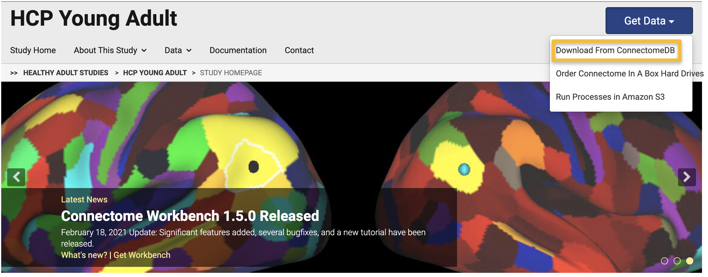
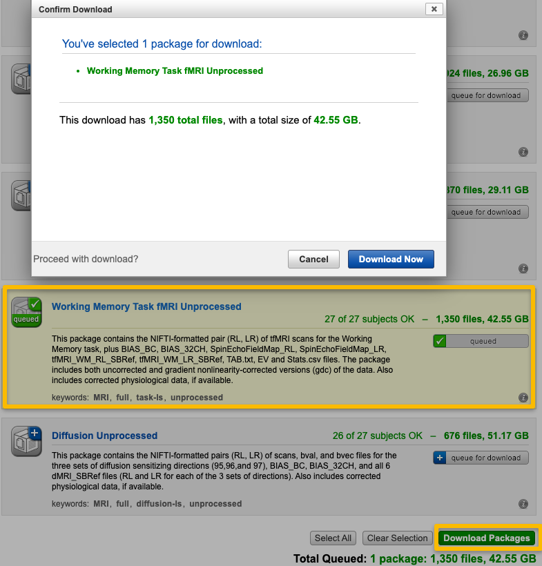

.. _HCP_1_DownloadData:

=====================================
HCP Tutorial #1: Downloading the Data
=====================================

-------------

For this tutorial, we will use the HCP Young Adult dataset, which in turn is composed of many data subsets. Scroll down the HCP website and click on the `HCP Young Adult <https://www.humanconnectome.org/study/hcp-young-adult>`__ link. Click on the ``Get Data`` button, and select the option ``Download from ConnectomeDB`` (DB stands for DataBase). 

.. note::

  To download the data, you may need to create an account. You will be prompted to give an email address and username, and then you will be able to set up your password.

As you can see, there are four data subsets within the Young Adult dataset. The first one, which is also the largest, contains structural, task fMRI, resting-state fMRI, and diffusion imaging; the others have complete descriptions of what they contain. Scroll down to the dataset ``WU-Minn HCP Lifespan Pilot Data`` and click on the button ``Open Dataset``. Next, click on the ``Download Images`` button on the right side of the page, and select ``All HCP LifeSpan Subjects``. The 27 subjects contained in this data subset have several different packages which can be downloaded; for example, you may choose to just download the unprocessed structural data, or just one of the task-fMRI datasets. 

Click on the button ``queue for download`` next to the package ``Working Memory Task fMRI Unprocessed``, and a green checkmark will appear on the package icon. Then, at the bottom of the page, click on ``Download Packages``. A summary window will appear, saying that there are 1,350 total files, with a total size of 42.55GB. Click on ``Download Now`` to begin the download.

.. note::

  All of the datasets on the HCP website are quite large, usually at least several dozen gigabytes. In this example I will be placing the downloaded data into an external hard drive, under the file path ``/Volumes/ANDY_FMRI/HCP/WU-Minn_HCP_Lifespan_Pilot_WM``. If you have the space on your desktop of your personal computer, by all means put it there.
  
After you have downloaded the data, extract the files for the first subject (i.e., ``LS2001``) by either double-clicking on the zipped file, or navigating to the directory in which the files are stored, and typing ``unzip LS2001*.zip``. This will extract all of the data into a new data structure, ``LS2001/unpreocessed/3T/tfMRI_WM_LR``. 
