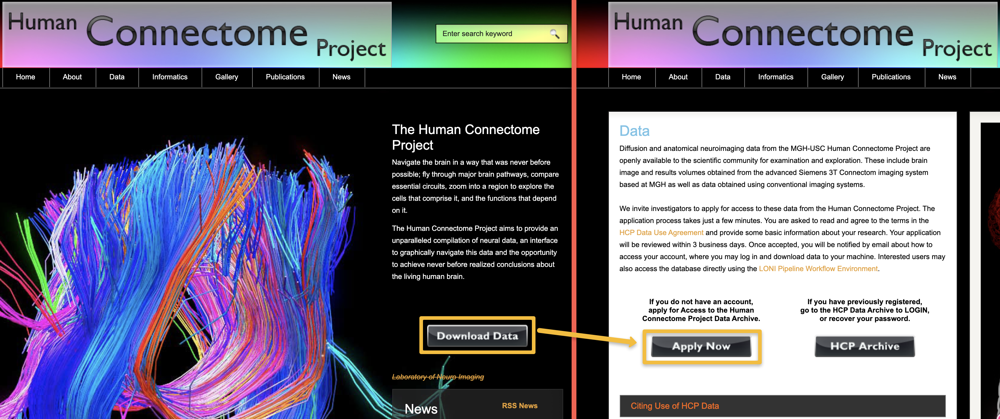
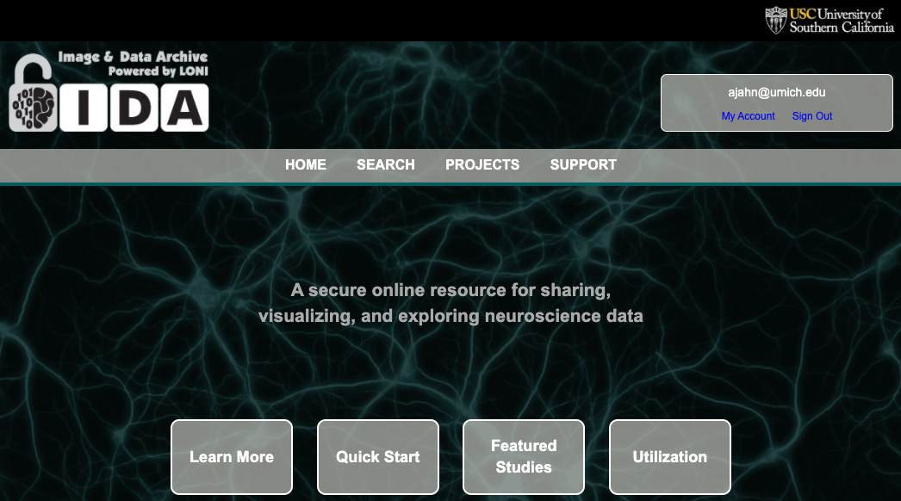

.. _HCP_1_Register:

=============================
HCP Tutorial #1: Registration
=============================

-------------

Before you can download any of the data stored in the Image and Data Archive, you will need to register an account with the Human Connectome Project. From the HCP homepage, click on ``Download Data``, and then on the new page click on ``Apply Now``:

The next few steps should be straightforward; you will be asked to read a user agreement, supply your email address, and then enter a security code when prompted. Once you have set up your email address and password, you can then click on the ``HCP Archive`` button from the previous page, which will redirect you to the IDA website:

Once you are there, you have access to all of the study data uploaded to the IDA. Click on ``Projects``, and then select ``ADNI``. This will redirect you to the Alzheimer's Disease Neuroimaging Initiative dataset, with an overview of the data demographics such as age, gender, and research group. Select ``Download -> Image Collections`` to open the IDA Search page. (The ``Study Data`` link allows you to download subject demographic data.) Click on ``Advanced Search``
