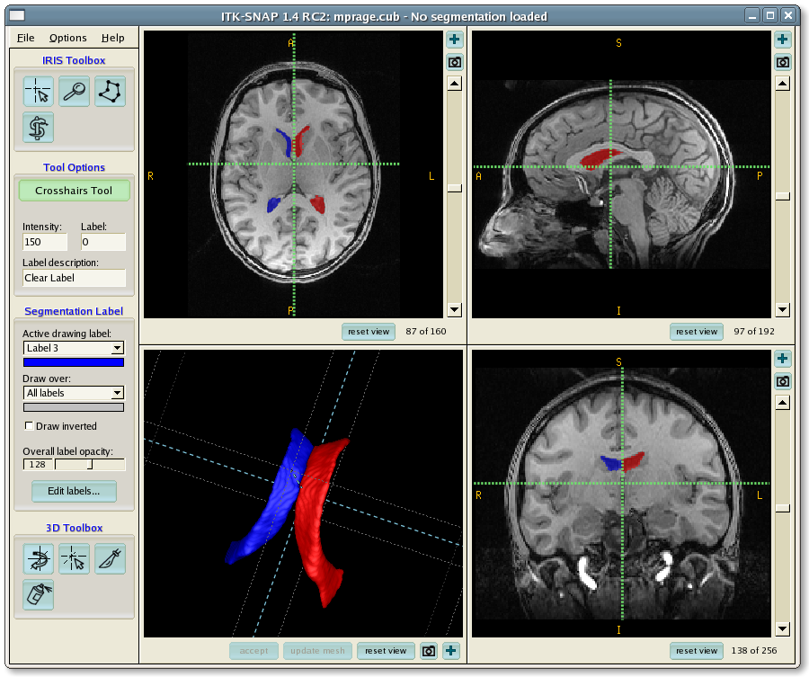

.. _ITK-Snap_Overview:

=================
ITK-Snap_Overview
=================

---------------

What is ITK-Snap?
*****************

ITK-Snap is a tool for visualizing and manually segmenting images. In this series of tutorials, we will learn how to use ITK-Snap to fix segmentation errors output by infant_recon_all (part of the FreeSurfer software package), and to rerun the analysis with the corrected images.

We will begin with an overview of infant_recon_all, learning how to install it and how to use it for a first-pass analysis. To begin with that tutorial, select it from the table of contents below, or click the ``Next`` button.

.. toctree::
   :maxdepth: 1
   :caption: ITK-Snap Tutorials

   ITK-Snap_Short_Course/ITK-Snap_01_InfantFreeSurfer
   ITK-Snap_Short_Course/ITK-Snap_02_GUI
