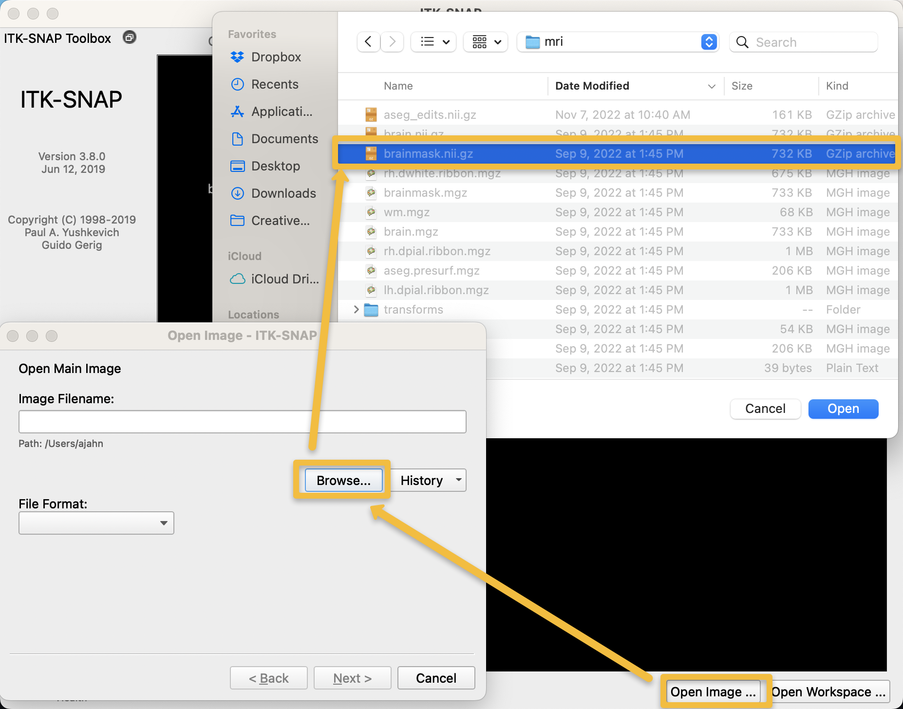
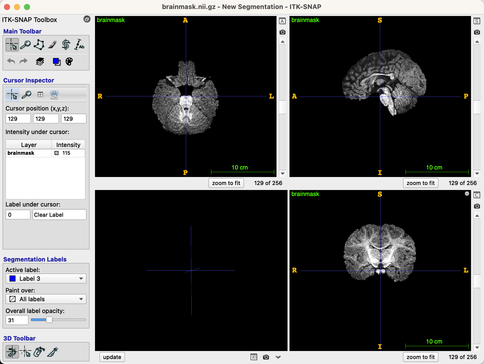
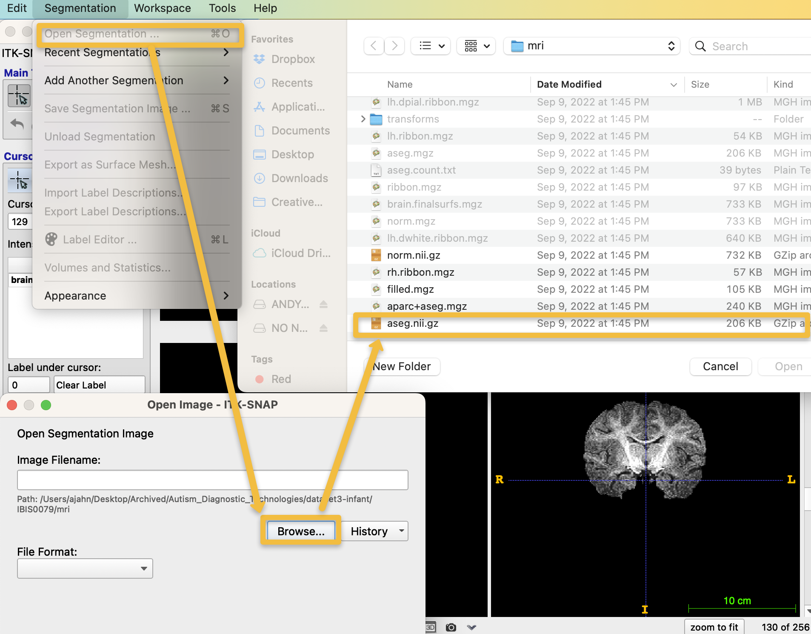
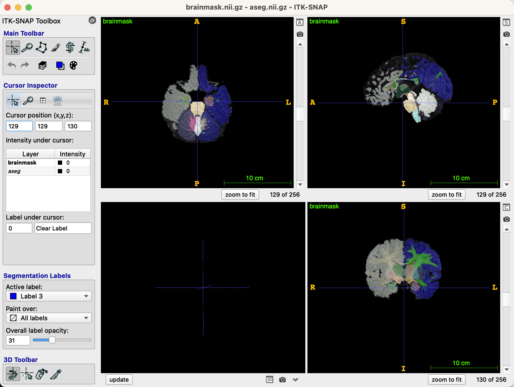
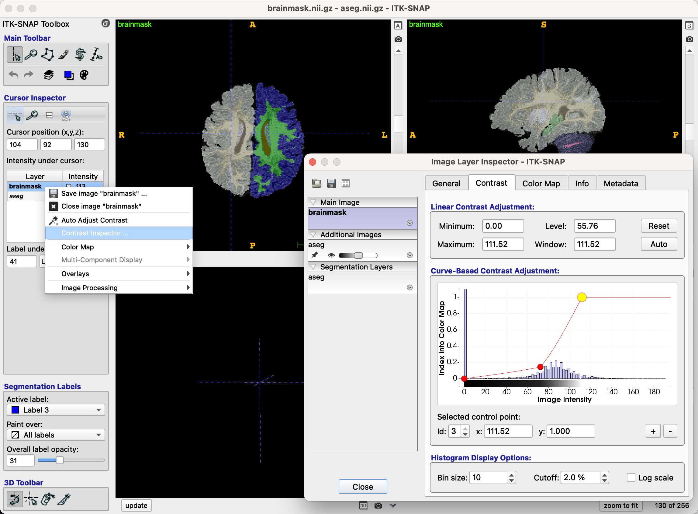
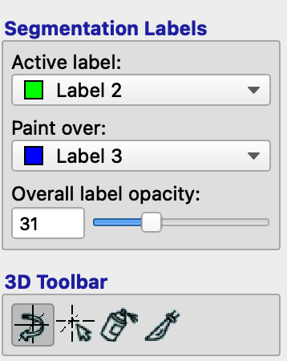
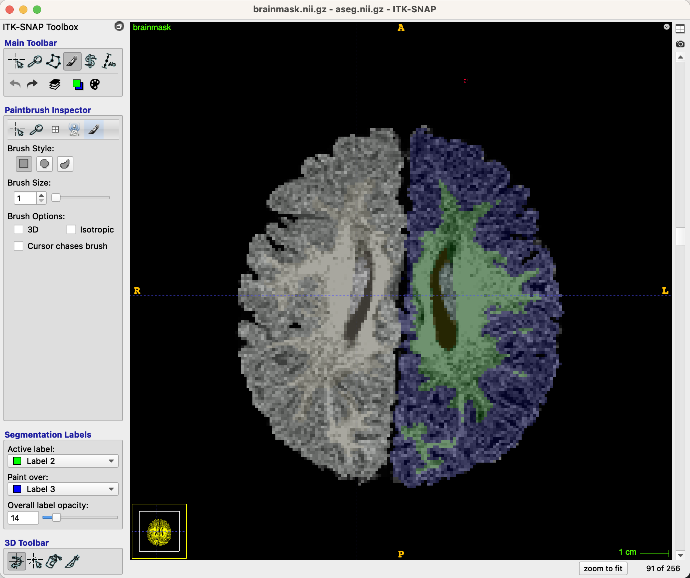
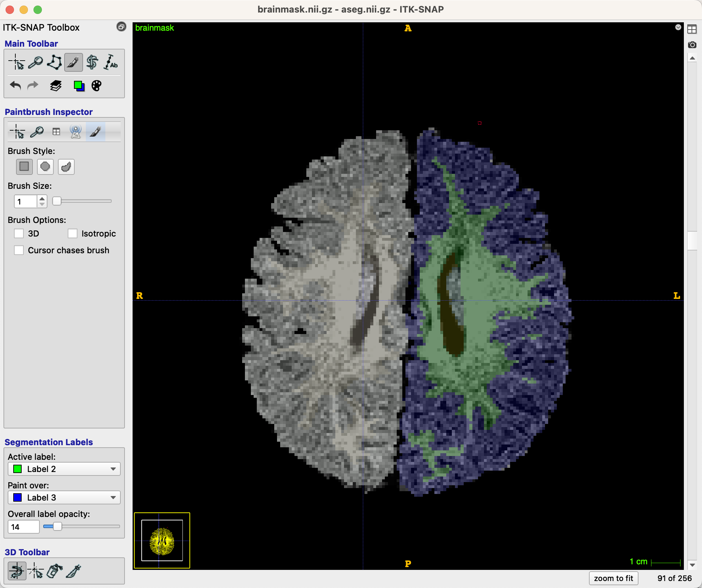

.. _ITK-Snap_02_GUI:

======================================
ITK-Snap Tutorial #2: The ITK-Snap GUI
======================================

---------------

Loading the Images
******************

ITK-Snap is run primarily from the Graphical User Interface. Once you load an image, you are able to make edits to the image, labeling voxels with different values as you see fit.

Let us continue with our example from the Infant Brain Imaging Study (IBIS) dataset, which contains anatomical images of children from birth to 24 months of age. When you open ITK-Snap, it will prompt you to select a recently opened image, if you have previously used the software. If it is your first time using ITK-Snap, click on ``File -> Open Main Image`` (or, alternatively, the ``Open Image`` button in the bottom right corner of the GUI), and select the skull-stripped, T1-weighted anatomical image that you have analyzed with infant recon-all. Using our current example subject, ``IBIS0079``, select the file ``brainmask.mgz`` located within the folder ``IBIS0079/mri``:

After you have loaded the image, you should see three orthogonal views of the brain, along with a three-dimensional reconstruction in the bottom left panel, if applicable (it does not exist in our current example):

Now that we have loaded the brainmask, we will overlay the segmentation to see how well the grey and white matter tissues are outlined. Click on ``Segmentation -> Add Segmentation``, and click the ``Browse`` button from the resulting pop-up window. Then navigate to the directory ``IBIS0079/mri``, and select the file ``aseg.nii.gz``, and click ``Open``. Click ``Next`` and ``Finish`` on the resulting pop-up windows:

This will overlay the segmentation on top of the brainmask image, which should now look like this:

Before you start editing, you can change the contrast settings of the brain so that it’s easier to see through the segmentation. For example, you can turn by either pressing the ``S`` key, or moving the slider in the lower left corner of the GUI to make the segmentation either more or less transparent. Find a level that you are comfortable with; I prefer somewhere around the 30-40 range for the opacity slider, so that the segmentation is visible as well as the underlying structures of the anatomical image.

Another way to improve visualization of the images is to change the contrast between the tissue types. Above the opacity bar and the segmentation labels, right-click on the brain you are currently editing (in our case, ``brainmask``), and then click ``Contrast Inspector``. This will open a new window with two dots above a historgram of intensity values. Click and drag the dots until the contrast of the underlying brainmask is to your liking:

Editing the Images
******************

Once you have a good contast between the different tissue types, we can now edit the images. FreeSurfer assigns certain numbers to different segmentations and parcellations; for example, the grey matter in the left hemisphere has a value of 3, while the white matter in the left hemisphere has a value of 2. The grey and white matter of the right hemisphere have values of 42 and 41, respectively. You can see this for yourself by click on the tissue of any hemisphere with your mouse, and observing the number in the field ``Label under cursor``, which is on the left side of the GUI.

.. note::

  The Left and Right sides of the image that is displayed are on the left and right sides of the ITK-SNAP GUI. Notice that the left side of the orthonogal views for the axial and coronal views has an ``R`` marked on it, while the right side of the orthogonal views has an ``L``.

Click the Paintbrush icon in the ``Main Toolbar`` part of the GUI, which will switch the left panel to ``Paintbrush Inspector``. (If you ever want to get back to the original navigation cursor, click on the cursor icon in the upper left corner of the ``Main Toolbar``.) Now when you hover your cursor over the image, you will see a small box around the tip of your cursor; if you left-click, it will fill in the box with whatever is under the ``Active Label`` field of the ``Segmentation Labels`` panel. For example, the label right now is Label 3, which is colored blue. The ``Paint over`` field indicates which labels it is allowed to paint over. If ``All labels`` is selected, it will paint over everything that you click on; if, however, we change it to Label 2, which is colored green, then any label edits will only affect that particular label. In our case, we will usually be editing the white matter, extending it into regions that have been mistakenly labeled white matter by FreeSurfer. Change the ``Active label`` to Label 2, and the ``Paint over`` field to Label 3:

  
You may find it easier to edit just one of the views, since it will focus your vision and also fill up the entire viewing panel with that orthogonal view. Usually the axial view is most useful for making grey and white matter edits; click on the ``A`` in the upper right corner next to the axial view, which will expand it to fill the whole viewing panel. You may want to also expand the image by clicking on the cursor icon in the ``Main Toolbar``, and holding the right mouse button while scrolling up or down.

If we scroll to slice 91, for example, we see that the white matter could extend further into the left frontal pole, in parts of the brain that have been labeled grey matter. Switch back to the paintbrush icon, and change the ``Brush Size`` to 1. If you have reason to believe that the same edit would translate to the slices above and below, you can check the box next to ``Brush Options: 3D``. Otherwise, leave the defaults as they are.

Now use your mouse to click on voxels that you believe have been mistakenly categorized as grey matter. See the following images for before and after images of the edited slices:

.. note::

  To check your edits comapred to the underlying anatomy, change the opacity slider, or toggle the overlay on and off by pressing the ``S`` key. You can also undo a previous edit by pressing ``CMD+Z`` for Macintosh operating systems, or ``CTL+Z`` on Windows.
  
Continue doing this for all of the slices that you believe have been mistakenly labeled. When you are finished, save the segmentation by clicking on ``Segmentation -> Save aseg.nii.gz as...`` and saving it into the ``mri`` folder as ``aseg_edits.nii.gz``.

Re-running infant recon-all with Segfile
****************************************

Now that we have our edited segmentation file, we can use it to assist FreeSurfer to generate more accurate grey and white matter segmentations. Re-run infant recon-all by typing the following from the SUBJECTS_DIR directory:

::

  infant_recon_all --s IBIS0079 --age 6 --segfile aseg_edits.nii.gz
  
Once it finishes, review the output of the segmentation to see whether it improved the grey matter and white matter boundaries. You can continue re-editing the segmentation file as needed, using the same steps outlined above.

Appendix: Additional Controls and Commands
******************************************

Below is a list of keyboard shortcuts you may find useful when using ITK-SNAP:

Any mode:

* Open up a main image: Command-G
* Open up a segmentation: Command-O
* Undo: Command-Z
* Redo: Shift-Command-Z
* Toggle between options in the main toolbar: number keys 1-6
* Change opacity: “A” moves the opacity down 5 and “D” moves the opacity up 5. “S” toggles the opacity on and off.
* Change labels: “<” moves down one label and “>” moves up one label
* Pan across a plane: Hold down middle click (scroll wheel) and drag
* Scroll through image slices: Top left panel = scroll up and down with the scroll wheel. Top right panel = left and right arrow keys. Bottom right panel = up and down arrow keys.

Crosshair and zoom mode (1 and 2):

* Zoom in and out: Hold right click and drag up or down
* Move the cursor: Hold down left click and drag in cursor mode (1)

Paintbrush mode (4):

*	Add voxels: Hold down left click and drag
* Remove voxels: Hold down right click and drag
*	Change paintbrush size: “-” cuts down the brush size by one voxel and “+” brings the brush size by one voxel.
