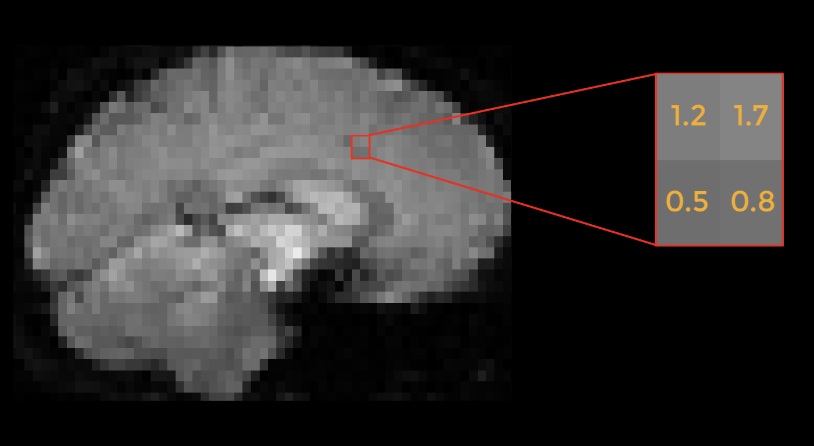
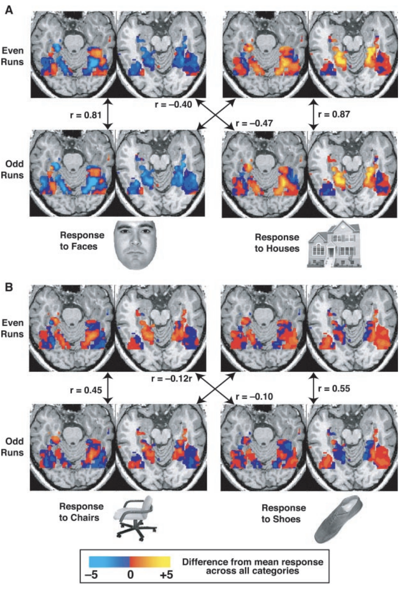
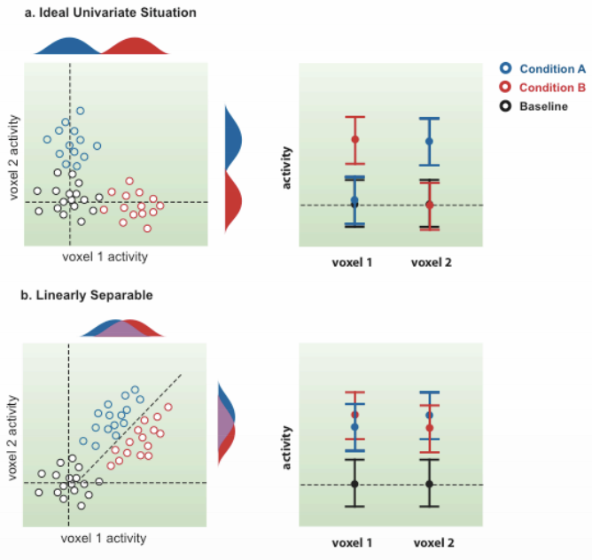
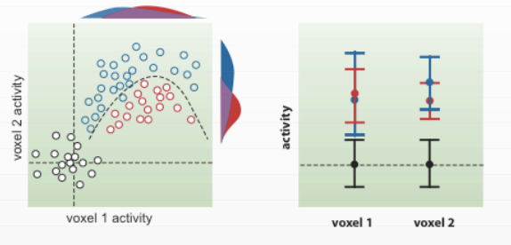
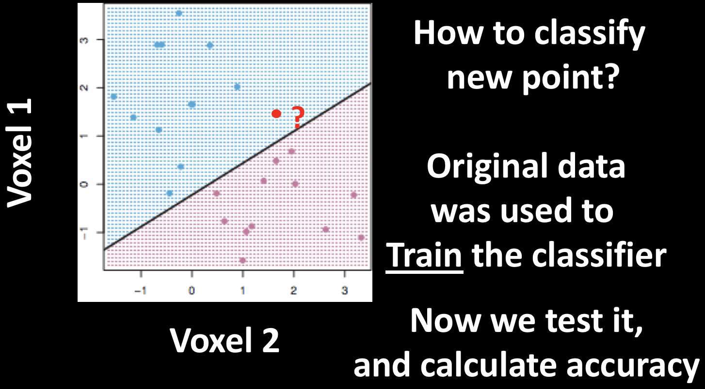

.. _ML_00_Introduction:

==========================================================
Machine Learning: Introduction to Basic Terms and Concepts
==========================================================

---------------

What is Machine Learning?
*************************

Machine Learning is a method of using data to train a classifier; this is called **training data**. The classifier is then provided with new data (also known as **testing data**), and it attempts to distinguish between different classes within the data based on the training data. The classifier's performance is judged by its accuracy - how many of the testing data points it managed to correctly classify.

The training data has one or more **features** that are used to train the classifier. These features can be any characteristic; for example, height and hair length. For example, you have probably met several thousand people in your life, and you've seen many thousands more in movies, pictures, and magazines. Over time, you've learned that in general males tend to be taller than females and have shorter hair, which implies that women on average are shorter and have longer hair. There are of course exceptions: Some males are quite short and have long hair (such as Sam Kinison), while some females are taller than the average male and have short hair (for example, Tilda Swinton). All of these experiences can be thought of as "training data" which you've observed during your life.

.. figure:: 00_Kinison_Swinton.png

  Example of a short man with long hair (Sam Kinison, left) and a tall woman with short hair (Tilda Swinton, right).

Now imagine that I tell you there's a person from the United States standing outside the door, that their height is six feet four inches, and that their hair length is three inches. (The average height for males in the United States is five feet, nine inches, with an average hair length somewhere between two and six inches.) What would be your best guess about whether it is a male or female? In this case, given the average height and hair distributions for males and females, it would likely be a male.

If I now say that there's another person behind the door, and that they are five feet and seven inches tall with a hair length of eight inches, what would you guess? This is a more difficult classification, since both features tend to be close to the middle range for both males and females. We would expect you - the "classifier" in this example - to be less accurate for these "testing data", and more accurate for the testing data that tend towards one end of the distribution.

Machine Learning in Neuroimaging
********************************

During the 1990s, fMRI studies focused on **activation** - which region of the brain responded to particular stimuli, as measured by the `BOLD response <https://psychology.wikia.org/wiki/BOLD_response#:~:text=The%20BOLD%20Response%3A%20A%20Fundamental,oxygenated%20blood%20than%20is%20needed.>`__. fMRI was a new method, and researchers were able to use it to determine which regions of the brain responded to touch, pictures, noises, and other basic stimuli. These experiments measured the *amplitude* of the BOLD response to each of the different stimuli, and then compared the amplitudes between conditions to see which one elicited greater brain activity.

This method, being straightforward and easy to use, led to several publications demonstrating the functional role of different areas of the brain in response to sound, touch, pictures, and other stimuli. In this vein, Nancy Kanwisher (1997) showed that part of the ventral temporal cortex responded with higher signal to faces; and, furthermore, that the response was selective to faces, as opposed to pictures of houses or other body parts, such as hands. This method of determining the Selectivity of different brain regions appeared to be consistent with Jerry Fodor's theory that the brain was modular, and that the only limit of brain imaging was its spatial resolution; as technology improved and smaller voxels could be imaged, the researcher would be able to detect finer shades of Selectivity.

Such was the progress of fMRI studies in the 1990s. A new path was struck in 2001, when James Haxby and his colleagues ran an experiment that instead focused on *patterns* of activity instead of the amplitude itself. For example, if we take a 2x2 grid of squares and assign a number in each square representing the BOLD response, certain stimuli may elicit a specific pattern that can be detected by a classifier. If that pattern is consistent and unique, we will be able to distinguish that pattern from a pattern elicited by another stimulus. Since we are using the voxels as the principal feature for discriminating between conditions, this method came to be known a **Multi-Voxel Pattern Analysis**, or MVPA - a term coined by Ken Norman of Princeton University.

  Example of a pattern of BOLD activity in an fMRI image. Imagine that this image was collected while the subject was doing a stop-signal task, which requires cognitive control. Instead of focusing on the entire brain we could instead focus on a specific region of the brain, such as this 2x2 grid of voxels; and furthermore, instead of averaging the signal of these voxels, we could instead use it as a pattern to train a classifier. If there are enough instances where this general pattern of activity is elicited in response to a cognitive control condition - not just an absolute amount of signal, but rather the relative amount of signal between voxels - then we could claim that cognitive control is encoded as a pattern within this region.
  
Haxby tested whether these patterns were consistent within categories by splitting his data into even runs and odd runs and then testing whether the pattern in one half correlated with the pattern in the other half - a technique known as **cross-validation**. The correlations between the runs were far higher within categories than between categories, even though the location of the patterns of each condition largely overlapped. Therefore, even if the overall activation between conditions wasn't different, the patterns themselves were significantly different, indicating that the patterns of both activation and de-activation were important for discriminating between conditions.

  Figure 3 from Haxby et al., 2001. The activity maps are shown for a single subject on two axial slices for both the odd and even runs; four of the eight conditions used in the experiment are shown. Note the greater correlation within categories compared to between categories, regardless of condition. Later on, we will analyze this data in a similar way, creating what is called a **confusion matrix** to represent the correlations in a compact form. 

.. note::

  The terms Multi-Voxel Pattern Analysis, Classifier, and Machine Learning, as applied to fMRI data, can be traced back to the Haxby et al. 2001 paper - although none of these terms were used in the original study. As we mentioned above, Haxby used a correlation method instead the classifier approach that we will use in the remaining chapters of this tutorial; regardless, the idea of matching patterns of activity is the same.

Support Vector Machines
***********************

After the Haxby study was published, new methods were introduced to refine the detection of patterns in imaging data. One of the most popular was **support vector machines**, a machine learning method that can divide the data based on patterns of activity within a group of voxels. This method, introduced to fMRI analysis by David Cox and Robert Savoy in 2003, assumes that the activity in one voxel is independent of the activity in other voxels; a line that can best separate the combinations of activity across voxels is then used to train the classifier as to what pattern belongs to what condition. 

To illustrate this, imagine that we measure the activity in just two voxels. In one scenario, condition A will only elicit activity from one of the voxels and not the other, while conditon B elicits activity only from the other voxel. In this case a typical univariate analysis would show a clear distinction between the two, similar to the Specificity studies that we discussed earlier

In another scenario, both condition A and condition B elicit activity from both voxels, but to slightly different degrees. Univariate analyses wouldn't be able to detect a difference between the two conditions, but there is clearly a difference in the pattern of activity; a support vector machine in this case will draw a line that best separates the activity profiles of these two conditions. Both scenarios are shown in the following figure:

Keep in mind that this method works best with a linearly separable pattern; there may be situations that are separable only by a nonlinear curve:

.. note::

  This last scenario, while important, will not be the focus of this module.
  
The line that separates the two patterns is called a **hyperplane**. As we deal with larger groups of voxels, such as thousands or tens of thousands, it becomes difficult to represent what this hyperplane looks like. In any case, the concept is the same. 

Now imagine that we train a classifier with this pattern by showing it dozens of instances of both conditions; after a while, the classifier has a good idea of what pattern belongs to condition A, and which belongs to condition B. If we give it a new pattern, which condition will the classifier guess that it belongs to? This is the question at the heart of machine learning, and the MVPA analyses that we now turn to.

Next Steps
**********

Having learned the fundamentals of machine learning, we will now apply them to actual data. The first tutorial will show you how to do this analysis with AFNI's 3dsvm, and the tutorials after that will focus on The Decoding Toolbox. To begin with the practical part of this module, click the ``Next`` button.
