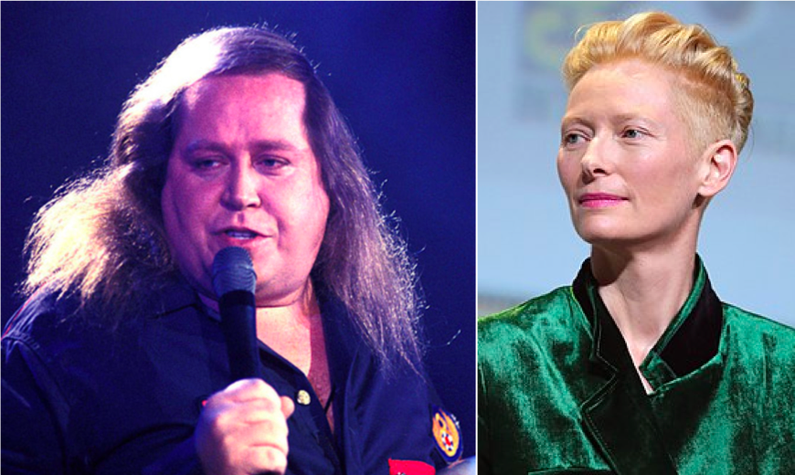

.. _ML_00_Introduction:

==========================================================
Machine Learning: Introduction to Basic Terms and Concepts
==========================================================

---------------

What is Machine Learning?
*************************

Machine Learning is a method of using data to train a classifier; this is called **training data**. The classifier is then provided with new data (also known as **testing data**), and it attempts to distinguish between different classes within the data based on the training data. The classifier's perfomance is judged by its accuracy - how many of the testing data points it managed to correctly classify.

The training data has one or more **features** that are used to train the classifier. These features can be any characteristic; for example, height and hair length. You have probably met several thousand people in your life, and you've seen many thousands more in movies, pictures, and magazines. Over time, you've learned that in general males tend to be taller than females and have shorter hair, which implies that women tend to be shorter and have longer hair. There are of course exceptions: Some males are quite short and have long hair (such as Sam Kinison), while some females are taller than the average male and have short hair (for example, Tilda Swinton). All of these experiences can be thought of as "training data" which you've observed during your life.

  Example of a short man with long hair (Sam Kinison, left) and a tall woman with short hair (Tilda Swinton, right).

Now imagine that I tell you there's a person standing outside the door, and that their height is six feet four inches, and that their hair length is three inches. (The average height for men in the United States, by the way, is five feet, nine inches, with an average hair length somewhere between two and six inches.) What would be your best guess about whether it is a male or female? In this case, given the average height and hair distributions for males and females, it would very likely be a male.

If I now say that there's another person behind the door, and that they are five feet and seven inches tall with a hair length of eight inches, what would you guess? This is a more difficult classification, since both features tend to be somewhere around the middle range for both males and females. We would expect you - the "classifier" in this example - to be less accurate for these "testing data", and more accurate for the testing data that tend towards one end of the distribution.
