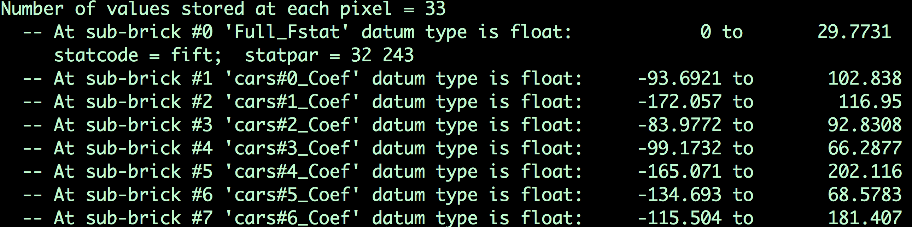
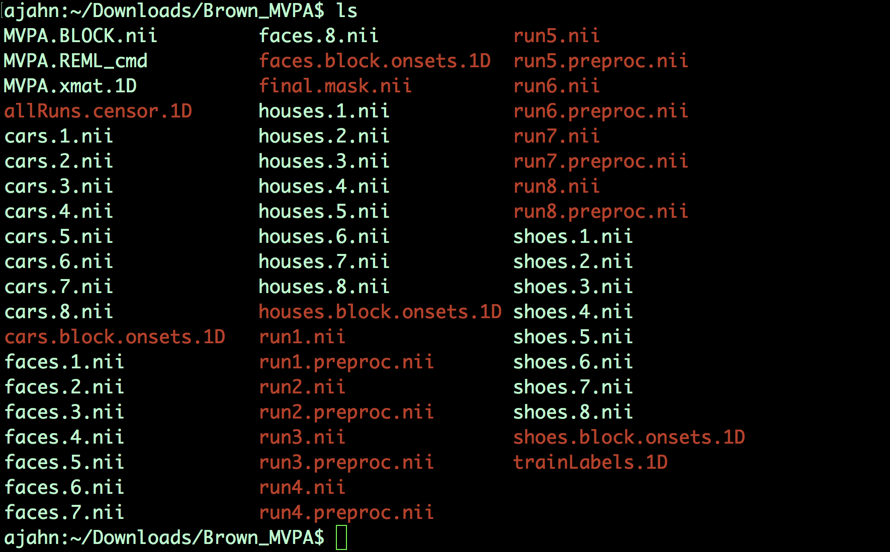
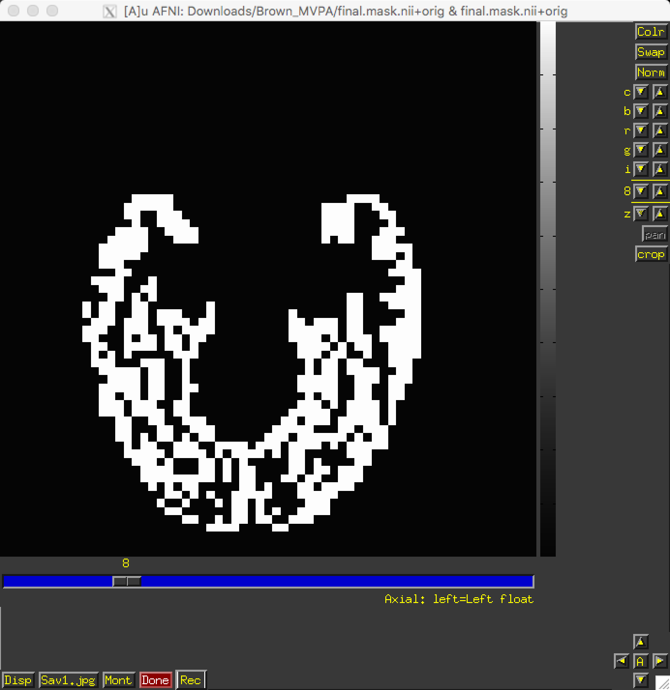

.. _ML_01_Brown_Example:

========================================================================
Machine Learning Tutorial #1: Basic Example with Support Vector Machines
========================================================================

-----------

Overview
********

This tutorial is transcribed almost verbatim from the `Brown University website <https://www.brown.edu/carney/mri/researchers/analysis-pipelines/mvpa>`__; the only additions here will be figures to show the results from certain steps, and to provide clarification where necessary.

The study design, according to the website, was as follows:

  We presented a participant with 4 different types of visual stimuli (cars, shoes, faces, houses) in a blocked design. The participant passively viewed these images (no task was performed). The study consisted of 8 runs, where each run was comprised of four blocks, one for each stimulus category. Within each block there were 10 images from a single simulus condition. The blocks were randomized across each run, and no image was repeated across runs (80 images per category total).
  
This dataset can be downloaded `here <https://drive.google.com/drive/folders/0B141z-GC_3Bdbms5TGlGRU9DRlk>`__. By highlighting all of the items and right-clicking, you can select "Download". This will place the files within your ``Downloads`` folder.
  
Pre-processing
**************

The data for this study has already been preprocessed, which includes sclie-timing correction, motion correction, and spatial smoothing. Note that some studies do not perform spatial smoothing, in order to keep the activation profiles of each voxel as separate as possible; because we are not concerned with detecting the strength of a signal that is there, we do not need to average together the signal of nearby voxels. We will cover this more in a later tutorial, in which you compare the results both with and without smoothing.

Regression Analysis
*******************

The .1D files that were included in the dataset indicate which stimulus class was presented during which run. Using ``3dDeconvolve``, we use the ``stim_times_IM`` option which will estimate the amplitude of the BOLD response for each trial within that stimulus class. Since there were 8 trials for each stimulus class, and 4 stimulus classes, we will have 32 regressors total: 

::

  3dDeconvolve -input run1.preproc.nii run2.preproc.nii run3.preproc.nii run4.preproc.nii run5.preproc.nii run6.preproc.nii run7.preproc.nii run8.preproc.nii \
  -polort 1 \
  -local_times \
  -censor allRuns.censor.1D \
  -num_stimts 4 \
  -stim_times_IM 1 cars.block.onsets.1D 'BLOCK(9,1)' -stim_label 1 cars \
  -stim_times_IM 2 faces.block.onsets.1D 'BLOCK(9,1)' -stim_label 2 faces \
  -stim_times_IM 3 houses.block.onsets.1D 'BLOCK(9,1)' -stim_label 3 houses \
  -stim_times_IM 4 shoes.block.onsets.1D 'BLOCK(9,1)' -stim_label 4 shoes \
  -bucket MVPA.BLOCK.nii
  

Copying and running this code in your Terminal should only take a few moments. The output file, MVPA.BLOCK.nii, contains image volumes (also known as **sub-briks**) for each instance of each regressor. If you type ``3dinfo -verb MVPA.BLOCK.nii``, you will see which sub-briks correspond to which trial for each regressor:

  The contents of the file MVPA.BLOCK.nii. Remember that the first file is indexed as 0; in other words, the first sub-brik in this dataset is "#0 'Full_FStat'", the first sub-brik for the Cars condition is sub-brik #1, which is labeled 'cars#0_Coef', and so on.

We will then extract the sub-briks from each class in the output of 3dDeconvolve, ``MVPA.BLOCK.nii`, using a for-loop. For example, to extract the sub-briks for the Car condition, we can use this line of code:

::

  for a in $(seq 1 8); do 3dTcat -prefix cars.$a.nii MVPA.BLOCK.nii[${a}]; done
  
Which will create 8 files, cars.1.nii, cars.2.nii, all the way until cars.8.nii. (The ``seq`` command creates a string of numbers between the two arguments that are provided; in this case, 1, 2, 3, 4, 5, 6, 7, and 8.) We will use this same command to extract the corresponding sub-briks for the Faces, Houses, and Shoes conditions:

::

  for a in $(seq 9 16); do (( b=`expr $a - 8` )); 3dTcat -prefix faces.$b.nii MVPA.BLOCK.nii[${a}]; done
  for a in $(seq 17 24); do (( b=`expr $a - 16` )); 3dTcat -prefix houses.$b.nii MVPA.BLOCK.nii[${a}]; done
  for a in $(seq 25 32); do (( b=`expr $a - 24` )); 3dTcat -prefix shoes.$b.nii MVPA.BLOCK.nii[${a}]; done
  
In this case, we include another piece of code, ``expr``. Since we want to label each sub-brik we extract as corresponding to the first through the eighth of that condition, we subtract from the sub-brik number that is specified in the ``seq`` command. For example, the first sub-brik of the Faces condition is the ninth one in the MVPA.BLOCK.nii file; by subtracting 8 from 9, we label the first sub-brik as ``faces.1.nii``, and so on for all of the sub-briks in that condition.

When you have run all of the code above, you should see something like this in your directory:

Creating the Training Set
*************************

Now that we have the sub-briks, we will create a **training set** for the classifier. The classifier will then have some experience of what the typical beta map looks like for each of the conditions in our experiment, and will be able to make an educated guess about what condition an unlabeled beta map belongs to.

In order to avoid any ordering confounds, we will select at random beta maps from each condition. This can be done with a random number generator, such as the one in Excel; but for now, we will use the same beta maps that are listed on the Brown website. For example, we will select beta maps 3 through 8 for the Cars condition, leaving beta maps 1 and 2 for the training set:

::

  3dTcat -prefix cars.train.nii cars.3.nii cars.4.nii cars.5.nii cars.6.nii cars.7.nii cars.8.nii
  
This will create a new dataset, ``cars.train.nii`, which contains beta maps 3 throught 8. We will do a similar procedure for the other conditions, selecting different sets of beta maps:

::

  3dTcat -prefix faces.train.nii faces.2.nii faces.8.nii faces.1.nii faces.7.nii faces.4.nii faces.5.nii
  3dTcat -prefix houses.train.nii houses.5.nii houses.3.nii houses.4.nii houses.8.nii houses.6.nii houses.7.nii
  3dTcat -prefix shoes.train.nii shoes.8.nii shoes.7.nii shoes.4.nii shoes.3.nii shoes.6.nii shoes.2.nii
  
We will then concatenate all of those training datasets into a single dataset called ``trainBlock.nii``:

::

  3dTcat -prefix trainBlock.nii cars.train.nii faces.train.nii houses.train.nii shoes.train.nii
  
In another file that was downloaded with the dataset, ``trainLabels.1D``, we find a string of numbers:

::

  1
  1 
  1
  1
  1
  1
  2
  2
  2
  2
  2
  2
  3
  3
  3
  3
  3
  3
  4
  4
  4
  4
  4
  4
  
Since there are 4 classes, we label each of the volumes in our training dataset ``trainBlock.nii`` with a number; in this case, 1's for Cars, 2's for Faces, 3's for Houses, and 4's for Shoes. The numbers are arbitrary - you can label them however you want, as long as the numbers within a category are consistent. You will need to remember these numbers when running the classifier on the testing data, which will return a number for its best guess as to the category for each condition.

Creating the Testing Set
************************

With each training set containing 6 beta maps, the testing set will therefore contain the remaining 2 beta maps for each condition. These are the beta maps that the classifier will use to make a guess as to which condition they belong to: 

::

  3dTcat -prefix cars.test.nii cars.1.nii cars.2.nii
  3dTcat -prefix faces.test.nii faces.3.nii faces.6.nii
  3dTcat -prefix houses.test.nii houses.2.nii houses.1.nii
  3dTcat -prefix shoes.test.nii shoes.5.nii shoes.1.nii

We then combine them into a single testing dataset, called ``testBlock.nii``:

::

  3dTcat -prefix testBlock.nii cars.test.nii faces.test.nii houses.test.nii shoes.test.nii

Creating the Mask
*****************

Just as with ROI analyses for fMRI data, we will want to restrict our analyses to a **mask** indicating which voxels to include for our analysis. Since we are doing a visual recognition task, we will want to restrict our analyses to the visual and temporal lobes of the brain; and, further, to the grey matter voxels of those lobes.

This mask has already been generated for you, in the file ``final.mask.nii``. An axial view shows the voxels that will be used for our classification analysis:

If the mask had not already been generated for you, other options would be to either 1) Create a spherical ROI based on the results of another study examining a similar region; 2) create a mask using regions defined by an atlas; or 3) Process the anatomical image through :ref:`FreeSurfer <FreeSurfer_Introduction>` and use the parcellations generated by recon-all. The choice is up to you.

Training and Testing the Classifier
***********************************

Now that we have testing data for the classifier, we will show each beta map to it, along with the labels indicating which condition that beta belongs to - analogous to showing a person pictures of several different males and females to get a sense of what each category looks like. To do this, we will be using a **support vector machine** that attempts to draw a hyperplane between the pattern of voxels that best classifies each category.

To train the model, we provide the training dataset, the training labels, and the mask for our analysis; these are indicated by the options ``-trainvol``, ``-trainlabels``, and ``-mask``, respectively. To output the model generated by the support vector machine, we will use the ``-model`` option:

::

  3dsvm -trainvol trainBlock.nii \
  -trainlabels trainLabels.1D \
  -model trainSet.model.nii \
  -mask final.mask.nii

We will then input this into ``3dsvm`` again, using the testBlock.nii file as our testing volume:

::

  3dsvm -testvol testBlock.nii \
  -model trainSet.model.nii \
  -classout \
  -predictions exemplar
  
  
