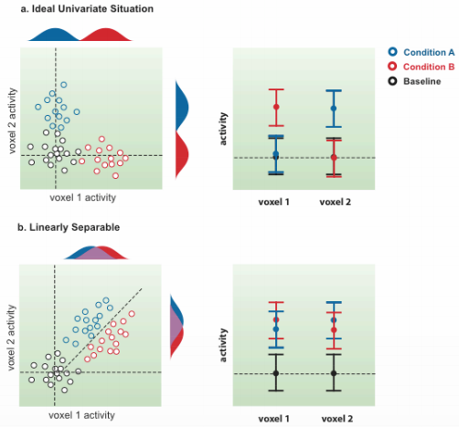
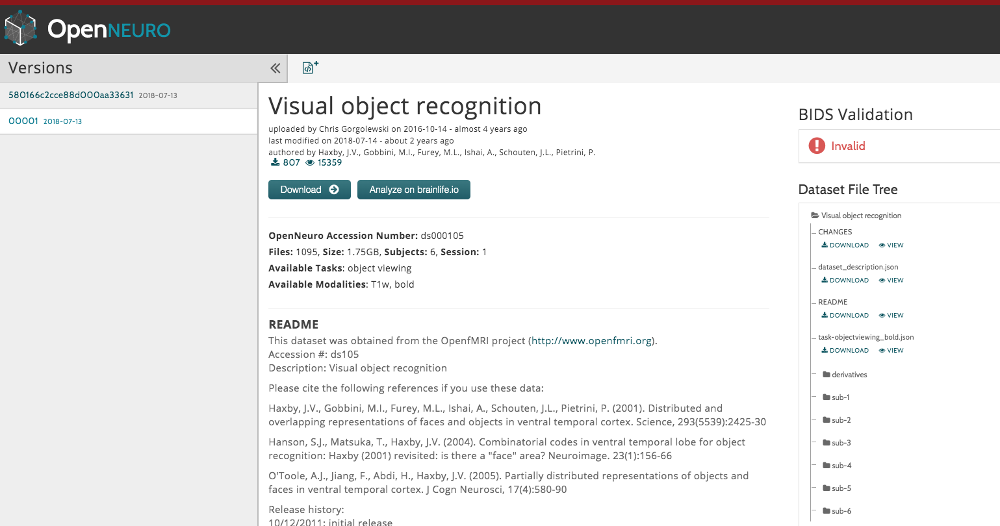

.. _ML_02_Haxby_Intro_Download:

===============================================
Machine Learning Tutorial #2: The Haxby Dataset
===============================================

-----------

Overview
********

During the 1990s, fMRI studies focused on activation - which region of the brain responded to particular stimuli. fMRI was a new method, and researchers were able to use it to non-invasively map which regions of the brain responded to touch, pictures, noises, and other basic stimuli. These experiments measured the *amplitude* of the BOLD response to each of the different stimuli, and then compared the amplitudes between conditions to see which one elicited greater brain activity.

In 2001, James Haxby conducted an experiment that instead focused on *patterns* of activity instead of the amplitude itself - for example, certain stimuli may elicit a specific pattern that can be detected by a classifier. If that pattern is consistent and unique, we will be able to distinguish that pattern from that elicited by another stimulus.

  Figure 1 from Cox & Savoy, 2003. In a univariate analysis, we test whether one condition shows greater activity than another condition; in this case, as we go along the y-axis for condition A, the activity increases for condition A but not for condition B, and vice versa as we go along the x-axis. However, it is not uncommon for an experiment to show high activity to both condition A and condition B for a given cluster of voxels. In this case, the activation for both conditions may be virtually identical, but the pattern of activity may be different.

Downloading the Data
********************

The dataset can be downloaded `here <https://openneuro.org/datasets/ds000105/versions/00001>`__ from the OpenNeuro website. If clicking on the Download button doesn't work, use the AWS option by following the instructions located `here <https://aws.amazon.com/cli/>`__, and then typing:

::

  aws s3 sync --no-sign-request s3://openneuro.org/ds000105 ds000105-download/
  
Once you have downloaded the data, move it to your Desktop and rename it by typing:

::

  mv ~/Downloads/ds000105 ~/Desktop/Haxby_Data
  
  
Video
*****

To see how to download the data, click `here <https://www.youtube.com/watch?v=X0O7wSqRYdI>`__
  
Next Steps
**********

Now that you have downloaded the data, we are ready to **preprocess** it using SPM. To see how to do that, click the ``Next`` button.
