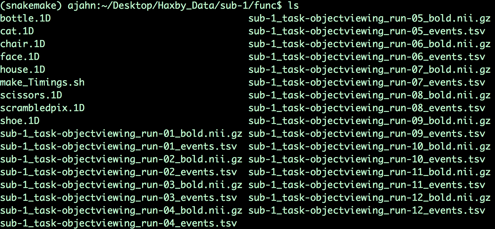

.. _ML_03_Haxby_Preprocessing:

===========================================
Machine Learning Tutorial #3: Preprocessing
===========================================

-----------

Overview
********

The preprocessing steps are mostly the same as with analyzing a typical fMRI dataset; however, we will omit the **smoothing** step to avoid blurring the signal between voxels. While this is useful in univariate analyses that focus on averaging together nearby signal, in this case we want to keep the signal in each voxel as distinct as possible. This will help the classifier distinguish between the patterns elicited by different stimuli, if the patterns exist.

Another step we may choose to remove is **normalization**. In a typical univariate study, normalization is useful for making sure that the activation is more or less in the same region across all of the subjects; we can also report our results using standardized coordinates. For MVPA analysis, however, we have the option of doing all of our analyses in **native space** - that is, without normalizing the data. By using subject-specific ROIs, we will generate a single classification number per condition, which can then be averaged across subjects.

The Preprocessing Pipeline
**************************

And view the output with:

::

  figure; h= heatmap(results.confusion_matrix.output{1})
  

.. note::

  The following are sketches for doing an individually modulated analysis in AFNI. (Move this to a different appendix chapter?)

Creating the Timing Files
^^^^^^^^^^^^^^^^^^^^^^^^^

Just as with our traditional fMRI analyses, we will need to create timing files that indicate which condition was presented at what time. These are found in the ``func`` folder for each subject with one timing file per run, with a ".tsv" extension. Within the file ``sub-1_task_objectviewing_run-01_events.tsv`` for example, we see the following lines:

::

  onset   duration        trial_type
  12.000  0.500   scissors
  14.000  0.500   scissors
  16.000  0.500   scissors
  18.000  0.500   scissors
  20.000  0.500   scissors
  22.000  0.500   scissors
  24.000  0.500   scissors
  26.000  0.500   scissors
  28.000  0.500   scissors
  30.000  0.500   scissors
  32.000  0.500   scissors
  34.000  0.500   scissors
  48.000  0.500   face
  50.000  0.500   face
  52.000  0.500   face
  54.000  0.500   face
  56.000  0.500   face
  58.000  0.500   face
  60.000  0.500   face
  62.000  0.500   face
  64.000  0.500   face
  66.000  0.500   face
  68.000  0.500   face
  70.000  0.500   face
  
The timings go on to include all of the other conditions, of which there are eight total: Bottles, Cats, Chairs, Faces, Houses, Scissors, Scrambled Pictures (labeled as ScrambledPix), and Shoes. Each condition was presented in a block containing several individual trials of the same stimulus type presented one after another, with each block lasting for 24 seconds. In order to write these timings into a format that AFNI understands, we will use the following code in the ``func`` directory for subject 1:

::

  #!/bin/bash
  for cond in bottle cat chair face house scissors scrambledpix shoe; do
          for i in `seq -w 1 12`; do
                  cat sub-1_task-objectviewing_run-${i}_events.tsv | awk -v i="$cond" '{if ($3==i) print $1}' | head -1 >> ${cond}.1D
          done
  done
  
This loops over all of the runs in the experiment (12 total) and all of the conditions, extracting the first timestamp for the condition that is presented and placing it in a corresponding 1D file. For example, the timing file for ``bottle.1D`` looks like this:

::

  228.000
  192.000
  156.000
  228.000
  84.000
  228.000
  264.000
  156.000
  228.000
  264.000
  120.000
  12.000
  
Later, we will use options in the regression command ``3dDeconvolve`` to indicate that these are **local times**, one timestamp per run, and that each one lasted for 24 seconds. For now, run the above code to create a 1D timing file for each condition. When it is done, you should see something like this in the folder ``sub-1/func``:

Creating the AFNI_proc File
^^^^^^^^^^^^^^^^^^^^^^^^^^^

Next, we will create a preprocessing file using AFNI's afni_proc.py command. Note that we include all of the usual preprocessing blocks *except* blurring, which smooths the data:

::

  #!/bin/tcsh

set subj=sub-1

  afni_proc.py -subj_id $subj -script proc.$subj -scr_overwrite -blocks tshift                                                  \
     align tlrc volreg mask scale regress -copy_anat                                                                  \
     $PWD/{$subj}/anat/{$subj}_T1w.nii.gz                     \
     -dsets                                                                                                                \
     $PWD/{$subj}/func/{$subj}_task-objectviewing_run-*_bold.nii.gz \
     -tcat_remove_first_trs 0 -align_opts_aea -giant_move -tlrc_base                                                       \
     MNI_avg152T1+tlrc -volreg_align_to MIN_OUTLIER -volreg_align_e2a                                                      \
     -volreg_tlrc_warp -regress_local_times -regress_stim_types IM -regress_apply_mask -regress_stim_times                                                                 \
     $PWD/{$subj}/func/bottle.1D                          \
     $PWD/{$subj}/func/cat.1D                        \
     $PWD/{$subj}/func/chair.1D                        \
     $PWD/{$subj}/func/face.1D                        \
     $PWD/{$subj}/func/house.1D                        \
     $PWD/{$subj}/func/scissors.1D                        \
     $PWD/{$subj}/func/scrambledpix.1D                        \
     $PWD/{$subj}/func/shoe.1D                        \
     -regress_stim_labels bottle cat chair face house scissors scrambledpix shoe -regress_basis 'BLOCK(24,1)'                                                \
     -regress_censor_motion 0.3 -regress_motion_per_run -regress_opts_3dD                                                  \
     -local_times -jobs 8 -regress_make_ideal_sum sum_ideal.1D -regress_est_blur_epits                                                  \
     -regress_est_blur_errts -regress_run_clustsim no
     
As we saw in the previous tutorial analyzing the Brown data, we will use the option ``-regress_stim_types IM`` to Individually Modulate each condition; that is, estimate a separate beta map for each trial within that condition. These will then be used as training and testing maps for our classifier. Also note that we use the basis function BLOCK to model each condition as a 24-second boxcar regressor.

Now run this script from the folder ``Haxby_Data`` which contains all of the individual subject folders. You can either copy and paste the code above directly into the terminal, or place it into a text file, save it as "Haxby_proc.sh", and type:

::

  tcsh Haxby_proc.sh
  
This in turn will generate a file called "proc.sub-1". The only edit I would make is on line 148, by adding the ``-init_xform`` option to the end of the ``@auto_tlrc`` command:

::

  @auto_tlrc -base MNI_avg152T1+tlrc -input sub-1_T1w_ns+orig -no_ss -init_xform AUTO_CENTER
  
Also, change the line ``-bucket`` to ``-cbucket`` to output only the coefficients (i.e., beta weights) for each regressor in the model. This will make it easier to write the script for extracting the beta weights.
  
Then, run the script by typing:

  tcsh -xef proc.sub-1
  
After about half an hour, you should see all of the files output into the folder ``sub-1.results``. You can do QA checks by navigating into the directory and typing:

::

  afni_open -b sub-1.results/QC_sub-1/index.html
  
To check registration, normalization, and any volumes censored due to motion.

Extracting the Beta Maps
************************

To extract the beta maps from the output statistics file, ``stats.sub-1+tlrc``, we can use the same for-loop structure that we used for the Brown data:

::

  for a in $(seq 48 59); do (( b =`expr $a - 47` )); 3dTcat -prefix bottle.$b.nii stats.sub-1+tlrc[${a}]; done
  for a in $(seq 60 71); do (( b =`expr $a - 59` )); 3dTcat -prefix cat.$b.nii stats.sub-1+tlrc[${a}]; done
  for a in $(seq 72 83); do (( b =`expr $a - 71` )); 3dTcat -prefix chair.$b.nii stats.sub-1+tlrc[${a}]; done
  for a in $(seq 84 95); do (( b =`expr $a - 83` )); 3dTcat -prefix face.$b.nii stats.sub-1+tlrc[${a}]; done
  for a in $(seq 96 107); do (( b =`expr $a - 95` )); 3dTcat -prefix house.$b.nii stats.sub-1+tlrc[${a}]; done
  for a in $(seq 108 119); do (( b =`expr $a - 107` )); 3dTcat -prefix scissors.$b.nii stats.sub-1+tlrc[${a}]; done
  for a in $(seq 120 131); do (( b =`expr $a - 119` )); 3dTcat -prefix scrambledpix.$b.nii stats.sub-1+tlrc[${a}]; done
  for a in $(seq 132 143); do (( b =`expr $a - 131` )); 3dTcat -prefix shoe.$b.nii stats.sub-1+tlrc[${a}]; done
  
We will then use the even-numbered beta maps for training data, and the odd-numbered maps for testing:

::

  3dTcat -prefix bottle.train.nii bottle.1.nii bottle.3.nii bottle.5.nii bottle.7.nii bottle.9.nii bottle.11.nii
  3dTcat -prefix cat.train.nii cat.1.nii cat.3.nii cat.5.nii cat.7.nii cat.9.nii cat.11.nii
  3dTcat -prefix chair.train.nii chair.1.nii chair.3.nii chair.5.nii chair.7.nii chair.9.nii chair.11.nii
  3dTcat -prefix face.train.nii face.1.nii face.3.nii face.5.nii face.7.nii face.9.nii face.11.nii
  3dTcat -prefix house.train.nii house.1.nii house.3.nii house.5.nii house.7.nii house.9.nii house.11.nii
  3dTcat -prefix scissors.train.nii scissors.1.nii scissors.3.nii scissors.5.nii scissors.7.nii scissors.9.nii scissors.11.nii
  3dTcat -prefix scrambledpix.train.nii scrambledpix.1.nii scrambledpix.3.nii scrambledpix.5.nii scrambledpix.7.nii scrambledpix.9.nii scrambledpix.11.nii
  3dTcat -prefix shoe.train.nii shoe.1.nii shoe.3.nii shoe.5.nii shoe.7.nii shoe.9.nii shoe.11.nii
  
  3dTcat -prefix trainBlock.nii *train.nii

  3dTcat -prefix bottle.test.nii bottle.2.nii bottle.4.nii bottle.6.nii bottle.8.nii bottle.10.nii bottle.12.nii
  3dTcat -prefix cat.test.nii cat.2.nii cat.4.nii cat.6.nii cat.8.nii cat.10.nii cat.12.nii
  3dTcat -prefix chair.test.nii chair.2.nii chair.4.nii chair.6.nii chair.8.nii chair.10.nii chair.12.nii
  3dTcat -prefix face.test.nii face.2.nii face.4.nii face.6.nii face.8.nii face.10.nii face.12.nii
  3dTcat -prefix house.test.nii house.2.nii house.4.nii house.6.nii house.8.nii house.10.nii house.12.nii
  3dTcat -prefix scissors.test.nii scissors.2.nii scissors.4.nii scissors.6.nii scissors.8.nii scissors.10.nii scissors.12.nii
  3dTcat -prefix scrambledpix.test.nii scrambledpix.2.nii scrambledpix.4.nii scrambledpix.6.nii scrambledpix.8.nii scrambledpix.10.nii scrambledpix.12.nii
  3dTcat -prefix shoe.test.nii shoe.2.nii shoe.4.nii shoe.6.nii shoe.8.nii shoe.10.nii shoe.12.nii
  
  3dTcat -prefix testBlock.nii *test.nii
  
We will also create a file, ``trainLabels.1D``, that contains a number indexing which volume in the dataset ``trainBlock.nii`` belongs to which category. For example, 1's can represent the "bottle" beta maps, 2's can represent the "cat" beta maps, and so on. Open a text editor such as TextWrangler or the vi editor, and enter six 1's, one per row, followed by six 2's, and so on, up until the number 8:

::

  1
  1
  1
  1
  1
  1
  2
  2
  2
  2
  2
  2
  
etc.
  
Creating the Mask
*****************

In the original Haxby study, the authors created masks (called volumes of interest, or VOIs, in their paper), using the following criteria:

  Volumes of interest (VOI) were drawn on the high-resolution structural images to identify ventral temporal, lateral temporal, and ventrolateral occipital cortex. The VOI for ventral temporal cortex extended from 70 to 20 mm posterior to the anterior commissure in Talairach brain atlas coordinates (41) and consisted of the lingual, parahippocampal, fusiform, and inferior temporal gyri. The VOI for lateral temporal cortex also extended from 70 to 20 mm posterior to the anterior commissure and consisted of the middle temporal gyrus and both banks of the superior temporal sulcus. The VOI for ventrolateral occipital cortex extended from the occipital pole to 70 mm posterior to the anterior commissure and consisted of the lingual, fusiform, inferior occipital, and middle occipital gyri. Voxels within these VOIs that were significantly object-selective (P , 1026, uncorrected) were used for the analysis of within-category and between-category correlations.
  
These regions were chosen because they usually show a BOLD response to faces and to objects. In particular, the ventral region of the temporal cortex can be parcellated into two functional regions: The Fusiform Face Area (FFA) and the Parahippocampal Place Area (PPA).

Creating ROIs from FreeSurfer
*****************************

Since normalization can introduce unwanted interpolations into the data, we can run our ROI analyses in native space using the parcellations from FreeSurfer. Once you've run recon-all on a subject, convert the annotations to individual label files using ``mri_annotation2label``:

::

  mri_annotation2label --subject Dev03 --hemi lh --outdir label
  
This will store all of the labels as ROIs in a directory called ``label``. We will then need to register the anatomical image to the subject that was run through recon-all:

::

  tkregister2 --mov rt1spgr_208sl.nii --noedit --s Dev03 --regheader --reg register.dat
  
We can then pick whichever label we want to convert to volumetric space. For example, if I wanted to convert the left superior temporal gyrus to volumetric space, I would type:

::

  mri_label2vol --label label/lh.superiortemporal.label --temp rt1spgr_208sl.nii --subject Dev03 --hemi lh --o Dev03_lh_superiorTemporal.nii --proj frac 0 1 .1 --fillthresh .3 --reg register.dat
  
You can then view the output image "Dev03_lh_superiorTemporal.nii" overlaid on the anatomical image to make sure it is aligned with the structure you intended.

.. note::

  Sometimes the header of the anatomical image will say that it is in normalized space, even if it hasn't been warped. To correct this, use a command like 3drefit to fix the problem:
  
  3drefit -space ORIG anatomical.nii

Then run the classification script (ADD HERE)

