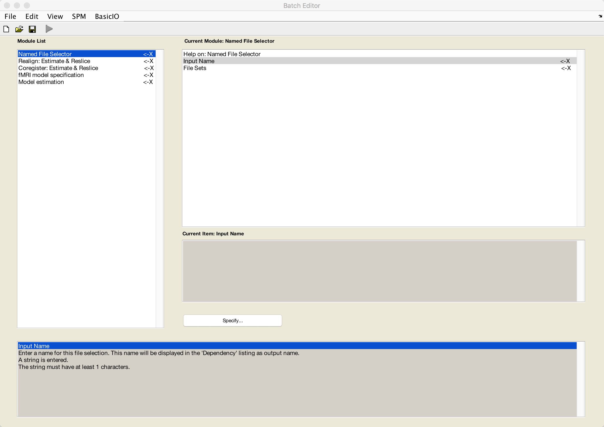
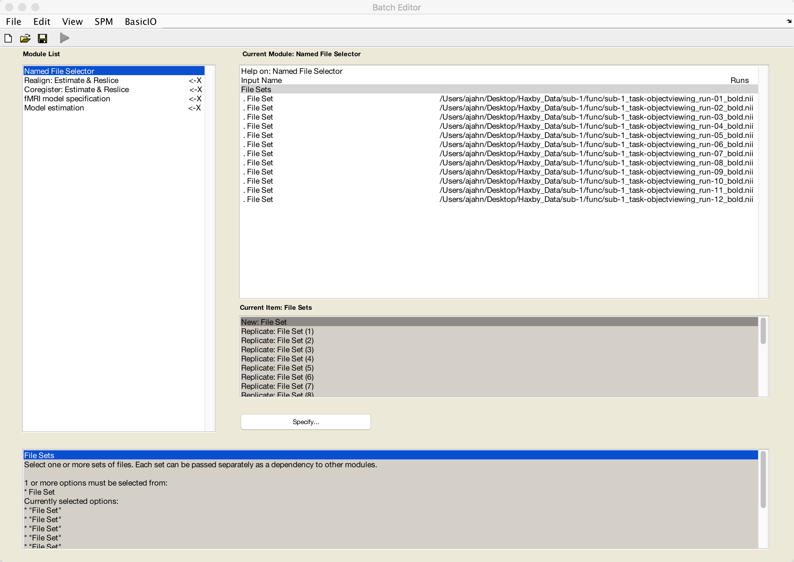
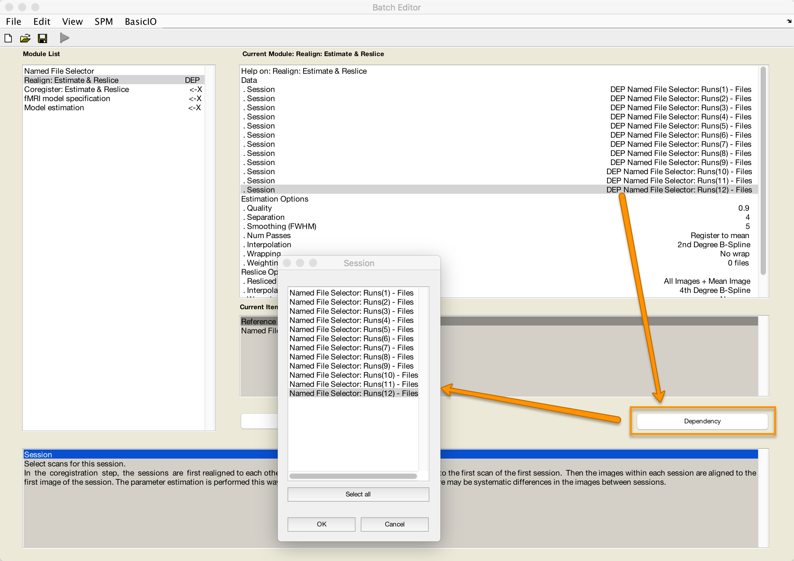
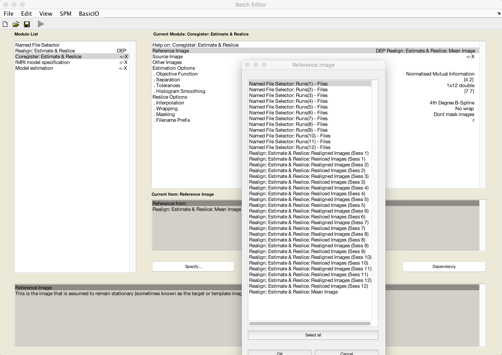
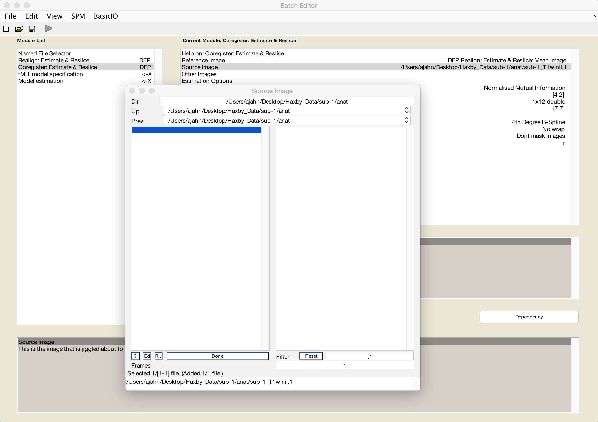
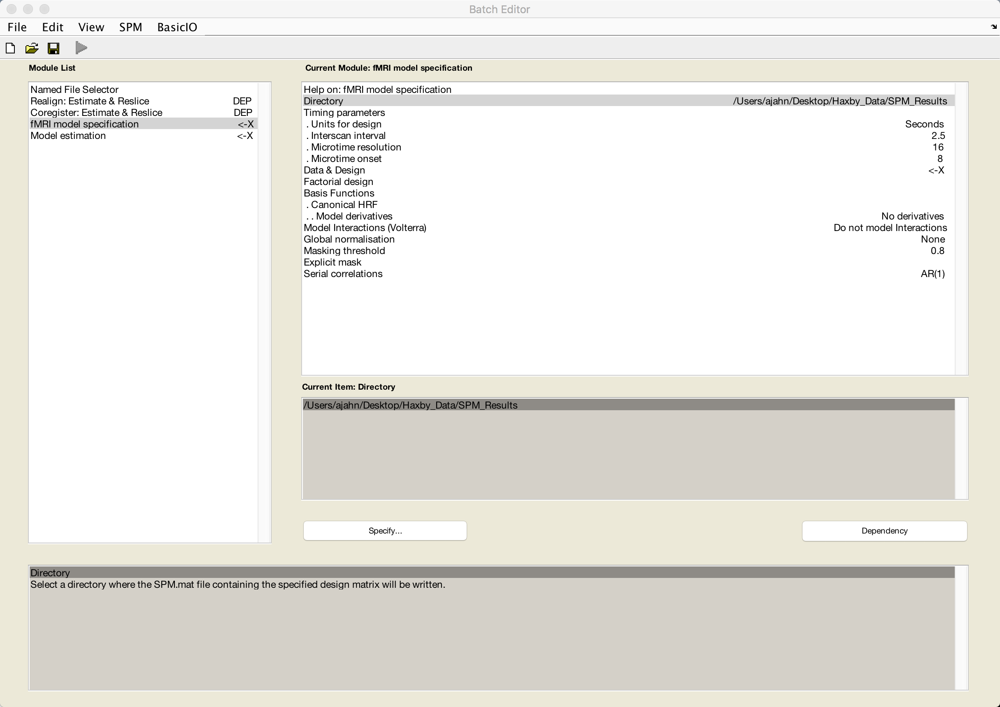
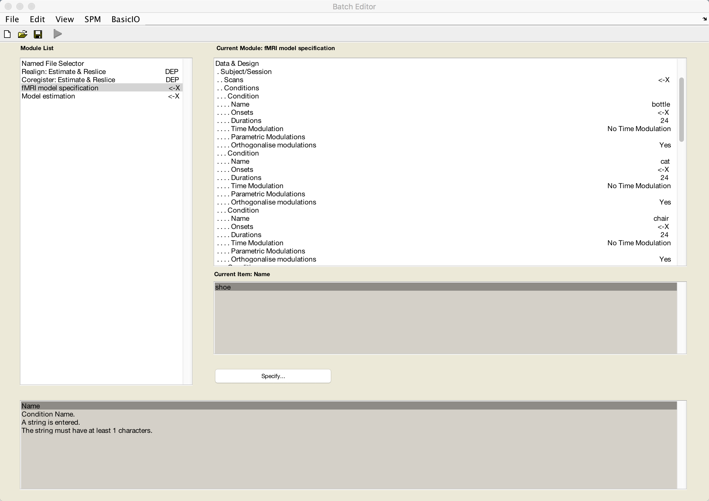
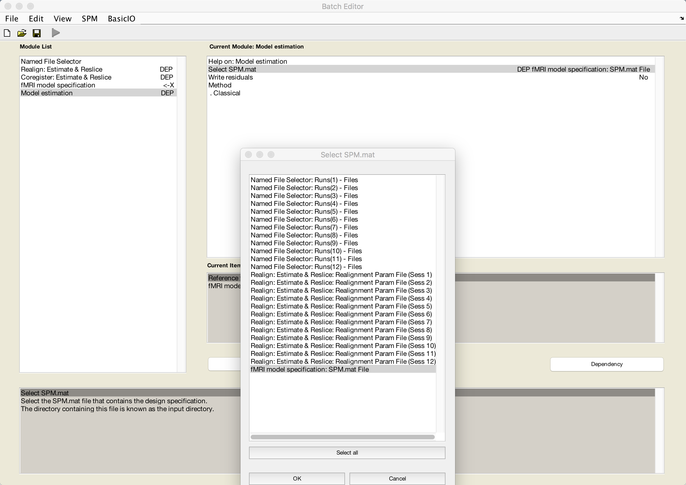

.. _ML_03_Haxby_Preprocessing:

===========================================
Machine Learning Tutorial #3: Preprocessing
===========================================

-----------

Overview
********

The preprocessing steps are mostly the same as with analyzing a typical fMRI dataset; however, we will omit the **smoothing** step to avoid blurring the signal between voxels. While this is useful in univariate analyses that focus on averaging together nearby signal, in this case we want to keep the signal in each voxel as distinct as possible. This will help the classifier distinguish between the patterns elicited by different stimuli, if the patterns exist.

Another step we may choose to remove is **normalization**. In a typical univariate study, normalization is useful for making sure that the activation is more or less in the same region across all of the subjects; we can also report our results using standardized coordinates. For MVPA analysis, however, we have the option of doing all of our analyses in **native space** - that is, without normalizing the data. By using subject-specific ROIs, we will generate a single classification number per condition, which can then be averaged across subjects.

The Preprocessing Pipeline
**************************

To reproduce the Haxby results, we will keep our preprocessing to a minimum, avoiding interpolation wherever we can. To that end, we will include only the following two steps:

1. Motion correction and realignment of the functional volumes; and

2. Coregistration of the anatomical image to the functional data.

Note that this pipeline excludes slice-timing correction, smoothing, and normalization.

From the Haxby_Data directory, open a Matlab terminal and type ``spm fmri`` to open the GUI. Then click on ``Batch`` and select the following modules:

* BasicIO -> File/Dir Operations -> File Operations -> Named File Selector
* SPM -> Spatial -> Realign -> Realign: Estimate & Reslice
* SPM -> Spatial -> Coregister -> Coregister: Estimate & Reslice
* SPM -> Stats -> fMRI model specification
* SPM -> Stats -> Model estimation

When you are done, the batch editor window should look like this:

We will now review each of these modules in turn.

Named File Selector
^^^^^^^^^^^^^^^^^^^

First, enter a label of your choosing in the ``Input Name`` field. For this tutorial, we will use the label ``Runs``.

For the File Sets, keep clicking on ``New: File Set`` until you have 12 sets total. Double-click on each set, selecting each run consecutively until you have loaded runs 1-12 of the dataset.

Realign: Estimate & Reslice
^^^^^^^^^^^^^^^^^^^^^^^^^^^

Similar to the Named File Selector module, highlight the ``Data`` field and select ``New: Session`` Until you have 12 sessions total. For each session that you highlight, click the ``Dependency`` button and select the corresponding run. For example, the first session will be ``Runs(1) - Files``, the second session will be ``Runs(2) - Files``, and so on.

Coregister: Estimate & Reslice
^^^^^^^^^^^^^^^^^^^^^^^^^^^^^^

The last preprocessing step we will do is coregistration between the anatomical and functional data. Since we want to keep any interpolations of the functional data to a minimum, we will use the mean functional volume as a reference image (i.e., the image that will remain stationary) and the anatomical volume as the source image (i.e., the image that will be moved and interpolated to match the reference image).

Click on ``Reference Image``, and then the ``Dependency`` button. Select the mean image, and click ``OK``.

Then click on ``Source Image``, navigate to sub-1's ``anat`` directory, and select the file ``sub-1_T1w.nii``:

Specifying the GLM
******************

Now that we have set up our motion correction and coregistration, we are done with preprocessing and ready to begin specifying our GLM. To prepare for this, go back to the Matlab terminal, make sure you are in the ``Haxby_Data`` directory, and type ``mkdir SPM_Results_1``.

This directory will be the input for the ``Directory`` field in the ``fMRI model specification`` module. Also set the Units for design to ``Seconds`` and the Interscan interval to ``2.5``:

We will now use the "Replicate" feature of the GUI to construct the rest of our model. With 12 runs and 8 conditions, specifying each by hand would be tedious. Instead, click on ``Data & Design`` and select ``New: Subject/Session``. When you click on the ``Conditions`` field, select ``New: Condition`` to create empty fields for that condition. Double-click on ``Durations`` and enter a value of ``24``, indicating that a boxcar regressor of 24 seconds will be used to model that condition.

Click on ``Conditions`` again, and then select ``Replicate: Condition (1)`` until there are 8 conditions total. Then fill in the name of each condition, one each, with the corresponding condition names:

::

  bottle
  cat
  chair
  face
  house
  scissors
  scrambledpix
  shoe
  
The conditions should look something like this:

Now go back to the ``Data & Design`` field, and select ``Replicate: Subject/Session (1)`` until you have 12 sessions total. For each of the Scans fields, select the corresponding resliced dependency from the Realignment step.

Once you’ve finished doing this, select ``Model estimation``, highlight the ``Select SPM.mat`` field, and select the dependency ``fMRI model specification: SPM.mat File``:

If you wanted to finish filling in all of the fields you need to run the batch from the GUI, you could go back to the fMRI model specification module and enter by hand each of the timings for each condition in each run. This would be tedious to do for each subject, even though we only have six individuals in the current dataset; instead, we will click on ``File -> Save Batch and Script`` and save the script to the ``Haxby_Data`` directory as ``Haxby_Script.m``.

Next Steps
**********

Now that we have a template script to work with, we will load the timings for each condition using Matlab code. To see how to do that, click the ``Next`` button.

