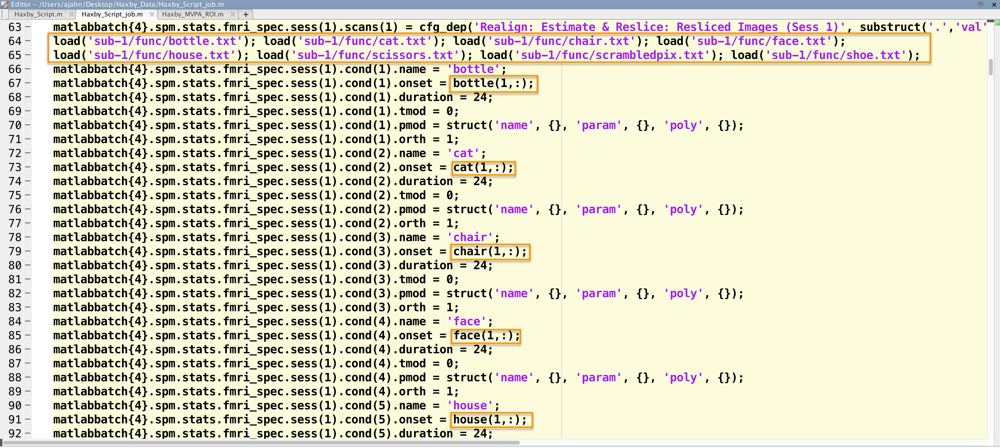
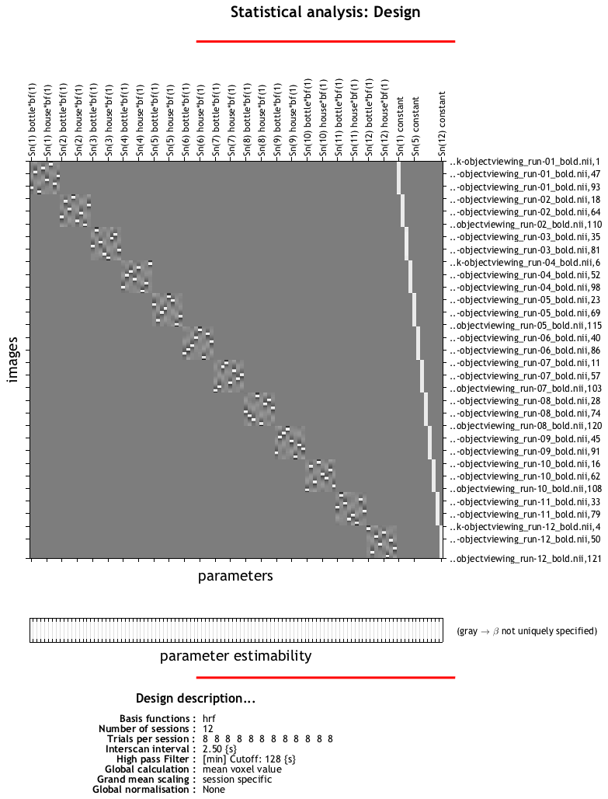

.. _ML_04_Haxby_Timing:

=======================================================
Machine Learning Tutorial #4: Creating the Timing Files
=======================================================

-------------

Overview
********

Once we have created a template, we will need to change the timings for each run. Each subject in the dataset has 12 timing files in their ``func`` folder, corresponding to each run of functional data. For example, the first few lines of the file ``sub-1_task_objectviewing_run-01_events.tsv`` in the folder ``sub-1/func`` looks like this:

::

  onset   duration        trial_type
  12.000  0.500   scissors
  14.000  0.500   scissors
  16.000  0.500   scissors
  18.000  0.500   scissors
  20.000  0.500   scissors
  22.000  0.500   scissors
  24.000  0.500   scissors
  26.000  0.500   scissors
  28.000  0.500   scissors
  30.000  0.500   scissors
  32.000  0.500   scissors
  34.000  0.500   scissors
  48.000  0.500   face
  50.000  0.500   face
  52.000  0.500   face
  54.000  0.500   face
  56.000  0.500   face
  58.000  0.500   face
  60.000  0.500   face
  62.000  0.500   face
  64.000  0.500   face
  66.000  0.500   face
  68.000  0.500   face
  70.000  0.500   face
  
According to the Haxby et al. 2001 paper, each condition lasted for 24 seconds, and this is reflected in the Duration field that we specified in the last chapter. We will therefore need to extract the first onset time for each condition for each run, and concatenate them into a single timing file per condition. Later, we will use this timing file to fill in the remaining fields of our script.

The following code will extract the first onset time for each condition automatically, looping over all of the subjects in the dataset. You can either copy and paste this into the terminal, first making sure you are in the directory ``Haxby_Data`` that contains all of the subjects; else, you can copy it into a file, name it ``make_Timings.sh``, and run it by typing ``bash make_Timings.sh``:

::

  #!/bin/bash
  for subj in sub-1 sub-2 sub-3 sub-4 sub-5 sub-6; do
    cd ${subj}/func
      for cond in bottle cat chair face house scissors scrambledpix shoe; do
        if [ -f "$cond.txt" ]; then
          rm ${cond}.txt
        fi
            for i in `seq -w 1 12`; do
                    cat ${subj}_task-objectviewing_run-${i}_events.tsv | awk -v i="$cond" '{if ($3==i) print $1}' | head -1 >> ${cond}.txt
            done
      done
    cd ../..
  done
  
  (Note that errors for subject 5 run 12 are expected, and will be dealt with later.)
  
This will generate files labeled ``bottle.txt``, ``cat.txt``, and so on, one for each condition, and place it in the appropriate subject's ``func`` folder. The contents of sub-1's ``bottle.txt`` file, for example, will look like this:

::

  228.000
  192.000
  156.000
  228.000
  84.000
  228.000
  264.000
  156.000
  228.000
  264.000
  120.000
  12.000
  
Note that these onset times are relative to the start of each run. For example, the first value of 228.000 means that the "bottle" condition occurred 228 seconds into the first run; the next value indicates that 192.000 seconds into the second run was when the "bottle" condition was next presented; and so on.

Modifying the Script
********************

In the previous chapter, we created a template script from the SPM GUI and labeled it ``Haxby_Script``. This created two separate scripts, ``Haxby_Script_job.m`` which contains the SPM code that runs all of the commands specified in the GUI, and ``Haxby_Script.m``, which contains the command ``spm_jobman`` which executes the file ``Haxby_Script_job.m``. We will be editing the latter in order to read the timing files that we just created; to open it, from the Matlab terminal type ``open Haxby_Script_job.m`` (or click the ``Open`` button and select the script).

.. note::

  This section draws upon many of the same principles discussed in the SPM chapter on :ref:`scripting <SPM_06_Scripting>`. If you haven't already, it may help to work through the entire SPM tutorial in order to develop a foundation for what we will learn next.
  
Around line 58 is where the fMRI specification module is defined. Before the onset times are defined, enter the following code (I place this at lines 64-65 in my script):

::

  load('sub-1/func/bottle.txt'); load('sub-1/func/cat.txt'); load('sub-1/func/chair.txt'); load('sub-1/func/face.txt'); 
  load('sub-1/func/house.txt'); load('sub-1/func/scissors.txt'); load('sub-1/func/scrambledpix.txt'); load('sub-1/func/shoe.txt')
  
This will load each text file for ``sub-1`` into a variable. Usually the variable is defined by typing something like ``x=load(bottle.txt)``, which assigns the values in ``bottle.txt`` to ``x``. If no variable is defined on the left side of the equation, then the variable will default to the name of the text file that is loaded. In this case, the variables will be labeled ``bottle``, ``cat``, and so on.

Remember that when we created this script in the GUI, we left the onset times undefined. In the script, you will see the string ``<UNDEFINED>`` that was not filled in from the GUI; we will replace these with the appropriate values from the text files that we just loaded.

For example, the first onset field in my script is at line 67. Since this is the onset time for the ``bottle`` condition for run 1, I will need to extract the first row of the file ``bottle.txt``. I can assign it to this field by replacing ``<UNDEFINED>`` with ``bottle(1,:)``. (You can double-check what value is being assigned by typing ``bottle(1,:)`` at the Matlab terminal.) We will then do this for the other conditions as well, which you can see in the figure below:

  Snapshot of part of the script to analyze the Haxby dataset. The timing files are loaded, and then the appropriate line is extracted and inserted into the onset times field for each run.
  
These need to be replaced for each condition for the first run, and then done for each of the other runs. Again, this is tedious, but you will see that once we've done it once, with slight modifications we can run it for all of the other subjects. When we fill in the onset times for the other fields, we will need to extract the correct row; for the second run, for example, the code to extract the onset times for the bottle condition would be ``bottle(2,:)``. 

.. note::

  If you are uncertain about how to fill in the rest of the fields, a copy of the script can be downloaded `here <https://github.com/andrewjahn/MachineLearning/blob/main/Haxby_Script_job.m>`__.
  
Lastly, add this line to the end of the script in order to run the code:

::

  spm_jobman('run', matlabbatch)
  
And then run the script from the terminal by tying the name of the script:

::

  Haxby_Script_job
  
It should take about an hour to run.

Video
*****

For an overview of how to create the timing files for this study, click `here <https://www.youtube.com/watch?v=Fv3KAPW8Kd0>`__.

Next Steps
**********

When the script has finished, you should see a design matrix that looks like this:

Each run should look like a separate square, with the tiny white squares within each run representing a block for each condition. Each of these blocks has been estimated as a separate beta map, which we will use as both training and testing data for our classifier. To learn how to do that, click the ``Next`` button.
