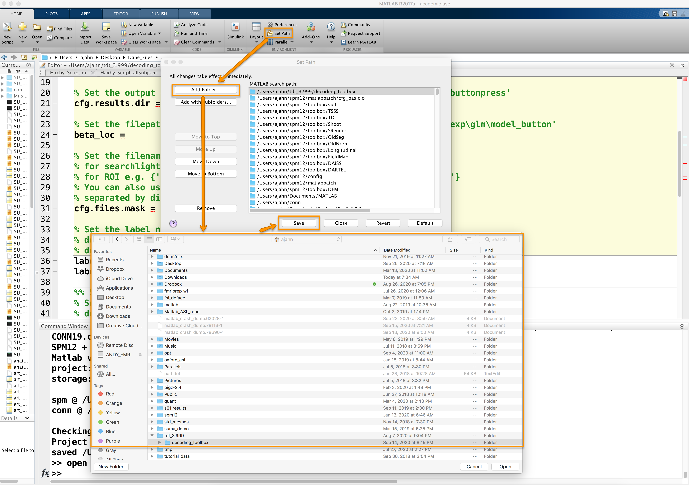
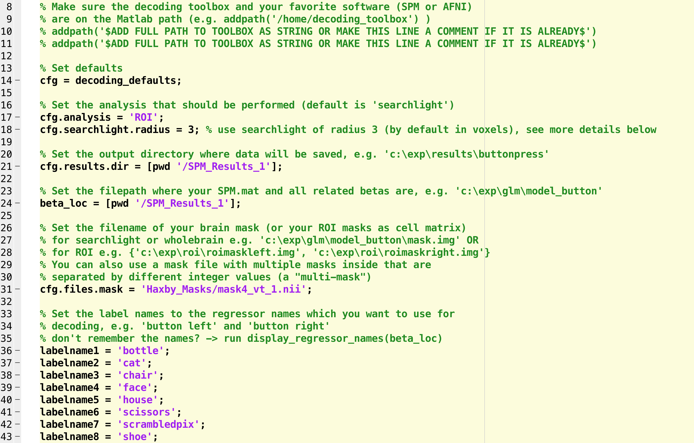
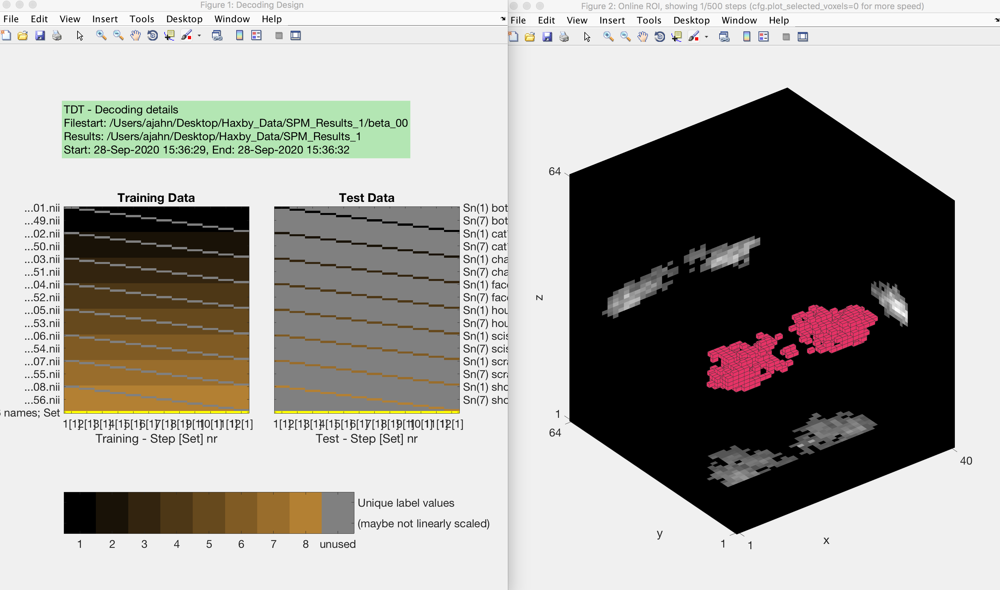
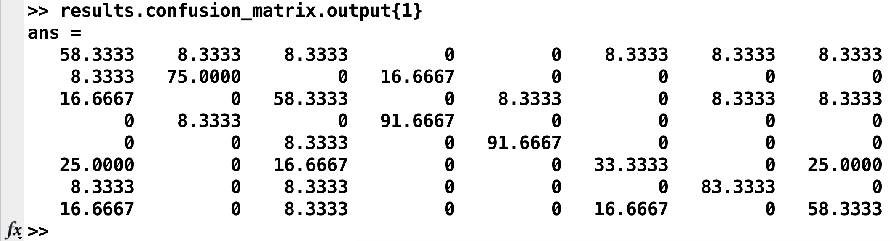
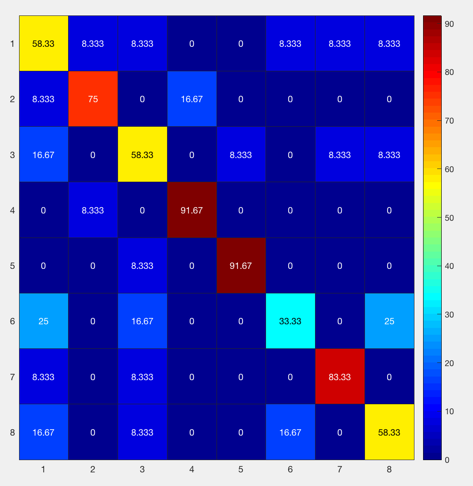
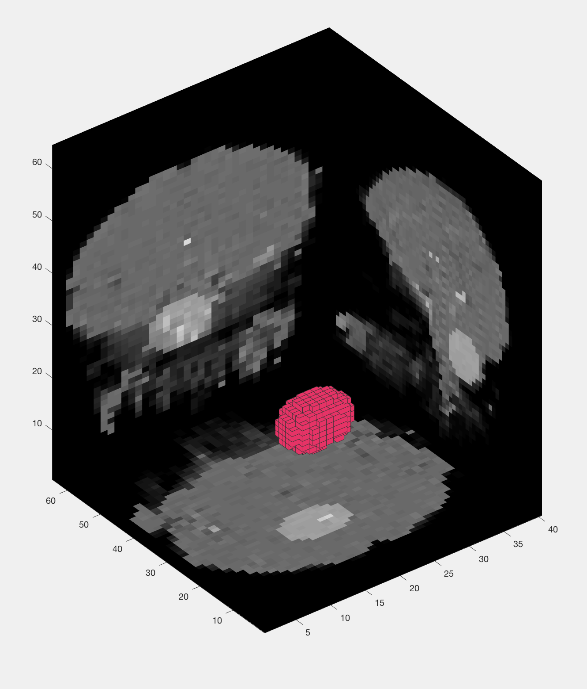
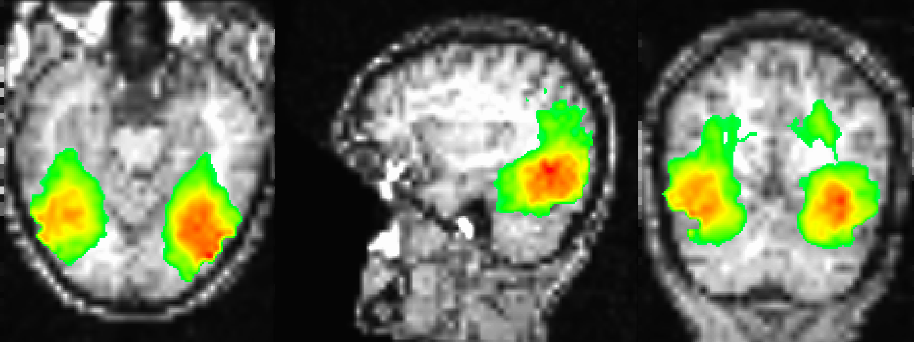

.. _ML_05_Haxby_MVPA:

=====================================================================
Machine Learning Tutorial #5: MVPA Analysis with The Decoding Toolbox
=====================================================================

-----------

The Decoding Toolbox
********************

Having generated beta maps for this subject - one per condition for each run - we are now ready to run a **multi-variate pattern analysis**, using the beta maps as both training and testing data. This is similar to what we did in the first tutorial with AFNI's ``3dsvm`` command, but we will be using a different package called **The Decoding Toolbox**.

A software package that runs in Matlab, The Decoding Toolbox can be downloaded from its homepage, located `here <https://sites.google.com/site/tdtdecodingtoolbox/>`__. Scroll down the page and click on the link ``Click here to download TDT``. Unzip the file when it is finished downloading, and move it to your home directory. Then open a Matlab terminal, click on "Set Path" at the top of the ``Home`` tab, and then click on ``Add Folder``. Select the directory ``decoding_toolbox`` within the folder ``tdt_3.999``, then click ``Open`` and ``Save``.

Modifying the Template Script
*****************************

The Decoding Toolbox contains many different commands and scripts, which I encourage you to explore at your leisure. For the current study, however, you will only need to modify one script: ``decoding_template.m``. Open this file by typing ``open decoding_template`` from the command line, which will display the file in the editor window. Using the ``Editor`` tab, click on ``Save -> Save Copy As...`` and save it to the folder ``Haxby_Data``, labeling it ``Haxby_MVPA_ROI``.

You will see several fields that need to be filled in or commented out. The first couple of ``addpath`` commands can be used to set the path to The Decoding Toolbox and SPM, if you need to; since we have already set those paths, we can comment out these lines. 

On line 17, we have different analysis options. The default, **searchlight**, will analyze all of the voxels within a mask (or the entire brain) and determine which voxels are most useful for decoding a particular condition. We will revisit this in a later tutorial; for now, change this string to "ROI", which will calculate the decoding accuracy across all of the voxels for each condition within a particular mask.

Lines 21 and 24, ``cfg.results.dir`` and ``beta_loc``, can both be set to ``[pwd '/SPM_Results_1']``.

On line 31, we will set a path to the mask. In the original Haxby paper, this mask was created by manually selecting the voxels within the lingual,
fusiform, inferior occipital, and middle occipital gyri, and then running an omnibus test to detect any voxels that responded to any of the conditions, thresholded at a p-value of p=0.000001. Any significant voxels within the manually defined mask were then binarized to create a new mask.

We could do this ourselves, but the masks have already been provided by the authors on `this website <http://data.pymvpa.org/datasets/haxby2001/>`__. Clicking on the file **subj1-2010.01.14.tar.gz**, for example, will download the original functional and timing data for subj1, including the mask used in the original paper. Download this folder and then unzip it, and note that there are several masks that you are able to choose from; the file ``mask4_vt.nii.gz`` is a ventral temporal mask that contains the significant voxels from the omnibus test. Open a terminal, navigate to the directory ``subj1`` that you just downloaded, and unzip the file by typing ``gunzip mask4_vt.nii.gz``; then navigate to the ``Haxby_Data`` directory, create a new directory for the masks by typing ``mkdir Haxby_Masks``, and move the file to this folder (e.g., ``movefile('~/Downloads/subj1/mask4_vt.nii', '~/Desktop/Haxby_Data/Haxby_Masks/mask4_vt_1.nii')``).

Beginning on line 36, we can list all of the conditions we have in our experiment. Since there were 8, we will create 8 labelnames, one for each condition; e.g.,

::

  labelname1 = 'bottle';
  labelname2 = 'cat';
  labelname3 = 'chair';
  labelname4 = 'face';
  labelname5 = 'house';
  labelname6 = 'scissors';
  labelname7 = 'scrambledpix';
  labelname8 = 'shoe';
  
So far, the modified script should look something like this:

Line 63 indicates the output that you want from the analysis; the default is "accuracy minus chance." A more useful output is a confusion matrix, which shows how accurate the classifier is at identifying each condition correctly. In this case, we will uncomment the line and change it to "confusion_matrix":

::

  cfg.results.output = {'confusion_matrix'};

The last line to edit is near the end, which starts with ``cfg=decoding_describe_data``. This contains only two conditions; to expand it to our 8 conditions, we will replace it with this code:

::

  cfg = decoding_describe_data(cfg,{labelname1 labelname2 labelname3 labelname4 labelname5 labelname6 labelname7 labelname8},[1 2 3 4 5 6 7 8],regressor_names,beta_loc);

Examining the Results
*********************

Now save the file and run it from the terminal by typing ``Haxby_MVPA_ROI``. This should only take a few moments, and you will then see the following figures:

  The output from an MVPA ROI analysis. The figure on the left shows the beta maps that are used as both training and testing data, which uses a leave-one-out cross-validation procedure. The figure on the right shows a three-dimensional representation of the voxels in the mask.
  
The results are stored in two places: Your Matlab workspace, in the variable ``results``, and in a .mat file in the statistics directory called ``res_confusion_matrix.mat``. (That way, you still have the results written to your disk even if you clear your Matlab workspace.) To see the confusion matrix, type:

::

  results.confusion_matrix.output{1}
  
Which will return something like this:

This can also be represented as a heatmap:

::

  figure; heatmap(results.confusion_matrix.output{1}, 'Colormap', jet)
  

Going from left to right, and from top to bottom, the columns and rows are 1) bottle; 2) cat; 3) chair; 4) face; 5) house; 6) scissors; 7) scrambledpix; and 8) shoe - the same order as they were entered into the GLM.

How should we interpret this? If we look at the number in the upper left corner, we see that it is 58.33%. That means that when the classifier was trained with the beta maps for the bottle condition, it accurately identified other beta maps for the bottle condition 58.33% of the time. If we look at the neighboring square to the right with a value of 8.33%, that is the amount that bottle beta maps were misidentified as cat beta maps. A perfect classifier would be 100% on all of the squares along the diagonal, since every condition would be correctly classified. Note that the highest classification accuracy is for faces and houses and the lowest accuracy is for scissors, replicating the main findings in the Haxby paper.

Searchlight Analysis
********************

The ROI analysis we just did gave us a single classification accuracy number per condition. This is useful if we have an ROI a priori, but what if we want to look at the whole brain?

One method to do this is called **searchlight analysis**. The searchlight is composed of a cluster of voxels of a given size specified by the user, which is centered consecutively at each voxel in the brain. The above ROI analysis is done here in miniature, with a leave-one-out cross-validation performed at each position of the searchlight; the classification accuracy is then stored in the center of the searchlight, and the process is repeated for the next voxel.

To run this analysis, click on ``Save -> Save Copy as...`` and call the new file ``Haxby_MVPA_Searchlight``. Open it in the terminal and change the ``cfg.analysis`` from "ROI" to "searchlight". Since we are examining a relatively large area, let's increase the searchlight radius to 5. Later one, in lines 50-53, you can decide to change the units to millimeters instead of voxels, and whether to make the searchlight spherical. Also, if we want to run the searchlight across the whole brain and not just the mask we specified previously, comment out line 31 (``cfg.files.mask``). Let's also uncomment lines 53 and 54 (i.e., ``cfg.searchlight.spherical`` and ``cfg.verbose``), and change line 70 from “confusion_matrix” to “accuracy_minus_chance”, which will create the accuracy map, save the script, and then run it from the terminal by typing ``Haxby_MVPA_Searchlight``.

You will see the same training and testing data figure as before, along with a figure that appears to show a group of voxels being used as a mask. Every few seconds or so, the group of voxels will move to a different location, demonstrating how the searchlight moves through all of the voxels in the brain. Note that it sometimes seems irregularly shaped, especially near the edges of the brain, but that it is a spherical cluster inside the brain mask.

The result of this analysis is a file in the ``SPM_Results_1`` directory called ``res_accuracy_minus_chance.nii``. I find it useful to overlay this on the subject's coregistered anatomical image in a viewer such as AFNI; after copying the file ``rsub-1_T1w.nii`` into the ``SPM_Results_1`` directory and loading the AFNI viewer, experiment with different viewing settings, in particular the threshold. Remember that the values in the image are the accuracy scores minus chance; since chance in this study is 1/8, or 12.5%., any negative values are accuracy scores less than chance, and any positive values are above chance. For example, if in a certain voxel we find a value of 25, that means the classification accuracy at that voxel is 25%+12.5%, or 37.5% total.

  Sample figure of the searchlight results, overlaid onto the subject's coregistered anatomical volume. The image is thresholded at 30, which shows classification accuracies of 42.5% or greater. The highest classification accuracies are found in the ventral temporal cortex, similar to what was found in the Haxby 2001 paper.
  
Video
*****

The video walkthroughs for this chapter are divided into two parts: To see how to do an ROI MVPA analysis, click `here <https://www.youtube.com/watch?v=R0R-1kCIBAI>`__. To see how to do a searchlight analysis, click `here <https://www.youtube.com/watch?v=CTxVHBh6OmI>`__.
  
Next Steps
**********

Now that we have both ROI and whole-brain searchlight results, we can repeat the same procedure for all of the subjects in our study. To see how to automate the process, click the ``Next`` button.
