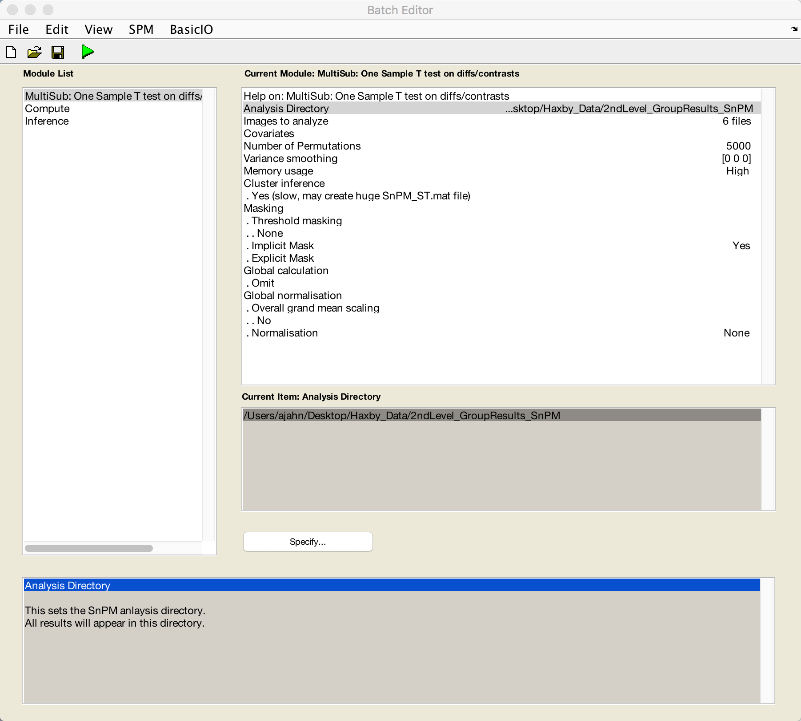
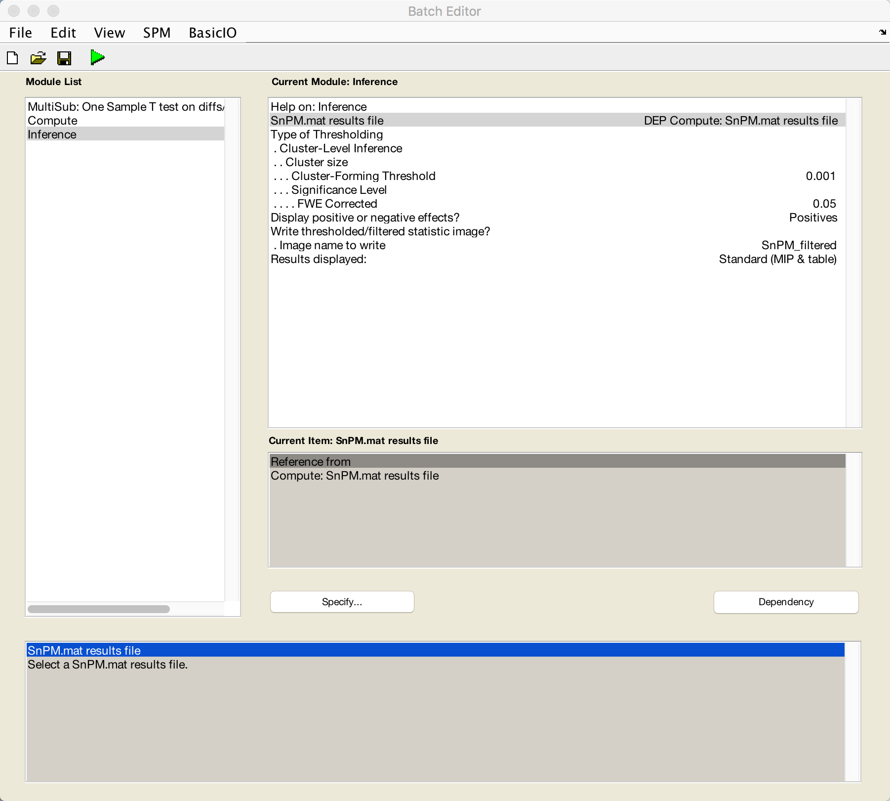
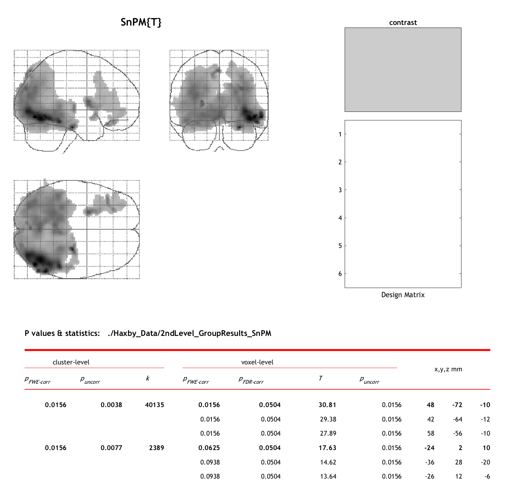

.. _ML_08_Haxby_NonParametric:

=====================================================
Machine Learning Tutorial #8: Non-Parametric Analysis
=====================================================

---------------

Overview
********

In the previous chapter, we used a t-test to determine whether there were significant differences in classification accuracies compared to chance. While this approach has been used by several researchers in the past (e.g., Li et al., 2009), the nature of the classification accuracies violates some of the assumptions of the t-test, which is a parametric test. For example, this test assumes that the values are normally distributed around zero; in the case of classification accuracies, however, all of the numbers are constrained to be positive. (A review of the problems of applying parametric methods to classification results can be found in `Allefeld et al., 2016 <https://www.sciencedirect.com/science/article/pii/S1053811916303470?casa_token=MkG6Tz_0BxAAAAAA:FwSVkWX7SCwJDL9t4OpJ5jTzDjsyWaGs7tZ_bDRJBYmZGQLXr16kqZKvVVuG1DemsOrt6GY6>`__). 

To remedy this, we can use other analyses. Here, we will review how to do non-parametric analyses with a toolbox called Statistical non-Parametric Mapping (SnPM).

Downloading SnPM
****************

SnPM can be downloaded by clicking on `this link <http://www.nisox.org/Software/SnPM13/>`__ and clicking on ``Registration``. You will be required to fill out a form with your email address. When you have finished filling out the form, you will be able to download the package. Unzip it, open a Terminal, navigate to the folder ``~/spm12/toolbox/``, and type:

::

  mv ~/Downloads/SnPM-devel-SnPM13.1.08 SnPM13
  
Then open a Matlab terminal, click on the ``Set Path`` button, and click ``Add Folder``. Select the folder ``SnPM13`` in the toolbox directory, click ``Save``, and then close the window.

Creating the SnPM Batch
***********************

From the Matlab terminal, open SPM by typing ``spm fmri``. Click on ``Batch``, then select ``SPM -> Tools -> SnPM -> Specify -> Multisub: One-sample T-test on diffs/contrasts``. This will open a new editor window. Add the following modules as well: ``SPM -> Tools -> SnPM -> Compute`` and ``SPM -> Tools -> SnPM -> Inference``.

From the Matlab terminal, navigate to the Haxby_Data directory, and create a new directory for our non-parametric results by typing ``mkdir 2ndLevel_GroupResults_SnPM``. Select this as the Analysis Directory in the Batch Editor window, and for Images to Analyze, select the smoothed and warped res_minus_chance images, entering ``swres`` in the filter field to help with your search. Leave the number of permutations at 5000, and change the "Cluster inference" option from ``None`` to ``Yes (slow)``. Leave the rest of the defaults the same.

Next, click on the ``Compute`` module, click the ``Dependency`` button, and select the configuration file from the MultiSub module.

Lastly, click on the ``Inference`` module, select ``Dependency`` and choose the output from the Compute module. From the ``Type of Thresholding`` menu, select ``Cluster-Level Inference`` and change the ``Cluster-Forming Threshold`` from NaN to 0.001. This will calculate an appropriate cluster-forming threshold with a voxel-wise threshold of 0.001; for more details, see :ref:`this chapter <Appendix_A_ClusterCorrection>`. You can also choose to write a thresholded statistic image from the ``Write thresholded/filtered statistic image?`` to generate a statistical map that will only show those voxels that pass the cluster correction you specified. For now, we will set this to ``Image name to write``, which will label the output image ``SnPM_filtered``.

When you have filled out all of the modules, click the green "Go" button. Since we only have six subjects in this experiment, this should only take a few seconds. When it finishes, you will see a Maximum Intensity Projection (MIP) map, similar to what we observed when viewing the results from an fMRI experiment analyzed with SPM:

There are two major clusters that we see from this analysis: One that covers virtually all of the occipital lobes, with the highest intensity in the ventral occipital and temporal lobes, and another cluster in the left lateral frontal cortex. This replicates our previous analysis using parametric methods, which is reassuring, and it also uses a statistical approach that is more robust to violations of assumptions of normality.

Next Steps
**********

These non-parametric results can be reported from the MIP table, just as you would for fMRI results. If you generated the thresholded image as well, you can display this in a viewer of your choice, such as AFNI or fsleyes.

As of now (December 18th, 2020), we have not yet covered prevalence tests, which are considered the appropriate method for analyzing classification results (Allefeld et al., 2016). In the meantime, however, nonparametric tests should still be able to give you reliable results, especially if they are found in areas that were predicted by your hypothesis. 
