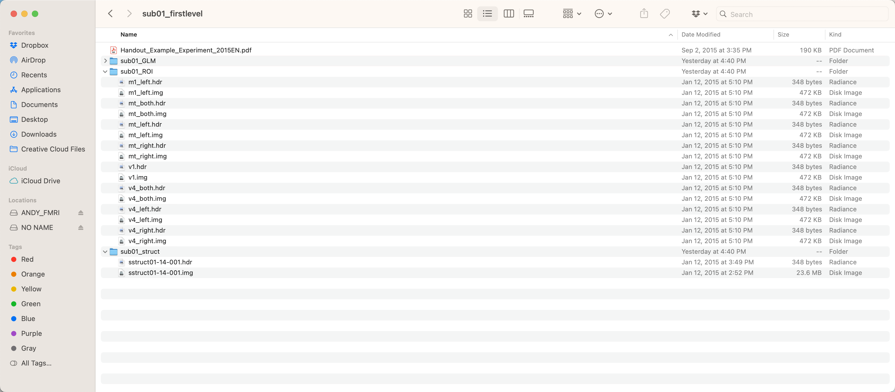
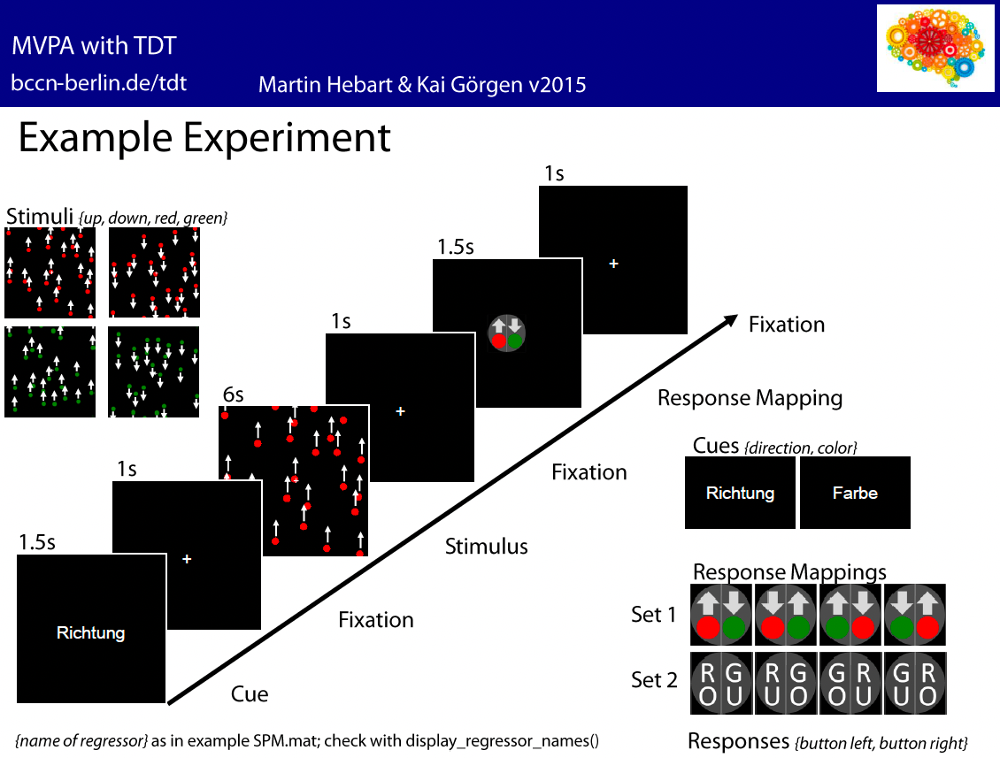
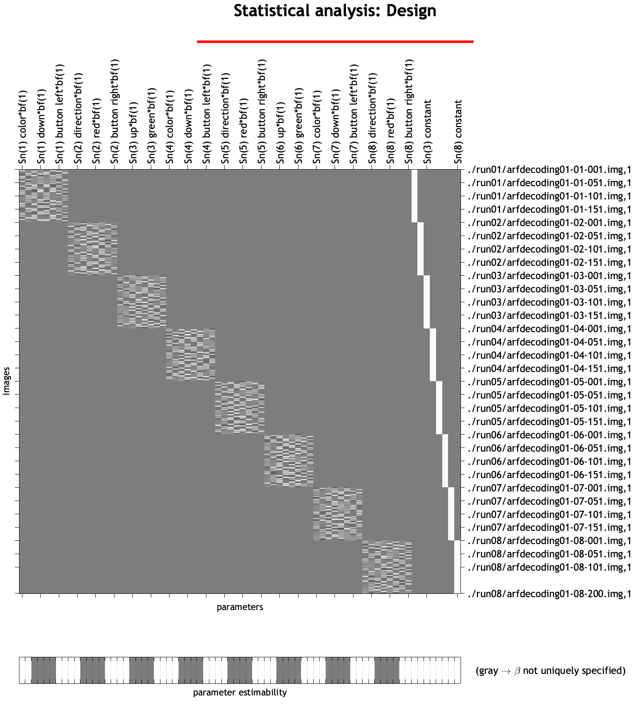
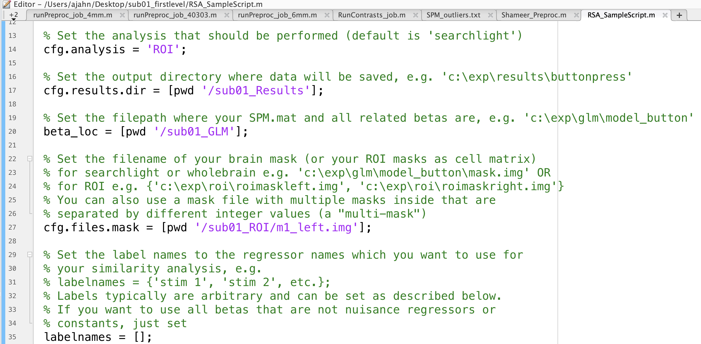
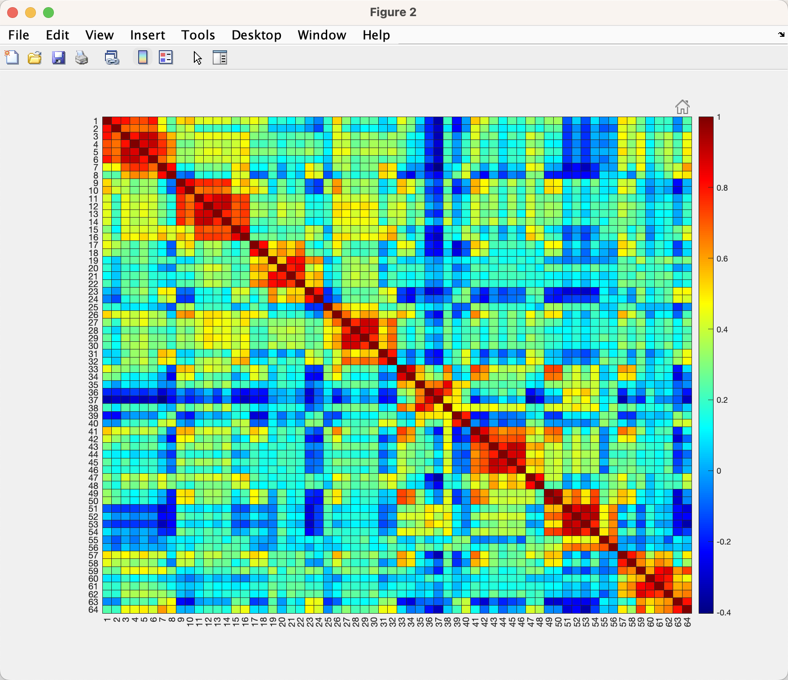
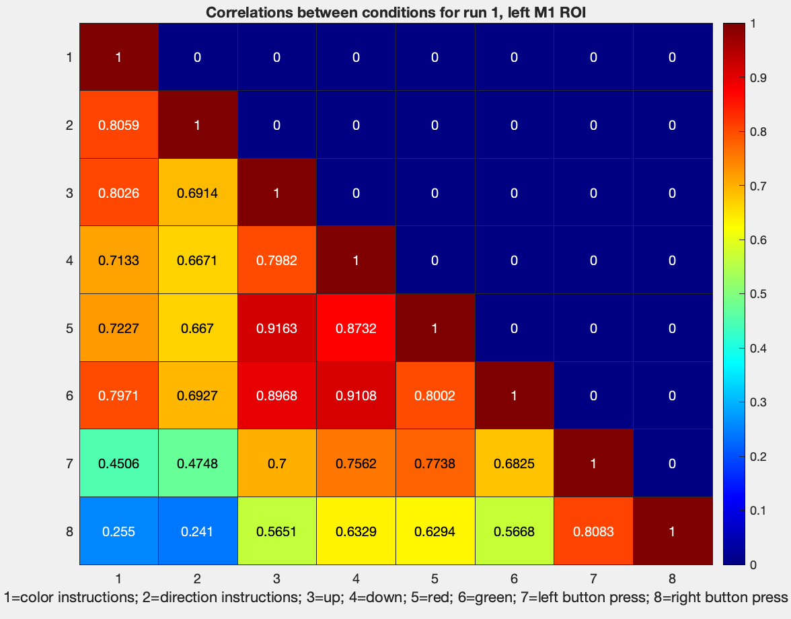
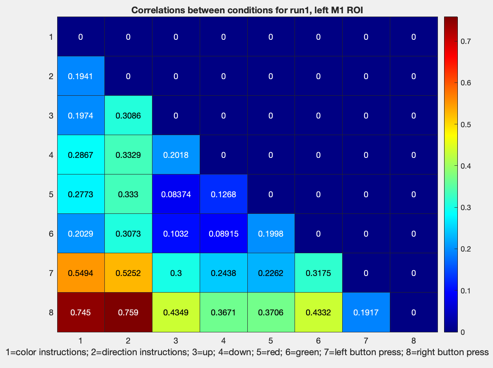

.. _ML_09_RSA:

==================================================================
Machine Learning Tutorial #9: Representational Similarity Analysis
==================================================================

---------------

Overview
********

Representational Similarity Analysis (RSA) 

Downloading the Data
********************

The dataset for this analysis can be found `here <http://www.bccn-berlin.de/tdt/downloads/sub01_firstlevel.zip>`__, on The Decoding Toolbox's website. This folder contains the fully preprocessed and analyzed data for a single subject, with betas generated for each trial of each condition. After you have downloaded the dataset, move it to your Desktop directory, and look inside:

The folder ``sub01_GLM`` contains the betas estimated from the GLM; the folder ``sub01_ROI`` contains different ROIs that can be used for the classifications analysis, such as the left primary motor cortex and primary visual cortex; and ``sub01_struct`` contains the anatomical image. For this tutorial, we will be using the data in the GLM and ROI folders.

In this experiment, subjects were given instructions to respond to either the color of the stimuli, or the direction of the stimuli. After seeing either red or green dots move up or down, the subjects then responded with a left or right button press, mapped on to either the direction or the color of the stimuli. 

As a result, there were eight regressors entered into the model, in the following order (regressor name is in parentheses to the right of each one, as returned by the command ``display_regressor_names`` run in the directory ``sub01_GLM``):

1. Instruction cue to respond to the color of the stimulus (color);
2. Instruction cue to respond to the direction of the stimulus (direction);
3. Stimuli moving in the "up" direction after the direction cue (up);
4. Stimuli moving in the "down" direction after the direction cue (down);
5. Red stimuli after the color cue (red);
6. Green stimuli after the color cue (green);
7. Left button presses (button left);
8. Right button presses (button right).

There are also constant, or baseline, regressors included at the end of each run to model the intercept, which we will ignore for our similarity analysis.

These can be verified in SPM by opening SPM12, clicking ``Review``, and selecting the ``SPM.mat`` file in the ``sub01_GLM`` directory.

Creating the Script
*******************

The Decoding Toolbox has a template RSA script lcoated within ``tdt_3.999F/decoding_toolbox/templates``; if your path already points to this folder, you can navigate to the folder ``sub01_firstlevel``, and then type ``open decoding_template_similarity.m``. Save a copy of it to the ``sub01_firstlevel`` folder, and call it ``RSA_SampleScript.m``. Open this new file in your Matlab terminal by typing ``RSA_SampleScript.m``, and close the original template script.

First, change the ``cfg.analysis`` on line 14 to from ``searchlight`` to ``ROI``, since we will be using ROIs for our similarity analysis. The code on lines 17 and 20 specify where to write the results and where the betas are located, respectively; change them to ``cfg.results.dir = ``[pwd '/sub01_Results'];`` and ``beta_loc = [pwd '/sub01_GLM'];``. Lastly, if we are interested in RSA in the left motor cortex, for example, we would change line 27 to be ``cfg.files.mask = [pwd '/sub01_ROI/m1_left.img'];``.

For now, leave the rest of the defaults as they are, noting on line 45 that the classification parameter output is set to ``pearson``, i.e., correlation values. We will experiment with different options later, which can be found in the file ``pattern_similarity.m``.

.. note::

  If you want to save disk space and overwrite the results each time you run the script, add the line ``cfg.results.overwrite = 1;`` anywhere in your script before the last line (i.e., ``results = decoding(cfg)``).

Running the Script and Viewing the Output
*****************************************

You can now run the script by typing ``RSA_SampleScript``. After a few seconds, you should see a new variable in your workspace called ``results``. Within this structure is a field called ``other``, which in turn has a sub-field called ``output``. You can display all of the data in this matrix - in other words, all of the correlation values calculated for each condition - by typing ``reuslts.other.output{1}``.

However, the output is quite large, and it is probably easier to view and understand the output if we plot it as a correlation matrix. To do that, type:

::

  figure; heatmap(results.other.output{1}, 'Colormap', jet)
  
This will generate a plot that looks like this:

Note that there are 64 rows, and 64 columns, since there are 8 conditions and 8 runs. For example, the first column and second row (i.e., cell(1,2)) represents the correlation between the instructions for color and the instructions for direction, which in this case is ``0.8059``; you can verify this by hovering your cursor over that cell. (Also note that the matrix is symmetrical around the diagonal, and that the upper triangle is identical to the lower triangle.) You can see a clear pattern in the matrix, which appears to have eight separate 8x8 matrices running along the diagonal, representing within each run the correlation of the conditions with each another. There are correlations off the diagonal as well, which represent the correlation of a condition in one run with the condition in another run; for exmaple, cell (1,9) represents the correlation between the instructions for color for run 1 with the instructions for color for run 2.

To simplify the matrix, let's focus in on the first 8x8 matrix by typing:

::

  figure; heatmap(1-results.other.output{1}(1:8,1:8), 'Colormap', jet)
  
Which will return a figure like this:

.. figure:: 09_Run1_Correlations.png

And if you want just the lower diagonal, you can type:

::

  figure; heatmap(tril(results.other.output{1}(1:8,1:8)), 'Colormap', jet)
  
Along with a title to describe what we are looking at:

::

  title('Correlations between conditions for run1, left M1 ROI')
  
And annotations along the x-axis:

::

  xlabel('1=color instructions; 2=direction instructions; 3=up; 4=down; 5=red; 6=green; 7=left button press; 8=right button press')
  

The same procedure can be done for the other runs; for example, run 2 can be visualized with:

::

  figure; heatmap(tril(results.other.output{1}(9:17,9:17)), 'Colormap', jet)
  
And so forth.

Creating Dissimilarity Matrices and Other Metrics
*************************************************

We have now generated similarity matrices. Remember, however, that we are interested in *dis*similarity matrices; a measure of how far apart two categories are, which can be measured from an absolute zero point. To that end, we will need to subtract these correlation values from 1, which can be done with a simple edit to a previous line of code:

::

  figure; heatmap(tril(1-results.other.output{1}(1:8,1:8)), 'Colormap', jet); title('Correlations between conditions for run1, left M1 ROI'); ...
  xlabel('1=color instructions; 2=direction instructions; 3=up; 4=down; 5=red; 6=green; 7=left button press; 8=right button press')
  
  

Exercises
*********

1. When you compute a dissimilarity matrix by subtracting the correlation values from 1, you may see that some values are greater than 1. Why is this? What does this mean about the similarity of that condition to another condition?

2. Run the same RSA analysis, this time with ``v1.img``. (Note that you can run multiple ROI analyses by using brace notation, e.g., cfg.files.mask = {[pwd '/sub01_ROI/m1_left.img'], [pwd '/sub01_ROI_v1.img']}.) How are the similarity matrices different? How are they similar? Why do you see these differences or similarities?
