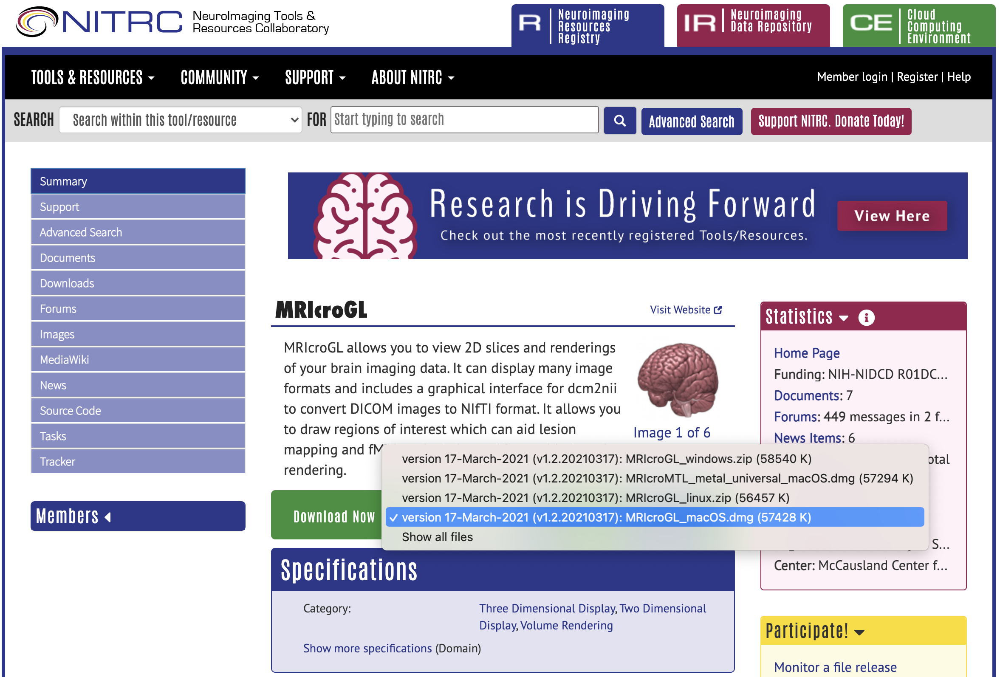
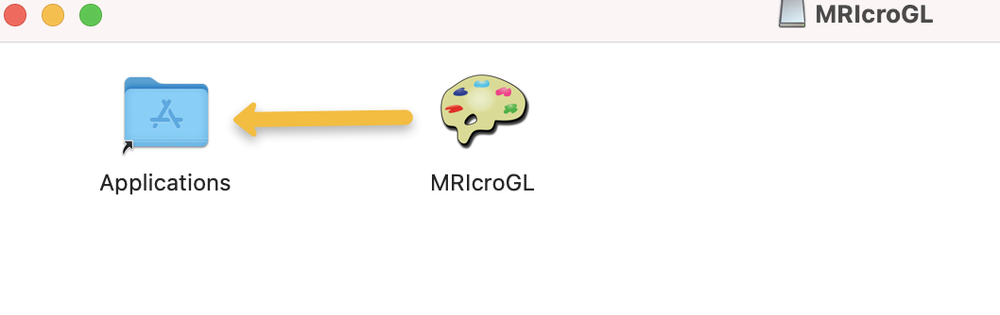
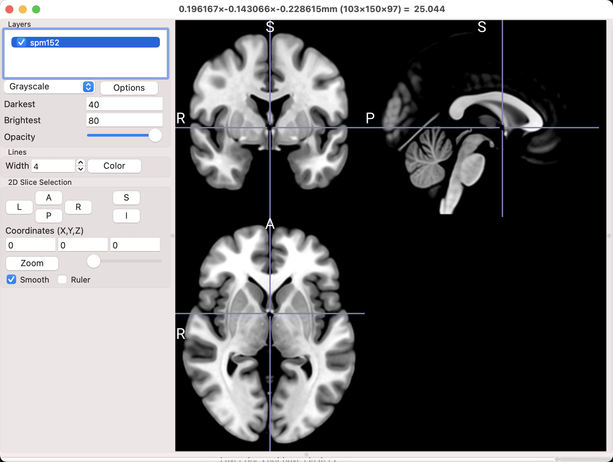

.. _MRIcroGL_1_Download:

==============================
MRIcroGL Tutorial #1: Download
==============================

Downloading MRIcroGL
--------------------

To download MRIcroGL, click on `this link <https://www.nitrc.org/projects/mricrogl>`__. The current version of MRIcroGL is hosted on the Neuroimaging Tools & Research Collaboratory (NITRC), and you may need to create an account first in order to download software from the website.

MRIcroGL's website includes a sidebar with links to documentation, source code, and a forum for asking questions. After you've explored the website, notice that on the main page there is a section labeled "Download Now", with a dropdown menu for different operating systems. In this case, I will select the macOS.dmg file, and then click on the download icon next to it. 

On the next screen, click "I Agree", and download the software. After a few moments, it should be in your Downloads directory; click on the file to open it, and then click and drag MRIcroGL to the Applications directory. That way, you will be able to search for MRIcroGL with Finder.

Double-click on the MRIcroGL icon to open the program. By default, the template brain spm152 is displayed in three orthogonal views: Coronal, Sagittal, and Axial. 

Take some time to click and drag the crosshairs in any of the viewing panes, noting how the other viewing panes are updated as you move the mouse around; you can also rapidly flip through slices in any one of the views by using the scroll wheel of your mouse. Try also experimenting with the numbers in the boxes next to the ``Darkest`` and ``Brightest`` fields, along with the opacity slider. We will cover more of these features in a later tutorial, so don't worry about understanding them fully just yet; for now, play around and try to build some intuition for what the buttons do.

Next Steps
----------

Once you have downloaded MRIcroGL, you are able to not only view imaging data, but also convert DICOM images to NIFTI format. To see how to do that, click the ``Next`` button.
